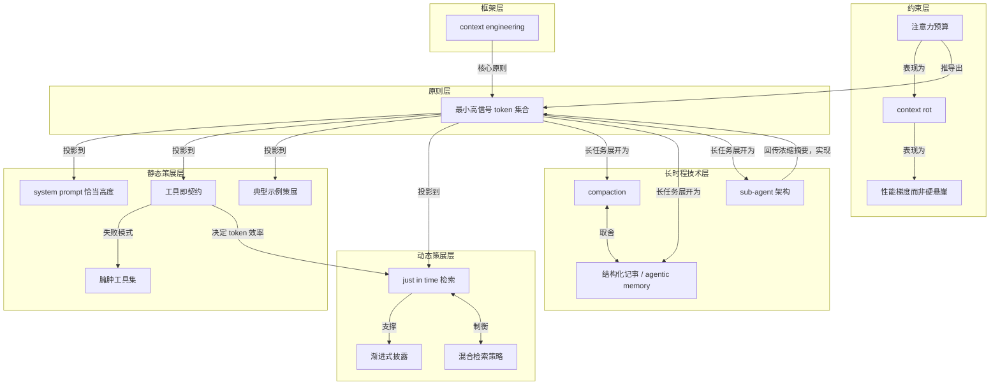

# 概念解析辞典

> 针对《Anthropic：有效的上下文工程，是为 agent 找到最小充分信息集》（Anthropic｜来源：anthropic.com）的概念提取

## 一、核心概念

### 1. **context engineering（上下文工程）**

- **context**：

  > context engineering 是 prompt engineering 的自然演进（natural progression），不是替代关系。

  > context 指从 LLM 采样时被纳入的那组 token；engineering 指在 LLM 固有约束下优化这些 token 的效用，以稳定达成期望结果。

  > 每一次决定「传什么给模型」，策展环节就发生一次。

- **费曼一下**：写 prompt 是一次性动作；context engineering 是每一轮推理都反复发生的策展。它管的不是一段指令怎么写，而是在模型有限的窗口里，此刻该放进什么、该留下什么。这是全文的总框架，也是它区别于 prompt engineering 的要点。

### 2. **注意力预算（attention budget）**

- **context**：

  > 像工作记忆容量有限的人类一样，LLM 在解析大量 context 时是从一份「注意力预算」里支取。

  > context 必须被当作有限资源，且边际收益递减。

- **费曼一下**：把模型的注意力想成一天有限的体力。每多给一个 token，就消耗一点。材料越多，模型越可能顾不过来。这个概念回答了“为什么不能把信息全都堆进上下文”：因为注意力会被摊薄，而它是一次次被支取的稀缺资源。

### 3. **context rot（上下文腐烂）**

- **context**：

  > needle-in-a-haystack 类基准研究发现，随着上下文窗口内 token 数增加，模型准确召回其中信息的能力下降。不同模型的衰减陡缓不同，但这个特性在所有模型上都会浮现。

- **费曼一下**：窗口塞得越满，模型从里面精准捞出某条信息就越不靠谱。这不是某个模型的产品缺陷，而是所有模型都会出现的特性。它是“注意力有限”最可直接观测到的表现。

### 4. **性能梯度而非硬悬崖（performance gradient rather than a hard cliff）**

- **context**：

  > 这些因素造成的是性能梯度而非硬悬崖（a performance gradient rather than a hard cliff）——长上下文下模型依然高度可用，只是相对短上下文，信息检索精度和长程推理会变弱。

- **费曼一下**：长上下文不会突然失效，而是像上坡：越来越费力，速度一点点掉，但车没熄火。这个分寸很重要——它不是说长上下文不能用，而是说“多长”不是问题，“值不值得为这段内容付出精度”才是问题。

### 5. **最小高信号 token 集合（smallest possible set of high-signal tokens）**

- **context**：

  > 好的 context engineering 就意味着找到最小可能的高信号 token 集合，使期望结果的概率最大化。

  > 「最小」不等于「短」（minimal does not necessarily mean short）。

- **费曼一下**：像收拾出差行李。目标不是箱子越轻越好，而是每一件都用得上、且缺一件就出问题。该带的一件不能少，不该带的一件都不要带。这是全文唯一的指导原则，后面所有技术都是它在不同位置上的投影。

### 6. **system prompt 的恰当高度（the right altitude）**

- **context**：

  > 一端：工程师在 prompt 里硬编码复杂、脆弱的 if-else 逻辑去逼出精确的 agent 行为——制造脆弱性，维护复杂度随时间上升。另一端：给出含糊的高层指导，没能给 LLM 关于期望输出的具体信号，或者错误地假设了共享 context。最优高度是平衡：足够具体到能有效引导行为，又足够灵活，给模型强启发式（strong heuristics）去自行判断。

- **费曼一下**：交代事情的颗粒度。说“客人进门第 3 秒问好、第 7 秒递菜单”是把人当机器；说“让客人感到宾至如归”又等于没说。好的交代是给清楚判断依据，但不替对方做每一步决定。

### 7. **工具即契约（tools as the contract）**

- **context**：

  > 工具是 agent 与其信息/行动空间之间的契约，所以工具必须促进效率：既返回 token 效率高的信息，也鼓励 agent 高效行事。

  > 工具应当像设计良好的代码库里的函数：自包含、对错误健壮、用途极其清晰。

- **费曼一下**：工具不只是能力，更是一份说明书，规定了 agent 能碰什么、怎么碰、碰完拿回什么。它吐回的每个字都吃注意力预算，所以“说得少而准”本身就是工具的设计目标。工具是 context 的一个关键入口，它如果不高效，后面的策略都会跟着失效。

### 8. **臃肿工具集（bloated tool sets）**

- **context**：

  > 最常见的失败模式是臃肿的工具集：覆盖功能过宽，或制造出「该用哪个工具」的模糊决策点。文中给出的判据非常锋利——如果人类工程师都无法确定某个场景该用哪个工具，就不能指望 AI agent 做得更好。

- **费曼一下**：工具多不等于能力强。功能重叠、边界不清会直接变成 agent 的犹豫和误用。这个概念给出的是工具集的淘汰标准：一个熟手都不能一口说出该用哪个，agent 更做不到。

### 9. **典型示例策展（diverse, canonical examples）**

- **context**：

  > 团队常犯的错是把一长串边缘 case 塞进 prompt，试图穷举 LLM 应遵守的每条规则——这不被推荐。正确做法是策展一组多样、典型（diverse, canonical）的示例，有效刻画 agent 的期望行为。对 LLM 而言，示例就是那种「胜过千言万语」的图片。

- **费曼一下**：教人做事，与其列一百条例外，不如给几个漂亮的样板。样板传递判断风格，条款只传递死规矩。这个概念是“最小高信号 token 集合”在 few-shot 示例上的具体化：不是堆数量，而是让少数例子有代表性。

### 10. **just in time 上下文检索**

- **context**：

  > just in time 的具体形态：不预处理全部相关数据，而是让 agent 维护轻量标识符（文件路径、存好的查询、网页链接等），运行时用工具按这些引用动态加载数据进 context。

- **费曼一下**：不把整个图书馆搬进书房，只在桌上放一张索书号清单，要用哪本再去取。这个概念说明，很多信息不需要预先进入上下文；只要给 agent 正确的工具和引用，它可以在需要时再拿进来。

### 11. **渐进式披露（progressive disclosure）**

- **context**：

  > 渐进式披露（progressive disclosure）：让 agent 自主导航与检索，它就能通过探索增量地发现相关 context。文件大小暗示复杂度、命名约定暗示用途、时间戳可作相关性的代理；agent 逐层拼装理解，工作记忆里只保留必要部分，并用记事策略做额外持久化。

- **费曼一下**：像走进一座陌生城市，不是先背下整张地图，而是从街名、门牌、招牌一点点认出这是什么区域。每看一眼就多知道一点，也就知道下一眼该往哪看。它描述的是 agent 通过即时探索逐步形成理解的认知过程。

### 12. **混合检索策略（hybrid strategy）**

- **context**：

  > 某些场景下最有效的 agent 会先取一部分数据保证速度，再自行决定深入探索。Claude Code 正是这种混合模型——CLAUDE.md 文件被朴素地一次性放入 context，而 glob、grep 这类原语让它即时取回文件，有效绕开了陈旧索引和复杂语法树的问题。

- **费曼一下**：出门前先把地图和常用电话装口袋，其余的到了现场再问。它说明 just in time 检索不是唯一答案；有些信息稳定、必须，应该预载，有些动态、不确定，应该现取。边界由任务本身的动态程度决定。

### 13. **compaction（上下文压缩）**

- **context**：

  > compaction（压缩）：把接近窗口上限的对话做摘要，用这份摘要重新初始化一个新的上下文窗口。它通常是提升长期连贯性的第一根杠杆，本质是高保真地蒸馏一个窗口的内容，让 agent 以最小的性能损失继续跑。

  > Claude Code 的实现：把消息历史交给模型总结压缩最关键的细节，保留架构决策、未解决的 bug、实现细节，丢弃冗余的工具输出和消息。

  > 调优路径很具体：先最大化召回率，确保压缩 prompt 能抓全 trace 里每条相关信息，再迭代提升精确率，剔除多余内容。

- **费曼一下**：会开到一半白板写满了，就把结论和未决事项誊到新白板上，其余擦掉重来。难的不是誊写，而是判断哪条“现在看着没用、过会儿才发现关键”。这个概念解决的是长任务如何在窗口限制下继续维持连贯性。

### 14. **结构化记事 / agentic memory**

- **context**：

  > structured note-taking（结构化记事，又称 agentic memory）：agent 定期把笔记写到上下文窗口之外的持久化存储，之后再把这些笔记拉回窗口。开销极小，却提供了持久记忆。

  > Claude playing Pokémon 是非编码领域的证明：agent 跨数千游戏步维持精确计数，追踪诸如「过去 1234 步我一直在 1 号道路练级，皮卡丘已升 8 级，目标是 10 级」这样的目标；在没有任何关于记忆结构的提示下，它自己发展出已探索区域的地图、记住已解锁的关键成就、维护对战策略笔记以学会哪种攻击对哪类对手更有效。

- **费曼一下**：人做长期项目靠的是笔记本，不是记性。agent 也一样：把状态写到窗口之外，重置之后回来读一遍，就还是那个知道自己干到哪儿的它。这个概念是从“全放窗口”转向“外部持久化”的关键一步。

### 15. **sub-agent 架构与关注点分离**

- **context**：

  > sub-agent 架构（子 agent）：不让单个 agent 扛住整个项目的状态，而是让专门化的子 agent 用干净的上下文窗口处理聚焦任务；主 agent 拿高层计划做协调，子 agent 做深度技术工作或用工具找信息。关键的经济性在于回传比：每个子 agent 可能探索甚广、用掉数万乃至更多 token，但只返回浓缩提炼的摘要（通常 1000-2000 token）。

- **费曼一下**：主编不亲自跑现场，而是派几个记者各查一条线，每人回来交一页纸。记者那边翻了多少材料主编不必知道，他要的是那一页纸。这个概念不只是绕开窗口限制的工程手段，它本身也是“最小高信号 token 集合”在架构层面的一次重演。

## 二、概念架构图

