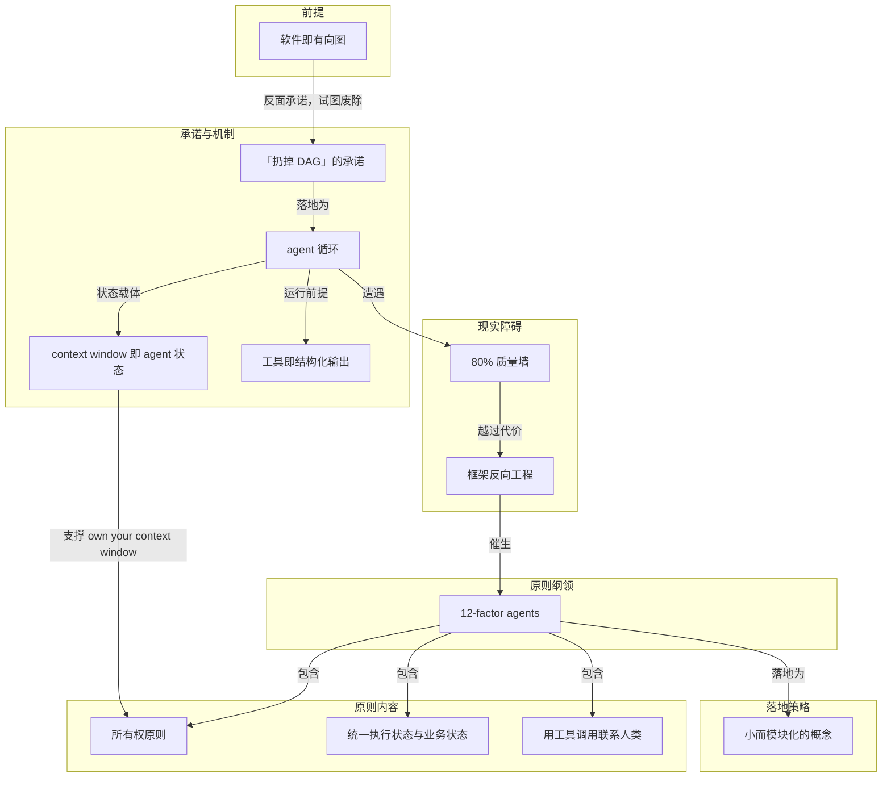

# 概念解析辞典

> 针对《12-Factor Agents：让 LLM 软件真能交付给生产用户的十二条原则》（Dex Horthy，HumanLayer / github.com）

## 一、核心概念

### 1. **12-factor agents**

- **context**：作者的中心问题只有一句：

  > What are the principles we can use to build LLM-powered software that is actually good enough to put in the hands of production customers?

  项目命名的精神来源：

  > In the spirit of 12 Factor Apps

- **费曼一下**：12-factor agents 不是又一个 agent 框架，而是一份"你的 LLM 软件要交给真实付费用户，迟早要面对哪些工程约束"的检查表。它继承 12 Factor Apps 的定位：当年那份清单不规定你用什么 Web 框架，只规定你的服务要能上云扩容必须满足哪几条。这里也一样——不论你用什么语言、什么库，只要软件要见客户，这十二条就是绕不过去的约束。把它当清单用，不当框架用。

### 2. **软件即有向图**

- **context**：作者把程序的最底模型翻出来当起点：

  > There's a reason we used to represent programs as flow charts.

  转述：软件本身就是有向图（directed graph）。

- **费曼一下**：任何程序本质上都是"从这一步走到下一步"的箭头集合。我们曾经用流程图表示程序，不是图方便，而是因为程序本来就长这样。这个判断是全文的地基：如果软件的底层结构就是一张有向图，那么"谁来决定下一支箭头指向哪里"就是最根本的权力问题——其余一切关于 agent 的讨论，都是这个问题答案的更换。

### 3. **「扔掉 DAG」的承诺**

- **context**：作者学 agent 时最大的心动：

  > you get to throw the DAG away

  紧接着的转折预告：

  > it turns out this doesn't quite work.

- **费曼一下**：agent 的诱惑是废除预先画图。过去的软件要求工程师把每一步、每个边界情况都写死，agent 则承诺：你不再逐步骤写死路径，而是给一个目标和一组可能的转移，让 LLM 在运行时实时找路。少写代码，能从错误中恢复，甚至可能找到人类想不到的新办法。但全句的重音在后面的转折——作者说这条承诺大致不成立，十二原则正是从"不太行"里长出来的。

### 4. **agent 循环**

- **context**：原文给出的最小实现骨架，是后续所有原则的锚点：

  > ```javascript
  > initial_event = {"message": "..."}
  > context = [initial_event]
  > while True:
  >   next_step = await llm.determine_next_step(context)
  >   context.append(next_step)
  >   if (next_step.intent === "done"):
  >     return next_step.final_answer
  >   result = await execute_step(next_step)
  >   context.append(result)
  > ```

- **费曼一下**：把 agent 拆到最里层，就是一台只会做三件事的机器：让 LLM 输出结构化 json 决定下一步（tool calling）、用确定性代码执行这次调用、把结果 append 回 context window，然后重复直到被判定为 done。所有关于 agent 的复杂工程，最终都要落回这三步里的某一步——要么改它怎么想，要么改它怎么干，要么改它怎么记。

### 5. **context window 即 agent 状态**

- **context**：循环里初始 context 只是一个起始事件（用户消息、cron 触发或 webhook），随后每一次决策与执行结果都被 append 进去。作者的关键观察是：

  > context 就是 agent 的全部状态

  Factor 3 将其提升为所有权主张：

  > Own your context window

- **费曼一下**：agent 没有单独的记忆器官，它的全部人生经历就是那段被反复喂回模型的文本。每一步决策和结果都堆在同一个数组里，所以上下文不是配置项，而是系统真正的状态数据库。谁掌握 context，谁就掌握 agent 的行为。正因为如此，把 context window 交给框架托管等于把数据库产权交给别人。

### 6. **80% 质量墙**

- **context**：作者与至少 100 位 SaaS 构建者聊过后，发现旅程惊人一致，其中一步是：

  > Realize that 80% isn't good enough for most customer-facing features

- **费曼一下**：框架帮你很快冲到 70-80% 的质量水位，然后撞墙。对内演示，十次对八次很惊艳；给付费客户用，十次错两次就是事故。demo 和产品之间隔着的不是 20% 工作量，而是一整个数量级的确定性要求。所有工程原则的动机，都在这堵墙后面。

### 7. **框架反向工程**

- **context**：越过 80% 的代价：

  > getting past 80% requires reverse-engineering the framework, prompts, flow, etc

  结局往往是从头再来：

  > start over from scratch

- **费曼一下**：框架用抽象换速度，前提是你不用看抽象底下的东西。可一旦质量要求逼你去调那句 prompt、那次重试、那段上下文，你就得把黑箱拆开——而拆一个不是自己写的黑箱，通常比自己写一遍还慢。这不是框架的罪过，而是抽象的收费时点到了。它也解释了为什么"原则"比"框架"值钱：框架替你藏起来的东西，恰是你越过 80% 时必须拿回手里的东西。

### 8. **小而模块化的概念**

- **context**：作者给出的最快路径，也是全文行动纲领：

  > The fastest way I've seen for builders to get good AI software in the hands of customers is to take small, modular concepts from agent building, and incorporate them into their existing product

  作者并强调，这些模块化概念大多数熟练软件工程师即使没有 AI 背景也能定义和应用。

- **费曼一下**：不要为做 agent 把产品推倒重写，而是把 agent 构建里那些独立好用的零件——工具调用、状态管理、人工介入点——一个个拧进现有系统。每拧一个都能立刻验证收益，出问题也能单独退回。这既是落地策略，也是 12 条原则的存在形式：原则被拆成可单点植入的模块，而不是必须整体接受的框架。

### 9. **所有权原则**

- **context**：十二条里三次重复 "Own your…"，这一重复本身就是作者的强调方式：

  > Own your prompts（Factor 2）
  > Own your context window（Factor 3）
  > Own your control flow（Factor 8）

- **费曼一下**：prompt、context window、control flow 是决定 agent 行为的三个开关。凡是你没握在手里的开关，出问题时你就修不了。所谓生产可用，很大程度上就是这三样东西的产权是否清晰地归你。"Own your..." 三次出现不是修辞，而是给整份清单定调：把越过 80% 必须的控制权，从框架手里拿回来。

### 10. **工具即结构化输出**

- **context**：Factor 4 的标题主张，与循环分工完全对应：

  > Tools are just structured outputs

  循环里 LLM 只负责输出结构化 json，真正执行的是确定性代码。

- **费曼一下**：LLM 其实什么也没"调用"——它只是吐出一段格式规整的话，说出自己想干什么，真正动手的永远是外头的代码。把工具去神秘化成一份结构化输出后，责任边界立刻清楚了：模型只负责表达意图，执行的正确性永远是软件工程的事。这是 agent 循环能够被工程化的前提；如果模型直接"执行一切"，就没有可靠边界可言。

### 11. **统一执行状态与业务状态**

- **context**：Factor 5 的标题主张，与 Factor 6 的启动/暂停/恢复、Factor 12 的无状态 reducer 构成一组：

  > Unify execution state and business state

- **费曼一下**：如果"agent 跑到第几步了"和"这单业务处在什么阶段"是两份账本，它们迟早对不上，而且出事时没人知道该信哪份。合成一份账本，agent 才能随时停下、随时恢复，也才能像纯函数那样被对待——把当前状态和一个新事件丢进去，得到下一个状态。这个统一是生产系统可恢复性的前提。

### 12. **用工具调用联系人类**

- **context**：Factor 7 的主张，与 Factor 10（Small, Focused Agents）、Factor 11（Trigger from anywhere）一同界定 agent 与外部世界的边界：

  > Contact humans with tool calls

- **费曼一下**：把"问一下人"做成 agent 可以调用的一个普通工具，而不是流程崩溃后的例外分支。这样一来，人不是 agent 失败后的补丁，而是它工具箱里的一件工具——需要授权、需要判断、需要担责的时候就被调用，调用完循环继续走。它和"工具即结构化输出"是同一逻辑的另一面：连人也是通过一次 tool call 进入循环的。

## 二、概念架构图



说明：架构图把概念按功能角色归为六层。历史前提层的"软件即有向图"反衬出"扔掉 DAG"的承诺，后者落地为 agent 循环；循环依赖 context window 承担状态、依赖工具即结构化输出作为运行前提。这一机制遭遇 80% 质量墙，越过它的代价是框架反向工程，恰恰是这个代价催生了 12-factor agents。原则纲领包含所有权、状态一致、人机边界三组内容，并以"小而模块化的概念"作为落地形式。所有权原则因直接覆盖 context window 这一状态载体，与循环形成回指关系。
