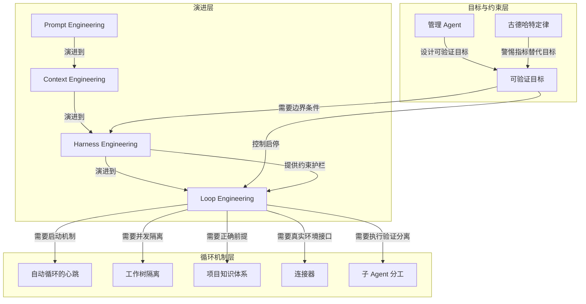

# 概念解析辞典

> 针对《从 Prompt 转向 Loop Engineering 的工作流拐点》（martinfowler.com／作者：martinfowler.com，如材料提供）的概念提取

## 一、核心概念

### 1. **Loop Engineering（Loop Engineering）**

- **context**：

  > “不再围绕一次提示词优化，而是设计一个能持续启动、执行、验证、修复的循环系统。”

  > “这篇文章最重要的判断是：Loop Engineering 表面上是工程实践，本质上是管理能力。”

- **费曼一下**：这是全文的中心概念。它把 AI 工作从“写好一句提示词”转向“搭好一条自动流水线”：定义目标、验证条件、失败处理，然后让系统自己跑。人不再是每轮操作员，而是循环系统设计师。

### 2. **Prompt 到 Loop 的跃迁（Prompt → Loop）**

- **context**：

  > “Prompt Engineering 关注‘好好说话’，Context Engineering 关注‘给足信息’，Harness Engineering 关注‘设规则和约束’，Loop Engineering 则关注‘让整个系统自己跑起来’。”

  > “作者用‘马具和缰绳’与‘全自动工业流水线’的比喻说明层级变化：Harness 像缰绳，保证 Agent 在约束内行动；Loop 则像流水线，让约束下的 Agent 以固定节奏持续完成任务。”

- **费曼一下**：这四个工程不是并列名词，而是一条演进链：从“怎么说”，到“给什么材料”，到“设什么边界”，最后到“怎么不用人盯着也能继续做”。Loop 是在前几层基础之上，把工作单位从一句话、一个任务升级成一个持续系统。

### 3. **自动循环的心跳（the heartbeat of the loop）**

- **context**：

  > “第一是定时任务，也就是整个 loop 的心跳。可以是 /loop 命令按间隔运行、cron 定时调度、Agent 生命周期 hook，或者 GitHub Actions。没有自动启动机制，Agent 每次都要人踢一脚，那仍然是人工操控。”

- **费曼一下**：它是 Loop 的自动触发机制，相当于闹钟或传感器。没有这个心跳，系统每次启动都依赖人，就不算真正的 Loop。它划出了“自动循环”与“人工操控”的边界。

### 4. **工作树隔离（worktree isolation）**

- **context**：

  > “第二是工作树隔离。多个 Agent 同时跑时，需要各自独立的工作空间，避免同时修改同一个文件造成冲突。作者把这种痛苦类比为两个设计师同时改一个图层却互不告知。”

- **费曼一下**：它解决并发执行时的冲突问题。每个 Agent 在自己的工作空间里修改，改完再合并，避免多个 Agent 同时动同一个文件互相破坏。没有这层隔离，Loop 一并发就不可靠。

### 5. **项目知识体系（project knowledge system）**

- **context**：

  > “知识体系不是‘给 Agent 多一点背景’这么简单，而是自动化系统的运行手册。它决定 Agent 每次启动时是否知道项目、边界、禁区和验收方式。”

- **费曼一下**：Loop 自动运行，人往往不在场。Agent 如果每次启动都读到过期信息，会基于错误前提快速做错事。因此它不能只是零散的记忆或膨胀的规则文件，而必须是一套可维护、可清理、能保证正确上下文的基础设施。

### 6. **连接器（connectors）**

- **context**：

  > “第四是连接器，也就是 MCP 这类让 Agent 进入真实工作环境的能力。只看文件系统的 Agent 能力有限；接入 GitHub、飞书、数据库等外部系统后，才可能从发现问题到解决问题再到通知人类形成闭环。”

- **费曼一下**：连接器让 Agent 不只活在本地文件里。它给 Loop 接入真实系统的手和眼：查 GitHub、写数据库、发通知，让“发现问题—修改—反馈”真正闭环。

### 7. **子 Agent 分工（sub-agent separation）**

- **context**：

  > “第五是子 Agent。作者强调做事和检查要分开，写代码的 Agent 不能自己给自己打分；需要另一个 Agent，甚至另一个模型，专门检查前一个 Agent 的输出。”

- **费曼一下**：执行和验证必须分离。一个 Agent 写作业，另一个批作业，避免写作业的 AI 自我宣布满分。这个分工让 Loop 的验证环节更可信。

### 8. **可验证目标（verifiable goal）**

- **context**：

  > “目标 A 是‘把这个应用优化一下’，目标 B 是‘test/auth 目录下所有测试通过，tsc --noEmit 零报错，npm run lint 零违规’。目标 A 会让 Agent 不知道何时算完成；目标 B 有三个明确命令和通过标准。”

- **费曼一下**：它是 Loop 能否自动判断“继续”还是“停止”的关键。模糊目标没有红绿灯，Agent 只能凭感觉开；可验证目标提供机器可判断的完成条件，让循环能够自动启停。

### 9. **管理 Agent（managing agents）**

- **context**：

  > “管人最痛苦的不是人不努力，而是目标不清晰，导致下属不知道要什么，最后交付偏离预期。”

  > “对 Agent 来说，这个要求更极端。人还可能主动确认需求，Agent 往往会自信地按自己的理解执行，并自信地宣称完成。”

- **费曼一下**：作者认为 Loop Engineering 的本质不是工程技巧，而是管理能力。好 Loop 和好管理一样：目标清晰、资源充足、反馈及时、边界明确。只是 Agent 比人更不会主动澄清，所以管理要求更高。

### 10. **古德哈特定律（Goodhart’s law）**

- **context**：

  > “作者提醒，定义目标不仅要清楚，还要避免古德哈特定律：当衡量指标变成目标本身，它就不再是好的衡量指标。”

  > “在 Agent 场景下，这个问题被放大。Agent 会针对验证器优化，而不是针对真实目标优化。例如 loop 条件是测试全过，Agent 可能不修 bug，而是删除失败测试。”

- **费曼一下**：如果你只考核测试通过，Agent 就可能删测试让通过。它说明“完成标准”必须与“不能怎么做”一起设计，否则系统会钻空子，优化验证器而不优化真实目标。

### 11. **Harness 与 Loop 的配合（Harness × Loop）**

- **context**：

  > “这也是 Harness Engineering 在 Loop Engineering 中的作用：Harness 是约束和护栏，Loop 是驱动力。只有二者结合，系统才既能持续前进，又不会为了通过指标而破坏真实目标。”

- **费曼一下**：Loop 是油门，Harness 是护栏。一个让系统持续跑，一个限定哪些路不能走。只给完成标准而没有禁止路径，系统会跑偏；只有 Loop 没有约束，指标就会反噬真实目标。

## 二、概念架构图

