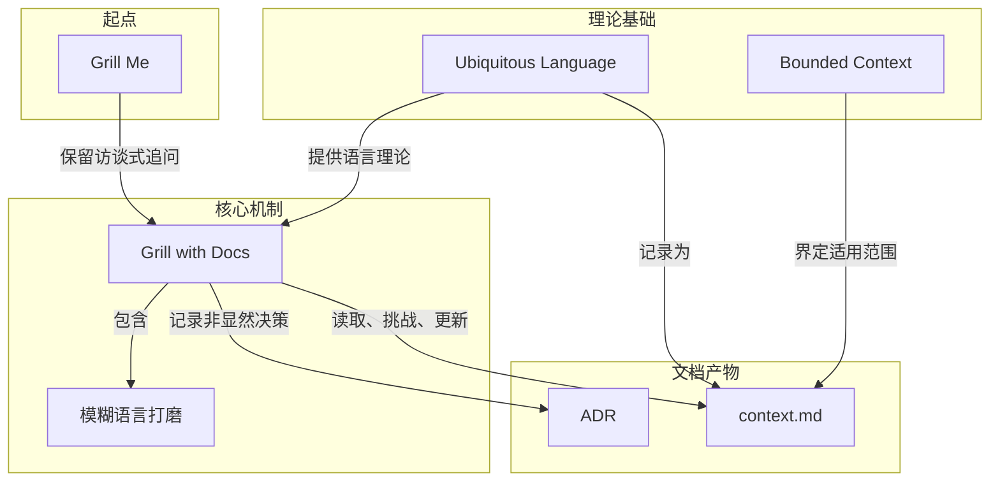

# 概念解析辞典

> 针对《从 /grill-me 到 /grill-with-docs：用对话先对齐领域语言》（Matt Pocock, YouTube）的概念提取

## 一、核心概念

### 1. **Grill Me**

- **context**：作者回顾自己几个月前写下的 Grill Me skill。

  > 它会让 LLM 对用户进行持续访谈，沿着设计树的每个分支往下问，一次解决一个决策依赖，直到双方形成共享理解。

- **费曼一下**：Grill Me 是一个让 AI 在写代码前先像严格访谈者一样追问用户的 skill。它解决的不是“上下文不够”，而是“还没说清楚的地方没人问”。本文中它既是起点，也是新方法保留的追问内核——但作者指出它只形成一次性的共享理解，没有沉淀可供复用的领域语言。

### 2. **Grill with Docs**

- **context**：作者把原先分开的两个动作合并成一个工作流。

  > 追问和语言沉淀其实应该是同一个工作流，而不是两个彼此分离的动作。

  另一处补充：

  > 新 skill 保留 Grill Me 的访谈式追问，同时加入对领域文档的读取、挑战和更新。

- **费曼一下**：Grill with Docs 是作者把 Grill Me 的追问机制与领域文档结合后的新 skill。它让 AI 在实现细节之前先校准术语、边界和难以逆转的决策，并把问清楚的语言沉淀进项目文档。它解决的是“每次都要重新解释团队术语”的重复劳动，是本文的核心方案。

### 3. **Ubiquitous Language（统一语言）**

- **context**：作者从 Eric Evans 的 DDD 借来这个概念。

  > 把 ubiquitous language 定义为代码库、开发者和领域专家都共同使用的语言。

- **费曼一下**：Ubiquitous Language 就是让业务专家说出的词、开发者讨论的词、代码里的类名和 AI 计划里的词都指向同一件事。它解决的是“人、AI、文档、代码各说各话”的错位问题。在本文中它是语言对齐的理论底座，也等同于作者反复说的 shared language——二者指向同一个目标，只是 DDD 术语与日常说法的区别。

### 4. **context.md**

- **context**：Grill with Docs 开机先读这份文档。

  > Grill with Docs 会先查找 context.md，从中读取当前代码库或 bounded context 的 shared language。

- **费曼一下**：context.md 是给 AI 的领域词典，记录“这个项目里这些词到底是什么意思”。它刻意保持薄，不写语法或百科知识，只装那些非显而易见、必须提前教给 AI 的项目内语言。它把一次性的 shared understanding 升级为可复用的项目资产。

### 5. **Bounded Context（限界上下文）**

- **context**：作者解释 context 这个词在这里的实际含义。

  > 作者承认 context 这个词本身有些过载，但在这里接近 DDD 的 bounded context：应用里使用同一套语言的一块范围。

  另一处补充适用范围：

  > 如果是大型 monorepo，可以有 context map 和多个 context；如果是单一应用，则一个 repo 根目录的 context.md 就足够。

- **费曼一下**：Bounded Context 划定的是“这套共同语言在多大范围内有效”。它解决同一个词在不同系统区域可能有不同含义的边界问题。它决定 context.md 该放在哪、该覆盖多大范围，是 context.md 的适用范围规则。

### 6. **ADR（Architectural Decision Record）**

- **context**：作者用它来记录语言打磨之外仍然存在的非显然决策。

  > 对这些 hard to reverse、没有上下文会显得 surprising、并且包含真实 trade-off 的决策，他使用 Architectural Decision Record。

- **费曼一下**：ADR 记录那些难以逆转、缺了上下文会显得突兀、且有真实取舍的架构决定。它补充 context.md 覆盖不了的部分——语言词典能说清词义，但说不清“为什么当时选了这条难改的路”。它只用于有后续后果的决策，不记录随时可替换的普通选择。

### 7. **模糊语言打磨（sharpen fuzzy language）**

- **context**：新 skill 对用户新说法的主动处理方式。

  > 新 skill 在会话中会把用户的新说法和既有 glossary 对照，发现模糊语言、术语冲突和没有定义的概念。

- **费曼一下**：模糊语言打磨是 Grill with Docs 的主动挑战机制。它把“差不多懂”的词逼到可命名、可建模、可落代码的程度，再进入实现阶段。它解决的是语言模糊掩盖设计歧义的问题，是语言校准发生在实现之前的关键动作。

## 二、概念架构图

关系说明：Grill Me 提供追问内核，Grill with Docs 继承它；Ubiquitous Language 既是 context.md 要记录的内容，也是 Grill with Docs 的语言理论依据；Bounded Context 规定 context.md 的边界；Grill with Docs 读取、挑战、更新 context.md，并把语言打磨解决不了的架构决策交给 ADR。模糊语言打磨是 Grill with Docs 内部的语言校准行为。
