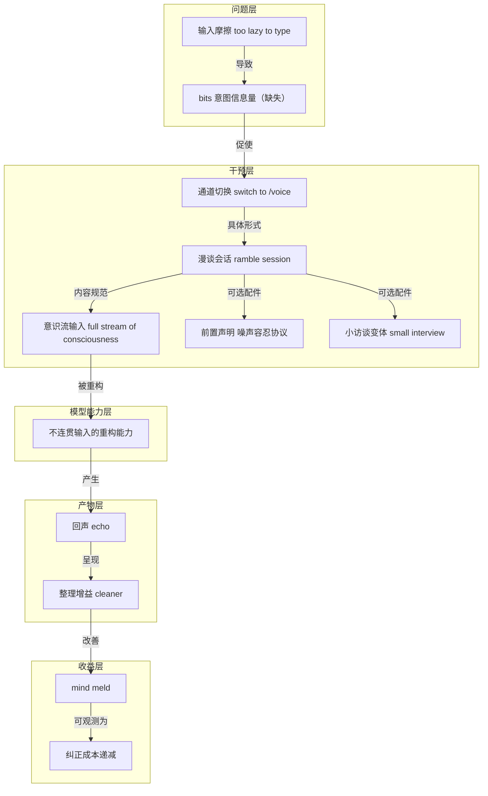

# 概念解析辞典

> 针对《用十分钟语音漫谈，让 LLM 帮你整理真正想说的话》（来源：AI 内参主题精选｜作者：未署名）的概念提取

## 一、核心概念

### 1. **漫谈会话（ramble session）**

- **context**：模式名称来自开篇推文原句，具体动作也出自同段。

  > One pattern I find useful for working with LLMs is a nice long ramble session.
  >
  > lean back, switch to /voice and just ramble for like 10 minutes.

- **费曼一下**：这是整个模式的动作容器：不是先把话想清楚再说，而是先进入一段十分钟左右的、无结构的自由讲述，让“想清楚”这件事发生在说的过程里。听众是 LLM，目的是用充分的原始信息换后续更少的纠偏。

### 2. **bits（意图信息量）**

- **context**：原文用 bits 界定问题缺口所在。

  > Sometimes the LLM needs more bits to understand what you're trying to achieve

- **费曼一下**：指的是让模型理解你真正意图所需的信息量，而不是模型的推理能力。模型之所以跑偏，常常不是因为它不聪明，而是你给出的关于目标、背景、约束和犹豫的线索太少。

### 3. **输入摩擦（too lazy to type）**

- **context**：同一句的后半句点出原因。

  > but you're too lazy to type them

- **费曼一下**：这些信息本来就存在于你脑子里，只是敲成文字的成本太高，于是被系统性地省略了。输入摩擦不是懒，而是键盘这条管道太贵，把最该传达的背景、顾虑和排除过的方案挡在了输入之外。

### 4. **通道切换（switch to /voice）**

- **context**：作者给出的具体动作。

  > lean back, switch to /voice and just ramble for like 10 minutes.

- **费曼一下**：用语音输入替代键盘，把同样的信息换到成本更低、带宽更高的管道里送进去。要传达的内容没变，只是把“写”换成“说”；这不改变信息的实质，但改变了送达的效率。

### 5. **意识流输入（full stream of consciousness）**

- **context**：对漫谈内容的要求是反向的。

  > total mess, anything goes, full stream of consciousness

- **费曼一下**：这十分钟的目标不是讲得漂亮，而是讲得全。允许跑题、重复、绕圈、中途改主意和不做自我审查，正是为了让那些在打字时会被压缩掉的 bits 全部通过，把整理工作推迟给模型。

### 6. **前置声明（噪声容忍协议）**

- **context**：作者有时会在开头先打招呼。

  > switching to speech recognition sorry for any typos...

- **费曼一下**：这句话不是礼貌，而是给模型一个噪声容忍协议：接下来的内容会有转写错误、断句混乱和口语碎片。它让模型把转写噪声与真实意图分开，不要把噪声当成有意义的信号。

### 7. **小访谈变体（small interview of a few turns）**

- **context**：作者有时会把漫谈改为问答。

  > Sometimes I turn it into a small interview of a few turns

- **费曼一下**：这是漫谈的结构化变体：不是一次性倒完，而是让对话在几轮问答里把意图逐步逼出来。它用模型的追问替代一部分自我组织的工作，暴露出模型理解中的空洞，而不是你以为的重点。

### 8. **不连贯输入的重构能力**

- **context**：整个模式的支点是这句经验判断。

  > I find that the LLMs are somehow very good at reconstructing long incoherent rambles.

- **费曼一下**：LLM 在经验上擅长从冗长、散乱、不连贯的口语流中重建结构。作者把它当作观察到的既成事实，而不是已经解释清楚的机制；如果没有这一能力，前面所有降低输入成本的努力都只会变成噪声。

### 9. **回声（echo of your own tangle of thoughts）**

- **context**：模型返回的内容是自己的回声。

  > often their echo of your own tangle of thoughts comes out quite a bit cleaner than what you started with

- **费曼一下**：模型返回的不是新观点，而是你自己那团缠绕想法的复述。只是它在复述时顺手替你理了一遍，让原本缠在一起的线头看起来有了顺序。

### 10. **整理增益（cleaner than what you started with）**

- **context**：同一句的后半段点出净增益。

  > often their echo of your own tangle of thoughts comes out quite a bit cleaner than what you started with

- **费曼一下**：模型整理后的版本常常比你最初的表达更清楚。这意味着漫谈有两份产出：一份是模型获得的上下文，另一份是你自己重新看清的思路——标题所说的“帮你整理真正想说的话”正是后者。

### 11. **mind meld（心智融合）**

- **context**：作者用 mind meld 概括收益。

  > you improve the mind meld

- **费曼一下**：描述人与模型在目标、约束和语境上的对齐状态被抬高。双方对“我们到底在干什么”的理解逐渐重合，后续交互不再需要不断重新对齐。

### 12. **纠正成本递减（correct things less from that point on）**

- **context**：可观测的结果。

  > have to correct things less from that point on

- **费曼一下**：从漫谈这一轮之后，需要纠正“我不是这个意思”的次数减少。这是 mind meld 改善的外在表现，也解释了十分钟前置投入的经济性：一次性的成本被后续所有回合的减少纠偏摊薄。

## 二、概念架构图

