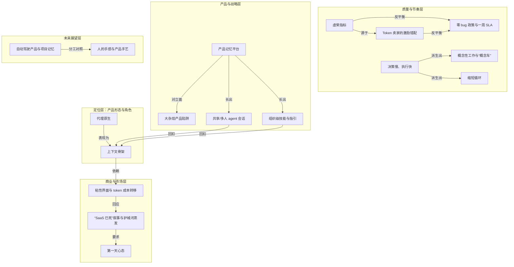

# 概念解析辞典

> 针对《SaaS 没死，Linear 正把上下文变成 Agent 的骨架》（AI and I，来源：app.podwise.ai）的概念提取

## 一、核心概念

### 1. **代理原生（agent-native）**

- **context**：文中反复出现的核心定位词。Karri 的世界观前提是：

  > “不会只有一个 agent，每个人都会有很多 agent，公司也会自建 agent”

  另一处关键语境：Linear 发布的 agent 平台“文档很好，agent 能自己读文档、自建集成”，因此“如今大多数 coding agent 都接入了 Linear：OpenAI 把它 codex 那类云端 agent 接了进来，只因为 Linear 就摆在那儿、随手可用”。

- **费曼一下**：普通软件围着人转，按钮菜单都按人的理解力设计；agent-native 软件围着 AI 转，把“该带什么上下文、能调哪些能力、怎么完成任务”都摆在 agent 读取的位置。它和“给旧产品外挂一个 chatbot”的区别在于：后者是事后补丁，前者从底层把产品重排成 agent 可用的形态。这个概念是全篇的起点——它解释了为什么 Linear 对 coding agent 友好到“摆在那儿随手可用”。

### 2. **上下文骨架（Linear 作为引导 agent 的系统）**

- **context**：Karri 用来概括 Linear 新使命的核心说法。它和一个被推翻的旧隐喻对立：

  > “Linear 更像一个‘可依赖的骨架’：收集信号、收集问题、收集决策”

  同一语境下，旧隐喻是“把 issue tracking 想成厨房的点单系统——有人点了鱼，一张票进厨房‘做鱼’”。Karri 明确拒绝这个隐喻：“工单本身可能随 agent 消失——agent 既能开票也能完成票；但收集上下文、把工作塑造成可执行、并为 agent 提供来自环境的好上下文，仍然有价值。”

- **费曼一下**：当你能同时指挥一百万个 agent，真正稀缺的不是“手”，而是“该干什么”的清晰指令和背景。骨架就是那套让 agent 站得住、对得齐的中轴：它不亲自砌砖，但决定砖往哪儿砌。工单系统只管“把菜端出去”，骨架管的是“这家店为什么做这道菜、接下来该上什么”。这个比喻把 Linear 从“任务追踪工具”升级为“组织决策的承重结构”。

### 3. **粘性界面与 token 成本转移（“坐在上游”的卡位）**

- **context**：Dan 点破的商业模式核心，Karri 用“上游”一词补充了战略含义：

  > “你是那个粘性界面，因为一切都从这里被发起、所有信息在这里被记录，你却不用为实际的 token 付一分钱”

  Karri 的补充：

  > “坐在工作来源的上游（upstream）”：work 进来、bug 进来，会自动 spawn 成 agent、甚至被委派给 agent，工程师可能根本看不到它们

- **费曼一下**：想象一个繁忙的港口。真正烧钱的是跑远洋的货轮（那是 OpenAI、Anthropic 和 coding agent 在付 token 成本）；港口只管调度、记录、盖章放行，成本低却掌握一切从哪儿开始、往哪儿去。谁守住“工作从这里发起”的入口，谁就既省了油钱又拿到指挥权。这个概念解释了为什么 Linear 在这个 AI 重投入的时代反而是“完美生意”。

### 4. **“SaaS 已死”叙事与护城河蒸发**

- **context**：文章标题直接回应的市场情绪。Karri 承认方向性判断的对与错：

  > “人们会自己攒出一个 CRM 工具”太简化，他不认为会那样发生

  他承认的真实部分是：“对投资人而言，未来现金流更不确定，因为格局在变，不能指望一切照旧”；“上市公司受伤最重，因为它们的护城河正在消失”。

- **费曼一下**：“SaaS 已死”把两件事混为一谈。真命题：当 AI 让软件更容易被替代，靠锁定和惯性收租的旧护城河确实在退潮。假命题：所以每家公司都会自己写掉所有软件。退潮冲垮的是浅滩上动作迟缓的大船，不是所有船；灵活的新公司反而能借水位变化重新出海。这个概念框定了全篇论述的对手方——为什么“SaaS 已死”需要被严肃回应又必须被修正。

### 5. **第一天心态（day one）**

- **context**：面对护城河消散时给自己立的姿态：

  > “即便对 Linear，也要重新活在‘第一天’（day one）的世界里，不能再依赖过去的决定”

  他强调要以全新眼光重看问题：“当 agent 进入产品开发流程，会冒出哪些新问题、如何帮上忙。不该被过去的产品绑住，而要看未来的产品该是什么样。”

- **费曼一下**：公司待久了，会把“我们一向这么做”当成物理定律。day one 心态就是强迫自己假装今天才创业：既有的决定、产品形态都不是理所当然，一切重新问一遍“如果从头来还会这样吗”。当外部世界剧变，最危险的不是没经验，而是把过去的经验误当成不变的地基。这个概念是对“SaaS 已死”叙事的实践回答：能活下来的不是最大或最久的，而是还能重新以第一天视角审视问题的。

### 6. **虚荣指标（vanity metrics）**

- **context**：Karri 对活动量崇拜的直接批判：

  > “如今最大的虚荣指标是‘你多少代码是 agent 写的、你合并了多少 PR’”

  他同时指出这类数字的陷阱：“活动并不总是正向的，有时是负向的”——高活动量可能引入不必要的复杂性或 bug。真正该问的是“产品在改进吗？新功能有好评吗？bug 更少吗？”

- **费曼一下**：体重秤上多出的数字可能是肌肉、脂肪，也可能只是没上厕所。只盯“产出了多少”就像只盯体重秤——数字在动，却说不清你到底变好还是变差。虚荣指标让人感觉良好、便于汇报，但真正该看的是那个不好看的滞后问题：产品真的更好了吗？这个概念是质量度量的批判入口，把“产出”和“价值”切开。

### 7. **Token 卖家的激励错配**

- **context**：Karri 对市场激励结构的诊断：

  > “花更多 token 从来不等于产品更好”

  他描述这个结构：“市场上有一批‘token 卖家’式的大公司，其商业模式就是让你花更多 token（你花得越多，它们的收入和市场份额越高）。于是有大量‘你应该花更多 token’的激励，却没人说‘你该想清楚、花得好’。”

- **费曼一下**：卖油的人不会劝你少开车。当供应商靠你的消耗量赚钱，它给你的所有“最佳实践”都会悄悄偏向“多烧一点”。这个概念是虚荣指标的因果背景：为什么市场如此痴迷于 token 消耗量？正因为有一整类公司的收入结构在奖励它。识别这种错配，你才不会把“烧得多”误当成“做得好”——耗油量是成本，不是里程，更不是你到没到目的地。

### 8. **零 bug 政策与一周 SLA**

- **context**：Linear 的内部质量制度，也是 agent 用在刀刃上的样板：

  > “现在有了 agent 和 AI，你为什么还会有 bug？没有借口了。”

  具体机制是：“所有 bug 都进去，一周 SLA 内必须修完”，现在“coding agent 能先做第一遍修复，然后 @ 那位工程师；工程师若不喜欢或想改，也能在 Linear 里改、在 Linear 里 review 代码”。

- **费曼一下**：把修 bug 从一件靠人排队、容易拖延的苦差，变成一条有硬期限、有机器先跑一遍的流水线。agent 做脏活累活的第一版，人只做最后的质量把关。当修复的启动成本被压到接近零，“留着 bug”就从“没空”变成了一个明摆着的选择题——而他们选择不留。这个概念给质量提供了一条硬边界：不是“尽力而为”而是“一周内必须清掉”。

### 9. **决策慢、执行快**

- **context**：Karri 化解“又要慢思考、又用快工具”这一表面矛盾的原则：

  > “我不想让找问题这件事变快。你应该花时间去找对的问题、对的方法；一旦你定了，就可以走得更快。”

  他警告另一个极端：用 AI 去“speed-run”决策，“有想法就立刻建，结果一群人盯着一个‘没人真正知道为什么存在、该不该做’的东西”。

- **费曼一下**：开车时你可以踩到底，但选目的地绝不能靠掷骰子。把油门和方向盘分开：方向（做什么）要反复确认、慢慢定；一旦定了方向，速度（怎么做）越快越好。AI 是极强的油门，如果你用它来替你选方向，只会更快地开到错误的地方。这个概念是全篇节奏哲学的核心：速度本身不是问题，用速度来躲开思考才是问题。

### 10. **概念性工作与“概念车”**

- **context**：Karri 从设计背景带来的方法——有些产出是一个“概念”，而非可交付的功能：

  > “这辆车不会量产，但这里有些能影响下一辆车的想法”

  他用“概念车”这个词是为了“不吓到人”，因为此时重点“不是去决定那个，而是先决定‘这个新概念有没有价值、是否重要到值得推进’”，把“会不会打破现有系统”的恐惧推到以后。

- **费曼一下**：概念车在车展上惊艳全场，却从不真的开上路——它的任务是探路，不是载客。产品里的“概念”也一样：你做一个大胆的原型，不是为了明天上线，而是为了看清“这个方向到底值不值得走”。把“探索的决定”和“交付的决定”切开，你才敢想得足够远，而不被“这会不会搞坏现有东西”提前吓退。这个概念给“决策慢”提供了具体内容：慢不是拖延，而是给探索留出不被交付压力挤压的空间。

### 11. **缩短循环（shortening the loop）**

- **context**：Karri 概括所有有效 AI 用法的共同模式：

  > “缩短某个循环，让你能立刻做，而不用等下周或别的时间——立刻做的成本其实很低”

  典型实例：在 Slack 里讨论达成一致后，直接 @ Linear：“能把这段对话变成 issue 吗？”事情立刻变得可执行，而不是“我们得先开个会、再立项、再分派人”。

- **费曼一下**：很多好主意不是死于反对，而是死于拖延——等下次开会、等有空再说，然后就没有然后了。缩短循环就是趁热把念头当场钉成一件可执行的事。当“立刻做”的成本低到几乎为零，主意的存活率就大幅上升；AI 最朴素也最可靠的价值，往往就是把这段等待时间抹掉。这个概念给“执行快”提供了机制：快不是赶工，而是把“想到”和“做到”之间的等待压缩到最短。

### 12. **产品记忆平台（product memory platform）**

- **context**：Karri 用来和“通用 agent 平台”划清界限的定位：

  > “不做一个非常通用的 agent 平台，而是做‘产品上下文 / 产品记忆平台’”

  他描述其独特处：普通工具“每次都得叫它去 fetch、去找某样东西，因为普通工具对‘你一般在做什么、已有哪些上下文可用’并没有理解”；而 Linear 是“围绕你的产品工作的一种方式、是一个通往‘产品思考’的 API”。

- **费曼一下**：通用 agent 像一个每天失忆的临时工，你每次都得从头交代背景；产品记忆平台像一个跟了你多年的老同事，你只说半句，他就知道你指哪个项目、上次卡在哪、客户要什么。价值不在“更聪明的大脑”，而在“共享且长期沉淀的记忆”——上下文本就活在那里，不必每次重新搬运。这个概念是 Linear 的最终自我定义：不是跑一切工作负载的通用平台，而是围绕“产品该怎么思考”的记忆底座。

### 13. **大杂烩产品陷阱（kitchen sink product）**

- **context**：Karri 明确要避开的反面：

  > “不想做那种什么都为所有人做的 kitchen sink 产品”

  他描述陷阱的形成机制：“公司常常因为企业买家和 checklist 陷进这种状态——只为了把勾打到 checklist 上正确的位置，但这些并不创造好的产品体验。”Linear 的对策是始终找“工作流里‘自然的下一步’”。

- **费曼一下**：把厨房所有电器都塞进一个盒子，你得到的不是全能厨具，而是一个谁都不好用的怪物。企业软件最容易这样死：为了在招标表上多打几个勾，功能越堆越多，体验越用越糟。这个概念是产品记忆平台的反面边界——它回答了“什么不做”，从而让“聚焦”成为可能。

### 14. **共享/多人 agent 会话**

- **context**：Linear 演示中的关键差异化：

  > “session 对我和对他都可见，一旦完成，两人可以跳进同一个 chat 一起看”

  Karri 说这“大大压缩了协作循环”，真实例子是 head of product 和 head of design 一起在同一个 agent session 上改东西，两人都能看同一个 preview link；代码评审时“工程师可以直接让 agent 修，而不是叫另一位工程师去修”。

- **费曼一下**：大多数人用 AI 是各自对着私密聊天窗口干活，成果和过程别人看不见。共享会话把这块“单人操作台”改成“公共工作台”：谁发起的、改到哪一步、预览长什么样，全组一目了然。PM、设计师、工程师不再靠转述彼此的意图，而是围着同一个 agent 直接协作——协作往返一下子短了。这个概念展示了“组织级上下文”的具体形态：不是一个人和一个 agent 的孤立对话，而是多个人和同一个 agent 的共享空间。

### 15. **组织级技能与指引（skills / Linear way skill）**

- **context**：Linear 演示中的功能，把公司理念固化给 agent：

  > “喂进公司 blog 里关于产品开发的材料，让它 ‘act like a linear product teammate’”

  技能分“组织级指引和个人级指引”，Karri 的“Linear way skill”带一个固定格式，从“底层需求”开始，去综合功能请求，把“multiple assignees per issue”这类几百人提过的诉求变成可讨论、可执行的东西。

- **费曼一下**：技能就是把“我们这家公司是怎么想事情的”写下来、喂给 agent，让它像一个懂行的老员工那样开口，而不是一个只会通用套话的外人。你把团队的判断口径、常用格式、看问题的顺序固化成一份可复用的“上岗手册”，agent 一加载就自带你们的品味——比每次临时提示要稳定得多。这个概念解释了“上下文”如何被组织化和沉淀：不是靠每次口头交代，而是靠一套可持续叠加的技能层。

### 16. **自动驾驶产品与项目记忆（self-driving / project memory）**

- **context**：Karri 对五年后“会变的部分”的预测：

  > “project 像一个 agent，基于它收到的输入自己做决策，仍可要求一定量的人类输入，但能自动运行”

  他模拟 agent 的话：“我看到这些模式，它们指向这个解法，这个解法似乎对人们管用，我做了个试制品发给一些客户，反馈不错。”

- **费曼一下**：今天的项目是一块被动的白板，人往上贴需求、派任务；自动驾驶的项目更像一个有记忆、会主动的助手——它记得这个功能一路收到过什么反馈，自己从中看出模式、提出方案、甚至小范围试水，只在关键处停下来问你一句。人从“事事亲自推”变成“设好规则、在岔路口把关”。这个概念标出了未来自动化可能抵达的边界：项目管理和决策循环可以部分自主，但要依据人类设定的规则与判断。

### 17. **人的手感与产品手艺（反数据驱动）**

- **context**：Karri 对“不变的部分”的最终信念：

  > “产品构建仍是手艺或艺术，仍需人的手感去判断什么有趣、什么让产品变好”

  他明确说“他个人从不相信 A/B 测试和纯数据驱动的产品开发——那对 agent 也许好用，但不适用于所有产品”。

- **费曼一下**：数据能告诉你“哪个按钮点击更多”，却告诉不了你“这个产品该有怎样的灵魂”。A/B 测试擅长在既定选项里择优，不擅长凭空想出那个更好的选项。当 agent 接管了执行和择优，人剩下的、也最不可替代的，恰恰是那份说不清道不明的手感——判断什么有趣、什么值得做、什么能让产品真正变好。这个概念是全篇的落点：无论工具多快，真正稀缺的仍是人对“该做什么”的清晰判断。

## 二、概念架构图

