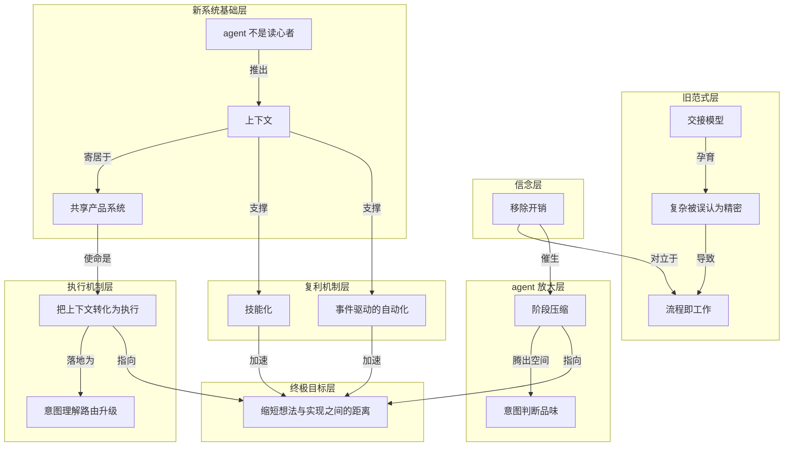

# 概念解析辞典

> 针对《Issue tracking is dead.》（linear.app，原文 https://linear.app/next）的概念提取

## 一、核心概念

### 1. **交接模型（handoff model）**

- **context**：文章开篇给出的旧范式。传统问题追踪是"为软件开发的交接模型（handoff model）"而造——PM 先划定范围，工程师稍后接手，中间靠优先级、协商、工作流来"弥合缝隙"。

  > "Issue tracking was built for handoffs."
  >
  > "Engineering time was scarce."

- **费曼一下**：想象一条流水线，一个人做好半成品，交给下一个人接着做。为了保证不出错，中间要填一堆表格、开一堆会、排一堆优先级。这些手续本身不创造价值，只是为"交接"这个动作服务。当年之所以值得，是因为工程师人手太少，必须精打细算地分配他们的时间。

### 2. **复杂被误认为精密（complexity looked like sophistication）**

- **context**：作者诊断旧系统退化的关键心理机制。

  > "Over time, complexity started to look like sophistication."
  >
  > "The more process a system could absorb, the more advanced it seemed."

- **费曼一下**：一个东西看起来越复杂，我们往往就越下意识觉得它越高级、越专业。软件流程也中了这个圈套：能塞进去的步骤、审批、字段越多，工具看着就越"强大"。但复杂不等于精密，很多时候它只是笨重而已。

### 3. **流程即工作（the process became the work）**

- **context**：上一条误判的直接后果。本该服务于构建的机制，反过来消耗了团队的主要精力。

  > "Overhead grew until the process became the work."

- **费曼一下**：本来流程是为了帮你把产品做出来，结果做到后来，大家一天的时间全花在维护流程本身上：更新状态、走审批、对齐字段。手段吃掉了目的，"管流程"变成了真正的工作，"做产品"反而成了副业。

### 4. **移除开销（remove overhead）**

- **context**：Linear 的立身信念，与"流程即工作"正面对立。它是全文的价值坐标。

  > "The best systems remove overhead so teams can focus on building."

- **费曼一下**：好工具的标准不是功能多，而是帮你把碍事的东西拿掉。与其把流程打磨得更精致，不如干脆删掉不必要的流程，让人把注意力还给"真正在造的那个东西"。少即是多。

### 5. **阶段压缩（compression）**

- **context**：agent 把"移除开销"这条信念推得更远的机制。随着 agent 吸收程序性工作，原本分离的阶段开始彼此挤压合并。

  > "As agents take on more procedural work, planning, implementation, and code review begin to compress."

- **费曼一下**：过去写软件像接力赛：先规划、再实现、再评审，一棒一棒交。agent 能同时插手这几段活儿，于是几个阶段被挤到一起、几乎同时发生，中间的等待和交接被压扁了。整个链条从"串行"变得更像"并行"。

### 6. **意图、判断与品味（intent, judgment, taste）**

- **context**：阶段压缩之后，留给人的高价值部分。agent 接走机械环节，人剩下的就是这三样。

  > "People can spend more time on intent, judgment, and taste—and less time managing the mechanics of the process."

- **费曼一下**：当机器把重复、程序化的活儿包了，人剩下的就是那些机器替代不了的部分：想清楚到底要做什么（意图）、在权衡中拍板（判断）、以及分辨什么是好的、什么是将就（品味）。这三样恰恰是最难自动化、也最值钱的能力。

### 7. **agent 不是读心者（agents are not mind readers）**

- **context**：新范式的第一性原理。这句话直接推出"上下文"为何是新系统的核心。

  > "Agents are not mind readers. They become useful through context."

- **费曼一下**：再聪明的助手，你不告诉它来龙去脉，它也帮不上忙。agent 不会自己猜出你的目标、约束和历史决策，你得把这些信息喂给它。所以问题不在于 agent 够不够聪明，而在于你有没有把上下文摆到它面前。

### 8. **上下文（context）**

- **context**：新系统的燃料与地基，也是标题所指驱动下一阶段的两大动力之一。

  > "Customer feedback, internal ideas, strategic direction, decisions, and code—placed in a system that humans and agents can work from together."

- **费曼一下**：上下文就是"关于这件事你需要知道的一切"：用户在抱怨什么、团队为什么这么定、代码是怎么写的、之前拍过哪些板。把这些散落各处的信息收拢到一个地方，agent 和人才能站在同一张地图上干活。没有上下文，agent 就是聪明但失明。

### 9. **共享产品系统（shared product system）**

- **context**：承载上下文的载体，也是 Linear 的自我定位内核。

  > "A system that humans and agents can work from together."
  >
  > "Linear is the shared product system that turns context into execution."

- **费曼一下**：不是给人一个系统、给 agent 另一个系统，而是让两者共用同一个工作台。人在上面提需求、拍决策，agent 在同一处读取这些信息、接着往下做。共享的意思是：同一份上下文，人和机器都看得见、都能动手。

### 10. **把上下文转化为执行（turn context into execution）**

- **context**：Linear 的一句话定位与核心机制。

  > "Linear is the shared product system that turns context into execution."
  >
  > "It shapes that context into work and helps humans and agents carry it all the way to production."

- **费曼一下**：光有一堆信息没用，关键是让信息自动变成"做出来的东西"。这套系统的价值在于打通"知道"到"做到"的最后一段路：反馈进来，变成任务，有人或 agent 去做，一直推到上线。上下文是原料，执行是成品。

### 11. **意图理解、路由与升级（understand intent, route, escalate）**

- **context**：新系统应具备的运行能力清单，是把上下文变成执行的具体动作。

  > "Understand intent, route work to the right actor, escalate when needed, and keep execution moving."

- **费曼一下**：一个好的调度系统要会三件事：听懂你到底想要什么（意图），把活儿派给最合适的人或 agent（路由），遇到自己搞不定的就往上交给能拍板的（升级）。这样工作才不会卡住，而是一直往前走，不被困在流程里空转。

### 12. **技能化（Skills）**

- **context**：今日发布之一，把可复用的工作流沉淀为可复用技能。

  > "Codify them as reusable skills. Compound your learning."

- **费曼一下**：你摸索出一套好用的干活套路后，不该每次都从头再来。把它打包存下来，取个名字，下次一键调用——甚至系统会在合适的时候自动帮你用上。经验因此像利息一样越滚越多，而不是每次归零。

### 13. **事件驱动的自动化（Automations）**

- **context**：今日发布之一，从 Triage 起步。在一个 issue 进入系统的那一刻就触发 agent 工作流。

  > "Trigger agent workflows the moment an issue enters."
  >
  > "Each new issue adds context to the workspace, and Linear can intelligently refine, synthesize, or act on it the moment it arrives."

- **费曼一下**：不用等人有空来处理，事情一发生就自动开跑。新问题一进来，系统立刻去归类、去查重、去补充关联信息，甚至直接动手。把"人来了才处理"变成"事一来就处理"，等待时间被压到接近零。

### 14. **缩短想法与实现之间的距离（collapsing the distance between idea and implementation）**

- **context**：全文的终极目标。通过把 agent 扎根于产品与代码库的完整上下文，Linear 正在压缩这条距离。

  > "Collapsing the distance between an idea and its implementation."
  >
  > "Issue tracking was built for handoffs. Linear turns context into execution."

- **费曼一下**：传统上，从"我有个点子"到"它真的上线了"要经过漫长的传递、排期、返工。当 agent 手握全部上下文、能直接把想法往下推，这段路被大幅缩短——想到和做到之间的鸿沟越来越窄，几乎可以一步跨过去。

---

## 二、概念架构图

图分七层。旧范式层的交接模型是起点，经由"复杂被误认为精密"的心理捷径滑向"流程即工作"。信念层的移除开销与之正面对立，并催生 agent 放大层的阶段压缩，从而腾出空间给人发挥意图、判断与品味。新系统基础层由"agent 不是读心者"这一第一性原理推出上下文，上下文寄居于共享产品系统。执行机制层是共享产品系统的使命——把上下文转化为执行，并落地为意图理解、路由与升级。复利机制层的技能化与事件驱动自动化由上下文支撑，共同加速终极目标：缩短想法与实现之间的距离。
