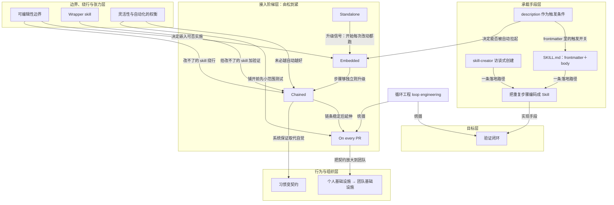

# 概念解析辞典

> 针对《用 Skills 在 Claude Code 里搭建验证闭环》（claude.com｜作者：Delba de Oliveira）的概念提取

## 一、核心概念

### 1. **验证闭环（verification loop）**

- **context**：全文的核心对象，指把「产出某个东西之后总要做的那个检查」固化成可自动执行的一环。

  > 每次做完一件事总要跟着做的那个检查——改完前端要跑的端到端验证、提交前的安全扫描、发 PR 前的无障碍审计——不该一直靠人记着做。最经济的做法是把它写成一个 skill，让 Claude 自己执行这个「验证闭环」（verification loop）。

- **费曼一下**：像流水线末端的质检工位。以前每做完一件产品你都得亲自拿卡尺量一遍；验证闭环就是把这道质检工序标准化、装到流水线上，让它自动量、自动挑出次品，你只在它报警时才出面。它是全文一切讨论的落点——后面所有 skill、接入方式，都是在回答「怎么把这道理做成」。

### 2. **把重复步骤编码成 Skill**

- **context**：把验证闭环落地的基本手段，也是后文四种接入方式共同的底座。

  > 把重复步骤编码进验证闭环，最常见的方式就是写成一个 skill

- **费曼一下**：把你脑子里「每次都要这么做」的那套动作，写成一张给助手看的工作卡片。写下来一次，以后助手照着卡片自己做，你不用每次都口头交代一遍。文章明确说这是「最常见的方式」，等于给出了「验证闭环用什么承载」这个问题的答案。

### 3. **skill-creator 访谈式创建**

- **context**：创建 skill 的一条落地路径——不手写，而是让 Claude 反过来问你。

  > 创建 skill 最快的方式，是装上 skill-creator 插件、让 Claude 反过来访谈你的工作流。
  >
  > /skill-creator Create a skill for verifying frontend changes end-to-end. Interview me about my workflow.

- **费曼一下**：不用自己憋着写说明书，而是让一个懂行的编辑坐下来采访你「你平时这活儿到底怎么干」，边问边帮你整理成规范。它解决的理解难点是：你不必先会写规范文档，也能把流程沉淀下来——这是「人人可写 skill」的入口。

### 4. **SKILL.md：frontmatter＋body 契约**

- **context**：skill 的最小结构，也是手写路径的具体形态。

  > 最简单的验证 skill＝几行 frontmatter＋一段 body。
  >
  > frontmatter 三件套：name；description……allowed-tools: [Read, Edit, Grep]。

- **费曼一下**：一张工作卡片分两半。上半是「标签栏」（叫什么、什么时候用、能动用哪些工具），下半是「操作步骤」。标签栏让系统知道何时该翻出这张卡，步骤栏才是真正要干的活。理解了这个结构，才看得懂后文为什么「description 没写好」会让检查不跑。

### 5. **description 作为触发条件**

- **context**：frontmatter 里最关键的一行，直接接管了后面 embedded 能否自动生效。

  > description（"Check that error logs include the request ID and never include the request body. Use when the diff touches error handling or logging."）
  >
  > description 里那句 "Use when..." 决定这个 skill 何时被自动拉进来，是后面 embedded 模式能否生效的关键开关。

- **费曼一下**：相当于卡片上的「适用场景」贴纸。写清楚「碰到 X 情况就翻我出来」，系统才会在对的时刻主动想起这张卡；贴纸含糊，卡片就躺在抽屉里没人用。文章排查嵌入失效时正是回到这一行——所以它是把静态文件接进动态工作流的开关。

### 6. **独立调用（Standalone）**

- **context**：四种接入方式里最松的一级——产物已存在后，由人刻意手动调用。

  > 你在产物已经存在之后，刻意地手动调用它。
  >
  > 它的价值在于那些「不必每次都做」的横切检查：提交前安全扫描、发 PR 前无障碍审计、整个 repo 的 license-header 校验。

- **费曼一下**：像家里的体重秤，想称的时候自己走上去。适合偶尔查一次的事。代价是每次都要你记着调用；当你发现自己「每次改动后都在跑它」，就是该升级到嵌入或链式的信号。它定义了这条阶梯的起点。

### 7. **嵌入（Embedded）**

- **context**：第二级——检查挂在产出物的那个 skill 身上，自动跟着跑。

  > 作为「产出物的那个 skill」的一部分自动触发。检查从此归属于某个特定工作流，工作流现在不用你开口就会跑它。
  >
  > 创建组件文件后，对它跑 eslint，并在报告完成之前处理掉所有 error。

- **费曼一下**：把质检直接焊进生产工序——工人组装完最后一步顺手就把自检做了，不需要另派人在旁边喊「记得检查」。检查和生产变成同一个动作。它的成立还依赖两个前提：description 能把它拉进来，且这个 skill 你得改得动。

### 8. **链式（Chained）**

- **context**：第三级——一个 skill 结尾调用下一个，串成端到端的自动流。

  > 一个 skill 在自己结尾调用另一个，若干个「经过验证的交接」端到端跑下来。
  >
  > /code-review 抓 bug，/simplify 清理 diff，一个 /verify skill 确认端到端行为，如果改动碰了 UI，一个自定义的 /design skill 会对照 DESIGN.md 里的规范做检查。

- **费曼一下**：像接力赛，每一棒跑到终点主动把棒递给下一棒，而不是停下来等裁判喊。它也承担一个特殊职责：给你改不了的 skill 加验证时，链式是唯一走得通的路。

### 9. **On every PR（每个 PR 上）**

- **context**：第四级，也是整条阶梯的终点。

  > 一旦链条对你自己的改动足够稳，同一套流程就能放到每个 PR 上跑。队友的改动会过和你一样的门禁，不管他有没有记得调用那条链。

- **费曼一下**：把个人自检清单升级成公司大门口的安检门。以前只有你出门会自觉检查，现在每个人进出都过同一道门，谁都绕不过去，也不靠谁「记得」。它和前三级是同一种基础设施，区别只在于不再依赖作者本人的自觉。

### 10. **可编辑性边界**

- **context**：决定你能走嵌入还是只能走链式的硬约束。

  > 硬边界：embedded 只对你能改的 skill 生效——你自己写的，或以项目级安装、SKILL.md 在你掌控下的那些。内置 skill 和插件托管的 skill（更新时会被覆盖）不适用这个模式；对那些，改用链式。

- **费曼一下**：你只能在自己的笔记本上写批注；图书馆里随时会换新版的公共书不能乱涂，涂了下次借到新版就没了。它是一条权限边界：先判断 skill 归不归你管，才决定用嵌入还是绕道链式——没有它，读者会以为四种接入方式可以随便挑。

### 11. **Wrapper skill（包装 skill）**

- **context**：绕过可编辑性边界的正解，属于链式的一种专门用法。

  > 链式也是给「你改不了的 skill」加验证的办法：做一个自定义的包装（wrapper）skill，先调用原 skill，再调用你的验证 skill。
  >
  > 先对当前 diff 跑 /simplify；/simplify 结束后，调用 /verify-no-public-api-changes。

- **费曼一下**：你不能改别人做好的黑盒机器，但可以给它套一个自己的外壳：外壳先把东西喂进黑盒，黑盒吐出结果后，外壳再接一道你自己的检查。机器没动，验证却加上了。它和「可编辑性边界」是一对——一个是限制，一个是绕行方案。

### 12. **习惯变契约（habit → contract）**

- **context**：链式在「人的行为」层面到底改变了什么。

  > 原本是一个靠自觉维持的习惯（"我总在 /simplify 之后跑 /verify"），变成了由系统保证的契约（"/simplify 结束时总会跑 /verify"）。
  >
  > 链条自己把整个开发循环跑完，只有当有东西升级回你这里时，你才介入。

- **费曼一下**：口头约定「我尽量记得锁门」和装一把「关门就自动上锁」的弹簧锁是两回事。前者靠你自律，后者靠机制兜底。链式的价值不在多跑一个检查，而在把「靠自觉」换成「靠系统保证」——这是理解升级路径为什么值得往上走的纵向理由。

### 13. **个人基础设施 → 团队基础设施**

- **context**：行为转变在「组织」层面的放大，也是整条阶梯的意义落点。

  > 这里就是验证「从个人基础设施变成团队基础设施」的那个点。你为省自己一周两分钟而写下的检查，现在在每一次改动上、为每个人省两分钟。

- **费曼一下**：你在自家门口修的一段台阶，原本只方便你自己；哪天它被并进小区的公共通道，就成了所有人每天都在用的设施。同一份投入，受益人从一个变成一群。它回答了「爬到 PR 级门禁到底图什么」。

### 14. **灵活性与自动化的权衡**

- **context**：给「越自动越好」这条直觉踩刹车的成本意识。

  > 链式是拿灵活性换自动化
  >
  > 链式验证闭环会增加 token 开销，所以最好在大范围部署之前，先测试这些闭环。
  >
  > 何时不链：当各步骤足够独立、你有时想只跑其中一个而不跑别的时

- **费曼一下**：自动挡和手动挡的取舍。全自动省心，但你没法临时只做半套动作；手动灵活，但事事得自己操心。而且越自动的档位越费油（token），所以铺开之前先小范围试一脚。它决定了这条阶梯不是无脑往上爬，每一级都有升级信号，也有「就停在这里」的例外。

### 15. **循环工程（loop engineering）**

- **context**：文章对这套方法论的统称，把所有前述概念收拢成一套固定流程。

  > 流程走顺之后，你就可以扩展你的「循环工程」（loop engineering）。
  >
  > 无论你在自动化什么、在什么环境里，验证闭环的创建流程都是一致的六步。

- **费曼一下**：把「让机器自己检查自己」当成一门可以反复练的手艺，而不是一次性的小聪明。招式不变——挑最烦人的重复动作、写成规则、装上、试跑、再串起来；能自动化的东西却越来越多。它是全文的最高一层：前面讲的是单个 skill 的做法，这里升维成可复用的方法。

## 二、概念架构图

全文是一台「从人工到自动、从个人到团队」的升级机器：目标是验证闭环，手段是把它写成 skill，然后沿着四级台阶往上爬；台阶上有边界阀门、行为与组织两层意义，还有一组踩刹车的张力，最后被「循环工程」统摄。

