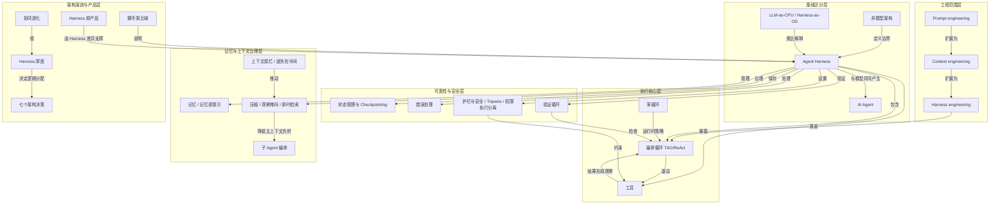

# 概念解析辞典

> 针对《Agent Harness 的本质：把模型放进可控的执行系统》（Akshay，baoyu.io 翻译）的概念提取

## 一、核心概念

### 1. **Agent Harness**

- **context**：
  > “Agent harness 的核心是把模型放进包含循环、工具、记忆和上下文管理的可控执行系统里。”
  > “Harness 包裹在大语言模型之外，包含编排循环、工具、记忆、上下文管理、状态持久化、错误处理和护栏。”

- **费曼一下**：Agent Harness 是模型之外的完整执行架构。模型负责推理和生成，Harness 负责组织循环、暴露工具、管理记忆和上下文、保存状态、处理错误、设置护栏并验证结果。它解决的理解难点是：Agent 能连续行动，不是模型直接控制外部世界，而是 Harness 把模型接进了可控执行系统。

### 2. **AI Agent**

- **context**：
  > “用户感知到的是 AI Agent：一个有目标、会用工具、能纠错的实体。”
  > “AI Agent 是用户感知到的实体：它有目标、调用工具、尝试纠错。”
  > “Harness 是产生这种实体行为的机器”

- **费曼一下**：AI Agent 是用户看到的行为实体，不是单个模型对象。它由模型与外围执行系统共同构成。与 Harness 的关键区别是：AI Agent 是行为体现，Harness 是背后产生这种行为的机器。

### 3. **非模型架构（Non-model Architecture）**

- **context**：
  > “Vivek Trivedy 的定义公式是：如果某个部分不是模型本身，那它就是 Harness。”

- **费曼一下**：这是作者用来切分边界的定义。模型之外负责运行、组织、限制、连接、恢复和验证的部分，都属于非模型架构，也就是 Harness。它让读者不再把 Agent 问题只归结为模型本身，而看到外围基础设施。

### 4. **LLM-as-CPU / Harness-as-OS**

- **context**：
  > “原生大语言模型类似没有内存、硬盘和输入输出设备的 CPU。”
  > “上下文窗口相当于内存，外部数据库相当于硬盘，工具集成相当于设备驱动。”
  > “Harness 则是操作系统：它把这些资源和机制组织起来，让模型从‘能生成文本’变成‘能执行任务’。”

- **费曼一下**：这个类比说明 Harness 的位置。裸 LLM 像 CPU，会计算但缺少资源管理；Harness 像操作系统，把上下文、存储、工具和权限组织起来，使模型从生成文本变成执行任务。

### 5. **三层工程化：Prompt engineering / Context engineering / Harness engineering**

- **context**：
  > “提示词工程关注模型接收到什么指令。”
  > “上下文工程关注模型在什么时间点能看到什么内容。”
  > “Harness 工程涵盖提示词和上下文，同时加入应用架构层面的设计。”
  > “Harness 不是提示词外面套一层壳，而是让 Agent 可以自主行动的完整系统。”

- **费曼一下**：三层工程从指令、视野扩展到完整应用系统。提示词工程管模型收到什么指令；上下文工程管模型何时看到什么内容；Harness 工程涵盖两者，并加入工具编排、状态、错误恢复、验证、安全和生命周期。关键区别是工程范围递进，不是互相替代。

### 6. **编排循环（Orchestration Loop / TAO / ReAct）**

- **context**：
  > “编排循环实现 Thought-Action-Observation，也就是思考、行动、观察的连续过程。”
  > “技术上它可能只是一个 while 循环，但复杂性来自循环内部要维护的状态、工具调用、错误反馈和退出条件。”
  > “Agent 的连续行动来自 Harness 对‘推理、执行、反馈、再推理’的稳定组织。”

- **费曼一下**：编排循环是 Agent 的节拍器。模型先推理，Harness 执行动作，再把结果作为观察反馈给模型，循环重复直到退出条件。它解决连续行动的机制问题：Agent 不是一次生成就结束，而是由 Harness 稳定组织推理、执行、反馈、再推理。

### 7. **笨循环（Dumb Loop）**

- **context**：
  > “Anthropic 把运行时称为‘笨循环’：智慧留给模型，Harness 管理回合切换。”

- **费曼一下**：笨循环不是指系统粗糙，而是运行时设计策略：执行框架尽量简单，把推理和判断留给模型，Harness 只负责稳定推进回合、处理边界条件和退出。它说明 Harness 可以在保持简单循环的同时管理复杂执行。

### 8. **工具（Tools）**

- **context**：
  > “工具以结构化模式暴露给模型，包括名称、描述和参数类型。”
  > “工具层要完成注册、校验、参数提取、沙箱执行、结果捕获和观察结果格式化。”
  > “工具：Agent 的双手”

- **费曼一下**：工具是模型触达外部世界的手。Harness 把工具用名称、描述和参数结构暴露给模型，并负责注册、校验、权限检查、沙箱执行、捕获结果和返回观察。机制边界是：模型不直接控制外部世界，必须通过 Harness 提供的结构化接口行动。

### 9. **记忆与记忆即提示（Memory / Memory as Prompt）**

- **context**：
  > “短期记忆是单次会话里的对话历史。”
  > “长期记忆跨越会话存在，可以表现为项目文件、memory.md、命名空间 JSON 存储、SQLite/Redis 会话存储等。”
  > “Agent 应把记忆看作提示，行动前仍要根据现实状态验证。”

- **费曼一下**：记忆是短期会话历史和长期跨会话存储的组合。设计原则是记忆即提示：保存下来的内容不是事实本身，而是给模型的线索；行动前仍要验证现实状态。它解决任务延续与避免盲信历史之间的张力。

### 10. **上下文腐烂与迷失在中间（Context Rot / Lost in the Middle）**

- **context**：
  > “许多 Agent 失败来自上下文窗口中的信号变差。”
  > “当关键信息处于窗口中间位置时，模型表现会下降；即使窗口达到百万级 token，指令遵循能力也会随上下文增长退化。”

- **费曼一下**：上下文腐烂和迷失在中间描述的是窗口变大不等于信号变好。关键信息位置不佳或无关信息增多，会让模型更难抓住重点，执行质量下降。它解释为什么 Harness 必须治理上下文，而不是只扩大窗口。

### 11. **上下文治理策略：压缩、观察掩码、即时检索**

- **context**：
  > “生产策略包括压缩、观察掩码、即时检索和子 Agent 委托。”
  > “上下文工程的目标是找到最小但信号最强的 token 集合。”

- **费曼一下**：这些是防止上下文腐烂的机制。压缩在接近限制时总结历史，保留高信号信息；观察掩码隐藏旧工具输出但保留工具调用记录；即时检索只保留轻量标识符，需要时再加载具体内容。共同目标是找到最小但信号最强的 token 集合。

### 12. **状态管理与 Checkpointing**

- **context**：
  > “LangGraph 把状态建模为在图节点之间流动的类型化字典。”
  > “Checkpointing 让系统中断后可以恢复，也让调试可以回到过去状态。”
  > “OpenAI 提供应用内存、SDK 会话、服务器端 API、响应 ID 链等状态策略。”

- **费曼一下**：状态管理保存任务进展，让多步任务可恢复、可追踪。Checkpointing 是存档点，中断后可恢复，调试可回溯。没有它，任务中断可能归零；有了它，Agent 更像可运行、可恢复的系统。

### 13. **错误处理**

- **context**：
  > “多步骤流程的整体成功率会随步骤数量下降；10 个 99% 成功率的步骤串联后，全流程成功率只有约 90.4%。”
  > “LangGraph 将错误分为临时性错误、模型可恢复错误、用户可修复错误和意外错误。”
  > “Harness 的错误处理不是简单报错，而是决定重试、反馈给模型、暂停等待人类，或上报调试。”

- **费曼一下**：错误处理防止小错误滚成大失败。多步任务中成功率会累积下降，所以 Harness 要对错误分类，并决定重试、反馈模型、暂停等人类或上报调试。它不是简单抛错，而是把错误变成循环可处理的反馈。

### 14. **护栏与安全（Guardrails / Tripwire / 权限执行分离）**

- **context**：
  > “OpenAI SDK 有输入护栏、输出护栏和工具护栏。”
  > “一旦触发 tripwire，Agent 会立即停止。”
  > “Anthropic 的结构把模型推理与权限执行分离：模型决定想做什么，Harness 决定能不能做。”

- **费曼一下**：护栏回答模型想做什么与系统允许什么。输入、输出和工具调用都可以设检查；tripwire 触发后立即停止。权限执行分离是机制边界：模型只提出意图，能否执行由 Harness 决定。它让 Agent 的行动受控。

### 15. **验证循环（Verification Loops）**

- **context**：
  > “验证循环区分玩具演示和生产级 Agent。”
  > “Anthropic 推荐规则反馈、视觉反馈和 LLM-as-judge 三种验证方式。”
  > “Claude Code 的创造者认为，让模型能够验证自己的工作，可以显著提升产出质量。”

- **费曼一下**：验证循环让系统检查结果，而不是生成后直接结束。规则反馈、视觉反馈和 LLM 裁判是三种方式。它是生产级分水岭，因为能防止错误累积，并让模型能够验证自己的工作。

### 16. **子 Agent 编排（Subagent Orchestration）**

- **context**：
  > “Claude Code 支持克隆、队友、工作树三种子 Agent 模式。”
  > “OpenAI 支持把 Agent 作为工具，或把任务移交给另一个专家 Agent。”
  > “子 Agent 的价值在于深度探索后返回压缩摘要，降低主上下文负担。”

- **费曼一下**：子 Agent 编排把探索和控制拆开。主 Agent 可以派子 Agent 深入探索，子 Agent 返回压缩摘要，而不是把所有细节塞进主上下文。它同时是任务拆分和上下文治理机制。

### 17. **脚手架比喻（Scaffolding Metaphor）**

- **context**：
  > “脚手架本身不盖房子，但让工人到达原本够不到的位置。”
  > “Harness 本身不是智能来源，但让模型获得工具、状态、反馈和安全边界。”

- **费曼一下**：脚手架比喻说明 Harness 不是智能来源，而是支撑条件。它让模型到达单独够不到的执行高度：有工具、状态、反馈和安全边界。理解这个比喻，能避免把 Harness 误当成模型智能本身。

### 18. **Harness 厚度（Harness Thickness）**

- **context**：
  > “架构师要决定多少逻辑写死在系统中，多少逻辑交给模型发挥。”
  > “Harness 厚度是一种架构下注。”

- **费曼一下**：Harness 厚度是系统确定性与模型自由度之间的比例。写死更多逻辑，控制更强但可能更僵；交给模型更多，灵活但需要护栏和验证。它是架构师要做的下注。

### 19. **协同进化**

- **context**：
  > “随着模型能力提升，Harness 的复杂度应该逐渐降低。”
  > “模型训练已经开始考虑 Harness 的存在。”
  > “好的 Harness 设计能在模型升级时自然受益，而不是不断增加外围复杂度。”

- **费曼一下**：协同进化说明模型和 Harness 不是固定分工。模型变强后，Harness 可以变薄，但不消失；好的设计应随模型升级自然受益，而不是靠不断堆外围复杂度。

### 20. **Harness 即产品**

- **context**：
  > “TerminalBench 的证据表明，仅改变 Harness 就能让排名发生巨大变化。”
  > “Harness 不是商品层，而是硬核工程能力。”

- **费曼一下**：同一模型配不同 Harness，结果可能差很多。因此 Agent 产品的差异不只来自模型选择，也来自外围执行系统的设计质量。Harness 是尚未被解决的工程问题，不是简单商品层。

### 21. **定义 Harness 的七个架构决策**

- **context**：
  > “定义 Harness 的七个架构决策”
  > “Harness 厚度是一种架构下注。”

- **费曼一下**：七个决策包括单 Agent 与多 Agent、ReAct 与先规划后执行、上下文管理策略、验证循环设计、权限与安全架构、工具范围管理、Harness 厚度。它们是 Harness 设计的取舍边界：没有单一答案，架构师要在灵活性、成本、控制和安全之间做下注。

## 二、概念架构图

