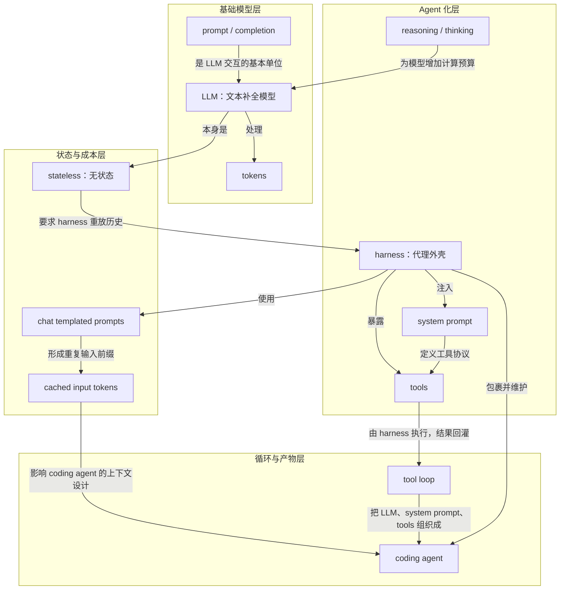

# 概念解析辞典

> 针对《Coding Agent 如何工作：工具循环与上下文工程》（Simon Willison，simonwillison.net）的概念提取

## 一、核心概念

### 1. **LLM（Large Language Model）**

- **context**：文章先把 LLM 降维到最朴素的定义。

  > 它是能根据已有文本预测后续内容的机器学习模型。

- **费曼一下**：在本文里，LLM 不是“会写代码的助手”本身，而是一台根据已有文本继续补全文本的机器。coding agent 的全部高级行为，都要建立在这个补全能力之上。拿掉这个理解，读者就容易把 agent 误认成某种神秘新物种。

### 2. **tokens**

- **context**：模型实际消费和生成的是 token，而不是自然语言中的词。

  > 文本会被转换为整数 token 序列，模型实际消费和生成的是这些 token。

- **费曼一下**：token 是模型真正看到的输入和输出单位。本文用它解释两个关键约束：供应商按 token 计费，模型一次能处理的上下文受 token 窗口限制。对 coding agent 来说，读文件、贴日志、追加对话都会变成更长的输入成本。

### 3. **prompt / completion**

- **context**：输入和输出的基本单位。

  > 输入模型的是 prompt，模型返回的是 completion 或 response。

- **费曼一下**：本文把所有交互都还原成“构造一段 prompt，让模型补全一段 completion”。聊天界面、工具调用、系统提示，本质上都只是更复杂的 prompt 编排。理解这一点，才能明白用户看到的“对话”和模型实际看到的“格式文本”不是一回事。

### 4. **stateless（无状态）**

- **context**：模型本身不保存上一轮。

  > 每次调用模型时，模型都从空白状态开始。

- **费曼一下**：LLM 没有会话记忆。连续对话、工具结果、上下文连续性，都不是模型自己记住的，而是外层软件每次重新发过去。这个性质是解释 agent harness 为什么必须维护和重放历史的起点。

### 5. **chat templated prompts（聊天模板化提示）**

- **context**：聊天格式只是 completion prompt 的特殊包装。

  > 软件把历史消息拼成一个特殊格式的 prompt，然后让模型继续补全 assistant 的下一段内容。

- **费曼一下**：所谓“模型在聊天”，其实是 harness 在持续重建一段模拟对话。模型并没有天然理解 user / assistant 角色，它只是看到一段按模板拼好的文本，然后继续补全下一段。这个概念拆穿了聊天界面的表象。

### 6. **cached input tokens（缓存输入 token）**

- **context**：供应商对重复输入前缀提供更低价格。

  > 供应商通常会对近期重复的输入前缀提供更低价格，因为底层计算可以复用。

- **费曼一下**：因为 agent 每轮都要重放历史，如果前缀经常变化，成本会更高。cached input tokens 解释了为什么 coding agent 会尽量避免修改早期对话内容，为什么有些看起来笨重的上下文组织方式其实是在为成本和延迟做折中。它是上下文工程里的经济约束。

### 7. **harness（代理外壳）**

- **context**：文章用 harness 指包裹 LLM 的软件层。

  > harness：包裹 LLM 的软件层，负责维护状态、注入提示、暴露工具、解析工具调用并把结果送回模型。

- **费曼一下**：harness 是真正把无状态 LLM 变成 agent 的外层机器。它维护对话、注入 system prompt、提供工具、解析模型发出的工具请求，再把执行结果放回上下文。没有 harness，LLM 只是一次次独立的补全调用。

### 8. **tools（工具）**

- **context**：agent 与普通 LLM 的分界线是工具。

  > agent 是能调用工具的 LLM 系统。

- **费曼一下**：工具是 harness 提供给模型的可调用函数，比如读文件、改文件、执行 shell、运行 Python、搜索项目、访问外部 API。模型不自己运行命令，它输出符合约定的调用请求，由 harness 执行。工具让模型的文本输出变成真实世界里的动作。

### 9. **system prompt（系统提示）**

- **context**：用户通常看不到它，但它定义 agent 的行为规则。

  > system prompt 把模型的自然语言能力导向一个可执行流程。

- **费曼一下**：system prompt 是 agent 的隐形操作手册，规定角色、边界、语气、工具调用方式、文件编辑策略、安全约束和汇报格式。只给模型工具还不够，还要告诉它何时、怎样、以什么格式使用工具。它和工具一起构成 harness 的核心。

### 10. **reasoning / thinking（推理/思考）**

- **context**：reasoning 让模型在给出最终答案前花更多 token 分析问题。

  > reasoning 或 thinking 指模型在给出最终答复前，用额外步骤分析问题、比较路径、推演解决方案。

- **费曼一下**：在本文里，reasoning 的价值不是形式上像人思考，而是给模型更多计算预算。复杂代码任务和调试需要模型维持假设、追踪调用、比较路径，所以 coding agent 往往提供 reasoning effort 档位，让难题多花 token、简单任务少花 token。它增加了 agent 处理复杂问题的能力。

### 11. **tool loop（工具循环）**

- **context**：工具结果重新进入上下文，形成循环。

  > tool loop：模型请求工具、harness 执行、结果回灌、模型继续决策的循环。

- **费曼一下**：tool loop 是 agent 的心跳：模型提出下一步，harness 执行工具，结果回到模型，模型再决定下一步。coding agent 的实际工作方式就是如此循环。它把 LLM、system prompt 和 tools 连成一个可行动的软件系统。

### 12. **coding agent（编码代理）**

- **context**：文章把它定义为由 harness 包住的 LLM，并通过工具获得额外能力。

  > coding agent 并不是某种神秘的新物种。它的基本结构是：一个 LLM，被一层 harness 包住，再通过 system prompt、工具调用、状态重放和推理预算，变成可以读写代码、运行命令、调试问题的软件代理。

- **费曼一下**：coding agent 不是“一个会写代码的模型”，而是一套把模型接到文件系统、终端、代码执行器和项目上下文上的软件系统。本文的主旨就是拆开这套系统：底层仍是 LLM 补全，外层靠 harness、system prompt、tools、状态重放和 reasoning 把它组织成可循环行动的 agent。

## 二、概念架构图

