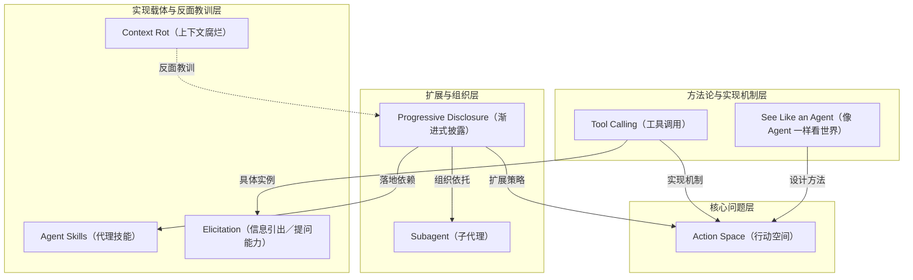

# 概念解析辞典

> 针对《构建 Claude Code 的经验教训：如何让 Agent「看见」世界》（Anthropic）的概念提取

## 一、核心概念

### 1. **Action Space（行动空间）**

- **context**：作者在开篇把构建 agent harness 最困难的部分指向行动空间。

  > "One of the hardest parts of building an agent harness is constructing its action space."

- **费曼一下**：Agent 能做什么，取决于你给它的工具集合以及这些工具如何被使用。Action space 就是 agent 可采取行动的总边界：工具太少无法完成任务，工具太多或形状不对则让模型困惑。全文的核心问题，就是如何设计出刚好匹配模型能力的行动空间。

### 2. **See Like an Agent（像 Agent 一样看世界）**

- **context**：作者用它回答一个前提问题：怎么知道模型的能力边界在哪里。

  > "You want to give it tools that are shaped to its own abilities. But how do you know what those abilities are? You pay attention, read its outputs, experiment. You learn to see like an agent."

- **费曼一下**：设计工具不能只靠人类工程师的直觉。作者的方法论是观察模型输出、阅读它怎么使用工具、反复实验，逐渐理解模型看到的世界和它能处理什么。它是设计 Action Space 的方法论，贯穿 AskUserQuestion、Task Tool、Grep 等所有案例。

### 3. **Tool Calling（工具调用）**

- **context**：作者说明 Claude 与外部世界交互的方式，以及工具可以由哪些原语构成。

  > "Claude acts through Tool Calling, but there are a number of ways tools can be constructed in the Claude API with primitives like bash, skills and recently code execution."

- **费曼一下**：模型不能直接操作环境，必须通过调用工具来行动。Tool Calling 是 Action Space 的实现机制；bash、skills、code execution 等是工具原语，AskUserQuestion、Task Tool、Grep 则是具体的工具实例。

### 4. **Elicitation（信息引出／提问能力）**

- **context**：构建 AskUserQuestion 工具时，作者把目标定为提升 Claude 的提问能力。

  > "When building the AskUserQuestion tool, our goal was to improve Claude's ability to ask questions (often called elicitation)."

- **费曼一下**：Elicitation 是 agent 主动向用户提问、获取关键信息的能力。好的 elicitation 能降低用户回答问题的摩擦，提高人机通信带宽，让一问一答快速对齐。它属于 Action Space 中的人机交互维度，AskUserQuestion 是它的具体实现。

### 5. **Progressive Disclosure（渐进式披露）**

- **context**：引入 Agent Skills 后，作者把这种探索式获取上下文的方式正式命名。

  > "When we introduced Agent Skills we formalized the idea of progressive disclosure, which allows agents to incrementally discover relevant context through exploration."

- **费曼一下**：不是一次性把所有信息塞给模型，而是让模型通过探索逐步发现相关上下文。技能文件可以引用其他文件，模型递归读取所需内容。这个模式让 Claude 从被给予上下文，转为自己构建上下文，也让 Action Space 无需新增工具就能扩展。

### 6. **Context Rot（上下文腐烂）**

- **context**：作者解释为什么关于 Claude Code 自身的信息不直接放进 system prompt。

  > "We could have put all of this information in the system prompt, but given that users rarely asked about this, it would have added context rot and interfered with Claude Code's main job: writing code."

- **费曼一下**：往 system prompt 里塞太多不常用信息，会稀释模型对核心任务的注意力，干扰它真正要做的事。Context Rot 是设计 Action Space 时的反面教训，说明不能简单把所有信息堆进提示，而要靠 progressive disclosure 或 subagent 来处理。

### 7. **Subagent（子代理）**

- **context**：作者提到 Opus 4.5 更擅长使用 subagent 后，随之出现共享任务列表的协调问题。

  > "We also saw Opus 4.5 also get much better at using subagents, but how could subagents coordinate on a shared Todo List?"

- **费曼一下**：Subagent 是主 agent 生成的子任务执行者。多个 subagent 需要共享状态、协调进度，例如共享 Todo List，因此需要 Task Tool 这类支持依赖和跨 subagent 更新的设计。它是 Action Space 的一种组织模式，通过任务分解与协作扩展复杂能力。

### 8. **Agent Skills（代理技能）**

- **context**：作者描述 skill 文件如何被模型读取，并进一步引用其他文件。

  > "Claude could read skill files and those files could then reference other files that the model could read recursively. In fact, a common use of skills is to add more search capabilities to Claude like giving it instructions on how to use an API or query a database."

- **费曼一下**：Agent Skills 是写在文件中的技能说明书，告诉 Claude 在特定场景下怎么做。Skill 文件可以引用其他文件，模型递归读取，因此成为 Progressive Disclosure 的具体载体。常见用法是给 Claude 增加搜索能力，比如 API 使用说明或数据库查询方法。

## 二、概念架构图

