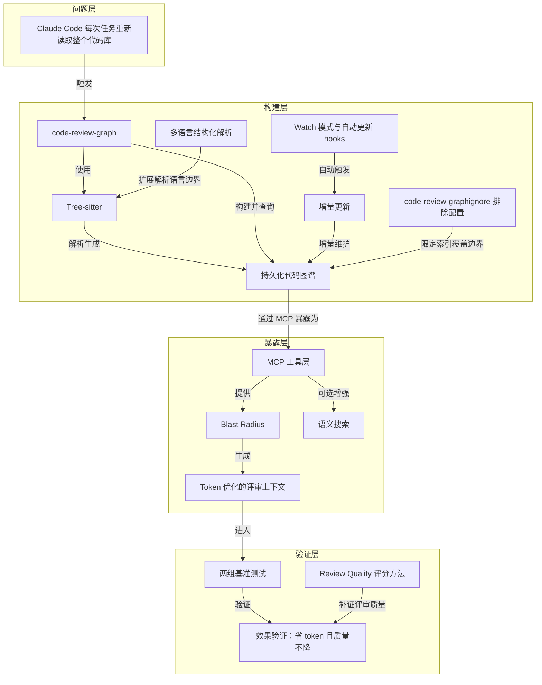

# 概念解析辞典

> 针对《用持久化代码图谱给 AI Review 精准上下文》（github.com｜作者：GitHub）的概念提取

## 一、核心概念

### 1. **code-review-graph**

- **context**：文章标题工具本身，定位是解决 Claude Code 在每次任务中重复读取整个代码库的问题，并用 Tree-sitter 构建结构化代码地图、增量追踪变化，给 Claude 精准上下文。

  > Claude Code re-reads your entire codebase on every task
  >
  > It builds a structural map of your code with Tree-sitter, tracks changes incrementally
  >
  > precise context so it reads only what matters

- **费曼一下**：这是全文的主工具：先给代码库画一张随时更新的结构地图，让 AI 做评审或改代码时不必把整个项目重新翻一遍，而是按图找到该看的地方。

### 2. **Tree-sitter**

- **context**：文章开篇点明工具的解析基础，支持 12 种语言的解析都依赖这套底层技术。

  > It builds a structural map of your code with Tree-sitter

- **费曼一下**：Tree-sitter 是负责“读懂代码”的解析引擎，把不同编程语言的源代码拆成结构化的语法树。没有它，图谱就无法把函数、类、调用、继承等关系变成可查询的数据。

### 3. **持久化代码图谱（structural map / graph）**

- **context**：图谱映射代码库中的每一种结构，并持久保存在本地，供后续查询和增量更新使用，而不是每次任务临时生成。

  > maps every function, class, import, call, inheritance relationship, and test in your codebase

- **费曼一下**：它不是每次临时给代码拍快照，而是造一张长期存在、可以反复查阅、还会自己更新的“代码关系网地图”。这张图是全文替代“重新读取整个代码库”的核心数据结构。

### 4. **增量更新（incremental update）**

- **context**：文中反复强调这一机制，安装后图谱会随文件编辑和 git commit 自动更新，CLI 的 update 命令只处理变化文件。

  > tracks changes incrementally
  >
  > Incremental update (changed files only)
  >
  > Subsequent updates complete in under 2 seconds

- **费曼一下**：地图第一次画好后，以后只重新画发生变化的那几处，而不是把整张地图推倒重来。它让图谱能持续保持最新，又不需要付出全量重建的成本。

### 5. **Watch 模式与自动更新 hooks**

- **context**：CLI 的 watch 命令与自动更新 hooks 共同保证图谱始终和代码库同步，无需用户手动触发。

  > Auto-update on file changes
  >
  > Graph updates on every file edit and git commit without manual intervention
  >
  > Continuous graph updates as you work

- **费曼一下**：它解决的是“什么时候更新图谱”的问题：不是靠人记得手动按一下，而是像后台哨兵一样，你一保存文件、一提交 commit，它就自动把地图补上最新内容。

### 6. **Blast Radius（blast radius / 影响半径）**

- **context**：这是评审和编码场景共用的核心概念，读取相关文件时同时带上 blast-radius 信息；MCP 工具中专门有 get_impact_radius_tool。

  > reads only the relevant files along with their blast-radius information
  >
  > Blast radius of changed files
  >
  > Shows exactly which functions, classes, and files are affected by any change

- **费曼一下**：改动一行代码会像水波一样影响到哪些函数、文件、测试，blast radius 就是把这圈涟漪精确画出来。它让 AI 知道除了改动点本身，还应该关心哪些关联位置，是“精准上下文”的中间产物。

### 7. **Token 优化的评审上下文（get_review_context_tool）**

- **context**：这是图谱落地到 code review 场景的具体产出物，用一份紧凑的结构化摘要替代读取整份源文件。

  > a compact structural summary (156 to 207 tokens) covering blast radius, test coverage gaps, and dependency chains
  >
  > Token-optimised review context with structural summary

- **费曼一下**：它不是把整个改动文件甩给 AI 去读，而是先浓缩成一份几百 token 的“体检报告”，告诉 AI 这次改动影响了哪些地方、测试有没有覆盖、依赖链是什么样。读这份报告就够了，token 消耗自然大幅下降。

### 8. **MCP 工具层**

- **context**：图谱建好后，Claude 通过一组 MCP 工具自动与图谱交互；CLI 里也有 install 和 serve 命令负责注册与启动 MCP server。

  > Claude uses these automatically once the graph is built
  >
  > Register MCP server with Claude Code
  >
  > Start MCP server

- **费曼一下**：图谱本身只是一堆数据，MCP 工具层把它包装成 Claude 能直接调用的“接口菜单”。Claude 不需要理解图谱内部结构，只要按需调用对应工具就能拿到影响范围、评审上下文或查询结果。

### 9. **语义搜索（semantic search / embeddings）**

- **context**：作为可选特性出现，通过 sentence-transformers 提供向量 embedding，对应 MCP 工具中的 embed_graph_tool 和 semantic_search_nodes_tool。

  > Semantic search: Optional vector embeddings via sentence-transformers
  >
  > pip install code-review-graph[embeddings]
  >
  > Search code entities by name or meaning

- **费曼一下**：默认图谱查询按名字、调用关系精确匹配；语义搜索额外加一层“理解意思”的能力，让你可以用意思相近的描述找代码，而不必记住确切函数名。它是精确查询的可选补充。

### 10. **Review Quality 评分方法**

- **context**：基准测试用来验证“省 token 是否会牺牲评审质量”的量化手段，按准确性、完整性、抓 bug 潜力、可执行洞见打分。

  > Quality scored on accuracy, completeness, bug-catching potential, and actionable insight (1 to 10 scale)

- **费曼一下**：光说省了多少 token 不够，所以作者用一套打分标准给每次评审评分，证明省 token 的同时评审质量没有变差，甚至更好。它补上了效果验证中“质量没有牺牲”这一环。

### 11. **两组基准测试（Benchmark）**

- **context**：文章用三个生产级开源项目分别测试 code review 场景和实际编码任务，并给出 token 节省数据。

  > average 6.8x token reduction
  >
  > 14.1x average, peak 49x
  >
  > 125 files about 4.6x, 27,000+ files near 49x

- **费曼一下**：这是全文的量化证据：用真实仓库和真实任务测出节省幅度，并显示仓库越大节省越明显。没有它，读者无法判断“精准上下文”到底带来了多大效果。

### 12. **code-review-graphignore 排除配置**

- **context**：在仓库根目录创建 `.code-review-graphignore` 文件，可以排除生成代码、第三方依赖等不需要被索引的路径。

  > create a .code-review-graphignore file in your repository root
  >
  > generated/**, *.generated.ts, vendor/**, node_modules/**

- **费曼一下**：它跟 `.gitignore` 是同一个思路，只不过排除对象是“不需要被 AI 理解和索引的代码”。它决定图谱该覆盖什么、不该覆盖什么，是图谱的索引边界。

### 13. **多语言结构化解析（12 languages / node type mappings）**

- **context**：特性表列出支持的 12 种语言；贡献指南说明扩展新语言时要编辑 parser.py，并补充不同 node type 的映射。

  > Python, TypeScript, JavaScript, Go, Rust, Java, C#, Ruby, Kotlin, Swift, PHP, C/C++
  >
  > EXTENSION_TO_LANGUAGE
  >
  > _CLASS_TYPES, _FUNCTION_TYPES, _IMPORT_TYPES, _CALL_TYPES

- **费曼一下**：这个工具不是只认一种语言，而是给每种语言配一份“翻译词典”：哪种语法结构算类、哪种算函数、哪种算调用。想让它认识新语言，本质上就是往词典里加词条。它决定图谱能理解多少种语言，以及可扩展边界在哪里。

## 二、概念架构图

按原文关系重建为分层图：问题层触发工具，构建层生成并维护持久化代码图谱，暴露层通过 MCP 工具把图谱变成 Claude 可用的精准上下文，验证层用基准测试和评分方法证明效果。

