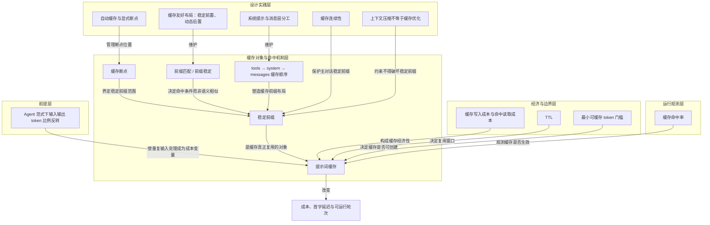

# 概念解析辞典

> 针对《提示词缓存不是小优化，而是 agent 成本结构的关键变量》（来源：x.com；作者：UNKNOWN）的概念提取

## 一、核心概念

### 1. **提示词缓存（Prompt Cache）**

- **context**：文章把它放在长对话、Agent、编程助手和文档问答的成本结构里讨论。

  > “提示词缓存不是 API 层的小优化，而是长对话、Agent、编程助手和文档问答系统的成本结构变量。它真正缓存的不是模型答案，而是请求开头到缓存断点之间的稳定前缀；因此，系统能不能省钱、变快、跑得更久，不只取决于 prompt 是否短，还取决于上下文布局是否能持续保持前缀稳定。”

- **费曼一下**：在本文中，提示词缓存不是“把答案存起来”的小技巧，而是让模型不要每轮重新处理同一大段输入前缀。它改变的是长对话和 Agent 的成本结构：省下的是重复阅读已有上下文的计算，同时降低首字延迟，让同样预算能跑更多轮。

### 2. **Agent 范式下输入输出 token 比例反转**

- **context**：作者用 Chatbot 与 Agent 的对比说明缓存为何成为关键。

  > “在 Chatbot 的范式下，输入 Token 与输出 Token 的比例是 1:20。但到了 Agent 的范式，输入 Token 与输出 Token 的比例反过来了，而且扩大了很多倍，变成了 200:1。这背后的核心技术就是 Prompt Cache（提示词缓存）。”

- **费曼一下**：以前聊天机器人回答多、输入少；Agent 则每轮都携带很长的系统指令、工具、历史、文档，输出相对很少。输入重复处理成了主要成本来源，所以缓存从可选项变成关键变量。

### 3. **稳定前缀（Stable Prefix）**

- **context**：文章反复把缓存对象界定为请求开头到断点之间的稳定内容。

  > “它真正缓存的不是模型答案，而是请求开头到缓存断点之间的稳定前缀；因此，系统能不能省钱、变快、跑得更久，不只取决于 prompt 是否短，还取决于上下文布局是否能持续保持前缀稳定。”

- **费曼一下**：稳定前缀就是每轮请求最前面那块最好别动的内容。缓存复用的就是它。前缀越稳定，越容易命中；前缀一变，后面缓存也跟着失效。

### 4. **缓存断点（Cache Breakpoint）**

- **context**：断点界定缓存覆盖到哪里，也连接自动缓存与显式断点。

  > “提示词缓存不是把整段对话或上一次答案简单存起来，而是缓存从请求开头到某个缓存断点之间的完整前缀。”
  >
  > “最多 4 个 breakpoints，cache read 的回看窗口是 20 个 block。断点不是越多越好，而应放在真正稳定的边界上。”

- **费曼一下**：断点告诉系统“从请求开头到这里，这一整段可以作为缓存前缀”。它决定缓存边界；放错位置，比如放到动态内容后面，就会让缓存容易失效。断点也有限制，不是越多越好。

### 5. **前缀匹配 / 前缀稳定（Prefix Matching / Prefix Stability）**

- **context**：文章区分“语义差不多”和“前缀一致”。

  > “缓存命中的关键不是内容大致差不多，而是前缀是否稳定。也就是说，缓存友好设计不是把意思写得类似，而是让请求开头的结构、顺序和内容尽可能保持一致。”

- **费曼一下**：缓存不是按“意思相近”找回忆，而是按请求开头的结构、顺序、内容是否对得上来判断。即使意思一样，只要顺序、JSON key、前面某些内容变了，缓存也可能 miss。

### 6. **tools → system → messages 缓存顺序**

- **context**：Anthropic 的缓存顺序把 prompt 布局变成系统设计问题。

  > “文章以 Anthropic 为例说明，官方文档给出的缓存顺序是：tools → system → messages。”
  >
  > “如果工具定义变化、系统提示每轮被改、JSON key 顺序不稳定，都会让后面的缓存一起失效。一个看似局部的 prompt 变动，会变成全局缓存 miss。”

- **费曼一下**：缓存按从前到后的顺序建立。工具定义在最前，最影响整条缓存链；系统提示在中间，应尽量稳定；消息在最后，适合承载每轮变化。工具定义或系统提示乱变，后面消息再稳定也救不回来。

### 7. **缓存写入成本与命中读取成本（Cache Write Cost / Cache Hit Read Cost）**

- **context**：文章用 Anthropic 价格说明缓存的经济逻辑。

  > “5 分钟缓存写入是基准输入价格的 1.25 倍，1 小时缓存写入是基准输入价格的 2 倍，缓存命中读取是基准输入价格的 0.1 倍。”
  >
  > “因此第一次写入缓存确实更贵，但后续只要复用，读取成本就会显著下降。”

- **费曼一下**：写缓存像先建索引，第一次更贵；命中读取则便宜很多。它是否值得，取决于后续能不能反复复用同一段前缀。复用次数够多，长前缀就能回本。

### 8. **TTL（缓存生命周期）**

- **context**：TTL 要匹配工作流空档，而不是越长越好。

  > “官方支持默认 5 分钟和扩展 1 小时两种 TTL。5 分钟适合连续追问，例如用户在几分钟内围绕同一份长文档不断提问；1 小时适合中间有较长空档的工作流，例如 Agent 读文件、跑测试、修改代码，隔 8 分钟后再回来继续。”
  >
  > “如果缓存有效期内再次命中，缓存会被刷新，且不会额外收费。”

- **费曼一下**：TTL 是缓存能等你多久。连续追问通常 5 分钟够用，因为每轮命中会续期；Agent 中间读文件、跑测试、改代码花了较久，1 小时缓存更像保险。选择要看工作流有没有空档。

### 9. **最小可缓存 token 门槛（Minimum Cacheable Tokens）**

- **context**：文章纠正统一 4096 tokens 的误解，并把它用于排障。

  > “按作者引用的 2026 年 5 月 Anthropic 文档，不同模型门槛不同：有的模型是 4096 tokens，有的是 2048 tokens，有的是 1024 tokens。”
  >
  > “如果 cache_creation_input_tokens 和 cache_read_input_tokens 都是 0，原因之一可能不是缓存没开，而是内容没有达到模型的最小缓存门槛。”

- **费曼一下**：缓存不是任何长度都会触发。不同模型有不同最小 token 门槛。看不到 cache read/write 不一定是没开缓存，可能只是上下文太短，还没达到门槛。

### 10. **缓存友好布局：稳定前置、动态后置**

- **context**：文章把提示词组织方式直接变成系统设计问题。

  > “这直接把提示词组织方式变成系统设计问题：稳定内容要靠前，动态内容要靠后。工具、系统指令、项目背景、大文档和示例集应该优先放在可复用区域；当前时间、临时状态、工具结果、局部上下文等高频变化内容则应该尽量放到后面。”

- **费曼一下**：想让缓存命中，就把最可能跨轮复用的高成本内容放在请求前面，把每轮会变的内容放到后面。这样前面的稳定前缀不被污染，缓存才能持续命中。

### 11. **系统提示与消息层的稳定 / 动态分工（System Prompt / Messages Layer）**

- **context**：文章批评把动态状态写进系统提示，建议改放消息层。

  > “很多系统习惯把当前时间、当前模式、当前状态直接写进系统提示。文章指出，这会把本该稳定的系统层变成每轮变化的动态层，缓存自然命不中。更稳妥的做法是把变化信息放进消息层，让固定指令保持不变。”

- **费曼一下**：系统提示应该像稳定河床，放固定规则；消息层像动态水流，承载每轮变化。把时间、模式、状态写进系统提示，等于每轮拆一次缓存地基。

### 12. **缓存连续性（Cache Continuity）**

- **context**：文章用主链路与分支任务说明如何保护缓存链。

  > “主链路保持模型稳定，维护缓存连续性；搜索、探索、辅助判断、子任务等放到独立上下文里运行，避免污染主对话缓存链。”

- **费曼一下**：主对话的模型和前缀最好别乱切、别被分支任务污染，这样缓存才能滚动复用。需要探索或子任务时，另开独立上下文，不要打断主链路的缓存连续性。

### 13. **自动缓存与显式断点（Automatic Caching / Explicit Breakpoints）**

- **context**：两种断点策略服务不同复杂度的上下文。

  > “Anthropic 支持 automatic caching 和 explicit breakpoints。一般多轮对话可以用自动缓存；如果上下文天然分成长期稳定层、中期变化层、短期动态层，显式断点更有价值。”
  >
  > “最多 4 个 breakpoints，cache read 的回看窗口是 20 个 block。断点不是越多越好，而应放在真正稳定的边界上。”

- **费曼一下**：自动缓存让系统帮你找断点，适合普通多轮对话；显式断点让你手动标出长期稳定层、中期变化层、短期动态层的边界，适合复杂系统。但断点数量和回看窗口有限制，放置要克制。

### 14. **上下文压缩不等于缓存优化（Context Compression / Summarization）**

- **context**：文章给出反直觉判断：短不等于省，破坏前缀对齐可能更贵。

  > “很多系统会自然走向两条路：少带上下文，或把上下文压缩成摘要。文章认为这两条路都可能有用，但如果只想着压缩，却破坏了缓存前缀对齐，反而可能更贵。”
  >
  > “成熟做法不是单纯追求越短越好，而是先保证主前缀稳定，再决定哪些内容需要摘要、压缩或延迟加载。摘要只是服务于稳定复用的手段，不是目的本身。”

- **费曼一下**：压缩上下文本身不是目标，稳定复用才是目标。一个短但每轮都变的摘要，可能比稍长但稳定的前缀更贵。先保证主前缀稳定，再考虑摘要、压缩或延迟加载。

### 15. **缓存命中率（Cache Hit Rate）**

- **context**：文章把命中率从优化项提升为运行状态指标。

  > “如果系统成本、速度和体验高度依赖缓存，缓存命中率就不能只是优化项，而应该是常态监控指标。”

  文章建议关注的指标包括：
  > - cache_read_input_tokens
  > - cache_creation_input_tokens
  > - 首字输出延迟
  > - 某类请求的缓存命中率
  > - 版本上线后的命中率断崖变化

- **费曼一下**：缓存命中率是系统健康度仪表盘。它帮助判断问题出在没开缓存、没到 token 门槛、断点放错，还是前缀被动态内容打碎。长对话系统应把它当常规监控，而不是事后优化。

## 二、概念架构图

