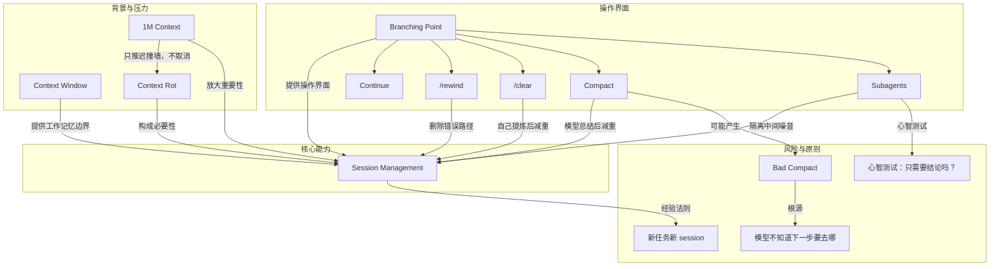

# 概念解析辞典

> 针对《Claude Code 的 1M Context 让会话管理变成核心技能》（Thariq Shihipar／x.com）的概念提取

## 一、核心概念

### 1. **Session Management（会话管理）**

- **context**：原文在客户访谈中反复出现的问题，直接指向会话管理方式的分歧。

  > What came up again and again in these calls is that there is a lot of variance in how you might manage your sessions, especially with our new update to 1 million context in Claude Code.
  >
  > Do you only use one session or two sessions that you keep open in a terminal? Do you start a new session with every prompt? When do you use compact, rewind or subagents? What causes a bad compact?

- **费曼一下**：本文中的 session management 不是开几个聊天窗口的小技巧，而是 Claude Code 的上下文治理能力。每个 session 都带着历史、工具输出、文件读取和错误路径；使用者要决定继续、回退、压缩、清空，还是把子任务交给 subagent。1M context 只把窗口变大，session management 才决定窗口里放什么、丢什么、什么时候换一个干净窗口。

### 2. **Context Window（上下文窗口）**

- **context**：原文把它定义成模型一次能看到的全部世界，并列出它包含什么。

  > context window 是模型一次能看到的全部世界
  >
  > context window 包含：system prompt、当前对话历史、tool calls、tool outputs、已读取的文件
  >
  > Claude Code 现在有 1M tokens 的 context window，但它仍然是一个窗口，不是长期记忆。

- **费曼一下**：在本文里，context window 不是长期记忆，而是模型一次可见信息的总和，也是 session 的工作记忆边界。它包含 system prompt、对话历史、tool calls、tool outputs、已读取文件。窗口再大也仍然是一个窗口，因此仍然需要整理。

### 3. **Context Rot（上下文腐化）**

- **context**：原文把上下文变长后的代价称为 context rot，并说明它为什么让 continue 不再是默认正确选择。

  > 文章把 context 使用的代价称为 **context rot**：context 变长后，模型注意力被分散；旧的、不相关的信息开始干扰当前任务；模型在长 session 后会更容易忘记真正重要的约束。
  >
  > 1M context 只是让你更晚撞墙，但不会取消“上下文会腐化”这件事。

- **费曼一下**：context rot 是上下文变长后的代价：噪音分散注意力，旧信息干扰当前任务，真正重要的约束更容易被忘掉。它解释了为什么一直 continue 并不总是好选择。大窗口只是推迟撞墙，没有取消腐化。

### 4. **1M Context（1M 上下文）**

- **context**：原文强调大窗口仍然有限，并且不会让模型自动变聪明。

  > Claude Code 现在有 1M tokens 的 context window，但它仍然是一个窗口，不是长期记忆。窗口越大，不代表模型越聪明；窗口越大，反而越需要整理。
  >
  > 1M context 只是让你更晚撞墙，但不会取消“上下文会腐化”这件事。

- **费曼一下**：1M context 在本文里是更大的缓冲区，不是免维护系统。它让长任务更可靠，降低爆窗频率，但没有取消 context rot；反而因为可以装更多东西，更需要主动管理上下文。

### 5. **Branching Point（分叉点）**

- **context**：原文把每一轮结束后的选择写成一个分叉点，并列出至少五种路径。

  > 当 Claude 完成一个 turn 后，你并不是只有“继续输入下一句”这一种选择。你至少有五种路径：
  >
  > **Continue**：在同一个 session 里继续发消息。
  >
  > **/rewind**：跳回之前某条消息，从那里重新提示。
  >
  > **/clear**：开始一个新 session，带着自己提炼好的 brief 重新开始。
  >
  > **Compact**：让 Claude 把当前 session 压缩成摘要，再继续工作。
  >
  > **Subagents**：把某个子任务交给拥有干净上下文的新 agent，只把结论带回主 session。

- **费曼一下**：branching point 是每个 turn 结束后的分叉点。本文把问题从下一步发什么 prompt，改写成了下一步怎么处理 context。Continue 只是默认路径之一，不是唯一路径。它承重，因为它把 session management 变成每一轮都可以操作的决策。

### 6. **Rewind（/rewind）**

- **context**：作者把 rewind 视为好 context management 的代表性习惯。

  > 作者说：如果只能选一个代表好 context management 的习惯，那就是 **rewind**。
  >
  > 更好的做法：rewind 到刚读完文件的位置；用你刚学到的信息重新 prompt；
  >
  > 例如：“Don’t use approach A, the foo module doesn’t expose that — go straight to B.”
  >
  > Rewind 的价值是：保留有效发现，丢掉错误路径。

- **费曼一下**：rewind 是回退到错误发生之前，再用刚学到的信息重新提示。它不是普通地纠正模型，而是把失败尝试和无效中间产物从 context 里删掉，只保留有效发现。承重之处在于，作者用它代表好上下文管理的核心动作。

### 7. **Compact（压缩）**

- **context**：原文把 compact 定义为让模型总结当前 session，并用摘要替换完整历史。

  > **Compact**：让模型自己总结到目前为止的对话；用摘要替换完整历史；优点是省力，Claude 可能记得你漏掉的细节；缺点是有损，模型决定什么重要。

- **费曼一下**：compact 是把长对话交给模型自己总结，然后用摘要继续工作。它省力，模型可能记得人漏掉的细节；但它是有损压缩，因为什么重要由模型决定。它和 clear 是两种不同的减重方式。

### 8. **Clear（清空）**

- **context**：原文把 clear 定义为由人自己写下关键内容，再开新 session。

  > **Clear**：由你自己写下真正重要的内容；例如当前目标、约束、相关文件、已经排除的方案；优点是干净、可控；缺点是需要你亲自做抽象。
  >
  > 简单说：compact 是让 Claude 整理房间；clear 是你自己打包行李换房间。

- **费曼一下**：clear 是开新 session 前，由人自己写 brief，提炼目标、约束、相关文件和已排除方案。它比 compact 更干净、更可控，但需要人亲自做抽象。关键区别是：减重由谁负责，以及是否保留使用者自己的意图。

### 9. **Bad Compact（劣质压缩）**

- **context**：原文解释 bad compact 为什么发生，以及它和 context rot 的关系。

  > bad compact 常发生在模型无法预测工作方向的时候。
  >
  > 更麻烦的是：context rot 最严重的时候，往往正是模型需要做 compact 的时候。
  >
  > 所以 1M context 的真正好处，是给你更多时间**主动 compact**，并明确告诉它接下来要保留什么。

- **费曼一下**：bad compact 是压缩后丢掉了下一步真正需要的信息。根源是模型不知道使用者接下来要去哪，于是按当前主线总结，可能把后续要用的细节删掉。更麻烦的是，context rot 最严重时又最需要 compact，所以人要主动压缩，并说明接下来要保留什么。

### 10. **Subagents（子代理）**

- **context**：原文把 subagent 解释为一种上下文管理手段，而不只是并行工具。

  > subagent 的价值不只是“多一个 agent 干活”，而是它有自己的 fresh context window。
  >
  > 它适合处理会产生大量中间输出、但最终只需要结论的任务。
  >
  > **will I need this tool output again, or just the conclusion?**
  >
  > 如果只需要结论，就让 subagent 读、查、验证、总结，再把最终结果带回主 session。

- **费曼一下**：subagent 在本文里是一个拥有干净上下文窗口的新 agent。它适合处理会产生大量中间输出、但最终只要结论的任务，从而避免主 session 被工具输出污染。心智测试是：以后还需要这个工具输出本身，还是只需要结论？承重之处在于，它把子任务外包和 context management 连在一起。

### 11. **新任务新 session（when you start a new task, you should also start a new session）**

- **context**：原文给出经验法则，并说明例外。

  > 作者给出的经验法则：**when you start a new task, you should also start a new session**。
  >
  > 但如果任务已经切换，继续沿用旧 session 往往会带入不必要的噪音。
  >
  > 例外是：两个任务相关，而且前一个任务中的部分 context 仍然有价值。
  >
  > 例如刚实现一个 feature，接着写这个 feature 的文档。

- **费曼一下**：这是 session management 的一条判断规则：任务切换时通常也开新 session，避免把旧任务的噪音带进来。例外是前后任务相关，且旧 context 仍然有价值，比如刚改完文件就写它的文档。它承重，因为它给出了何时新开、何时继续的判断边界。

## 二、概念架构图

