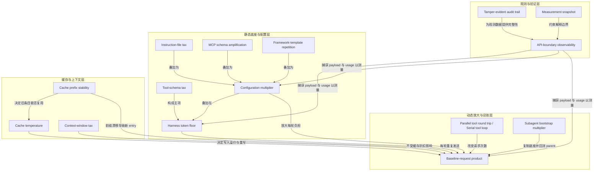

# 概念解析辞典

> 针对《Claude Code 在读提示词前为何已发送 3.3 万 Token》（systima.ai｜作者：systima.ai）的概念提取

## 一、核心概念

### 1. **Harness token floor（固定底座）**

- **context**：作者用 T1 隔离用户任务进入前的固定开销，并把 Claude Code 与 OpenCode 的起步底座作为后续一切乘数的基数。

  > 在用户任务进入前，Agent harness 已经发送 system prompt、tool schema 和 scaffolding。实验中 Claude Code floor 约 32.8K token，OpenCode 约 6.9K。

- **费曼一下**：这是 Agent 在“读用户任务”之前就已经发出的那一大块内容。它像起步价：车还没走就已计费，而且这些 token 还占着上下文座位。底座不是只发一次，后续每轮请求还要重发或读缓存，所以首轮的小差异会被多轮放大。

### 2. **Tool-schema tax（工具 schema 税）**

- **context**：作者拆开 Claude Code 固定底座，指出其最大重量来自工具定义，而不是 system prompt 本体。

  > Claude Code 携带 27 个工具、99,778 字符的 schema；OpenCode 携带 10 个工具、20,856 字符。约 24,000 个 Claude Code 底座 token 来自工具定义，OpenCode 对应约 4,800。

- **费曼一下**：模型每次动手前，都要先收到一本“所有工具说明书”。工具越多、接口越丰富，这本说明书越厚。它解决的理解难点是：Claude Code 的 33K 底座并非神秘黑箱，工具 schema 就是主项之一。

### 3. **Baseline-request product（固定底座 × 请求次数）**

- **context**：作者用这个公式解释为什么“首轮谁更轻”不能直接推出“整项任务谁更省”。

  > 整体输入可近似理解为 baseline × request count + conversation growth。大底座但积极批处理，可能战胜小底座但严格串行；“首轮谁更轻”不能直接推出“整项任务谁更省”。

- **费曼一下**：总消耗不是只看起步底座，而是看底座被请求了多少轮，再加上对话本身增长。底座大但请求次数少，可能反而比底座小但反复请求更省。它是全文从静态底座转向动态总账的关键。

### 4. **Parallel tool round trip / Serial tool loop（工具批处理与串行循环）**

- **context**：T3 出现与首轮底座相反的结果，原因是两个 harness 的工具循环方式不同。

  > Claude Code 把两次文件写入和两次脚本执行压进一个 parallel tool round trip；OpenCode 每轮只调用一个工具，因此反复支付较小的约 7K 底座。

- **费曼一下**：一次请求里并行做多个工具动作，和每轮只做一个工具、再发下一轮请求，会改变请求次数。请求次数一变，小底座可能因反复支付而变贵，大底座也可能因批处理而摊薄。它决定 Baseline-request product 在实际任务中往哪边倒。

### 5. **Configuration multiplier（配置乘数）**

- **context**：作者把 harness 出厂底座与真实工作配置区分开，真实配置会把 floor 整体放大。

  > Instruction file、MCP schema、plugin 与 workflow template 会叠加在 harness floor 上。真实 OpenCode 配置从约 7K floor 增至 90,817 token，约 12 倍。

- **费曼一下**：harness 决定出厂底盘，配置决定真正上路的重量。指令文件、MCP、插件、工作流模板都不是一次性装饰，而是每轮 payload 的叠加层。它解释为什么“空 workspace 测量”只是 floor，不是真实账单。

### 6. **Instruction-file tax（指令文件税）**

- **context**：作者用 72KB 指令文件测试对称乘数，并强调文件是否真正被识别会静默失败。

  > 72KB AGENTS.md 或 CLAUDE.md 为两种 harness 每个请求增加约 20K token，而且文件是否被识别取决于 harness 与启动方式。

  > 指令文件会搭乘仓库中每个 session 的每个请求。它不是一次性启动费，而是“文件大小 × 请求次数”的持续税。

- **费曼一下**：仓库说明不是开工前读一次，而是每次和模型说话都重新夹带一份。文件越长、轮次越多，重复成本越大。它还提醒：文件存在不等于进了 payload，必须在请求边界确认。

### 7. **MCP schema amplification（MCP schema 放大）**

- **context**：作者把 MCP 视为每个请求都要附带的接口说明书，并指出“已配置”不等于“已附加”。

  > 小型、公开且无凭据的 MCP server，每个每请求增加约 1,000 到 1,400 token；因为 schema 相同，两种 harness 承担的 tax 近似相同。

  > Claude Code 在 print mode 下还会静默忽略 project-scoped .mcp.json，除非显式传入 --mcp-config，再次说明“已配置”不等于“已附加”。

- **费曼一下**：每接入一个外部系统，就要给模型多发一份接口手册。连接越多，每封信的附件越厚。生产 MCP 的 schema 可能远大于小型测试 server，所以静态说明会变成重复载荷。

### 8. **Framework-template repetition（工作流模板重复）**

- **context**：作者用 slash command 展开的 workflow template 展示：模板一旦进入 conversation history，就会被后续请求反复携带。

  > 模板一旦进入 conversation history，后续每个请求都会携带；一个 9-request session 会重发 9 次。其真实成本不是模板本身大小，而是 template size × request count。

- **费曼一下**：会议议程只有两页，但每次发言前都要重新朗读一遍。发言次数一多，两页也会变成大开销。它把“模板有多大”转换成“模板会被重发多少次”的成本视角。

### 9. **Subagent bootstrap multiplier（Subagent 启动乘数）**

- **context**：作者称 subagent 是实验中最大的 token 乘数，因为每个 worker 都复制独立底座，parent 还要摄入结果。

  > 同一小任务直接执行时，Claude Code 累计约 121K token；扇出到两个并行 subagent 后达到 513K，是 4.2 倍。

  > 每个 Claude Code subagent 都携带自己的 3,554 字符 agent system prompt 和 27 个工具中的 24 个，形成独立 bootstrap；subagent transcript 返回后，又被 parent 纳入上下文。

- **费曼一下**：分工不只是多请两个人；每个人都要重新培训、配工具，最后主管还要把所有人的完整报告再读一遍。它包含两次放大：每个 worker 复制底座，parent 再摄入 transcript。因此它是重会话 token 异常时首先该检查的拓扑。

### 10. **API-boundary observability（API 边界观测）**

- **context**：作者反对靠体感或产品标签判断开销，主张在 harness 与模型 endpoint 之间记录两类 ground truth。

  > Payload capture 回答“发送了什么”，usage block 回答“计费了什么”。只有两者结合，才能把模型成本拆回 system prompt、tool schema、scaffolding、用户输入和会话增长。

- **费曼一下**：不要只看电费账单，也要在电表前记录每台设备何时开启。完整 JSON payload 告诉你实际发送了什么，usage block 告诉你实际计费了什么。两份数据合在一起，才能把成本拆回具体组件。

### 11. **Cache prefix stability（缓存前缀稳定性）**

- **context**：作者用 tools array 和 system block 的 hash 判断缓存能否复用，并对比 OpenCode 与 Claude Code 的前缀行为。

  > OpenCode 在所有请求和所有 run 中都发出 byte-identical prefix；三个独立 T1 session 的 tools、system 与 message bytes 都一致，重复运行写入 0 个 cache token。

  > Claude Code 每个 session 至少出现三种 request class：warmup probe、主会话和 subagent call；每类有不同 prefix 与 cache entry。

- **费曼一下**：缓存像按文件指纹找副本。哪怕内容意思一样，只要字节变化，系统就会当成新文件重新存一次。前缀稳定，一次写入就能在整段会话持续复用；前缀漂移，就会出现新 cache entry 和中途重写。

### 12. **Cache temperature（缓存温度）**

- **context**：作者用缓存冷热解释同样任务下 cache-write volume 的巨大差异。

  > 根据 cache temperature，Claude Code 同任务的 cache-write volume 是 OpenCode 的 5.9 到 54 倍。写入按 5 分钟 tier 的 1.25 倍或 1 小时 tier 的 2 倍计费，因此 prefix drift 能直接解释 usage meter 的跳升。

- **费曼一下**：刚烧热的炉子做饭省燃料，冷炉子要重新点火。缓存刚预热时几乎不写，冷或漂移时会整段重写；写入还要按溢价计费。它解释为什么“命中缓存”不等于“没有成本”。

### 13. **Context-window tax（上下文窗口税）**

- **context**：作者强调缓存折扣只改变价格，不改变 payload 对上下文窗口的物理占用。

  > Cache hit 只降低计费，不减少上下文占用。85K bootstrap 仍占 200K window 的 40% 以上，并提前触发 compaction。

  > 因此，缓存改变的是计费单价，不改变 payload 大小、请求拓扑和上下文物理占用。

- **费曼一下**：一本书打折不代表它变薄了。即使读取便宜，厚底座仍占满书包，留给代码和对话的空间更少，还会更早触发压缩。它防止读者用“已经命中缓存”否定底座过重的问题。

### 14. **Tamper-evident audit trail（防篡改审计链）**

- **context**：作者把 benchmark 数据写成可验证的审计链，使其能支持第三方重建和治理要求。

  > 实验把全部 150 条 request/response record 写入 tamper-evident 的 SHA-256 hash-chained audit trail，并验证链条端到端无断裂。

  > 同一机制来自开源库 @systima/aiact-audit-log，可支持 EU AI Act Article 12 所需的结构化日志、完整性证明和第三方重建。

- **费曼一下**：每条记录都盖上前一条记录的指纹。中间改掉一页，后面所有指纹都会对不上，因此篡改会留下证据。它让 token benchmark 不只是截图，而是可复核的生产日志。

### 15. **Measurement snapshot（测量快照）**

- **context**：作者限定数值的可迁移范围，把具体排名与测量方法分开。

  > 实验只覆盖一台机器、一对版本、一个模型家族和较小样本；harness prompt 频繁变化，因此数值是 2026 年 7 月快照。

  > 最持久的成果不是“某 harness 永远更省”，而是测量公式：固定底座、请求次数、会话增长、配置层、subagent 拓扑与 prefix 稳定性必须共同审计。

- **费曼一下**：天气读数只代表测量那一刻，温度计的使用方法却能长期复用。具体 token 数会随版本过期，但 API 边界测量、逐项加变量和分层审计的方法仍然成立。它约束全文结论的解释边界。

## 二、概念架构图

