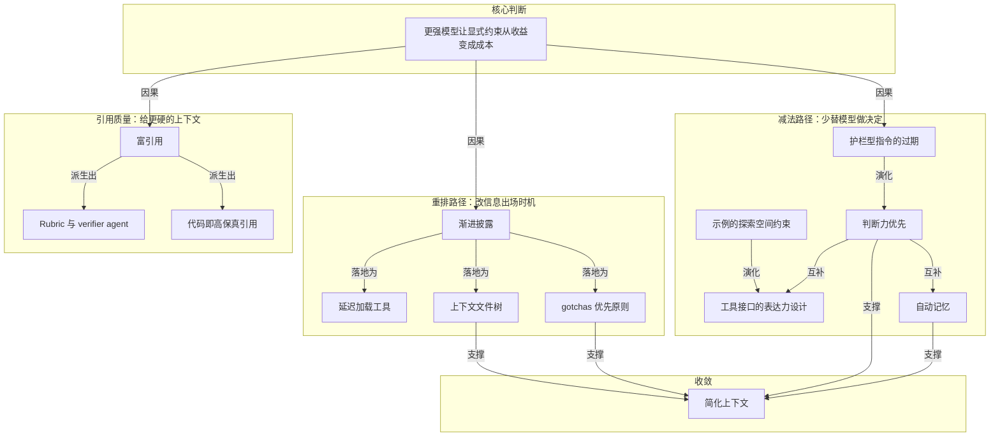

# 概念解析辞典

> 针对《Claude 5 世代的上下文工程，规则变了》（claude.com｜作者：Claude；导读称作者为 Thariq Shihipar）的概念提取

## 一、核心概念

### 1. **上下文工程（context engineering）**

- **context**：全文把它设为讨论主题：不是提问技巧，而是决定模型在某个时刻看到什么、这些构件在何时加载。

  > 官方给出面向 Claude 5 系列的上下文组织原则：把上下文窗口当有限预算而不是垃圾场，工具和信息按需加载。

- **费曼一下**：在本文里，上下文工程就是给模型布置工作台。桌上放什么、什么时候递过去、哪些东西放抽屉里等它来找，都是这门手艺。system prompt、CLAUDE.md、skills、tool description、references 是工作台上的不同构件；后面所有 then / now 都在改这些构件的位置和出场时机。

### 2. **护栏型指令的过期**

- **context**：文章称一批旧最佳实践已经变成神话，并解释它们当年为何必要。

  > previous context engineering best practices that had become myths

  > 没有这层护栏，Claude 写出的注释在很多情况下是错的，团队只能接受这个 tradeoff。

- **费曼一下**：为老模型写的强指令本来是护栏，防止它做出最坏决定；代价是这些规则对一部分任务并不成立。模型判断力提升后，护栏如果还留在原地，保护就变成压制。旧实践不是写错了，而是条件变了。

### 3. **判断力优先（let Claude use judgement）**

- **context**：第一组 then / now 的落点：把结论式规定换成取向式指令。

  > Write code that reads like the surrounding code: match its comment density, naming, and idiom.

  > 不给结论，只给对齐的对象。

- **费曼一下**：不说注释一行封顶，而说跟周围代码一个样。前者替模型做决定，后者告诉它拿什么当参照，具体怎么做交回模型。这是旧护栏撤掉后仍然保持可靠的方式：用参照替代死规则。

### 4. **示例的探索空间约束**

- **context**：文章用它推翻工具使用第一条规则是给示例。

  > giving examples actually constrains them to a certain exploration space

  > 过去工具使用的第一条规则是给 Claude 示例。新模型上的发现相反。

- **费曼一下**：示例在弱模型上是脚手架，帮它学会怎么用；在强模型上却变成天花板，把它锁在某个特定做法里。你给了一个标准答案，它就可能不再去找更好的那个。模型越强，示例的围栏成本越高。

### 5. **工具接口的表达力设计**

- **context**：取代给示例的做法，重心回到工具、脚本、文件本身的设计。

  > 接口即指令。

  > 把 status 做成 pending、in_progress、completed 的枚举，本身就在暗示用法；而「同时只保留一项处于 in_progress」这条说明，则把期望行为定义清楚了。

- **费曼一下**：好工具自己会说明怎么用。把意图铸进参数、枚举、状态里，比在旁边贴一段使用说明更可靠，因为参数是模型必须经过的地方，说明只是它可能读到的地方。

### 6. **渐进披露（progressive disclosure）**

- **context**：文章说它是贯穿全文的机制，并给出定义。

  > 现在 Claude Code 已经很擅长渐进披露，也就是在正确的时机加载正确的上下文。

- **费曼一下**：渐进披露的做法不是开场就把整本手册念完，而是把手册放在模型伸手能拿到的地方。它不减少信息总量，只改变信息出现的时机；能延后加载的东西，就不该提前占上下文预算。

### 7. **延迟加载工具（deferred loading）**

- **context**：渐进披露在工具层的实现。

  > 部分工具是 deferred loading，agent 必须先用 ToolSearch 搜到完整定义才能调用。这样可以拥有更多工具（例如 Task 系列），而它们在被需要之前不占用上下文。

- **费曼一下**：工具箱里可以放很多工具，但台面上只摆目录。要用哪把，再去搜完整定义。工具数量的上限不再由上下文预算决定，而由按需检索决定。

### 8. **上下文文件树**

- **context**：针对把所有实践塞进 CLAUDE.md 和 Skill.md 的常见神话，文章给出替代结构。

  > 一个常见神话是：必须把所有可能用到的实践都塞进这些文件，否则 Claude 找不到。正解是做成一棵能在正确时机加载的文件树。

- **费曼一下**：与其写一本无限膨胀的百科全书，不如做索引加许多分册。中央仓库的问题不是信息不够，而是每次都得整本搬进来；文件树让正确的那一页在正确的时候被加载。

### 9. **自动记忆（auto-memory）**

- **context**：第五组 then / now：记忆管理从用户手动动作变成系统职责。

  > 过去鼓励用 # 热键把东西自动写进 CLAUDE.md 来保存记忆；现在 Claude 会自动保存与当前工作、与你本人相关的记忆。

- **费曼一下**：过去要自己写便利贴贴在显示器上，现在助手自己记得住。人不必再兼任自己的档案员；记忆从用户维护的文件，变成系统保存的状态。

### 10. **富引用（rich references）**

- **context**：第六组 then / now：spec 的形态从简单 markdown 扩展。

  > 现在 Claude 能处理越来越复杂的引用形式：不止简单的 markdown，还可以引用新 artifacts 功能生成的 HTML artifact。

  > 一份 spec 可以是一套详细的测试套件，也可以是另一个 codebase 里等待移植的函数。

- **费曼一下**：说明书不必是一段文字。一套能跑的测试、一份能渲染的原型、另一个代码库里待移植的函数，都可以充当 spec。它们更硬，因为不容易被误读，也更接近模型熟悉的语言。

### 11. **Rubric 与 verifier agent**

- **context**：富引用中最特别的一种。

  > Rubric 是又一种引用形式。它让 Claude 借助 dynamic workflows 起 verifier agent，去尝试并验证你在某个领域的品味——例如「什么样的 API 设计算好设计」。

- **费曼一下**：把什么算好写成可核对的评分标准，再派一个专门的检查员照单核对。这样主观品味不再只存在你脑子里，而变成流程里可执行的一环。

### 12. **gotchas 优先原则**

- **context**：CLAUDE.md 一节的 token 分配原则。

  > 保持轻量，简要说明这个 repo 是干什么的，然后把大部分 token 花在 codebase 内部的 gotchas 上——比如你的类型全部集中在一个 monolithic 文件里、别处没有。避免陈述那些 Claude 看一眼文件系统或 repo 就知道的显而易见的事。

- **费曼一下**：只写模型猜不到的那部分。它能自己读代码看出来的事，写一遍等于浪费预算；它一定会踩的那个坑，不写就一定会踩。有限 token 被用来买信息增量，而不是重复已知事实。

### 13. **代码即高保真引用**

- **context**：references 一节的选材偏好。

  > 一般优先选代码形式的文件，因为它给 Claude 的是清晰、高保真的指令，而且用的是它非常熟悉的语言。

  > 一份设计的 HTML mockup，通常比对该设计的文字描述或一张截图产生更好的结果。

- **费曼一下**：在这个框架里，跟一个母语是代码的对象沟通，代码比自然语言转述更保真。同一个意图，越接近模型的母语，转述过程中丢掉的信息越少；所以代码、mockup 这类材料比文字描述或截图更不容易失真。

### 14. **简化上下文**

- **context**：全文收尾的动作项，也是概念网络的收敛点。

  > 收尾的动作项只有一个词：简化。

  > 跨 system prompt、skills 和 CLAUDE.md，你可能需要像 Anthropic 一样做一次简化。

- **费曼一下**：简化不是一条新的独立规则，而是前面所有推论的合力结果。文件树与 gotchas 优先压缩常驻上下文体积，减法路径清掉为旧模型留下的冗余护栏。claude doctor 的出现说明这件事已经足够程式化，可以交给工具自动执行。

## 二、概念架构图

按原文支持的关系分层绘制：核心判断向下分出减法、重排、引用质量三条路径，最后收敛到简化上下文。

