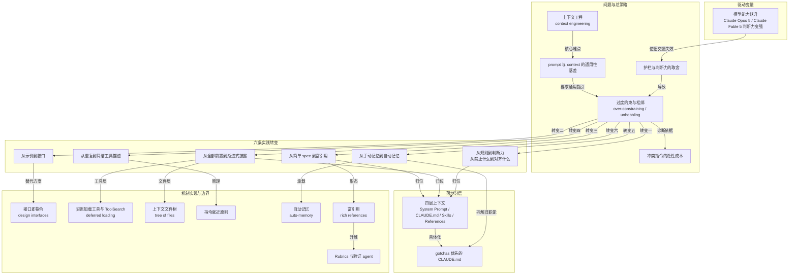

# 概念解析辞典

> 针对《Claude 5 时代的上下文工程新规则：系统提示词砍掉 80%》（来源如材料提供：claude.com；原文作者：Thariq）的概念提取

## 一、核心概念

### 1. **上下文工程（context engineering）**

- **context**：文章的总纲概念。作者把由系统提示词、Skills、CLAUDE.md、memory 等来源拼装起来的整体上下文称为“上下文工程”。

  > 你发给 Claude 的那条 prompt，只是它实际拿到的上下文的一小部分。真正决定结果的，是由系统提示词、Skills、CLAUDE.md 文件、memory 等来源拼装起来的整体上下文

- **费曼一下**：写 prompt 像当面交代一件事，上下文工程则像给一个长期工作的助手准备环境：有哪些资料、放在哪里、什么时候加载。它关心的不是单次话说得多具体，而是整体上下文如何装配。

### 2. **prompt 与 context 的通用性落差**

- **context**：作者点出的结构性难点：prompt 可以针对单次请求很具体，但 context 要跨请求复用，因此无法预先写得太具体。

  > 上下文工程和写 prompt 有本质差别：prompt 是一次性的、可以很具体；上下文要跨很多次请求通用使用，**所以它没法那么具体**。难点就在于：你不知道用户下一句会问什么，却要先写好给 Claude 的通用指引。

- **费曼一下**：一次性便签可以写“今天三点把合同送到 A 公司”；贴在墙上给所有人看的长期规程只能写通用规则。后者越想写具体，越容易在未知场景里出错。

### 3. **过度约束与松绑（over-constraining / unhobbling）**

- **context**：作者对旧实践的直接诊断：系统提示词、CLAUDE.md、skills 三层都曾把 Claude Code 约束得太狠。松绑的量化证据是删掉大量系统提示词而评测无损。

  > 我们过去把 Claude Code 约束得太狠了，系统提示词、CLAUDE.md、skills 三层都在过度约束。
  >
  > 针对 Claude Opus 5、Claude Fable 5 这一代模型，他们**删掉了 Claude Code 系统提示词的 80% 以上，编码评测上没有可测量的损失**。

- **费曼一下**：给新手司机装限速器、防撞杆是有用的；等他成了老司机还不拆，辅助装置就变成枷锁。松绑就是拆掉已经不需要的约束，把决定权还给模型和它周围的上下文。

### 4. **冲突指令的隐性成本**

- **context**：团队读自家 transcript 时发现，同一个请求里会同时出现互相打架的指令。关键判断是：Claude 可能仍答对，但必须额外消耗思考来调和冲突。

  > 同一个请求里经常出现互相打架的指令，比如系统提示词说"leave documentation as appropriate"（该写文档就写），另一处又说"DO NOT add comments"（不要加注释），系统提示词、skills 和用户请求彼此冲突。
  >
  > Claude 通常仍能读懂用户真实意图给出正确答案，但代价是：**它必须先花更多思考去消化这些重叠、冲突的指令，才能决定做什么**。冲突指令的成本不是"做错"，而是"想得更累"。

- **费曼一下**：三个领导给你下三条互相矛盾的命令，你最后还是把事办对了，但一半精力花在猜“到底听谁的”上。冲突指令的代价不一定是出错，而是白白烧掉的思考。

### 5. **护栏与判断力的取舍（guardrail tradeoff）**

- **context**：作者解释了旧强规则为何存在：为了避免删文件等最坏情况。旧模型没有护栏时会犯错，团队只能接受这个交易；新模型判断力更好，交易不再划算。

  > 这些约束当初确有必要——是为了避免最坏情况（例如删文件）。但现在团队发现，**其中很多可以直接删掉，让模型用周围的上下文和自身判断力去决定**。
  >
  > 对旧模型而言，没有这些护栏，Claude 写出来的注释在很多情况下是错的，**团队只能接受这个 tradeoff**。新模型判断力更好，不靠显式规则也能处理好这类决定。

- **费曼一下**：护栏是一笔交易——用“少数场景下做错”换“绝不出大事”。当模型能力变强，这笔交易就不划算了，该退掉。

### 6. **从规则到判断力（从“禁止什么”到“对齐什么”）**

- **context**：这是六条实践转变中最具操作性的一条。旧系统提示词是一串禁令，新系统提示词换成一条参照式指令：让代码对齐周围代码的风格。

  > 旧系统提示词的原话是：默认不写注释（"default to writing no comments"），绝不写多段 docstring 或多行注释块，一行封顶；除非用户要求，不要生成计划、决策或分析文档，要从对话上下文工作，而不是靠中间产物文件。
  >
  > 新系统提示词换成了一句话：写出读起来像周围代码的代码——匹配它的注释密度、命名和惯用法（"Write code that reads like the surrounding code: match its comment density, naming, and idiom."）。规则从"禁止什么"变成"对齐什么"。

- **费曼一下**：与其列一张“不许做的事”清单，不如给一个参照物：“照着屋里现有的风格来。”后者更短，却在更多情况下成立。

### 7. **接口即指令（design interfaces）**

- **context**：替代“给示例”的方案。作者发现示例会把模型框在特定探索空间里，因此应重新设计工具、脚本和文件的接口，让参数本身表达用法。

  > 在最新模型上，团队发现**给示例反而会把模型约束在某个特定的探索空间里**。
  >
  > 与其塞示例，不如认真想清楚工具、脚本和文件的**设计**——Claude 手里有哪些参数，这些参数怎样才能更有表达力。
  >
  > 把 status 定义成 pending、in_progress、completed 的枚举，本身就在向 Claude 暗示该怎么用；而"同时只保留一项 in_progress"这条约定，则定义了团队想要的行为。**接口即指令**。

- **费曼一下**：好工具不需要说明书。插头只能按一个方向插进插座，形状本身就是指令。枚举值、参数和约束把用法编码进结构里，而不是靠示例封死路径。

### 8. **渐进式披露（progressive disclosure）**

- **context**：贯穿全文的组织原则，定义为在正确时机加载正确上下文。作者把它用于 skills：验证和代码审查被搬进独立 skills，按需调用。

  > 因为 Claude Code 聚焦编码，系统提示词里塞了详细的代码审查与验证说明。这些信息不是总需要，但需要的时候极其关键。
  >
  > 现在 Claude Code 已经很擅长渐进式披露——**在正确的时机加载正确的上下文**。团队把验证和代码审查搬进了各自独立的 skills，让 Claude Code 按需调用。

- **费曼一下**：把所有资料都摊在桌上，你反而找不到要用的那份。渐进式披露是把资料按需从抽屉里取——需要时在手边，不需要时不占桌面。

### 9. **延迟加载工具与 ToolSearch（deferred loading / ToolSearch）**

- **context**：渐进式披露在工具层的具体形态。部分工具延迟加载，agent 必须先用 ToolSearch 搜到完整定义才能使用，从而挂载更多工具而不提前占用上下文。

  > 渐进式披露不只用于 skills，也用于工具：有些工具是 **deferred loading（延迟加载）**，agent 必须先用 ToolSearch 搜索到完整定义才能使用。这样团队可以挂载更多工具（比如 Task 类工具），而这些工具在被真正需要之前不占用上下文。

- **费曼一下**：工具箱里放五十把工具，但只有你伸手去找的那一把才拿出来摊开。工具变多不等于工作台变乱。

### 10. **上下文文件树（tree of files）**

- **context**：作者要破除的一个神话：认为所有实践都必须塞进一个中心仓库，否则 Claude 找不到。替代主张是做一棵可在恰当时机加载的文件树。

  > 一个常见神话是：得把所有可能用到的实践都塞进一个中心仓库，否则 Claude 找不到。作者的建议正相反——**做一棵可以在恰当时机被加载的文件树**。

- **费曼一下**：知识不该堆成一本谁也读不完的百科全书，而该整理成一个有目录的书架——先看目录，再抽出需要的那一本。

### 11. **指令就近原则**

- **context**：“重复自己 → 简洁工具描述”背后的原理。早期模型需要重复指令，导致系统提示词和工具描述各写一遍。新做法是把工具用法放进工具描述本身。

  > 团队发现这些重复的示例可以删掉，**把"怎么用这个工具"的说明放进工具描述本身，而不是系统提示词**。指令就近于它作用的对象。

- **费曼一下**：使用说明贴在机器上，比印在员工手册第 47 页有用。指令应该待在它作用的那个东西旁边，这样既减少冗余，也减少冲突。

### 12. **自动记忆（auto-memory）**

- **context**：CLAUDE.md 旧职能被拆解的一个例证。过去用户用 # 热键把内容写进 CLAUDE.md 来保存记忆；现在 Claude 会自动保存相关记忆。

  > 过去团队鼓励用户用 # 热键把内容自动写进 CLAUDE.md，以此保存记忆。
  >
  > 现在 Claude 会**自动保存**与当前工作和与你本人相关的记忆，不再需要用户手动维护这条通道。

- **费曼一下**：以前得靠你自己记笔记给助手看，现在助手边工作边自己记，还知道哪些值得记。CLAUDE.md 不必再承担全部记忆职责。

### 13. **富引用（rich references）**

- **context**：对“spec 只能是简单 markdown 文件”的升级。引用可以更复杂，且作者建议优先选择代码形态，因为代码对 Claude 来说高保真。

  > 但团队发现，**Claude 能处理的引用可以越来越复杂**。除了简单 markdown 文件，Claude 还能引用由新的 artifacts 功能生成的 HTML artifact。
  >
  > 引用也可以是代码形态：一份 spec 可以是一套详尽的测试套件，也可以是另一个代码库里某个待移植的函数。
  >
  > 一般应**优先选择以代码形式存在的文件**，因为代码是 Claude 极其熟悉的语言，能提供清晰、高保真的指令。

- **费曼一下**：告诉装修师傅“我要简约风”，不如直接给他一张实景照片；给他一套可执行的施工图，比照片还准。载体的保真度决定结果的保真度。

### 14. **Rubrics 与验证 agent**

- **context**：引用的另一种形态，也是全文里最“元”的一招。Rubric 让 Claude 启动带评分标准的 verifier agent，去验证某个领域的品味。

  > **Rubrics（评分标准）是引用的另一种形态**：它让 Claude 借助 dynamic workflows、启动带 rubric 的 verifier agent，去尝试验证你在某个领域的品味（比如"什么才算好的 API 设计"）。

- **费曼一下**：你把自己的评分标准写下来交给对方，他就能自己给自己打分，而不必每件事都来问你满不满意。品味一旦被写成可检查的条目，就能被复制和自动执行。

### 15. **gotchas 优先的 CLAUDE.md**

- **context**：CLAUDE.md 层的具体写法准则。保持轻量，把大部分 token 花在代码库里反直觉的 gotchas 上，避免陈述显而易见的东西。

  > 保持轻量：简要说明这个 repo 是干什么的。
  >
  > 把大部分 token **花在代码库里的 gotchas 上**——例如"所有类型都集中放在一个巨型文件里，别处没有"这类反直觉约定。
  >
  > 避免陈述"显而易见"的东西：Claude 看一眼文件系统或 repo 就能知道的事，不要写。

- **费曼一下**：给新同事的交接文档，不该复述办公室在几楼，而该写“三楼那台打印机要先按两次开关才认纸”。只有意外之处才值得写下来。

### 16. **四层上下文（System Prompt / CLAUDE.md / Skills / References）**

- **context**：作者把全文收拢成一份分层清单，说明亲手拼装上下文时每一层该承担什么：系统提示词绑定产品语境，CLAUDE.md 保持轻量，Skills 作为轻量指南，References 用 @ 提及文件带入深度信息。

  > 作者把全文收拢成一份分层清单——当你亲手拼装上下文时，每一层该承担什么。
  >
  > 对 Claude Code 用户来说，你基本永远不会去改它；但如果你在构建自己的 agent harness，**这一层值得你花大量时间**。
  >
  > 把 skill 当作**轻量指南**：让 Claude 在需要时能找到信息。
  >
  > 可以用 @ 提及文件把它们作为引用带入，让 Claude 参考当前计划的深度信息。

- **费曼一下**：四层之间是由通用到具体、由长期到当下的梯度。每一层都可以把细节推迟到下一层，在需要时才展开——渐进式披露正是这个梯度得以成立的机制。

## 二、概念架构图

