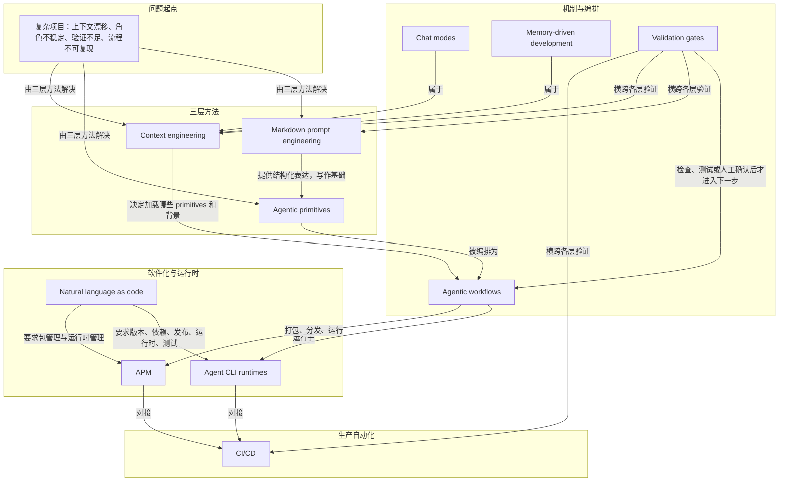

# 概念解析辞典

> 针对《构建可靠 AI 工作流：智能体原语与上下文工程》（Daniel Meppiel，github.blog）的概念提取

## 一、核心概念

### 1. **三层框架**

- **context**：

  > “文章提出一套把临时 prompt 实验转化为可靠 AI 工程实践的三层框架：Markdown prompt engineering 负责让意图结构化，agentic primitives 负责把规则、角色、流程和记忆产品化，context engineering 负责持续控制模型看到什么、忽略什么、如何验证结果。”

- **费曼一下**：这篇文章不是教人写更长的 prompt，而是把 AI 协作拆成三层工程：第一层让意图变得可读，第二层把规则、角色、流程、记忆固化成可复用资产，第三层管理模型每一步看到什么、忽略什么。它是全文的总骨架，拿掉它，后面的概念就会变成零散技巧。

### 2. **Markdown prompt engineering**

- **context**：

  > “Markdown 是面向模型的结构化语言：标题、列表、链接和代码块会帮助模型识别任务边界、推理步骤和上下文来源。”

- **费曼一下**：这里说的 Markdown 不是排版美化，而是让模型读懂任务结构的“界面”。标题、列表、链接和代码块告诉模型什么是背景、什么是任务、什么是约束、什么是验证标准。它是所有 agentic primitives 的写作基础，所以是承重概念。

### 3. **Agentic primitives**

- **context**：

  > “Agentic primitives 是可复用的 AI 工作单元，包括 .instructions.md、.chatmode.md、.prompt.md、.spec.md、.memory.md 和 .context.md。”

  > “这些 primitives 把一次性的自然语言请求，升级为可以在团队、项目和自动化系统里反复调用的工作流资产。”

- **费曼一下**：Agentic primitives 是把临场写在对话框里的规则、角色、流程、规格和记忆拆成文件，像 AI 工作流里的标准零件。它解决的问题是：单次 prompt 无法稳定复用。它承重，因为作者把 AI 协作从个人经验变成团队资产的关键一步就在这里。

### 4. **Context engineering**

- **context**：

  > “Context engineering 的核心不是把所有材料都塞进上下文，而是选择正确的信息、用正确顺序呈现，并把无关噪声排除出去。”

  > “作者强调 context window 是有限资源，过量上下文会降低模型判断质量；因此需要 session splitting、模块化规则、按需 context helper 和 memory-driven development。”

- **费曼一下**：Context engineering 是管理模型注意力的工程能力：每次给什么信息、按什么顺序给、把什么排除掉。它不追求“更多上下文”，而是追求“刚好需要的上下文”。它承重，因为复杂项目里的上下文漂移、注意力分散和记忆断裂都靠它控制。

### 5. **Validation gates**

- **context**：

  > “Validation gates 是这一层的重要机制：在进入下一步之前明确要求检查、测试或人工确认，避免模型把‘完成叙述’当作‘完成验证’。”

  > “它把‘模型说完成了’和‘任务真的完成了’区分开来，是可靠 AI workflow 的基本防线。”

- **费曼一下**：Validation gates 是工作流里的检查点。模型完成一步后，必须通过测试、审查、人工确认或验收条件，才能进入下一步。它承重，因为它把生成式输出转化为可验证结果，没有它，可靠性就只剩模型自己的说法。

### 6. **Chat modes**

- **context**：

  > “Chat modes 也属于 context engineering：不同任务需要不同认知姿态，例如架构审查、代码实现、调试、文档生成，不应混用同一套上下文和角色。”

- **费曼一下**：Chat modes 是模型的角色切换机制。做架构设计、写代码、审查 PR、调试错误时，模型需要不同关注点和输出习惯。它承重，因为它是 context engineering 的边界：上下文和角色不能混用，否则工作状态会变得粗糙。

### 7. **Memory-driven development**

- **context**：

  > “Memory-driven development 是把过去的项目决策、踩坑记录和稳定规则写成可被后续 agent 读取的记忆。”

  > “它让 AI 不再每次从零开始，也减少重复犯错和重复解释。”

- **费曼一下**：Memory-driven development 是把跨会话经验写成 agent 后续能读取的记忆，包括项目决策、踩坑记录和稳定规则。它解决的是 AI 每次从零开始的问题。它承重，因为它是 context engineering 中保留经验、减少重复的机制。

### 8. **Agentic workflows**

- **context**：

  > “.prompt.md 可以把 instruction、chat mode、spec、memory 和 context helper 串成完整流程，用于 IDE、terminal、CI 等不同运行环境。”

  > “一个可靠 workflow 通常包括：加载项目规则、读取 spec、执行任务、调用工具、运行验证、根据结果迭代、输出可审查的变更。”

- **费曼一下**：Agentic workflows 是把各种 primitives 编排起来的端到端流程，包含规则、上下文、工具调用、验证和输出格式。它让 AI 从“回答问题的工具”变成“执行流程的系统”。它承重，因为可靠 AI workflow 的最终形态就在这里，而且强调可重复、可审计。

### 9. **Natural language as code**

- **context**：

  > “作者把 prompt、instructions 和 workflows 视为‘natural language as code’：它们不是随手写的说明，而是会直接影响系统行为的可执行资产。”

  > “因此，它们也需要版本控制、依赖管理、发布机制、运行时和测试验证。”

- **费曼一下**：Natural language as code 指自然语言不再只是说明文字，而是会驱动 agent 行为的可执行逻辑。一旦它会影响系统行为，就需要像代码一样被版本管理、测试、复用和发布。它承重，因为这是作者把 AI 工作流软件化的核心判断。

### 10. **Agent CLI runtimes**

- **context**：

  > “Agent CLI runtimes 让这些自然语言工作流可以离开 IDE，在终端、脚本和 CI/CD 中运行，连接开发者的 inner loop 和自动化的 outer loop。”

- **费曼一下**：Agent CLI runtimes 是运行 agent workflow 的命令行环境，让自然语言工作流不再局限在 IDE 里，而能进入终端、脚本和 CI/CD。它承重，因为它是 AI workflow 获得生产部署能力的通道，也连接了开发者日常循环和自动化循环。

### 11. **APM**

- **context**：

  > “APM 在文章中承担 agent workflow 的 package manager 和 runtime manager 角色，负责安装、配置、分发和运行 agent primitives。”

  > “当 workflows 可以被打包、共享和在 CI 中执行时，AI 协作从个人技巧进入团队基础设施。”

- **费曼一下**：APM 在本文里像 agent workflow 的“包管理器”和“运行时管理器”，负责安装、配置、分发和运行 agent primitives。它承重，因为当工作流可以打包、共享并在 CI 中执行时，AI 协作就从个人文件夹进入团队基础设施和生态。

## 二、概念架构图

