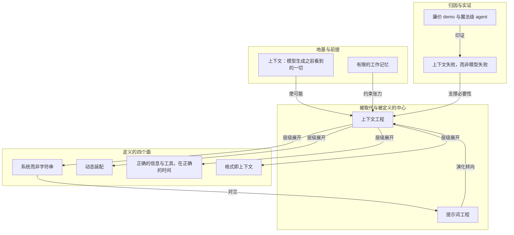

# 概念解析辞典

> 针对《AI 的新技能不是提示词，而是上下文工程》（Philipp Schmid／philschmid.de）的概念提取

## 一、核心概念

### 1. **上下文工程（Context Engineering）**

- **context**：全文的中心概念，作者用它替代 prompt engineering 作为 AI 的「新技能」。

  > 上下文工程是设计并构建动态系统的学科，这些系统在正确的时间、以正确的格式，提供正确的信息与工具，从而给 LLM 完成一项任务所需的一切。

- **费曼一下**：这篇文章说的「新技能」，就是别再琢磨「这句话该怎么问」，而要想「回答这个问题之前，得先把哪些资料和工具摆到桌面上」。它的起点是 Tobi Lutke 那句定义——「为任务提供全部上下文，使其对 LLM 而言变得看似可解的艺术」；关键词是**看似可解（plausibly solvable）**，不是「更聪明」。信息不全的任务，模型只能猜，所以这里的工程对象不是措辞，而是喂进去的那堆东西。

### 2. **上下文（Context）：模型生成之前看到的一切**

- **context**：作者要求先扩张定义，再谈工程。上下文

  > 不只是你发给 LLM 的那条单一提示词

  而是

  > 模型在生成响应之前看到的一切

  并被拆成七类：Instructions / System Prompt、User Prompt、State / History（短期记忆）、Long-Term Memory、Retrieved Information（RAG）、Available Tools、Structured Output。

- **费曼一下**：模型答题时能看到的整张桌面就是上下文——题目、规则、笔记本、参考书、计算器、答题卡格式，全都算。把「上下文」缩成「那条提示词」，等于只擦干净了桌面的一角。这份清单真正的作用，是把上下文变成一件**装配结果**：七类来源各有各的获取路径与成本，却共用同一块有限空间——只有先承认这一点，「工程化」才有对象。

### 3. **有限的工作记忆（limited working memory）**

- **context**：agent 兴起后，承载上下文的空间被描述为一块有限的记忆。

  > 一旦模型要跨多步、调工具、持续工作，「往有限的工作记忆里装什么」就成了首要工程问题。

- **费曼一下**：模型的注意力像一张放不大的桌子。可选内容原则上没边界（历史、长期记忆、检索、工具、格式定义都能往里放），但桌子就那么大，装不下全部。正因为装不下，才必须有人决定装什么、何时装、以什么形状装——取舍的必然性，把上下文从「素材问题」变成了「设计问题」，这也是上下文之所以是「工程」的物理前提。

### 4. **提示词工程（prompt engineering）**

- **context**：被对照、被承接的旧概念，是理解「转向」的参照物。

  > prompt engineering 聚焦于在一个文本字符串里打磨出完美的指令集；context engineering 的范围要宽得多。

- **费曼一下**：提示词工程的对象是一个文本字符串——把那个字符串打磨到最好。作者并没有说它没用了，而是说重心正在从它迁移出去：当模型要跨多步、调工具、持续工作，光有一个写得漂亮的字符串救不了场。它是旧坐标，新坐标要靠它来定位。

### 5. **系统而非字符串（A System, Not a String）**

- **context**：四条特征的第一条，也是上下文工程与提示词工程最锋利的分野。

  > 上下文不是一个静态的提示词模板，它是**在主 LLM 调用之前运行的那个系统的输出**。

- **费曼一下**：提示词是一张写好的卡片，谁来都念同一张；上下文是一条流水线的产品——每次调用之前先跑一遍那个系统，产出这一次专属的那份材料。它把「上下文」从文本对象改写成了系统对象：有生产者、有触发时机。正因为它是另一个系统的输出，「改上下文」才不是改一句话，而是改一套系统。

### 6. **动态装配（Dynamic）**

- **context**：四条特征的第二条，回答「何时生产」。

  > 即时生成，为当下任务量身定制。这次请求可能是日历数据，下次是邮件或一次网络搜索。

- **费曼一下**：不是准备一个万能资料包，而是每次接到任务后临时抓取：今天要排会就调日历，明天要回客户就调往来邮件。资料的清单本身随任务变——你没法在系统里预设一份「永远正确」的上下文，只能设计一个「每次都能重新装配」的机制。

### 7. **正确的信息与工具，在正确的时间**

- **context**：四条特征的第三条，回答「生产什么」。核心工作是

  > 确保模型不缺关键细节（「Garbage In, Garbage Out」）

  并且

  > **同时提供知识（信息）与能力（工具）**，且只在需要且有用时提供。

- **费曼一下**：既要给资料，也要给工具，还要挑时候给。这里有两层，别混为一谈：**知识**（信息，对应 RAG、记忆一侧）和**能力**（工具，对应 Available Tools 一侧，比如 check_inventory、send_invite）。光告诉助理「你老板明天满档」，他也只能干看着；还得给他一个能发邀请的按钮。知道什么、能做什么，缺一样任务都落不了地。而「只在需要且有用时提供」又把这条拉回到那块有限的桌子上——一次性全塞过去不是慷慨，是占地方。

### 8. **格式即上下文（where the format matters）**

- **context**：四条特征的第四条，回答「以什么形状交付」。

  > 你如何呈现信息是有影响的。**一份简洁的摘要优于一堆原始数据的倾倒；一个清晰的工具 schema 优于一句含糊的指令。**

  七类构成里的 Structured Output 也属于格式层面的上下文。

- **费曼一下**：同样的信息，摆放方式不同，效果差很远。给人一份两行的摘要，比甩过去一整个数据库导出更管用；工具说明写清参数，比嘴上交代一句强。这一条常被跳过，但它解释了为什么「垃圾进，垃圾出」在 agent 时代不是老话，而是日常事故的根因——「进」的不仅是内容，也包括形状。

### 9. **上下文失败，而非模型失败（context failures, not model failures）**

- **context**：全文最有力的归因判断，出现两次，是把改进着力点从模型挪回系统的开关。

  > 大多数 agent 的失败已经不再是模型失败，而是上下文失败

  > agent 的失败不只是模型失败，它们是上下文失败。

- **费曼一下**：助理办错事，先别急着换人。多半是你没告诉他日程满了、没给他通讯录、没给他发邀请的权限。它把归因权从模型手里拿回来，交还给做系统的人：如果失败大多源于模型，你就只能等升级；如果失败大多源于上下文，那就有可被工程化的一侧可以动手。这不只是诊断，也是责任划分。

### 10. **廉价 demo 与「魔法级」agent**

- **context**：全文的示范性反事实对照。同一句邮件——「Hey, just checking if you're around for a quick sync tomorrow.」——两种 agent 两种产物：上下文贫乏的只能回

  > Thank you for your message. Tomorrow works for me. May I ask what time you had in mind?

  被日历、往来邮件、联系人列表与发邀请工具喂饱的，回的是

  > Hey Jim! Tomorrow's packed on my end, back-to-back all day. Thursday AM free if that works for you? Sent an invite, lmk if it works.

  作者用它证明

  > 魔法不在更聪明的模型或更巧妙的算法里，而在于为正确的任务提供了正确的上下文。

- **费曼一下**：这是判断一个 AI 产品成色的照妖镜。看它回答得体不体面，其实是在看它回答之前被喂了多少东西——代码里那句关键的认知转换是：**代码的首要职责不是弄清楚「怎么」回应，而是「收集」LLM 完成目标所需的信息**。模型相同、算法相同，只因调用前装进去的东西不同，一个像玩具，一个像同事。

### 11. **跨职能挑战（cross-functional challenge）**

- **context**：作者对「构建可靠 agent」这件事性质的判断，界定它究竟是谁的活。

  > 需要理解你的业务用例、定义清楚你的输出、并把一切必要信息结构化，好让 LLM 能够「完成任务」。

- **费曼一下**：这不是纯写代码或纯写提示词能包办的活。你得懂业务场景（才知道哪些信息相关）、定义清楚输出（才知道要什么形状）、再把必要信息组织成模型能用的样子。重心迁移到最后落在这里：不再是想清楚「怎么回答」，而是把回答所需的东西凑齐——凑齐这件事本身就是一门跨职能的手艺。

## 二、概念架构图

全文由一次**定义扩张**发动，最终收束到一次**归因转向**。（以下为按功能角色分层重建的关系，边上的关系词取自原文支持的说法。）

读图说明：地基层的「上下文＝模型看到的一切」不解释上下文工程是什么，而是让它成为可能——只有上下文被划界成装配结果，才有可工程化的对象；「有限的工作记忆」与之构成张力，正是「无边界候选 × 有限容量」逼出了取舍，也就逼出了设计。特征层四者不是四个独立主张，而是同一个定义的四个面（谁生产、何时生产、生产什么、以什么形状交付），其中「系统而非字符串」与「提示词工程」直接对立。归因层的判断向上支撑上下文工程的必要性，向下被那个反事实对照所印证——这条从诊断到实证的回路，是「魔法不在更聪明的模型里」能站住的原因。
