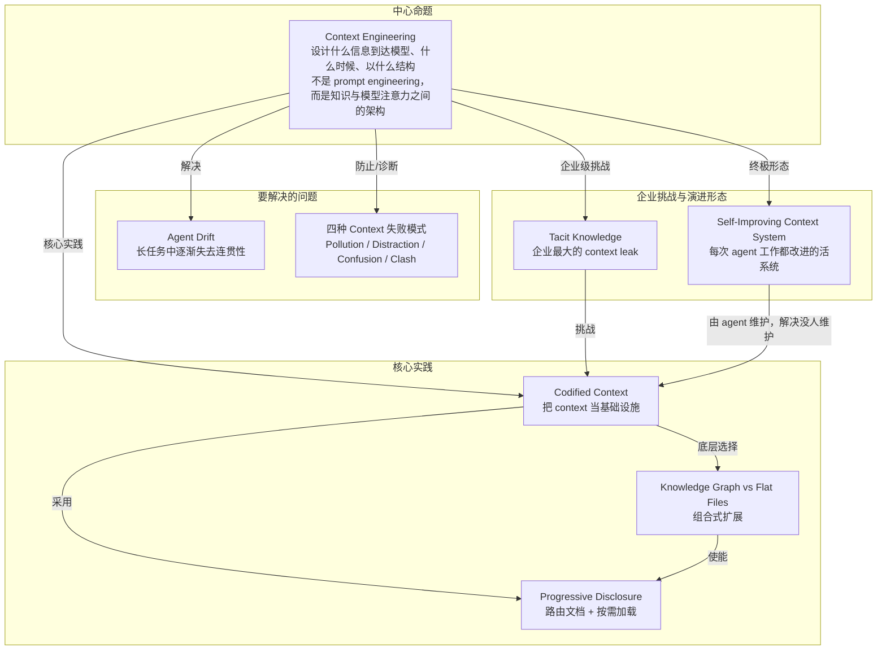

# 概念解析辞典

> 针对《上下文工程：AI 时代的核心能力》（Nyk 🌱，x.com，原文标题 Context Engineering Is The Only Engineering That Matters Now）的概念提取

## 一、核心概念

### 1. **Context Engineering（上下文工程）**

- **context**：作者把它与 Prompt Engineering 对照，并给出定义和三个层次：

  > Prompt engineering 教你 **ask better questions**；Context engineering 教你 **build better environments**。
  >
  > **设计什么信息到达模型、什么时候、以什么结构的学科**
  >
  > 不是 prompt engineering（怎么问），不是 fine-tuning（改模型），而是**你的知识与模型注意力之间的架构**
  >
  > 三个层次：
  > - **Layer 1: Selection** — 什么进入窗口
  > - **Layer 2: Architecture** — 如何结构化
  > - **Layer 3: Lifecycle** — 什么时候刷新

- **费曼一下**：模型够不够聪明不是本文认为的瓶颈，模型“开始工作时看到什么”才是。Context Engineering 就是设计模型的「信息环境」：哪些知识进入窗口、以什么结构组织、什么时候刷新。它把一次性的 prompt 提升为持续运作的架构层，是全文的中心概念，其他概念都在展开它要解决的问题、实践方法和最终形态。

### 2. **Agent Drift**

- **context**：作者用 Anthropic 的内部研究说明它不是推理问题：

  > Anthropic 内部研究发现：agent drift（AI 在长任务中逐渐失去连贯性）几乎完全是 **context management 问题**，而非 reasoning 问题

- **费曼一下**：Agent 做着做着“跑偏了”——忘记初始目标、前后风格不一致、重复犯同类错误。本文的关键判断是：根因不在模型推理能力，而在 context 管理失败。随着任务推进，相关信息被稀释、关键指令被遗忘、噪音累积。它支撑了为什么必须做 Context Engineering。

### 3. **四种 Context 失败模式（Context Pollution / Distraction / Confusion / Clash）**

- **context**：作者把 AI 失败归因到四种 context 失败，并给出统一解法：

  > 每一个 AI 失败都可以映射到以下四种 context 失败之一：
  >
  > **Context Pollution（上下文污染）**
  >
  > 幻觉或过时的信息进入窗口并复合放大
  >
  > **Context Distraction（上下文干扰）**
  >
  > 太多无关信息淹没相关信号
  >
  > **Context Confusion（上下文混乱）**
  >
  > 太多工具、太多冲突指令
  >
  > **Context Clash（上下文冲突）**
  >
  > 同一窗口里的矛盾信息
  >
  > **统一解法**: Don't dump, curate.（不要倾倒，要策展。）

- **费曼一下**：这是一个诊断框架。Pollution 是坏数据进入窗口后被下游继承，错误复合；Distraction 是噪音淹没信号，模型对窗口中的一切大致等权对待；Confusion 是工具和指令太多，注意力花在不需要的东西上；Clash 是同一窗口里的矛盾信息，模型随机选择甚至来回交替。作者认为这些模式覆盖了 AI 灾难的根因，统一解法不是塞更多，而是策展。

### 4. **Codified Context**

- **context**：作者用 26,000 行 context 的案例说明把 context 当基础设施，并重新定义 CLAUDE.md：

  > 一个 Claude Code 项目演化出 26,000 行 codified context——比某些模块的实际代码还多
  >
  > 结果：agent 停止了幻觉
  >
  > **CLAUDE.md 不是配置文件，是教学文档**——最好的写法读起来像给一个已经会写代码但不了解你代码库的高级工程师的 onboarding docs
  >
  > **Memory 层级与渐进式披露**（progressive disclosure）——不是所有东西都需要同时在窗口里，引导模型去找它需要的东西
  >
  > **关注点分离**——架构 context 一个文件，编码规范另一个，领域知识第三个，模型按任务需要加载
  >
  > 有效的 agent 规格中，超过一半是 context，不是 instructions
  >
  > **More context architecture, fewer instructions. That's the pattern.**

- **费曼一下**：把 context 当成基础设施来工程化，而不是写一个大 prompt。用结构化文件网络组织模型需要知道的一切：CLAUDE.md 像给高级工程师的 onboarding 文档，memory 分层，架构、规范、领域知识分开，按任务加载。核心模式是“更多 context 架构，更少指令”。它是 Context Engineering 的核心实践方法。

### 5. **Progressive Disclosure（渐进式披露）**

- **context**：作者把它作为 memory 层级和路由文档的具体策略：

  > **Memory 层级与渐进式披露**（progressive disclosure）——不是所有东西都需要同时在窗口里，引导模型去找它需要的东西
  >
  > **MEMORY.md** 作为路由文档控制在 200 行以内，详细主题文件从中链接
  >
  > **Metadata 用于过滤**：frontmatter 实现渐进式披露

- **费曼一下**：不要把全部知识一次性塞进模型窗口。用一个简短的路由文档告诉 agent 去哪里找什么，详细信息放在被链接的文件里，按需加载。它解决的是“窗口有限、知识太多”的矛盾，让 context 可以扩展而不是越塞越乱。它是 Codified Context 的具体架构策略。

### 6. **Knowledge Graph vs Flat Files**

- **context**：作者对比线性扩展与组合式扩展，并指出 Tools for Thought 的方法论：

  > Flat context（一个巨大的 CLAUDE.md、一个长 system prompt）线性扩展——每个新事实增加一个单位的价值
  >
  > Knowledge graph 组合式扩展——每个新节点连接已有节点，关系涌现，整体大于部分之和
  >
  > Tools for Thought 社区意外建好了 LLM 的完美架构
  >
  > **Atomic notes**：一个概念一个文件，可组合
  >
  > **Wikilinks 作为语义连接**：关系本身就是链接文本
  >
  > **Maps of Content**：路由文档，告诉 agent 去哪里找
  >
  > **Metadata 用于过滤**：frontmatter 实现渐进式披露
  >
  > **Prose-as-title**：笔记名称是 claim，不是 category
  >
  > 不是 architecture-decisions.md，而是 we chose PostgreSQL because our query patterns are relational.md
  >
  > agent 搜索时，光看标题就知道要不要打开——这是**文件命名层面的 context engineering**

- **费曼一下**：一个大文件是线性增长的，加一条信息只多一条孤立信息；知识图谱是组合式增长的，每个新节点连接已有节点，关系涌现，整体大于部分之和。Tools for Thought 社区长期使用的 atomic notes、wikilinks、Maps of Content、metadata、claim 式标题，恰好就是 agent 高效遍历知识库所需的架构。它是 Codified Context 和 Progressive Disclosure 的底层架构选择。

### 7. **Tacit Knowledge（隐性知识）**

- **context**：作者说这是企业级 context engineering 最难的部分：

  > 这是最难的部分：CTO 选 PostgreSQL 而非 MongoDB，决策也许被记录了，但推理过程、她考虑的 tradeoffs、让她觉得显而易见但对别人不可见的 context——通常都丢失了
  >
  > **解法**：录制会议，agent 从中挖掘 claims、decisions、action items、strategic shifts
  >
  > 这不是"没人读的会议纪要"，而是**人类思维与 agent 外化表征之间的主动同步**
  >
  > 大部分组织知识活在人的脑袋里，人离开知识就消失了

- **费曼一下**：隐性知识是锁在人脑中的推理、权衡、默认背景，通常写不进正式文档。决策可能被记录了，但为什么这么选、当时考虑了什么、什么对当事人“显而易见”却对别人不可见，往往丢失。作者认为这是企业最大的 context leak，因为人一离开知识就消失。解法是录制会议，让 agent 主动挖掘 claims、decisions、action items、strategic shifts，把人类思维同步到外化表征中。

### 8. **Self-Improving Context System**

- **context**：作者对比传统知识管理死于维护，指出 agent 天生擅长维护：

  > 杀死每一个 wiki、知识库、"single source of truth" 的，是维护
  >
  > 有人必须持续更新它们。他们从来没做到过
  >
  > Agent 不会对维护感到无聊，不会因为赶着开会而跳过更新
  >
  > **杀死每一个知识管理系统的恰恰是 agent 天生就能做的事**
  >
  > 当足够多的观察堆积，agent 提议对系统本身的结构性变更
  >
  > **它重构自己的指令。它演化自己的架构——当当前架构产生太多阻力时**
  >
  > Context engineering 不是一次性设置，而是一个**每次 agent 工作都在改进的活系统**

- **费曼一下**：传统 wiki、知识库、single source of truth 往往死于没人持续维护。Self-Improving Context System 让 agent 在日常工作中自动标记矛盾、过时 context 和结构性漂移；当观察积累到一定程度，agent 提议甚至重构自己的指令和架构。Context engineering 因此不是一次性设置，而是每次 agent 工作都在改进的活系统。它是整个体系的终极形态。

## 二、概念架构图

