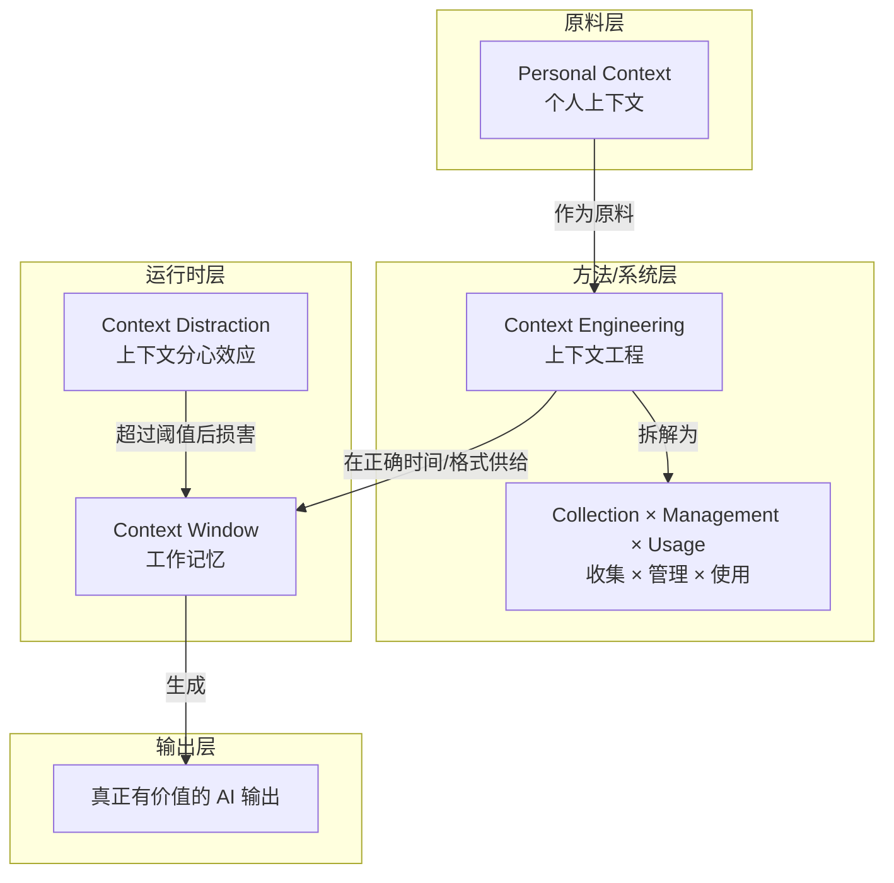

# 概念解析辞典

> 针对《什么是 Context？——从“提示词”到“工作记忆”的认知跃迁》（原文作者 howie.serious；AI 内参主题精选整理）的概念提取

## 一、核心概念

### 1. **Context Window（上下文窗口）**

- **context**：作者把 Context 从“提示词”提升为 LLM 运行时的工作记忆，并用 Karpathy 的说法定义它的资源属性与边界。

  > **Context Window 是 LLM 的“工作记忆”**（Karpathy 语），而且是极其昂贵的、有限的资源。
  > Karpathy 特别强调两点：
  > 1. Context 里的 token 越多，模型越容易被“分心”，反而降低准确性；
  > 2. Context 是个“精贵资源”，应该像管理稀缺注意力一样管理它。

- **费曼一下**：Context Window 不是“我这次写了什么提示词”，而是 LLM 在一次任务中能同时看到、并据此行动的全部信息，相当于模型的工作记忆。它的边界有两层：容量有限且昂贵；塞入的 token 越多，模型越可能分心，准确性反而下降。这个概念的承重作用是，把 AI 交互从单次提示词技巧，转成对有限工作记忆的配置问题，因此质量比数量更重要。

### 2. **Context Distraction（上下文分心效应）**

- **context**：Drew Breunig 用它解释“更大的 Context Window 不等于更好的结果”。

  > Drew Breunig 的文章则进一步揭示了一个反直觉的真相：**更大的 Context Window 不等于更好的结果**。他提出了“Context Distraction”这个概念——当 Context 超过某个阈值（比如 Llama 3.1 的 32k），模型开始机械重复历史行为，而不是真正推理。这意味着：Context 的质量远比数量重要。

- **费曼一下**：Context Distraction 是 Context Window 的质量陷阱。它不是简单的“记不住”，而是超过某个阈值后，模型被过量历史信息淹没，开始机械重复以前的行为，而不是真正推理。它为 Context Window 划出边界：扩大窗口不等于提升结果。本文用它支撑“质量远大于数量”的核心判断。

### 3. **Context Engineering（上下文工程）**

- **context**：作者用 LangChain 的定义和 Philipp Schmid 的判断，说明它不是提示词魔法，而是系统工程。

  > Context Engineering = 构建动态系统，在正确的时间，以正确的格式，将正确的信息和工具提供给 LLM，使任务有可能被完成。

  > Most agent failures are not model failures anymore, they are context failures.

- **费曼一下**：Context Engineering 是管理 Context Window 的方法层。它不问“怎样写一句更神的提示词”，而问：在什么时刻、用什么格式、把哪些信息和工具送进模型，任务才可能完成。它的范式转移在于：AI 失败多数不再是模型失败，而是 Context 给错、给少、给乱。作者还列出六种核心战术——RAG、Tool Loadout、Context Quarantine、Context Pruning、Context Summarization、Context Offloading——它们共同界定了操作边界：检索、配置工具、隔离、裁剪、压缩、外置存储，都是在有限工作记忆内做取舍。

### 4. **Collection × Management × Usage（收集 × 管理 × 使用）**

- **context**：来自中文文章「上下文工程已经30岁了」的三维框架。

  > Context Engineering = Collection（收集）× Management（管理）× Usage（使用）
  > 这三个维度是正交的，可以独立优化，非常适合作为实操框架。

- **费曼一下**：这是 Context Engineering 的内部坐标。Collection 决定把什么原料收进来；Management 决定如何保存、裁剪、压缩、隔离这些信息；Usage 决定在任务发生时，把什么信息以什么格式送进 Context Window。三个维度正交，意味着可以分别优化，而不是互相替代。它让“上下文工程”从一个总概念变成可拆解的实操系统。

### 5. **Personal Context（个人上下文）**

- **context**：作者把它视为个人 AI 的原料层和护城河。

  > AI 的泛化能力是共享的，但 Personal Context 是私有的、不可复制的。你过去几年积累的笔记、思考框架（Munger OS、Tolstoy OS）、教学经验、投资判断，这些都是你独有的 Personal Context 原料。谁先把它系统化地接入 AI，谁的 AI 就越聪明。

  > 普通 RAG 只是“关键词匹配 → 片段召回”，而真正有价值的 Personal Context 系统是“多步检索 → 时间线重建 → 结合 Persona 推理 → 给出连本人都没想到的洞察”。

- **费曼一下**：Personal Context 是个人长期积累的笔记、经验、思维框架和判断，构成专属的 Context 原料库。它和通用模型能力不同：模型能力是共享的，Personal Context 是私有、不可复制的，因此是个人 AI 的护城河。它的价值不只在关键词召回，而在多步检索、时间线重建、结合 Persona 推理，甚至给出本人没想到的洞察。它是整条链路的起点：个人原料越丰富、越系统化，Context Engineering 可组装的上限越高，AI 越能理解你。

## 二、概念架构图

依据原文的链路和“分心效应损害窗口质量”的关系重建：

