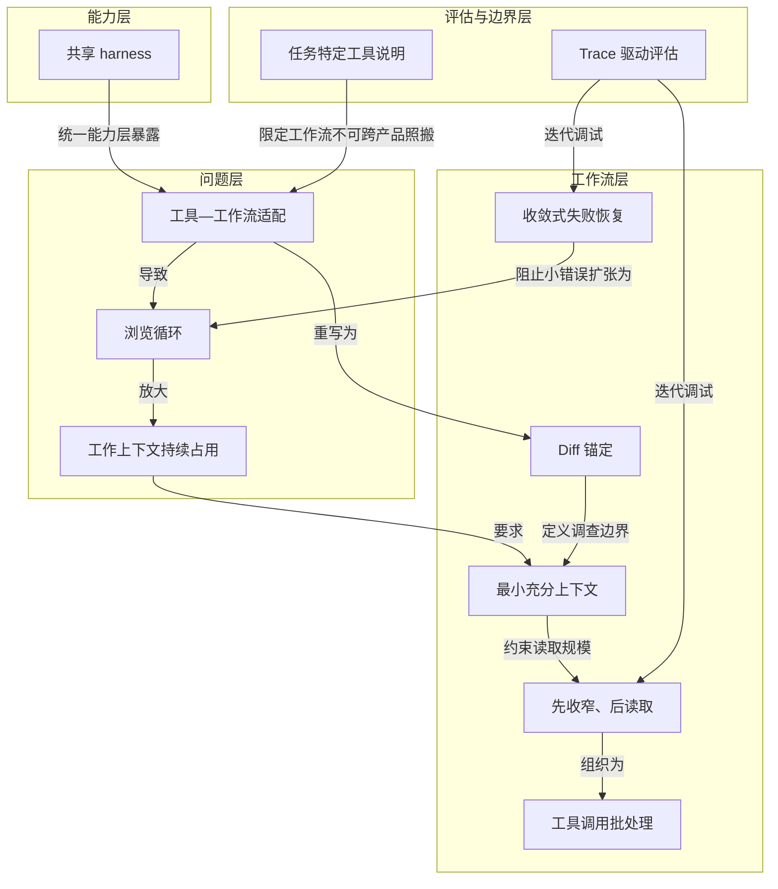

# 概念解析辞典

> 针对《工具更多反而让 Copilot 代码审查变差，GitHub 如何修正》（GitHub）的概念提取

## 一、核心概念

### 1. **共享 harness（shared harness）**

- **context**：

  > Copilot CLI harness 则提供 Unix 风格的共享工具：glob 发现候选路径，grep 搜索文本、符号和调用点，view 在路径或范围明确后读取代码。GitHub 希望减少重复工具实现，让 Copilot CLI、cloud agent、code review 等产品共享同一处基础设施改进。

- **费曼一下**：harness 是多个 Copilot 产品共用的工具底盘，提供更原子化的 grep、glob、view 能力。它解决的是重复实现与统一维护问题，但本身不决定某个 agent 应该怎么使用这些工具；因此它既是能力层，也是后续工具与工作流错配的起点。

### 2. **工具—工作流适配（capability layer / workflow layer）**

- **context**：

  > 工具能力相同，行为契约不同，产品结果就可能完全不同。

- **费曼一下**：工具能力和任务工作流是两层。工具即使更好、更可维护，如果说明没有把它约束到当前任务的工作姿势，也可能得到更差结果。这个概念解释了“共享更好的工具后审查反而更贵、更差”：问题不在工具本身，而在工具说明指向了错误的工作流。

### 3. **浏览循环（browsing loop）**

- **context**：

  > 这形成 browsing loop。每轮探索都能找到看似相关的新线索，agent 因而继续扩散，却没有更接近 diff 中某个具体风险的证据。

- **费曼一下**：审查 agent 陷入“广泛搜索—猜路径—读大片文件—继续搜索”的状态，每次都能发现一点新东西，于是永远觉得还该再看一点。它是通用 coding assistant 的探索姿势被套用到代码审查后产生的核心失败模式。

### 4. **工作上下文持续占用（working context）**

- **context**：

  > 每个工具结果都会进入 agent 的 working context，并在后续推理中继续存在。无关文件内容会同时增加 token 成本和注意力负担，让 review 更难围绕 diff 的证据保持聚焦。

- **费曼一下**：工具输出不是一次性打印，而是会留在 agent 的工作上下文里持续影响后续推理。读取无关内容不只是多一次调用，而是会持续增加成本和注意力负担。这个概念说明浏览循环为什么昂贵，也为“最小充分上下文”提供机制依据。

### 5. **Diff 锚定（diff anchoring）**

- **context**：

  > 这些问题都以变更为锚点，不要求先打开仓库的大部分内容。目标是找到 minimal context，回答一个可验证的风险判断。

- **费曼一下**：代码审查的起点和边界应是 pull request diff，而不是仓库全貌。围绕变更提出具体问题，才能把探索限制在确认或排除某个风险所需的范围内。这是打断浏览循环的首要约束。

### 6. **最小充分上下文（minimal context）**

- **context**：

  > reviewer 的典型动作不同：它从 diff 开始，问变更是否引入了问题，然后只查证确认或排除该问题所需的最窄上下文。

- **费曼一下**：审查者只需要能回答问题的最窄代码证据，而不是“上下文越多越好”。这个概念规定证据规模，防止无关文件进入工作上下文后推高成本并让推理失焦。

### 7. **先收窄、后读取（ask, narrow, read, decide）**

- **context**：

  > 只有当 agent 已知道需要哪个文件或哪段行范围时，才调用 view。读取不再承担“也许会有用”的探索职责，而是承担确认或否定假设的证据职责。

- **费曼一下**：这个工作流节奏要求先用 grep、glob 等廉价搜索定位候选文件、符号和调用点，只有路径或行范围明确后才用 view 读取代码。读取从“先看看再说”的探索动作变成验证假设的动作，避免边读边找造成扩散。

### 8. **工具调用批处理（batching）**

- **context**：

  > 独立搜索应批量完成，聚焦读取也应批量完成，避免在“一次搜索—一次读取—再一次搜索”之间来回切换，减少每个中间结果引发新的扩散。

- **费曼一下**：把相互独立的搜索和后续聚焦读取各自集中成批，而不是搜索一个、读一个、再临时换个方向。批处理减少中间结果触发新探索的机会，使调查路径更稳定。

### 9. **收敛式失败恢复**

- **context**：

  > 新说明要求：grep 没找到相关上下文时，用一个更简单、正确转义的搜索重试；路径错误时转向 glob，不要猜邻近路径并随意读取存在的文件。

- **费曼一下**：工具失败后的恢复动作被限定为修正查询或改用更合适的工具，而不是把“不知道路径”解释成“需要探索更多仓库”。它阻止小错误放大成浏览循环，规定失败后如何重新收敛。

### 10. **Trace 驱动评估**

- **context**：

  > 内部 benchmark 不只给最终分数，还记录 agent 走过的路径：调用了什么工具、返回多少内容、哪里报错、搜索是在收窄证据还是扩大范围。

- **费曼一下**：评估不仅比较最终分数，还观察 agent 的搜索、读取、错误和收敛路径。团队因此能把成本与质量变化分解为可调试的行为，而不是只凭最终分数猜 prompt 是否变好。

### 11. **任务特定工具说明**

- **context**：

  > 最终经验不是“所有 agent 都应少读文件”，而是 “same tools, different job”。工具可以共用，instructions 必须表达当前产品的任务边界、锚点、证据标准和停止条件。

- **费曼一下**：同一套工具不能配同一套工作流说明；说明必须按产品任务重写。CLI 等开放式场景可能需要广泛探索，而代码审查需要围绕 diff 收窄。这个概念划定结论边界：可共享工具能力，但不能照搬 reviewer 的工作姿势。

## 二、概念架构图

