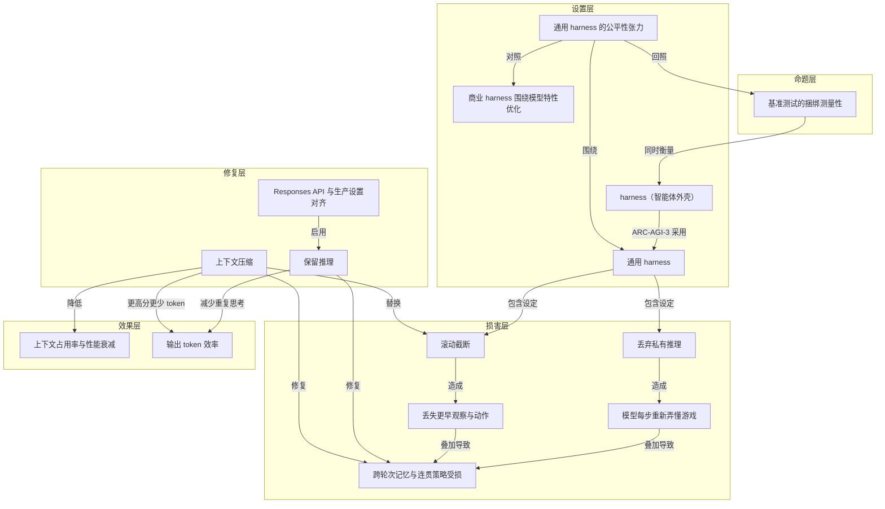

# 概念解析辞典

> 针对《只改两个 API 设置，OpenAI 把 ARC-AGI-3 成绩提到三倍》（openai.com，OpenAI）的概念提取

## 一、核心概念

### 1. **harness（智能体外壳）**

- **context**：文中反复出现的核心变量。ARC-AGI-3 使用通用 harness，商业开发者则围绕模型特性优化 harness；文章把分数变化归因到 harness 设置。

  > ARC-AGI-3 刻意使用一个通用（intentionally generic）harness，不带工具，也没有特殊功能。
  >
  > 商业开发者的做法正好相反：他们围绕每个模型的特性和怪癖（each model's features and quirks）去优化 harness。
  >
  > 模型的大部分困惑并非模型本身固有，而是来自 harness 的设置（not inherent to the model itself, but due to settings in the harness）。

- **费曼一下**：harness 是包在模型外面的那层程序，决定模型每一轮能看到什么、记住什么、能调用什么工具、上下文满了怎么办。本文之所以把 harness 当成承重概念，是因为模型权重没有变化，分数却从 13.3% 变成 38.3%；被改变的不是模型，而是模型之外的外壳。

### 2. **基准测试的捆绑测量性（Benchmarks rarely measure AI models in isolation）**

- **context**：全文的主命题，开头和结尾各说一次。

  > 基准测试很少孤立地衡量模型（Benchmarks rarely measure AI models in isolation）。它同时在衡量一捆不太可见的选择：API 设置、harness 设计和提示词。

- **费曼一下**：这句话在本文里是说，benchmark 分数不是模型能力的纯净读数，而是模型加上一整套工程默认值的联考成绩。读者如果不先理解这一点，就会把 ARC-AGI-3 的低分直接当成模型能力低，而作者要证明的恰恰是低分可能来自 harness 设置。

### 3. **保留推理（retained reasoning）**

- **context**：两个被打开的 API 设置之一。原 harness 每次动作后丢弃全部私有推理，模型只看到过去的动作记录和简短笔记，看不到导致这些动作的计划、洞察和思路。

  > 第一处：每次游戏动作之后，全部私有推理都被丢弃。这意味着每走一步，GPT-5.6 Sol 都要从头重新弄懂这个游戏（asked to figure out the game anew）。
  >
  > 对 GPT-5.6 来说，只要传入上一条 response 的 ID，跨工具调用和跨轮次的推理就会被自动保留。

- **费曼一下**：保留推理就是让模型把自己的草稿纸留在桌上，而不是每做完一步就撕掉。没有它，模型每走一步都要重新推导已经想明白的事；有了它，模型不必从零解读游戏，思考时间变短，也更容易形成连续策略。

### 4. **上下文压缩（compaction）**

- **context**：另一个被打开的 API 设置，用来替换官方 harness 的滚动截断。

  > 第二步改进是用 compaction 替换滚动截断。
  >
  > 启用 compaction 之后，GPT-5.6 Sol 能在更长的运行中更好地保住它对每个游戏学到的东西，用更少的输出 token 拿到更高的分数。

- **费曼一下**：compaction 是在上下文快满时，把已有内容浓缩成摘要接续下去，而不是把最旧的记录直接丢掉。它保住的是模型对每个游戏学到的东西；与滚动截断相比，同样是面对上下文上限，一个选择丢弃，一个选择浓缩。

### 5. **滚动截断（rolling truncation）**

- **context**：官方 harness 的上下文管理方式，也是造成模型“失忆”的第二处设定。

  > harness 使用滚动截断窗口（rolling truncation window），随着历史增长，较早的动作会变得不可见。
  >
  > 官方 harness 处理上下文上限的方式是：当对话上下文超过 175,000 字符时，丢弃最旧的消息。
  >
  > 模型丢失了更早的观察与动作。模型在任务的大部分时间里都运行在一个更满的上下文窗口下，而这会轻微损害表现。

- **费曼一下**：滚动截断像一条只能记住最近几步的传送带，旧消息自动掉出去。它不只让模型忘掉自己做过什么，还让模型长期运行在更满的上下文窗口下。本文把它列为修复前的主要损害机制之一。

### 6. **跨轮次记忆与连贯策略**

- **context**：修复带来的实质收益，也解释了模型此前为什么难以随时间学习。

  > 能记住过去的想法之后，模型明显更擅长随时间学习，也更能采用连贯的策略（employing coherent strategies）。
  >
  > 丢弃推理和滚动截断这两个特性，共同制造了一个每一步都被重置的学习者。

- **费曼一下**：探索型任务的胜负手，是能不能把每一步的经验累积成一套打法。没有跨轮次记忆，模型只是在做一串互不相关的单步决策；有了记忆，这些决策才连成策略。本文用它说明：问题不是模型不会推理，而是它被剥夺了保存推理和观察的条件。

### 7. **RHAE（Relative Human Action Efficiency）**

- **context**：ARC-AGI-3 的评分口径，用来界定本文所说的“成绩”到底在比什么。

  > 评分口径是 RHAE（Relative Human Action Efficiency），一个把模型表现与人类基线相比的指标。基于官方人类测试日志，OpenAI 估计人类测试者的平均分约为 48%。

- **费曼一下**：RHAE 不是简单看有没有通关，而是把模型达成目标所用的动作效率与人类基线相比。本文里 38.3% 和 13.3% 都是在说相对人类动作效率。理解这个概念，读者才不会把分数误读成通关率或模型绝对能力。

### 8. **Responses API 与生产设置对齐**

- **context**：修复的实现路径，也是作者给开发者的核心建议。

  > 具体做法是用 Responses API 重新实现 ARC-AGI-3 的 harness，让评测环境贴近生产环境。
  >
  > 用 Responses API，不要用 legacy 的 Chat Completions API。

- **费曼一下**：Responses API 在本文里是把评测环境改造成接近 ChatGPT 和 Codex 生产环境的手段。它让保留推理和上下文管理按产品线上真实使用的方式运行，因此测出的分数更接近模型在真实交付系统里的表现。

### 9. **通用 harness 的公平性张力**

- **context**：ARC 采用通用 harness 的理由，与商业开发者围绕模型优化 harness 的做法形成对照。

  > ARC 的理由很清楚：简单的 harness 会让模型的缺陷更可见，也让模型之间的比较更公平。
  >
  > 商业开发者的做法正好相反：他们围绕每个模型的特性和怪癖（each model's features and quirks）去优化 harness。这就是同一个模型在不同场景下表现割裂的根源。

- **费曼一下**：统一考场对所有考生一视同仁，却也剥夺了每个人惯用的工具。通用 harness 为了公平而抹平工程差异，但这样测出的可能是模型在失忆状态下的下限，而不是它在真实产品中的能力。公平与代表性在这里被本文拉成一对张力，这也是文章既要致谢 ARC、又要指出 harness 设置问题的原因。

### 10. **上下文占用率与性能衰减**

- **context**：滚动截断的第二个弊端，也是 compaction 额外缓解的问题。

  > 模型在任务的大部分时间里都运行在一个更满的上下文窗口下，而这会轻微损害表现。

- **费曼一下**：上下文窗口不是装得越满越好，越满往往越迟钝。本文把它当作一个机制边界：滚动截断不仅删除旧消息，还让模型长期处在高占用状态；compaction 通过压缩腾出空间，从而在记忆之外再带来一份性能增益。

### 11. **输出 token 效率**

- **context**：两项设置叠加后的第二个量化结果。

  > 合计效果：保留推理加上 compaction，让 GPT-5.6 Sol（max）拿到大约 3 倍的分数和 6 倍更少的输出 token。
  >
  > 每个动作之前的思考时间变短了，因为模型不再需要每一轮都从零解读游戏。

- **费曼一下**：在本文里，省钱和提分不是取舍，而是同一个原因的两个结果。模型不再每个动作前重新解读游戏，重复思考减少，于是输出 token 大幅下降，同时策略连续性提升。这个结果支撑了文章标题里“还更省”的部分。

## 二、概念架构图

