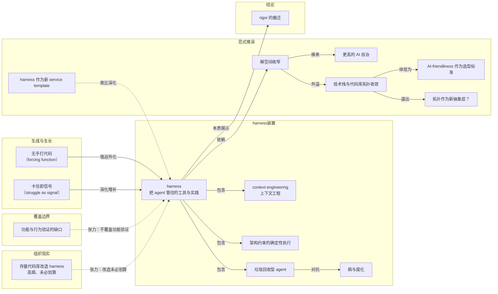

# 概念解析辞典

> 针对《Martin Fowler 为「harness 工程」站台：Thoughtworks 的一线笔记》（martinfowler.com，如材料提供）的概念提取

## 一、核心概念

### 1. **harness（把 agent 管住的那套工装）**

- **context**：全文的锚概念。作者说她喜欢用这个词来描述管住 AI agent 的工具与实践总和。

  > "the tooling and practices we can use to keep AI agents in check"

  她认为无论这个词来路如何，都准确描述了把 agent 套住、同时让它使得上劲的那套装置。

- **费曼一下**：harness 原指套在牲口身上的挽具——既不让你乱跑，又让你的力气能被用上。用在 AI 编程里也是同一个意思：不是给 agent 松绑，也不是把它关死，而是造一副装置，让它的输出始终落在可接受的范围内。

### 2. **无手打代码（no manually typed code at all）**

- **context**：OpenAI 实验的自我设限规则，作者称之为 forcing function。

  > "no manually typed code at all"

  正是这条规则逼出了整套 harness，并支撑起五个月、超 100 万行代码的真实产品。

- **费曼一下**：把自己的退路堵死，才会认真造工具。只要允许“实在不行我自己上手改一行”，那些本该外化成规则和检查的东西就永远停在人的脑子里。禁止手打代码不是为了炫技，是为了把隐性能力逼成显性装置。

### 3. **context engineering（上下文工程）**

- **context**：作者归纳的 harness 第一类组件。

  > "context engineering"

  它指写在代码库内、被持续增强的知识库，加上让 agent 取到动态上下文的通道——可观测性数据、浏览器导航都算。文末作者进一步指出，上下文工程不只是策展知识库，代码设计本身就是上下文的一大部分。

- **费曼一下**：agent 干得好不好，很大程度取决于它此刻知道什么。上下文工程就是有计划地安排“它该知道什么、从哪里知道”：静态知识写进代码库，动态信息开实时通道。最深的一层是：代码本身写成什么样，就在告诉 agent 这个系统该怎么运转。

### 4. **架构约束的确定性执行（architectural constraints + deterministic enforcement）**

- **context**：harness 的第二类组件。作者强调这些约束不只交给 LLM agent 去盯，还由确定性的自定义 linter 和结构性测试来强制。

  > "architectural constraints" ／ "custom linter" ／ "structural tests"

  确定性这一层不依赖模型当天的状态。作者在自检清单里点名 ArchUnit 这类结构性测试框架。

- **费曼一下**：让模型来检查模型，等于让同一种不确定性当裁判。确定性检查的价值在于它今天和明天给出同样的结论——规则写死在代码里，违反就是违反，不看模型心情。

### 5. **「垃圾回收」型 agent（garbage collection agent）**

- **context**：harness 的第三类组件，周期性运行的 agent，专找文档不一致与架构约束违规。

  > "fighting entropy and decay"

  它不产出新功能，只在后台不断把跑偏的地方拨回来。

- **费曼一下**：软件不会自己变好，只会自己变乱。这类 agent 相当于给代码库雇了个巡道工：不产生新业务价值，只负责对抗熵增，让系统慢一点腐化。

### 6. **熵与腐化（entropy and decay）**

- **context**：垃圾回收 agent 的对手，也是作者判断老代码库能否补 harness 的依据。

  > "so non-standardized and full of entropy"

  老应用往往极不标准化、充满熵，补 harness 可能根本不划算。

- **费曼一下**：熵在这里很具体：文档和代码对不上、模块边界越界、同一件事有五种写法。它不会一次性爆发，只会日积月累，直到没人说得清系统真实结构——那时想加任何自动化都无处下手。

### 7. **卡住即信号（struggle as signal）**

- **context**：OpenAI 团队的迭代机制，被作者专门引出来。

  > "When the agent struggles, we treat it as a signal: identify what is missing — tools, guardrails, documentation — and feed it back into the repository, always by having Codex itself write the fix."

  这是 harness 的生长机制，不是并列组件。

- **费曼一下**：把 debug 的对象从“这次的输出”换成“产生输出的环境”。人一旦开始接管，改进就停在这一次；把卡点当成环境缺陷来补，下一次同类问题就不再出现。而且补丁仍由 agent 自己写，保证装置和代码服从同一套规则。

### 8. **功能与行为验证的缺口（verification of functionality and behaviour）**

- **context**：作者对 OpenAI 写作的第一处保留。

  > "verification of functionality and behaviour"

  所有措施都指向长期内部质量与可维护性，缺的是功能与行为对不对的验证。

- **费曼一下**：一套 harness 可以保证代码结构整洁、边界清楚、文档同步，但这些全是关于“代码长成什么样”的。它做的事对不对，是另一个维度的问题，需要另一套装置来回答——这个位置目前还空着。

### 9. **service template 与 golden path**

- **context**：作者用来类比 harness 未来形态的现成实践。

  > "service template" ／ "golden path"

  service template 帮团队沿 golden path 实例化新服务；她设想团队从一组现成 harness 里按应用拓扑挑一个开工，也预判了同样的 forking 与同步难题。

- **费曼一下**：golden path 是组织内被推荐的默认路线——照它走，脚手架、规范、工具链都是现成的。harness 若走上这条路，好处是新项目开局即有护栏；坏处是老问题会照搬过来：每个团队都把模板改成自己的样子，上游更新就再也合不回去。

### 10. **解空间收窄（constraining the solution space）**

- **context**：作者从 harness 实践中读出的核心交换关系。

  > "something has to give" ／ "constraining the solution space"

  提升信任与可靠性，靠的是具体架构模式、强制边界、标准化结构；代价是放弃一部分“什么都能生成”的自由。

- **费曼一下**：可选项越少，出错的花样越少，检查也越容易写。想让 AI 自己跑得更远，你得先把跑道修窄——这是自由与自治之间的交换，不是免费升级。

### 11. **AI 友好度（AI-friendliness）作为选型标准**

- **context**：作者对技术栈收敛的预判。

  > "AI-friendliness" ／ "what's good for humans is good for AI"

  当写代码变成 steering its generation，开发者在细节层面的口味变得不重要，接口小怪癖不再烦人，团队可能优先选“有好 harness 可用”的栈。

- **费曼一下**：过去选框架看“我用着顺不顺手”，以后可能要多问一句“agent 用着顺不顺手、有没有现成护栏”。这两个标准并不对立：清晰的接口对人好，对模型同样好。

### 12. **拓扑作为新抽象层（topology as the new abstraction layer）**

- **context**：全文最具野心的一问。

  > "new abstraction layer" ／ "natural language"

  如果我们普遍学会 harness 代码库的设计模式，这些拓扑结构会不会成为新的抽象层，而不是许多 AI 爱好者期待的自然语言本身。作者能看清的抓手是保持数据结构稳定、定义并强制模块边界。

- **费曼一下**：抽象层是我们思考系统时真正操作的那一层。流行叙事说以后大家用自然语言编程；这一问反过来讲：真正决定系统能不能被 AI 维护的，也许不是你怎么描述它，而是它被切成了什么形状、边界画在哪里。

### 13. **rigor 的搬迁（relocating rigor）**

- **context**：作者借 Chad Fowler 的“Relocating Rigor”收束全文。

  > "Our most difficult challenges now center on designing environments, feedback loops, and control systems."

  她认为听到严谨该往哪儿搬的具体经验，好过一味指望“更好的模型”自动解决可维护性问题。

- **费曼一下**：严谨这份工作量并没有蒸发，只是从“一行行把代码写对”搬到了“把环境、反馈和控制设计对”。谁以为 AI 会免掉这份工作，谁就会在几个月后收到一份没人看得懂的百万行代码。

## 二、概念架构图

