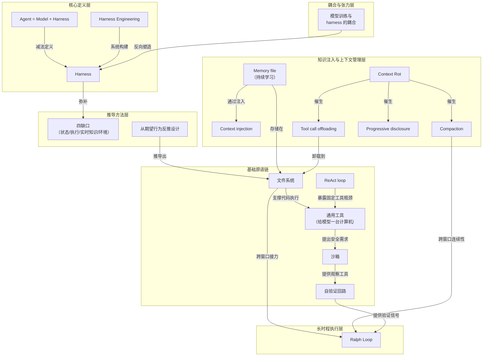

# 概念解析辞典

> 针对《The Anatomy of an Agent Harness》（LangChain / blog.langchain.com）的概念提取

## 一、核心概念

### 1. **Harness（框架 / 马具）**

- **context**：

  > If you're not the model, you're the harness.

  > every piece of code, configuration, and execution logic that isn't the model itself

  > a raw model is not an agent

- **费曼一下**：马具本身不产生力气，力气在马身上；但没有马具，马的力气没法变成拉车这件有用的事。harness 就是套在模型外面的那副装备——它不聪明，却决定了模型的聪明能落到哪里、能不能持续、出错时能不能被纠正。它的边界是减法划出来的：除了模型权重本身，其他所有代码、配置、执行逻辑，包括工具描述和确定性中间件，全部属于这一类。

### 2. **Agent = Model + Harness**

- **context**：

  > The model contains the intelligence and the harness is the system that makes that intelligence useful.

  > a raw model is not an agent

- **费曼一下**：把「agent」这个模糊的词做了一次因式分解。评价一个 agent 好不好，可以分开问两个问题：模型这一项有多强？框架这一项做了多少事？两项可以独立优化、独立归因。裸模型只有在 harness 提供了 state、tool execution、feedback loops 和 enforceable constraints 之后才成为 agent。

### 3. **Harness Engineering（框架工程）**

- **context**：

  > designing systems around model intelligence

  > convert a desired agent behavior into an actual feature in the harness

  > surgically extend and correct

- **费曼一下**：不是给模型写更好的提示词，而是给模型造更好的工作环境。就像同一个工人，在工具齐全、流程清晰、有质检环节的车间里，产出会和在空地上完全不同——你改的不是人，是车间。它有两个作用：帮人类注入有用的先验来引导 agent 行为；在模型变强之后，用于外科手术式地扩展与纠正模型。

### 4. **Harness level features（框架级能力 / 四缺口）**

- **context**：裸模型开箱即用做不到的事，全部是 harness level features。

  > 跨交互维持 durable state / 执行代码 / 获取 realtime knowledge / 搭建环境、安装依赖包以完成工作

  > LLM 的结构要求某种把它包起来的机器

- **费曼一下**：一个判断归属的分诊标准。遇到 agent 做不到的事，先问它属于「模型不够聪明」还是「没人给它这个能力」。绝大多数看起来像智力问题的失败其实是第二类——那就不该等模型升级，而该动手改框架。文中列出的四个缺口——持久状态、执行代码、实时知识、环境搭建——就是整个推导链条的起点。

### 5. **从期望行为反推 harness 设计**

- **context**：

  > Behavior we want (or want to fix) → Harness Design to help the model achieve this

  > convert a desired agent behavior into an actual feature in the harness

- **费曼一下**：全文的推导方法论。不是先看别人的框架有什么组件然后照抄，而是先说清楚「我希望它表现成什么样」，再倒推需要什么机制。这样得到的每个组件都带着理由，日后模型变了、任务变了，你知道哪些该留哪些该扔。它不是穷举功能清单，而是从「帮模型做有用的工作」这个起点推导出必然的组件。

### 6. **文件系统（Filesystem）**

- **context**：

  > arguably the most foundational harness primitive

  > 世界本来就在用文件系统干活

  > 文件系统是天然的协作面

- **费曼一下**：给模型一块能写字的白板，而且是它从小就学会用的那种白板。context window 是短期记忆，文件系统是长期记忆兼公共桌面。它解锁三件事：agent 拿到一个 workspace；工作可以增量累加和卸载，不必把一切都攥在 context 里；多 agent 与人类通过共享文件协调。后面的记忆、Ralph Loop、长时程协作，全都要回到这块白板上。

### 7. **ReAct loop**

- **context**：

  > 模型推理 → 通过 tool call 采取行动 → 观察结果 → 在 while loop 里重复

  > harness 只能执行它有逻辑的工具

- **费曼一下**：想一步、动一下、看一眼结果、再想下一步。这个循环本身很朴素，真正决定上限的是「动一下」这一步能动用什么。如果每个可能的动作都要人先造一个工具，agent 的能力上限就是工具表的长度——这就是 ReAct loop 暴露的结构性瓶颈，也是后面引入通用工具的动机。

### 8. **通用工具：给模型一台计算机（bash 与代码执行）**

- **context**：

  > giving models a computer

  > 模型可以用代码即时设计自己的工具，而不被固定的预配置工具集束缚

- **费曼一下**：与其给厨师准备一百把专用刀，不如给他一间能自己打铁的作坊。代码执行是元工具——它让工具集从「事先枚举」变成「按需生成」，agent 的能力边界不再由设计者的想象力决定。harness 仍然会带其他工具，但代码执行成为自主解题的默认通用策略。

### 9. **沙箱（Sandbox）**

- **context**：

  > 沙箱给 agent 安全的运行环境

  > 环境可以按需创建、在众多任务上扇出、干完就销毁

- **费曼一下**：给 agent 一间一次性实验室——它可以在里面随便折腾，折腾完把房间扔掉再开一间新的。安全和扩展性其实是一件事的两面：因为环境是隔离且可抛弃的，所以既能放心让它跑 agent 生成的代码，也能同时开一百间。好环境自带好的默认工具链，这本身也是 harness 的职责。

### 10. **Self-verification loop（自验证回路）**

- **context**：

  > 写应用代码 → 跑测试 → 查日志 → 修错误

  > 把解法锚定在测试上

  > harness 的 hooks 跑一套预定义测试，失败时把错误信息回灌给模型；或者提示模型独立地自评自己的代码

- **费曼一下**：让 agent 长出眼睛。只会写不会看的 agent，错了也不知道错在哪；能跑测试、能读日志、能截图对照，它才第一次拥有了「我干得对不对」这个信号——而所有自我改进都要从这个信号开始。browser、logs、screenshots、test runners 都是它的观察工具。

### 11. **Context injection（上下文注入）**

- **context**：

  > the only way to add knowledge is via context injection

  > 模型除了权重和当前 context 之外没有额外知识

- **费曼一下**：你没法给模型动脑手术，只能在它每次开口之前，往它面前的桌子上多放几张纸。一切「让 AI 知道更多」的花样，本质上都是在决定往桌上放什么、什么时候放、放多少。记忆文件、Web Search、MCP 工具都是这条通道上的具体实现。

### 12. **Memory file 与持续学习（continual learning）**

- **context**：harness 支持 AGENTS.md 这类 memory file 标准。

  > 在 agent 启动时注入 context；agent 编辑后 harness 再载入更新版本

  > agent 把一次 session 的知识持久存下来并注入未来的 session

- **费曼一下**：给模型一本它自己写、自己每天开工前先读一遍的工作笔记。权重改不了，但笔记可以改——于是「学习」这件事被从训练环节挪到了运行环节，由框架而不是训练管道来承担。它的落点仍然是文件系统：记忆文件的增删改都在磁盘上发生，harness 负责把它注入 context。

### 13. **Context Rot（上下文腐坏）**

- **context**：

  > 模型在 context window 被填满的过程中，推理与完成任务的能力都会变差

  > Harnesses today are largely delivery mechanisms for good context engineering.

- **费曼一下**：塞得越满未必记得越牢，反而会越糊涂。这是对「上下文窗口越大越好」的直接反驳——窗口大小是容量，不是效能。真正的手艺在于往里放什么、什么时候清理，而这活儿是框架干的。它也是管理策略（压缩、卸载、渐进式披露）共同的诞生源头。

### 14. **Compaction（压缩）**

- **context**：

  > 压缩会智能地卸载并总结已有上下文，让 agent 继续工作

  > 没有压缩时，对话超出窗口只能让 API 报错——那不行

- **费曼一下**：桌子快堆满时，把旧材料归纳成一页纸的摘要、原件收进抽屉，腾出桌面继续干活。它换来的是连续性：一个能压缩的 agent 不会因为聊得太久就突然断片。它是长时程工作跨窗口不丢失连贯性的关键机制之一。

### 15. **Tool call offloading（工具输出卸载）**

- **context**：

  > 超过阈值 token 数时，harness 只保留输出的头部和尾部 token，把完整输出卸载到文件系统，模型需要时再去取

- **费曼一下**：只把目录和结尾摆在桌上，整本书塞进书架，需要时再翻。这是「文件系统作为 context 延伸」的最直接用法——信息没有丢，只是从昂贵的近处挪到了便宜的远处。针对的是大段工具输出污染上下文却不提供有效信息的问题。

### 16. **Progressive disclosure 与 Skills（渐进式披露与技能）**

- **context**：

  > 模型并没有选择让 Skill front-matter 在启动时进入 context，但 harness 可以支持这件事

  > 解决启动时载入过多工具或 MCP server、在 agent 开始干活前就拖垮性能的问题

- **费曼一下**：先给一份目录，用到哪一章再翻哪一章。它的深层含义是：能力的「存在」和能力的「在场」应该分开——你可以拥有一百个技能，但不必让这一百个同时占着注意力。作者特别点出，这个保护性取舍是 harness 替模型做的，模型自己无权决定。

### 17. **Ralph Loop**

- **context**：

  > 用 hook 拦截模型的退出企图，在一个干净的 context window 里重新注入原始 prompt，逼 agent 对着完成目标继续工作

  > 每一轮都从全新上下文开始，但能读到上一轮留下的状态

- **费曼一下**：模型想收工时，框架把它叫回来，递上同一份任务书和一张干净的桌子，说「接着干」。它把「长时间工作」拆成了许多次短时间工作，靠磁盘上的状态接力——连贯性不来自记忆，来自留在外部的痕迹。之所以可行，正是因为文件系统在：每次迭代都从全新上下文开始，但能读到上一轮留下的状态。

### 18. **模型训练与 harness 设计的耦合**

- **context**：

  > 模型与 harness 同时在 loop 里做的 post-training

  > 改动工具逻辑会导致模型表现变差

  > 模型被 post-train 时用的那副 harness，不一定是你这项任务的最佳 harness

  > Opus 4.6 在 Claude Code 里的得分远低于同一个 Opus 4.6 在其他 harness 里的得分；LangChain 只改 harness 就把 coding agent 从 Top 30 提到 Top 5

- **费曼一下**：模型和框架一起长大，会长出默契，也会长出依赖——换一副框架就手生。这有两个后果：一是模型的分数从来不是模型一个人的分数；二是「原厂框架」并不等于「最优框架」，为自己的任务重调框架，往往比换模型划算得多。文中用 Terminal Bench 2.0 的榜单证据证明：只改 harness，还大有汁水可榨。

## 二、概念架构图

