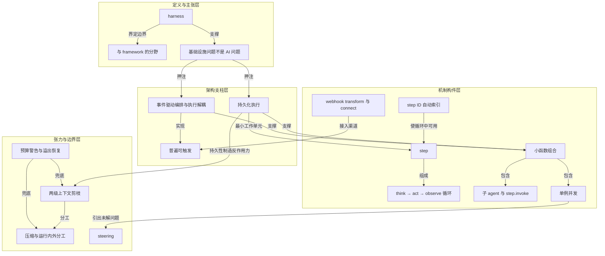

# 概念解析辞典

> 针对《Your agent 需要的是 harness，不是又一个框架》（inngest.com，原文标题 Your Agent Needs a Harness, Not a Framework）的概念提取

## 一、核心概念

### 1. **harness（工程套具）**

- **context**：全文的核心比喻与题眼。作者开篇即下定义，并明确划出它区别于框架的那条边界。

  > 在任何工程学科里，harness 都是同一件东西：连接、保护、编排各个部件，而自己不做工作。

  > harness 的三个动词是连接（connect）、保护（protect）、编排（orchestrate），而关键在第四点：它自己不做工作。

  > LLM 是引擎，工具是外设，memory 是存储。

- **费曼一下**：harness 在本文里是一层管连接处、管出事时怎么接住、但自己不干活的壳。它不决定 agent 怎么想、怎么行动，只保证这些动作可靠地发生。作者用它来回答"agent 各部分之间靠什么连起来、谁来接住失败"这个暴露出来的真正缺口。

### 2. **harness 与 framework 的分野**

- **context**：标题即论点，也是全文从定义到主张的起跳点。

  > 每一个 agent 框架都在从零重造一个：自己的重试逻辑、自己的状态持久化、自己的任务队列、自己的事件路由。

  > 框架倾向于替你决定 agent 怎么想、怎么行动，harness 只负责让这些动作可靠地发生。

  > 这些框架在用应用层代码解决基础设施层问题。

- **费曼一下**：这条分野是全文的判据。框架管"做什么"（替你决定 agent 的行为），harness 管"怎么不出事"（让行为可靠地发生）。作者用它指控当下 agent 框架把力气花在重造基础设施原语上，从而把读者引向他的主张：你缺的不是框架，是 harness。

### 3. **「基础设施问题，不是 AI 问题」**

- **context**：全文的价值主张，也点明了所有技术选择的依据。

  > All of these problems are infrastructure problems, not AI problems.

  > 你需要的原语可能已经存在了。

- **费曼一下**：这句话把 agent 开发中撞上的墙——重试、并发、状态管理、可观测性——重新归类为二十年前就解决过的软件工程问题。它是全文的收束：不需要以 agent 之名重造轮子，正确动作是去用已经存在的原语。这句话既是论点，也是后面所有"现成工具 + step 包裹"写法的合法性来源。

### 4. **持久化执行（durable execution）**

- **context**：全文的技术底座，也是作者押注"基础设施本身就是 harness"的实质内容。

  > 每一次 LLM 调用或工具调用都成为一个 step——一个可独立重试的工作单元；进程在第五轮死掉，前四轮的结果已经落盘。

  > 持久化、事件驱动的基础设施早已解决了这些问题……基础设施本身就是 harness。

  > 这就是持久化执行本来的设计意图，只不过从结账工作流换到了 agent loop 上。

- **费曼一下**：像游戏里每过一关自动存档，第五关挂了不必从头再打。作者强调它不是为 agent 发明的新东西，而是把为结账工作流设计的持久化机制原样搬到 agent loop 上。这个机制是 harness 能够"接住失败"的底层原因。

### 5. **step（可独立重试的工作单元）**

- **context**：持久化执行落到 Utah 里的最小原语。

  > 每一次 LLM 调用和每一次工具执行都是一个 Inngest step。

  > 每个 step 独立可重试。第 3 轮 LLM API 返回 500，Inngest 只重试那一个 step；第 1、2 轮的结果已经持久化，不会重放。

- **费曼一下**：step 是一个被单独记账的小任务。它成功了就永久落盘，失败了只重做自己，不牵连已完成的轮次。它同时还是 trace 与检视的粒度，让"agent loop 每一轮都完整可观测"这件事有了具体单位。

### 6. **step ID 自动索引**

- **context**：让"在循环里用持久化 step"这件事从繁琐变成自然的机制细节。

  > step.run("think") 在循环里被调十次，Inngest 内部记为 think:0、think:1……你不需要自己管理唯一 step ID，SDK 负责。

- **费曼一下**：循环里同一个名字被反复调用，系统自动在后面加编号区分第几次。没有这个机制，开发者就得手工管理唯一 ID，持久化 step 在循环里就不成立。它是循环与持久化两者能兼容的黏合剂。

### 7. **think → act → observe 循环**

- **context**：Utah 的 agent loop 形态，也是作者认为不需要框架就能写出来的东西。

  > 一个带「steps」的 while 循环，step 里调 LLM、跑工具。

  > 每一轮调用 LLM，检查它是否想用工具，执行工具，把结果喂回去。

  > 文本响应即完成。LLM 返回文本且没有工具调用，这一轮就结束了，不需要显式的「done」信号。

- **费曼一下**：想一想（调 LLM）、动动手（执行工具）、看看结果（把 toolResultMessage 推回 messages），然后再循环。循环的结束条件很朴素：LLM 只回文本、不叫工具时，那段文本就是最终回复。作者用它证明"agent loop 本身就这么朴素，不需要框架"。

### 8. **事件驱动编排与执行解耦**

- **context**：Utah 区别于 OpenClaw 与 pi 系列库的关键分界线。

  > 它们内部用的是进程内事件，事件与编排都在内存里处理；而 Inngest 本身是一个事件驱动的编排层，这个项目把执行与编排解耦了。

  > 前者足够跑通一个单机 agent，后者才让 agent 具备运维属性。

- **费曼一下**：原来指挥和演奏是同一个人，进程一死全都没了；现在指挥站到台外，执行在下层跑，编排在上层记录、路由、重试。解耦换来的五样东西——可观测性、持久化重试、分布式多人编排的基础、审计轨迹、内建调度——都是"运维属性"，而不是"能不能跑通"的区别。

### 9. **普遍可触发（universally triggered）**

- **context**：Utah 名字里的第一个词，作者强调它是"实指"。

  > Telegram/Slack webhook、cron 定时、子 agent 调用、函数间事件——agent 不知道也不关心自己是被什么激活的。

  > 触发与工作解耦。明天加一个 Slack bot，agent loop 一行不改，harness 负责路由。

- **费曼一下**：不管是谁敲门、闹钟响了、还是同事喊你一声，你干活的方式都一样。"谁来叫你"与"你怎么干活"是两件事。这个分离让 agent loop 与触发源彻底无关，是"加一个新渠道只需要 webhook transform 加回复函数"的前提。

### 10. **webhook transform 与 connect()**

- **context**：打通"公网 webhook"与"本地 worker"鸿沟的两个具体机件。

  > 一个 webhook transform 把原始 http payload 转成带类型的 Inngest event；……connect() API 从你的本机（或一台 mac mini、一台远程服务器）向 Inngest Cloud 建立一条持久 WebSocket 连接，不需要任何公网 endpoint。

- **费曼一下**：前者是海关，把外面五花八门的原始 payload 拆开、贴上统一类型的标签；后者是你主动拨出去的一条专线，这样别人不用知道你家的公网地址也能把事件送到你本机。两者合起来实现了"本地跑 agent，但享受云编排"。

### 11. **小函数组合（六个函数，不是一个巨石）**

- **context**：Utah 的架构组织方式。

  > Utah 不是一个包办一切的函数，而是六个通过事件通信的函数。

  > 每个函数有自己的重试策略、并发控制和触发条件。

  > 你是在用一组小而专注、由事件连接的函数来组合行为。

- **费曼一下**：与其让一个人既接电话又做饭又救火，不如六个人各管一摊、用事件互相通知。打字指示器可以立即触发不必等主循环，渠道特的格式化与降级隔离在回复函数里，全局错误由 failureHandler 统一接住。谁出问题只换谁，重试、并发、触发条件各自独立。

### 12. **子 agent 与 step.invoke()**

- **context**：应对 context window 撑爆的手段，以及它推导出的结论。

  > 用 step.invoke() 启动一次完全独立的 agent function run。……子 agent 函数跑一个全新的 agent loop：自己的 context window，同一套工具但去掉 delegate_task（不允许递归派生），最后向父级返回一份摘要。

  > 编排已经解决了，不需要 agent-to-agent 协议，只是函数在调用函数。

- **费曼一下**：活太大自己脑子会塞满，就交给一个助理，给他清晰任务、让他单独去做，只把摘要交回来；而且规定助理不能再找助理（去掉 delegate_task）。这个机制的关键在于它把子 agent 当成一个 step 来调用——父 agent 看到的只是一个工具结果。结论很硬：不需要另设 agent 间协议。

### 13. **单例并发（一次只跑一个对话）**

- **context**：以 session key 为键的并发控制，及其选择的处理方式。

  > 「一个对话」由渠道特定的 session key 定义：单线程渠道（如 Telegram）用 chat id；有 thread 的平台（如 Slack）则精确到 channel + thread。

  > 这个项目选择了 cancel + restart，理由是循环带着全部上下文重启是最干净的做法。

  > 以 sessionKey 为键的单例并发——每个 chat 同一时刻只有一次 agent run，没有竞态，没有交错的回复；新消息即取消——用户在 agent 处理中发来新消息，当前 run 被取消，新的 run 带着最新消息启动。在 Inngest 里这是一行配置。

- **费曼一下**：给每个对话配一把锁——同一时刻只允许一个 agent run 进入。用户半路发新消息，就取消在跑的、带着最新消息重新开始，理由是"带着全部上下文重启最干净"。用 session key 精确定义"一个对话"的范围（chat id 或 channel+thread），把传统做法里要给每个用户建队列、管理锁、处理取消的成本压成一行配置。

### 14. **两级上下文剪枝（pruning）**

- **context**：作者点名的"真正难题"，以及 Utah 的配置化应对。

  > 上下文管理才是真正的难题。最难的不是调用 LLM，而是管理进入 LLM 调用的东西。

  > 作者亲眼看到 agent loop 无休止地调用工具却始终产不出回复。

  > keepLastAssistantTurns: 3；softTrim 在超过 maxChars: 4000 时保留头 1500、尾 1500 字符；hardClear 在总量超过 50000 时整段清空并留下占位符。旧的工具结果被软裁或硬清，最近三轮始终保持完整。

- **费曼一下**：桌上文件太多就看不见重点。于是规定：最近三份原样保留，旧的只留首尾两页，实在太多就整摞收走贴个"已归档"的条子。这个机制解决的是运行内的上下文膨胀问题——它是持久化执行允许长循环后必然要面对的反作用力。

### 15. **压缩（compaction）与运行内外的分工**

- **context**：与剪枝并列的第二套机制，作用对象是会话本身。

  > 估算 token 超阈值时，先把对话历史摘要化再喂进下一次运行。

  > 剪枝处理运行内的上下文，压缩处理跨运行的累积。

- **费曼一下**：剪枝是这一场会议里少发点材料；压缩是每次开完会写一份纪要，下次带纪要来，而不是把历次材料全搬来。作者用这条分工把两套相似机制划清边界：一个管单次运行内的膨胀，一个管跨长时间会话的累积。

### 16. **预算警告与溢出恢复**

- **context**：上下文治理的另外两道保险，与剪枝、压缩构成四重机制。

  > 预算警告是在 agent 迭代次数快用完时注入系统消息，告诉它收尾；溢出恢复是当 LLM 在运行中途返回 context-too-large 错误时，强制压缩消息并重试，不浪费一次迭代。

  > 四者合起来让 agent 保持在轨。

- **费曼一下**：一个是提前提醒"还剩五分钟，请收尾"，一个是话说太长被打断时先精简再重说、不消耗一次迭代机会。它们补齐了剪枝与压缩之外的失败兜底层，让上下文治理从"预防"延伸到"迭代预算"和"错误恢复"两个尺度。

### 17. **steering（运行中途的介入）**

- **context**：作者明确标记的未解问题，也是全文唯一一处"基础设施已解决"话术承认失灵的地方。

  > steering 仍是未解问题。用户在 agent 运行中途发新消息该怎么办？现在用 singleton 取消当前 run 再起新的，能用，但在途的工作丢失了；新 run 从持久化的会话状态接上，并不无缝。

- **费曼一下**：你正在干活，对方半路改口。现在的做法是把手上的活全扔掉重新开始——不会错，但浪费。作者没有粉饰这个裂缝，而是直接标为"正在探索的领域"。它是单例并发 cancel+restart 策略引出的代价，暴露了基础设施能力接不住的那部分。

## 二、概念架构图

