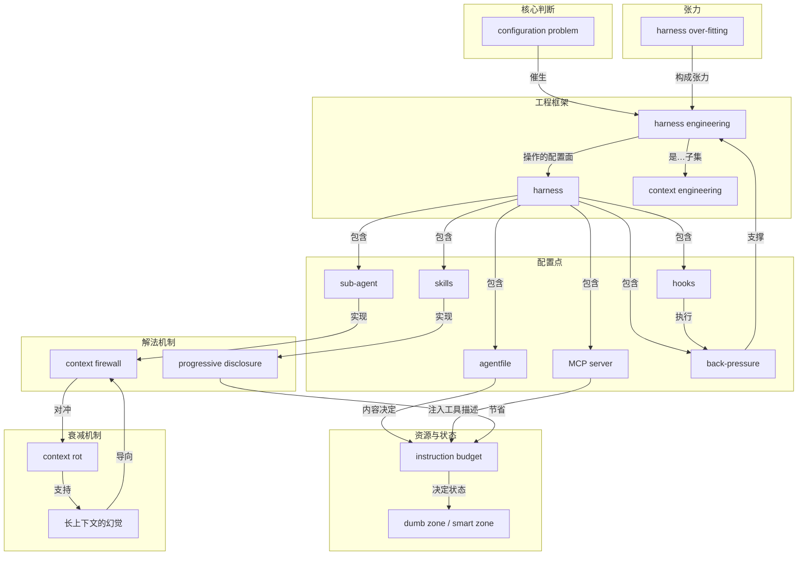

# 概念解析辞典

> 针对《HumanLayer：harness 工程就是把 coding agent 的配置点用到极致》（humanlayer.dev，材料提供）

## 一、核心概念

### 1. **configuration problem（不是模型问题，是配置问题）**

- **context**：作者在几十个项目、几百次 agent session 之后反复得到同一个结论：

  > 这不是模型问题，这是配置问题。

- **费曼一下**：全文的起点判断。它把 agent 失败的原因从“等下一代模型变强”转移到“检查你给模型搭的那套环境”。模型变聪明，我们会交给它更难的问题，失败仍会以新的方式出现；真正可优化的，是你这一侧。

### 2. **harness（agent 的运行时与外设）**

- **context**：作者把几个看似分立的东西收拢为一个配置面：

  > skills、MCP servers、sub-agents、memory、agentfile 在技术上是分立的概念，但它们同属 coding agent 的配置面。

  这个配置面被作者称为 harness，即 agent 的运行时，或者说 agent 的外设，决定模型靠什么与环境交互。

- **费曼一下**：模型像发动机，harness 像车子的方向盘、油门、仪表盘和后视镜。同一个发动机装进不同的车，能跑出完全不同的成绩。你换不了发动机，但可以重新装配这辆车。

### 3. **harness engineering（harness 工程）**

- **context**：Mitchell Hashimoto 给出了最短也最锋利的定义：

  > 每当你发现 agent 犯了一个错，就花时间工程化出一个解法，让 agent 再也不会犯这个错。

- **费曼一下**：把 agent 可靠性从“祈祷模型升级”变成可积累、可迭代、可交付的工程活儿。失败不是等待的理由，是配置的输入；修一次，就让它不会再犯同一类错。

### 4. **context engineering（上下文工程）**

- **context**：作者明确 harness 工程的定位：

  > harness 工程是上下文工程中主要通过 harness 配置点来精细管理 coding agent 上下文窗口的那一部分。

  而上下文工程由 Dex 在 12-factor agents 中提出，是“提示词工程”的超集。

- **费曼一下**：提示词工程关心“一句话怎么写”；上下文工程关心“模型此刻的视野里应该有什么、不该有什么”；harness 工程则是用配置点去执行这个视野管理。

### 5. **instruction budget（指令预算）**

- **context**：作者把上下文窗口里的每一条规则都看作成本：

  > 每一条无关的工具描述都是 agent 必须处理却毫无收益的指令。

  另一处补充：skills 出现之前，他们“还没开工，指令预算就烧光了”。

- **费曼一下**：模型的注意力像一份有限预算。写进上下文的每条规则、每个工具说明都在花钱，花在无关处的每一块钱都是从真正任务那里挪走的。它是解释所有配置点为什么要“少而准”的枢纽。

### 6. **dumb zone / smart zone（笨蛋区与聪明区）**

- **context**：插入过多 MCP 工具会“把你更快地推进笨蛋区”；而把工作拆给 sub-agents 是让主线程留在“聪明区”的办法。

- **费曼一下**：不是两个模型，而是同一个模型的两种状态。窗口干净时聪明，窗口塞满噪音时变笨；你的配置决定它待在哪一侧。

### 7. **progressive disclosure（渐进披露）**

- **context**：作者把它看作 skills 的核心价值：

  > 只有当 agent 判断（或你替它判断）需要时，它才拿到那部分指令、知识或工具。

- **费曼一下**：给一张目录，而不是一开始就把整本手册塞给它。信息按需加载，指令预算才花在刀刃上；这也是 agentfile 写作、MCP 工具搜索与 sub-agent 返回出处的共同原则。

### 8. **context firewall（上下文防火墙）**

- **context**：作者对 sub-agents 最核心的判断是它们“扮演上下文防火墙”：

  > 让离散任务在隔离的上下文窗口里跑，中间噪音不会累积到负责编排的父线程里。

- **费曼一下**：助手去查资料，只要回来说结论，不需要把翻过的每一页都念给你听。中间过程留在他那边，你的脑子才留得住整件事的全貌。

### 9. **context rot（上下文腐烂）**

- **context**：Chroma 的研究为作者体感提供了实证：

  > 上下文越长，性能越差，简单任务也不例外。

  更糟的是，当问题与相关信息的语义相似度低时，衰减更陡；干扰效应在长上下文里会叠加。

- **费曼一下**：上下文不是越长越好，而是越长越糊。无关内容不只是占地方，它们还会互相干扰。它与指令预算是互补关系：预算说“你花掉了多少”，腐烂说“花掉之后还会互相污染”。

### 10. **长上下文的幻觉（the bigger haystack）**

- **context**：作者直接反驳“把上下文窗口做大就行”：

  > 更大的上下文窗口不会让模型更擅长找针，它只是把草堆堆得更大。

  并进一步说：

  > 如果你觉得自己需要更长的上下文，你可能真正需要的是更好的上下文窗口隔离。

- **费曼一下**：扩窗只是在同一模型上加数学技巧延长注意序列，不会提升它找出关键信息的能力。真正的解法不是更大的包，而是分成几个小包分别装。

### 11. **agentfile（CLAUDE.md 与 AGENTS.md）**

- **context**：这些仓库顶层的 markdown 文件会被 harness：

  > 确定性地注入 agent 的系统提示。

  ETH Zurich 测试 138 个 agentfile 发现：LLM 自动生成的反而损害性能且多花 20% 以上成本，代码库总览和目录清单完全没用；人工撰写只带来约 4% 提升。作者自己的版本不到 60 行。

- **费曼一下**：给 agent 的入职须知，不是公司百科。写得越多，它每天上班都要重读一遍，读完还没干活就已经累了。少而精、普遍适用，让确定性的基础信息只占最小的预算。

### 12. **MCP server（工具接入与注入）**

- **context**：关键机制是：

  > 接入 MCP server 后，可用工具的列表、描述和调用参数会被注入 coding agent 的系统提示。

  由此带来安全警告：

  > 绝不要连接你不信任的 MCP server——这是提示注入的危险入口。

- **费曼一下**：MCP 把新工具插进 agent，但工具描述直接进入系统提示，既影响行为也消耗指令预算；挂得越多越早跌进笨蛋区，还带来安全风险。不在主动使用、又提供大量工具的 server，应该关掉。

### 13. **skills（可复用知识与渐进披露载体）**

- **context**：技能激活的机制是：

  > SKILL.md 会作为一条 user message 载入 agent 的上下文窗口，同时 agent 被告知这个文件所在的目录。

  作者强调：skills 的核心价值是渐进披露；但没法把 MCP server 直接打包进 skill，需要写成可执行文件或 CLI 随 skill 分发。

- **费曼一下**：可复用的知识或工具包，按需展开而不是常驻上下文。一个 skill 里可以放多个 markdown 文件，主 SKILL.md 只当目录，告诉 agent 什么时候该读哪一个。

### 14. **sub-agent（子 agent 的上下文封装）**

- **context**：作者说：

  > sub-agent 把一整个 coding agent session 的工作封装起来，派发方只看到自己写给 sub-agent 的提示，以及 sub-agent 的最终结果。

  并强调它们是“跨多个 session 维持连贯性的关键”。作者也明确否定了按“前端工程师 / 后端工程师”这类角色分工的用法——真正管用的是上下文控制。

- **费曼一下**：子 agent 不是给 AI 分配职称，而是给上下文划分房间。每个房间干完活只递出一张纸条，屋里的杂物不进父线程；父线程因此能留在聪明区，把多个小上下文窗口缝起来解决一个复杂问题。

### 15. **hooks（确定性控制流）**

- **context**：作者给出的示例 hook 的精髓是“成功彻底静默”：

  > 成功时什么都不会进 agent 的上下文；失败时只暴露错误，并用退出码 2 告诉 harness 重新唤起 agent，让它先修好再收工。

- **费曼一下**：模型是概率的，hooks 是确定的。凡是“必须每次都发生”的事，不要写进提示词请求，而写成脚本让它必然触发。它让成功不占用任何注意力，只把失败推到模型面前。

### 16. **back-pressure（背压与自我验证）**

- **context**：作者的核心命题：

  > 用 coding agent 成功解决问题的概率，与 agent 验证自己工作的能力强相关。

  但验证必须上下文高效：早期让 agent 跑完整测试套件，4000 行通过输出冲垮窗口；现在的做法是“吞掉输出、只暴露错误”。

- **费曼一下**：让 agent 能自己知道对不对，比让它一次写对更重要。但反馈要像体检报告的结论页，不是把所有原始化验单都糊到它脸上。成功静默，失败才显形。

### 17. **harness over-fitting（模型对 harness 过拟合）**

- **context**：作者承认官方 harness 有优势，但也指出：

  > 模型也可能对自己的 harness 过拟合。

  证据是 Opus 4.6 在 Claude Code 里排第 33，换到后训练时没见过的 harness 里排第 5，因此：

  > harness 是变量，不是常量。

- **费曼一下**：“官方配置最好”只是经验判断，不是定律。模型对原生装备既可能是磨合优势，也可能是路径依赖；最优 harness 需要让真实失败来告诉你该动哪里，而不是预设。

## 二、概念架构图

