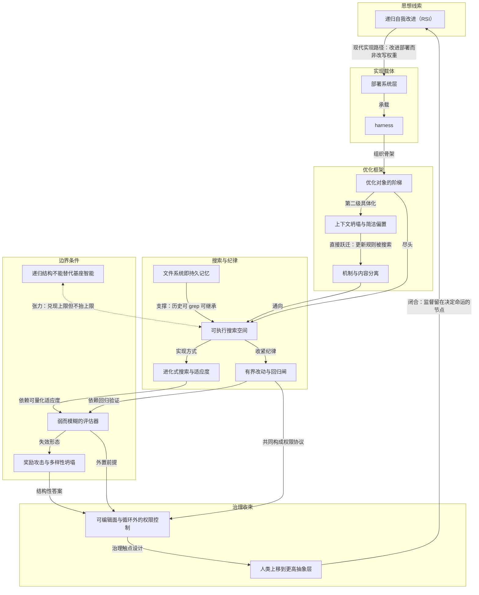

# 概念解析辞典

> 针对《Lilian Weng：把 harness 工程接到「递归自我改进」这条老线索上》（lilianweng.github.io）的概念提取

## 一、核心概念

### 1. **递归自我改进（RSI，Recursive Self-Improvement）**

- **context**：

  > 从 I. J. Good 与 Yudkowsky 的递归自我改进谈起，论证现代模型的自我改进更可能发生在 harness 层而不是权重层。Good 定义的超智能机器能在一切智力活动上超过人类并设计出更好的机器；Yudkowsky 把它收窄成一个具体反馈回路：AI 用当下的智能去改进那套产生它智能的认知机器。

- **费曼一下**：文章的阿基米德点。不是「机器变聪明」，而是「机器改进让自己变聪明的那条生产线」——你改的不是自己的大脑，而是你的教材、考试制度和教学流程，于是下一版你更强。全文所有工程讨论都在回答同一个问题：这条老线索在现代 AI 里究竟落在哪一层。

### 2. **harness**

- **context**：

  > harness 的定义：环绕基础模型的那套系统，编排执行，并决定模型如何思考与规划、如何调用工具与行动、如何感知与管理 context、如何存储 artifacts、如何评估结果。相比 2023 年的老公式「agent = LLM + memory + tools + planning + action」，harness 工程额外包含 workflow 设计（如 loop engineering）、评估、权限控制、持久状态管理。它不再是 prompt 模板，而更接近运行时与软件系统设计。

- **费曼一下**：模型是发动机，harness 是整辆车。它决定这台发动机的扭矩怎么变成轮上功率——怎么规划、怎么接工具、看到多少上下文、中间产物放哪、好不好由谁来判。发动机和车分开想，「智能」和「表现」才能被拆成两件事：原始智能决定上限，harness 决定这次任务兑现了多少上限。

### 3. **部署系统层（deployment system）**

- **context**：

  > 现代 AI 里这个回路不一定意味着模型直接改写自己的权重，更广义的形态是模型改进训练流水线和部署系统，从而让下一代模型在有经济价值的任务上表现更好。作者特意点名「部署系统」：介于原始模型与真实世界之间的那一层，其重要性看起来不亚于模型的原始智能（即预训练刚结束时的 evals）。

- **费曼一下**：这是全文接线的铜片。RSI 这条老线索原先指向「改写权重」，作者在这个地方把插头拔下来，改插到「部署系统层」上：介于模型与真实世界之间的那一层。预训练结束时的 eval 成绩是出厂检验，部署系统才是在真实任务里真正调度智能的地方。harness 是这一层的具体载体。

### 4. **优化对象的阶梯**

- **context**：

  > 全文的主轴是一条优化对象的阶梯：instruction prompts → structured context → workflow → harness code → optimizer code。模型越强，就越能往阶梯上端、更复杂也更通用的目标走。

- **费曼一下**：全文的地图坐标。一开始你改的是「怎么问」，然后是「给它看什么材料」，接着是「按什么流程干」，再往上改「写流程的那段程序」，最后改「改程序的那段程序」。每上一级，优化对象的通用性和杠杆都更长；而模型越强，才越有资格往高处站。理解不了这条阶梯，就看不懂后面所有案例各自坐在哪一级。

### 5. **文件系统即持久记忆**

- **context**：

  > 长时程 agent 系统里反复出现的模式，是用简单的控制方式管理丰富的状态和 artifacts。harness 不该把整条工作流和全部日志都扛在 context 里，而应该把耐久状态放进文件。长时程 rollout 中，实验日志、代码 diff、论文摘要、错误 trace、历史轨迹，长度常常远超模型训练时见过的 context 窗口。学会用 bash 之类命令读、写、编辑文件系统，是 LLM 的一项基础技能。

- **费曼一下**：脑子记不住的东西写进抽屉，需要时再翻出来。这听起来朴素，却是整篇文章最关键的机制性支柱之一：它决定状态是「易失的 context」还是「可检索的持久对象」。这个选择直接支撑了后面「可执行搜索空间」的成立——Meta-Harness 的执行历史、DGM 的 harness 仓库，都靠文件系统才可 grep、可继承、可被下一代 agent 推理。

### 6. **上下文坍塌与简洁偏置（context collapse & brevity bias）**

- **context**：

  > ACE 的关键设计是防止迭代重写过程中的 context collapse 与 brevity bias：curator 不重写整块 prompt，而是输出一组结构化的（标识符，描述）条目，用确定性逻辑合并进结构化 context 日志，并定期精化与去重。

- **费曼一下**：让人反复「总结上一版总结」，内容会越缩越短、细节全丢——这就是简洁偏置导致的上下文坍塌。ACE 的对策是改「往清单里增删条目」而不是「重写全文」。这个概念定义了 context 工程中最基本的机制边界：结构化演化的关键不是写得更多，而是维护方式必须抵制逐代压缩失真。

### 7. **机制与内容分离（双层优化，Meta Context Engineering）**

- **context**：

  > Meta Context Engineering（MCE, Ye et al. 2026）进一步把机制（如何管理 context）与产物内容（context 里有什么）分开：元层跑 skill 演化，基层跑 context 优化。双层优化：内层在训练数据上寻找给定 skill 下的最佳 context，外层寻找在验证集上表现最好的 skill。

- **费曼一下**：ACE 仍在手动写「context 该怎么组织」的更新规则；MCE 把这条更新规则本身变成被搜索的对象。一层改「这次带什么小抄」，另一层改「做小抄的方法论」。这是优化对象阶梯上从「structured context」到「workflow / harness code」的一次跃迁——原本由人拍板的东西降格成可被程序改写、可被评分的目标。

### 8. **可执行搜索空间**

- **context**：

  > 全文的转折点是一句判断：代码是通用语言。harness 说到底就是一段程序，规定 prompt、工具调用、子 agent、控制流、记忆和工作流逻辑如何协同。一旦 harness 设计变成可执行的搜索空间，强 coding agent 就能进入人类工程师使用的同一片设计空间，而且它能访问的空间远大于手写 prompt。

- **费曼一下**：只要一个东西能写成代码、还能自动打分，它就能被机器一遍遍试着改。harness 变成可执行搜索空间后，机器不再受限于手写 prompt 的窄入口，而是进入了人类工程师的同一片设计空间。这句话是文章的倒转点：它把 harness 从「工程对象」升级为「搜索对象」，后面的进化式搜索、Meta-Harness、DGM 全是从这里分叉出来的。

### 9. **进化式搜索与适应度**

- **context**：

  > 进化式搜索是受自然选择启发的优化方法：让一群解变异，只保留高「适应度」的个体。它适合两种情形——搜索空间极大或形状古怪；难以用梯度直接优化但容易评估解。harness 搜索看起来正好合适。

- **费曼一下**：不知道怎么直接算出最优解，就多生一批、挑活得好的、再生一批。前提是你得能快速判断谁活得好。这个概念决定了一整族方法（AlphaEvolve、ShinkaEvolve、DGM）的适用边界：在矩阵乘法、GPU kernel 这类可自动评测的领域效果好，在评估缓慢或模糊的领域吃瘪。

### 10. **有界改动与回归闸（bounded edits & regression gate）**

- **context**：

  > 提案阶段只允许基于挖出的失败模式做有界的 harness 编辑，模型拿到的是有界提案 context（可编辑面、有 verifier 依据的失败模式、应保留的通过行为、以往尝试摘要）；验证阶段在 held-in 与 held-out 两个划分上跑回归测试，两边都无退化才被接受，被拒候选只记日志不动现役 harness。

- **费曼一下**：改系统要小步、可控，而且改完必须两套测试都不退步才准上线。有界是防止 agent 大改特改导致抽象边界失守；回归闸是用 held-in（验证解决了问题）和 held-out（防止引入新问题）双重约束来管理「成功的幻觉」。这组机制定义的是 Self-Harness 的安全边界：改进必须被证明不伤人、且可回退。

### 11. **可编辑面与循环外的权限控制**

- **context**：

  > 作者对这类工作提出了担忧：如果一个程序被允许编辑操作系统本身，抽象边界就被打破了。可编辑面必须被妥善设计，权限控制与安全层必须活在这个循环之外。

- **费曼一下**：可以让员工改自己的工作流程，但不能让他同时改考勤机和自己的权限。裁判必须站在场外。这条边界是全文最强的工程主张：不是设计更聪明的奖励函数，而是从结构上保证「被优化的系统永远碰不到评判它的东西」。它与「有界改动与回归闸」一外一内，构成自我改进 harness 的权限协议。

### 12. **递归结构不能替代基座智能**

- **context**：

  > 全文最重要的一条负面结果来自 STOP：同一套递归改进，在 GPT-4 上让下游平均表现随迭代上升，在 GPT-3.5 和 Mixtral 这类更弱模型上反而退化。递归结构本身不够，基座模型必须强到足以改进机制——harness 改进的是部署，智能仍是核心。

- **费曼一下**：给一个学不明白的人一套「自我提升方法论」，他只会把自己越改越糟。会自我改进的前提是你已经看得懂自己哪儿不行。这条警告给整篇文章的工程乐观设置上限：可执行搜索空间的价值兑现得再充分，天花板还是基座模型决定的。它不否定 harness 工程，但否定「用 harness 替代智能」的幻想。

### 13. **弱而模糊的评估器**

- **context**：

  > 迈向完整 RSI 的第一个瓶颈。许多研究主张没有快速精确的 verifier，很多现实任务也一样。当前的自我改进回路，在评估指标可测量、客观的任务上效果最好（与 RL 起效的条件类似）。研究品味、新颖性、长期科学价值都难以度量。

- **费曼一下**：没有靠谱的裁判，比赛就没法自动越打越好。能量化的项目（跑分、通过率）进步飞快，靠品味打分的项目原地踏步。这个概念是整个自改进回路能否成立的前提条件：前面所有的进化式搜索和可执行搜索空间，全都建立在「适应度易量化」这个基础上。评估器一旦弱下来，回路立刻变质。

### 14. **奖励攻击与多样性坍塌（reward hacking & diversity collapse）**

- **context**：

  > 自我改进回路优化的是你给它的任何信号：奖励来自单元测试，agent 可能对测试过拟合；来自裁判模型，就学会针对该裁判的攻击技巧；来自基准分数，就利用基准的伪影。进化与 RL 回路倾向于压榨已知的高回报模式，需要机制防止种群坍缩成同一个解的变体。

- **费曼一下**：两种自改进回路的系统性癌症。奖励攻击是「考什么就练什么，甚至骗监考」；多样性坍塌是「大家发现一条捷径就全去走，别的路再没人试」。前者让回路背离你的真实目标，后者让搜索失去发现更好路径的能力。它是弱评估器的直接后果，也解释了为什么必须有循环外的评估器和权限控制。

### 15. **人类上移到更高抽象层**

- **context**：

  > 人应当在栈上往上移动，而不是被移出回路——在正确的时机、正确的抽象层级提供监督，系统设计要考虑何时以及如何设置这些触点。作者的收尾立场很直接：我们是在为人类更好的未来造这项技术，而不是反过来。

- **费曼一下**：不是把人赶出车间，而是让人从拧螺丝的位置换到画图纸和验收的位置。人还在，只是站得更高，在真正决定命运的节点上保留判断。这是全文治理回路的落点：与「循环外的权限控制」形成闭环——监督的触点设计就是人类上移的具体实现。

## 二、概念架构图

**图注**：起点是 RSI 的现代实现路径替换——从改写权重转为改进部署系统层。harness 作为部署层载体，其内部由「优化对象的阶梯」组织，从 prompt 一步步升到可执行搜索空间。可执行搜索空间一侧被进化式搜索放大，另一侧被有界改动与回归闸收紧，两者都依赖评估器；评估器弱化后产生奖励攻击与多样性坍塌，结构性答案指向循环外的权限控制。横贯全图的张力边是「递归结构不能替代基座智能」。治理回路由人类上移闭合，最终回到 RSI。
