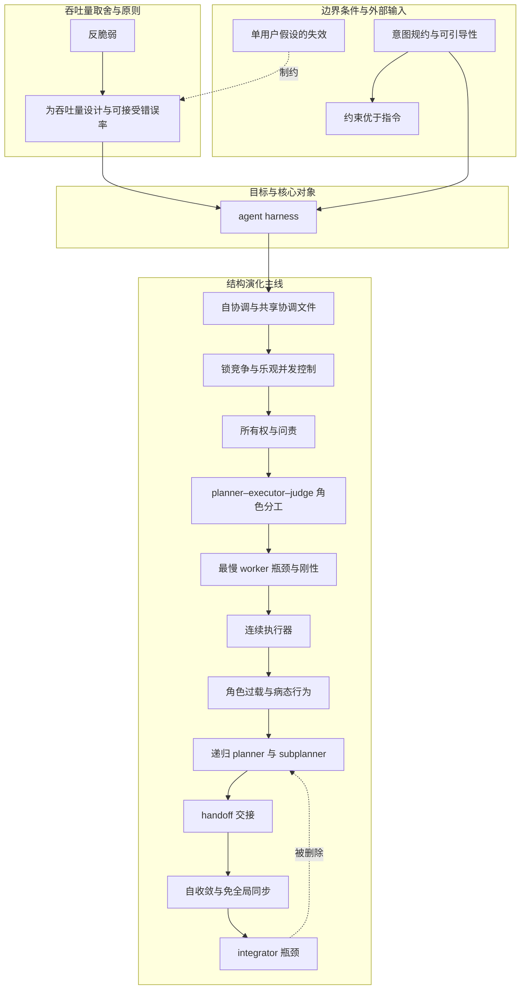

# 概念解析辞典

> 针对《Towards self-driving codebases》（Cursor，原文见 cursor.com/blog/self-driving-codebases）的概念提取

## 一、核心概念

### 1. **agent harness**

- **context**：

  > “we created a new agent harness to orchestrate many thousands of agents and observe their behavior”

- **费曼一下**：harness 不是模型本身，而是模型之外那套负责编排、调度、观测、约束的系统。全文讲的不是如何把模型变大，而是如何把承载模型这辆“车”造好——底盘、变速箱、仪表盘都决定最终能跑多快。理解它才能理解为什么同一批模型在不同版本里表现天差地别。

### 2. **自协调与共享协调文件（shared coordination file）**

- **context**：

  > “have agents with equal roles use a shared state file to see what others are working on, decide what to work on, and update the file”  
  > “This failed quickly.”

- **费曼一下**：让一群平级 agent 共用一块白板，各自写下“我在干什么”，指望它们自己把活分好。设计哲学是“尽量少规定”，但实际是所有人都在抢那支笔，而且没有人愿意认领最难的活。这是整个演化链的第一块承重砖——正是这次失败逼出了后面的所有结构设计。

### 3. **锁竞争与乐观并发控制（lock contention / optimistic concurrency）**

- **context**：

  > “Locking is easy to get wrong and narrowly correct”  
  > “20 agents would slow to the throughput of 1-3”

- **费曼一下**：自协调失败的表面技术原因。Agent 持锁太久、忘记释放、在非法时机加解锁，更根本的是它们不理解持有协调文件锁的意义。加 prompt 也没用，给显式等待工具也很少被用，换成无锁的乐观并发控制仍解决不了困惑。这把“把难度放错地方”的教训钉死了：靠模型学拿捏锁语义，不如重新设计结构让锁没必要存在。

### 4. **所有权与问责（ownership and accountability）**

- **context**：

  > “we separated roles to give the agents ownership and accountability”  
  > “no single agent took on big, complex tasks”

- **费曼一下**：自协调最深的病根不是性能，而是责任真空——没有结构，就没有任何一个 agent 愿意接下大而复杂的任务，它们只做小而安全的改动。所有权与问责是对此的直接回应：让每一个范围都有明确的归属者。这是从“自由”转向“结构”的动机，是全文反复出现的核心张力之一。

### 5. **planner–executor–judge 角色分工**

- **context**：

  > “planner: first lays out the exact path and deliverables needed to fulfill the user's instruction”  
  > “executor: the single lead agent, solely responsible for the plan being fully delivered”  
  > “judge: runs after the executor finishes, independently determines if it's really done”

- **费曼一下**：把一个人的活拆给“出方案的、盯落地的、验收的”三个角色。好处是终于有人对结果负责，worker 也能安心聚焦窄任务；代价是流程被钉死——前期方案一旦过时，系统要等下一轮循环才有机会纠正。这是第二代结构，承重在于它证明“所有权”有效，但也暴露了刚性的天花板。

### 6. **最慢 worker 瓶颈与刚性（bottlenecked by the slowest worker / rigidity）**

- **context**：

  > “we found this system to be bottlenecked by the slowest worker. It was too rigid.”  
  > “Doing all planning upfront also made it hard for the system to dynamically readjust”

- **费曼一下**：角色分工版的硬伤。所有规划前置等于把地图画死，路上发现桥塌了，队伍只能站在原地等下一次重新画图。系统吞吐被最慢的那个 worker 拖住，任何局部延误都会拖垮整体。这个概念是推导出连续执行器的逻辑前提——刚性太强，所以需要去掉独立 planner。

### 7. **连续执行器（continuous executor）**

- **context**：

  > “it didn't need to write a plan anywhere, stick to one static unchanging plan, or rigidly wait for all workers”

- **费曼一下**：第三代设计把 planner 和 executor 合并成一个 agent，让它边想边干、随时改主意，不必把计划写成文件。灵活性大涨，judge 也被删掉以保持简单。但它埋下了下一个问题的种子：这一个人身上的帽子太多了。理解连续执行器，才能理解为什么下一步会滑向“角色过载”。

### 8. **角色过载与病态行为（role overload and pathological behavior）**

- **context**：

  > “plan, explore, research, spawn tasks, check on workers, review code, perform edits, merge outputs, and judge if the loop is done”  
  > “In retrospect, it makes sense it was overwhelmed.”

- **费曼一下**：连续执行器同时被赋予九个角色，结果不是变成九个人，而是变成一个什么都做不好、还会随机 sleep、停掉 worker、拒绝规划、过早宣称完成的 agent。这个概念解释了为什么“减少结构”并不能无限走到底——结构过少则过载，结构过多则刚性。它直接催生了最终设计中对角色的重新拆分。

### 9. **递归 planner 与 subplanner**

- **context**：

  > “when the planner feels its scope can be further subdivided, it spawns subplanners, which own that delegated slice in exactly the same way. This is recursive.”  
  > “Interestingly, this does represent how some software teams operate today.”

- **费曼一下**：最终设计把“负责”这件事做成可以分形复制的：root planner 拥有整个用户指令的范围，觉得能切就 spawn subplanner，subplanner 完全拥有那一片窄范围。每一片工作总有且仅有一个 agent 对它整体负责。这解决了“结构过多刚性、结构过少过载”的矛盾——所有权可以递归下放，不必把所有责任压在一个 agent 身上，也不必让所有 agent 平级争夺。

### 10. **handoff 交接**

- **context**：

  > “contains not just what was done, but important notes, concerns, deviations, findings, thoughts, and feedback”

- **费曼一下**：worker 完成任务后只交回一份交接报告，由系统提交给下达任务的 planner。这不是交作业，是交情报：做完了什么只是最浅一层，真正值钱的是“我发现了什么、哪里不对劲、我偏离了哪里”。这些内容成为上层重新决策的燃料，使系统在没有全局同步的情况下保持动态。

### 11. **自收敛与免全局同步（self-convergence without global synchronization）**

- **context**：

  > “even if a planner is 'done,' it continues to receive updates, pulls in the latest repo, and can continue to plan”  
  > “without the overhead of global synchronization or cross-talk”

- **费曼一下**：不开全员大会，也不让所有人互相加好友。信息只沿着“谁对这块负责”的链条向上传播，视野越往上越全局。系统因此既能持续收敛，又不必付出人人同步的开销。这是最终架构运转起来的核心机制——它解释了为什么这套递归结构能够既动态又稳定。

### 12. **integrator 瓶颈**

- **context**：

  > “There were hundreds of workers and one gate (i.e. 'red tape') that all work must pass through.”

- **费曼一下**：原本设的一道全局质量控制闸门，结果在上游有几百个 worker 时成为全公司最堵的地方。改 prompt 无果后直接删除。这个概念是全文的减法逻辑：当一道闸门带来的排队损失远大于它拦下的错误时，它就不是质量保障，而是官僚负担。它也是最终设计“没有中央集成者”的反事实对照。

### 13. **为吞吐量设计与可接受错误率（designing for throughput / acceptable error rate）**

- **context**：

  > “agents can trust that other issues will get fixed by fellow agents soon”  
  > “The error rate remains small and constant”

- **费曼一下**：要求每次 commit 前 100% 正确会导致严重串行化，一个 typo 就能让系统停摆、agent 一拥而上互相踩踏。放宽后，允许持续存在一小撮已知会被很快修掉的错误，系统反而跑得更快，前提是错误率稳定、不爆炸不恶化。这是全文最反直觉的工程取舍：接受“脏得稳定”，再在最终 green 分支做发布前快速修复 pass。

### 14. **反脆弱（anti-fragile）**

- **context**：

  > “As we scale the number of agents running simultaneously, we also increase the probability of failure. Our system needs to withstand individual agents failing, allowing others to recover or try alternative approaches.”

- **费曼一下**：规模本身就是故障源。一百个 agent 里总有几个会跑偏、卡死或胡说八道。系统的正确目标不是让每个 agent 都不出错，而是让任何一个出错都不要紧。这条原则是“为吞吐量设计”之所以成立的前提——如果每个 agent 的失败都会拖垮全局，你就不敢接受任何错误率。

### 15. **意图规约与可引导性（intent specification / steerability）**

- **context**：

  > “The harness was merely following our instructions exactly.”  
  > “Ultimately, agents are still agents: trained to follow your instructions strictly, go down those paths, not change or override them, even if they're bad.”

- **费曼一下**：当执行力接近无限时，方向的每一度偏差都会被放大成几公里。harness 稳定之后，输出质量的决定权就转移到了人给出的指令上。你不是在管理工人，而是在管理一个会把你说的话执行到底、好话坏话一视同仁的系统。这是全文与工程技术并列的第二条主线：表达意图的能力成为新的瓶颈。

### 16. **约束优于指令（constraints over instructions）**

- **context**：

  > “Constraints are more effective than instructions.”  
  > “No TODOs, no partial implementations”  
  > “Models generally do good things by default. Constraints are defining their boundaries.”

- **费曼一下**：与其列一张“你要做的十件事”的清单（模型会只盯着这十件，并隐含地把没列出的降级），不如画一圈“不许越过的线”，把剩下的判断留给它。前者压缩了模型的能动性，后者只压缩了它的犯错空间。这是“意图规约”在 prompt 层面的具体方法，也是处理“过窄指标与无结构自由”之间平衡的一种实践。

### 17. **单用户假设的失效（breakdown of single-user assumptions）**

- **context**：

  > “the project structure, architectural decisions, and developer experience can affect token and commit throughput”

- **费曼一下**：我们今天的开发工具几乎都默认“一台机器上只有一个人在工作”。这个假设在几百个 agent 同时编译的项目面前立刻崩掉——磁盘成为热点、共享锁造成竞争、大量重复文件浪费资源。这个概念把“吞吐量”与底层的项目结构和工具选择联系起来，指出改造这些老原语可能比堆算力更划算，是从基础设施层面对系统上限的硬约束。

## 二、概念架构图

关系说明：  
- 结构演化主线是从**失败驱动**的链：自协调失败暴露锁竞争与责任真空，催生所有权与问责；角色分工带来刚性，促成连续执行器；连续执行器过载，催生递归 planner 与 subplanner；handoff 支撑自收敛；integrator 被证明多余而删除。  
- 吞吐量取舍层：反脆弱是“接受错误率”的前提，为吞吐量设计直接指导 harness 的构建；单用户假设的失效从基础设施层制约了吞吐量的上限。  
- 外部输入层：意图规约是 harness 稳定后浮现的新瓶颈，约束优于指令是意图规约在 prompt 层面的具体方法；意图规约与 harness 是并列而非从属——两者独立必要，缺一不可抵达“会自动驾驶的代码库”。
