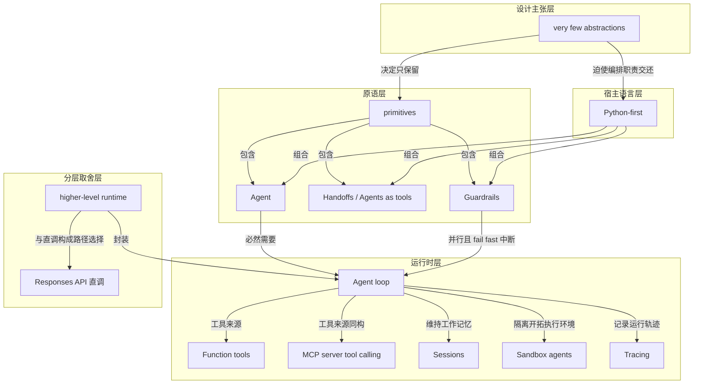

# 概念解析辞典

> 针对《OpenAI Agents SDK 官方文档：抽象极少的轻量 agent 框架》（OpenAI／openai.github.io）的概念提取

## 一、核心概念

### 1. **very few abstractions（抽象极少）**

- **context**：SDK 的自我定位宣言，也是全文反复回到的判据。

  > “with very few abstractions”
  > “without a steep learning curve”

- **费曼一下**：每多一层抽象，出问题时就要多一次翻译成本。本文中“抽象极少”指框架只发明非发明不可的那几个词，剩下的用 Python 已有的语言表达，从而降低学习曲线。它不是谦辞，而是对外宣示的核心竞争力。

### 2. **primitives（原语）**

- **context**：文档用 primitives 指称三个不可再拆的基本构件。

  > “a very small set of primitives: Agents, Agents as tools / Handoffs, Guardrails”
  > “few enough primitives to make it quick to learn”

- **费曼一下**：原语就是这套积木里的基本块。块的种类越少，你越快学会；能不能搭出复杂东西，取决于块之间能不能自由组合——本文中组合能力由 Python 提供。少抽象与强表达力之间的张力，靠把编排职责还给宿主语言来化解。

### 3. **Agent（装备了指令与工具的 LLM）**

- **context**：原语之一，定义极简。

  > “Agents, which are LLMs equipped with instructions and tools”

- **费曼一下**：agent 不是一个神秘的智能体，而是“模型 + 一段说明它该做什么的话 + 一组它能调用的工具”的打包。去掉包装，里面就这三样。这是整个框架的最小单元。

### 4. **Handoffs / Agents as tools（委派与交接）**

- **context**：原语之一，允许 agent 之间协调与委派。

  > “delegate to other agents”
  > “a powerful mechanism for coordinating and delegating work across multiple agents”

- **费曼一下**：一个 agent 干不完的活，可以交给另一个更专的 agent。交法有两种：当成工具调一下再拿回控制权（Agents as tools），或者把整场对话整体交接出去（Handoffs）。前者像请教同事，后者像转接电话。同一机制有两种叫法与两种用法。

### 5. **Guardrails（并行护栏）**

- **context**：原语之一，横切输入输出两端，且与主流程并行。

  > “enable validation of agent inputs and outputs”
  > “run input validation and safety checks in parallel with agent execution, and fail fast when checks do not pass”

- **费曼一下**：护栏不是排在主流程前面挡路的串行关卡，而是与主流程同时跑的一条检查线。一旦检查不过就立刻中止，不让错误输入白白消耗一整轮推理。它的并行与 fail fast 是区别于普通前置校验的关键。

### 6. **Python-first（以 Python 为先的编排）**

- **context**：设计原则在 API 形态上的落地。

  > “Use built-in language features to orchestrate and chain agents, rather than needing to learn new abstractions”

- **费曼一下**：编排逻辑就用普通的 if、for、函数调用写，不用学框架自造的一套流程语言。好处是你原有的调试器、类型检查和测试工具全都还能用。这是“抽象极少”的直接推论：既然只留三个原语，就必须把表达能力交还给宿主语言。

### 7. **Agent loop（内置 agent 循环）**

- **context**：运行时核心，封装了工具调用与 LLM 之间的往返。

  > “A built-in agent loop that handles tool invocation, sends results back to the LLM, and continues until the task is complete”

- **费曼一下**：模型调工具、拿到结果、再喂回模型、判断是否结束——这个来回的循环谁都要写一遍。SDK 把它内置了，你只描述 agent 是什么，不用描述它怎么转。这是“抽象少不代表运行时薄”的关键证据。

### 8. **Function tools（函数即工具）**

- **context**：本地工具来源，与 MCP 构成同构关系。

  > “Turn any Python function into a tool with automatic schema generation and Pydantic-powered validation”

- **费曼一下**：你写一个普通函数，框架读它的签名自动生成模型能看懂的工具描述，并用 Pydantic 校验模型传来的参数。工具定义与函数定义合并成同一份代码，不再两处维护。

### 9. **MCP server tool calling（MCP 工具的同构接入）**

- **context**：外部工具来源，与 Function tools 同构。

  > “Built-in MCP server tool integration that works the same way as function tools”

- **费曼一下**：外部 MCP 服务器提供的工具，和你自己写的 Python 函数工具，在调用面上长得一模一样。工具从哪来对 agent 是透明的，这让本地能力和外部能力可以随意互换。同构，而不是新增一层抽象。

### 10. **Sessions（持久记忆层）**

- **context**：Agent loop 内的工作记忆。

  > “A persistent memory layer for maintaining working context within an agent loop”

- **费曼一下**：agent 每一轮都要知道之前发生过什么。Sessions 就是替它保管这份工作记忆的地方，让状态跨轮次延续，而不必每次都把全部历史手工塞回提示词。

### 11. **Sandbox agents（隔离工作区与可恢复执行）**

- **context**：真实隔离执行环境与可恢复会话。

  > “Run specialists inside real isolated workspaces with manifest-defined files, sandbox client choice, and resumable sandbox sessions”

- **费曼一下**：当 agent 要真的读写文件、跑代码，它需要一间自己的房间，而不是在你的机器上乱翻。沙箱给它这间房间，而且中断之后还能回到原处继续，不用从头再来。这扩展了 agent loop 的执行边界。

### 12. **Tracing（内置可观测性）**

- **context**：内置追踪，支撑调试、评估与模型微调。

  > “built-in tracing that lets you visualize and debug your agentic flows, as well as evaluate them and even fine-tune models for your application”

- **费曼一下**：agent 的每一步为什么这么走，事后要能回放。tracing 把这些运行轨迹记录下来，先用于排错，再用于评估，最后这些轨迹本身还能变成微调模型的训练材料——同一份数据在三个环节复用。

### 13. **higher-level runtime（模型调用之上的运行时分层）**

- **context**：SDK 与 Responses API 的分层边界。

  > “The SDK uses the Responses API by default for OpenAI models, but it adds a higher-level runtime around model calls”
  > “You do not need to choose one globally”

- **费曼一下**：SDK 不是 API 的替代品，而是套在它外面的一层。你要么自己管循环、工具分发和状态，要么把这些交出去。关键在于这个选择是按路径做的：同一个应用里，托管流程走 SDK，低层调用直连 API，两者共存。选择粒度是路径，而不是项目。

## 二、概念架构图

