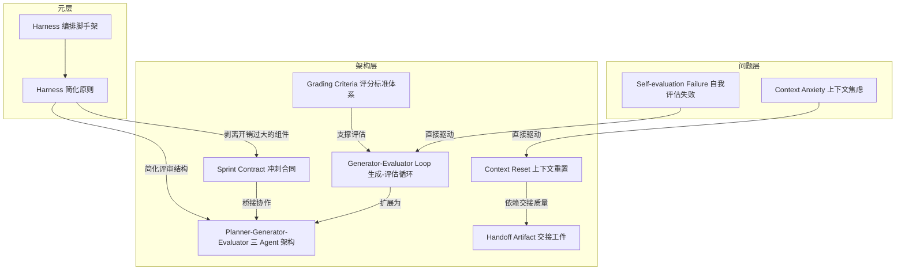

# 概念解析辞典

> 针对《Harness design for long-running application development》（Anthropic 工程团队）的概念提取

## 一、核心概念

### 1. **Harness（编排脚手架）**

- **context**：

  > every component in a harness encodes an assumption about what the model can’t do on its own, and those assumptions are worth stress testing, both because they may be incorrect, and because they can quickly go stale as models improve.

- **费曼一下**：Harness 是围绕 LLM 搭建的编排层——不是模型本身，而是决定模型以什么角色、什么顺序、在什么约束下工作的外部结构。每个 harness 组件本质上都是一个关于「模型自己做不到什么」的假设，这些假设需要随模型进化不断重新审视。全文讨论的 generator-evaluator 循环、三 agent 架构、context reset 都是 harness 的具体形态。

### 2. **Context Anxiety（上下文焦虑）**

- **context**：

  > Some models also exhibit “context anxiety,” in which they begin wrapping up work prematurely as they approach what they believe is their context limit.

- **费曼一下**：模型在长任务中会产生一种「假想性上下文窗口即将耗尽」的幻觉，导致提前收尾、草草了事。这不是真的上下文窗口满了，而是模型自己「以为」要满了。这是长时间运行 agent 的第一大失败模式，Sonnet 4.5 表现尤为严重，直接决定了需要 context reset 而非 compaction。

### 3. **Context Reset vs Compaction（上下文重置 vs 上下文压缩）**

- **context**：

  > This differs from compaction, where earlier parts of the conversation are summarized in place so the same agent can keep going on a shortened history. While compaction preserves continuity, it doesn’t give the agent a clean slate, which means context anxiety can still persist. A reset provides a clean slate, at the cost of the handoff artifact having enough state for the next agent to pick up the work cleanly.

- **费曼一下**：两种处理上下文窗口溢出的策略。Compaction 是「原地总结」——把早期对话压缩，同一个 agent 继续工作，优点是连续性，缺点是 context anxiety 仍然存在。Reset 是「重新开始」——彻底清空上下文，启动全新 agent，通过 handoff artifact 传递状态。代价是交接工件必须包含足够信息，但能彻底消除 context anxiety。这是机制边界的关键区分。

### 4. **Handoff Artifact（交接工件）**

- **context**：

  > Context resets—clearing the context window entirely and starting a fresh agent, combined with a structured handoff that carries the previous agent’s state and the next steps—addresses both these issues.

- **费曼一下**：在 context reset 时，上一个 agent 留给下一个 agent 的结构化状态文件，必须包含足够信息让新 agent 干净利落地接手。它是 context reset 机制不可分割的组成部分——reset 的效果直接取决于 handoff artifact 的质量。没有这个工件，reset 就只是清空，无法接续工作。

### 5. **Self-evaluation Failure（自我评估失败）**

- **context**：

  > When asked to evaluate work they’ve produced, agents tend to respond by confidently praising the work—even when, to a human observer, the quality is obviously mediocre.

- **费曼一下**：Agent 对自己的作品存在系统性的「自我感觉良好」偏差。这在主观任务（如设计）上尤其突出，因为没有二元化的通过/不通过测试；但即使在有客观验证的任务上，agent 也会展现糟糕判断力。这是 Generator-Evaluator 分离的核心动因、长时间运行 agent 的第二大失败模式。

### 6. **Generator-Evaluator Loop（生成-评估循环）**

- **context**：

  > Taking inspiration from Generative Adversarial Networks (GANs), I designed a multi-agent structure with a generator and evaluator agent.

  > Separating the agent doing the work from the agent judging it proves to be a strong lever to address this issue.

- **费曼一下**：借鉴 GAN 的对抗思想：一个 agent 生成，另一个 agent 评判，形成反馈循环。核心价值不在于分离本身能消除宽容倾向，而在于调教一个独立的 evaluator 变得严格，远比让 generator 自我批评更容易。一旦外部反馈存在，generator 就有了具体的迭代目标。这是全文的核心架构机制。

### 7. **Grading Criteria（评分标准体系）**

- **context**：

  > “Is this design beautiful?” is hard to answer consistently, but “does this follow our principles for good design?” gives Claude something concrete to grade against.

- **费曼一下**：将主观判断转化为可操作的评分框架。作者设计了四个维度——Design quality、Originality、Craft、Functionality——并着重加权前两项。关键发现是：标准的措辞会以意想不到的方式引导输出方向，即使在第一次迭代就能把模型从泛化默认中拉出来。这是 evaluator 能有效工作的前提，没有它 evaluator 无法对主观任务给出可靠反馈。

### 8. **Sprint Contract（冲刺合同）**

- **context**：

  > Before each sprint, the generator and evaluator negotiated a sprint contract: agreeing on what “done” looked like for that chunk of work before any code was written.

- **费曼一下**：在 generator 写任何代码之前，先和 evaluator 就「什么算完成」达成书面共识。它桥接了高层产品规格和可测试实现之间的鸿沟，确保 generator 构建的是正确的东西，且 evaluator 有明确的验收标准。这是三 agent 架构中协调 generator 和 evaluator 的机制性概念，决定了验收的边界在哪里。

### 9. **Planner-Generator-Evaluator 三 Agent 架构**

- **context**：

  > The final result was a three-agent architecture—planner, generator, and evaluator—that produced rich full-stack applications over multi-hour autonomous coding sessions.

- **费曼一下**：将软件开发生命周期拆分为三个专业化角色：Planner 负责将简单 prompt 扩展为完整规格（聚焦范围和高层设计而非实现细节）；Generator 按 sprint 逐功能实现；Evaluator 像真实用户一样测试运行中的应用。三者通过文件通信。这是 generator-evaluator 循环在全栈任务上的扩展，是「分解与专化」原则的实证。

### 10. **Harness 简化原则（Harness Simplification）**

- **context**：

  > find the simplest solution possible, and only increase complexity when needed.

  > every component in a harness encodes an assumption about what the model can’t do on its own, and those assumptions are worth stress testing, both because they may be incorrect, and because they can quickly go stale as models improve.

- **费曼一下**：不要假设 harness 的复杂度是永久必要的。每次新模型发布时，应逐一移除组件观察影响，剥离不再承重的部分。作者从 Opus 4.5 到 4.6 移除了 sprint 结构和逐 sprint 评审，但保留了 planner 和 evaluator。这是全文的方法论核心：模型能力和 harness 设计是共同演进的关系——模型越强，某些组件变得多余，但新的任务空间也被打开，需要新的 harness 组合。

## 二、概念架构图

