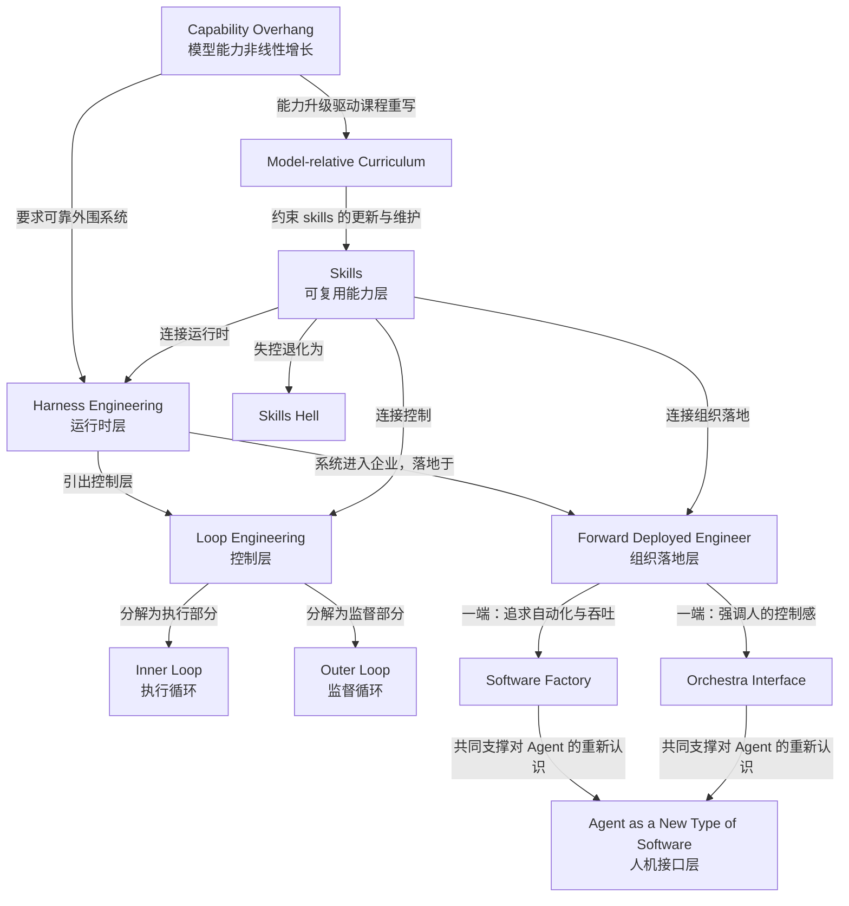

# 概念解析辞典

> 针对《2026 AI 工程五大趋势：从模型能力转向可靠系统》（Latent.Space，据材料提供原文 https://www.latent.space/p/aiewf26trends）的概念提取

## 一、核心概念

### 1. **Harness Engineering（Harness 工程）**

- **context**：

  > Harness 负责 workflow、context、permissions、evaluation、persistent state 与 continuous improvement。模型能力只是系统的一部分，可靠交付来自外围结构。

- **费曼一下**：Harness 是本文的核心概念，指模型运行所需的整个外围基础设施——工作流编排、上下文管理、权限边界、评估体系、持久化状态和持续改进机制。2026 年的重心转移正体现在这里：模型本身再强也不能单独交付可靠结果，真正决定 Agent 能否在生产环境长期稳定工作的，是这些外围结构。它相当于“发动机之外的整台车”——方向盘、刹车、仪表盘和车架。

### 2. **Capability Overhang（能力非线性增长）**

- **context**：

  > Anthropic 的 Thariq Shihipar 说“models are grown, not designed”，能力会 spiky 地增长。正因为前沿公司也不能完全预测模型变化，外部评估、监控和控制系统更重要。

- **费曼一下**：这个概念解释了为什么要建 Harness。模型能力不是按设计蓝图线性增加的，而是像生物生长一样不可预测地“尖峰式”冒出，连前沿公司自己都无法完全预知。这种不可预测性决定了不能只依赖模型内部能力——正因为没人知道能力何时以何种方式增长，外部评估、监控和控制系统才成为必须。

### 3. **Inner Loop（内部执行循环）**

- **context**：

  > Inner loop 由 Agent 与用户或环境交互并执行主要工作；outer loop 研究、维护和改进这个执行系统。

- **费曼一下**：Inner loop 是 Agent 完成实际任务的循环——与用户、代码、工具交互，接收任务、执行、测试、修正。它是系统里追求执行速度和自治的那一层，可以在较少人工干预下长时间运行。理解本文控制机制的关键在于：inner loop 不是全部，它必须被 outer loop 监督。

### 4. **Outer Loop（外部监督循环）**

- **context**：

  > Addy Osmani 概括为：“agents can run much more of the inner execution loop, but that outer loop is still engineering。”

- **费曼一下**：Outer loop 是研究、维护和改进执行系统的循环，汇集反馈信号、evals 和 human input，由人设定方向和做重要决定。它不亲自执行每个任务，却决定整个系统往哪里改、哪里该刹车。这句话的意思是：Agent 可以接管大量执行工作，但 outer loop 依然是工程——人的工程判断没有被自动化取代。

### 5. **Loop Engineering（循环工程）**

- **context**：

  > 因此 loop engineering 是对自治的新约束方法：不是把 Agent 锁死，而是让它能跑，同时保留可观测、可评估和可纠偏的边界。

- **费曼一下**：Loop engineering 是把 inner 和 outer 两层循环设计成可反馈、可纠偏系统的工程实践。它回答了“非确定性 Agent 怎么被控制”的问题：传统确定性控制循环套用不了，因为 Agent 的输出分布、工具调用和能力边界会随模型变化而变化。于是人设计反馈信号、失败检测、终止条件、升级路径和人工检查点，让 Agent 自治地跑，但始终在可观测和可干预的边界内。

### 6. **Forward Deployed Engineer（前沿部署工程师，FDE）**

- **context**：

  > FDE 不只是部署模型，而是与组织共同实现 integrations、cloud agents、long-running agents、automations 和基于 SDK 的应用。

- **费曼一下**：FDE 是 AI 进入企业落地的关键角色——不是交付软件就走的供应商，而是驻场与客户组织一起把 Agent 接入真实业务流程的人。成功标准是 strict ROI：FDE 离开后，客户不会关闭系统。技术可用只是前提，组织治理、信任和变革条件才是落地成败的决定因素。FDE 因此成为技术与组织之间的翻译者。

### 7. **Software Factory（软件工厂）**

- **context**：

  > “Software factory”描述长时间运行的 Agent 覆盖软件生命周期。企业必须选择自动化哪些 repository 和环节，以及在 code review、高风险变更等位置何时引入人。

- **费曼一下**：Software factory 是组织落地的一种形态或比喻，强调自动化、吞吐和标准流程——Agent 团队像工厂生产线一样持续覆盖软件生命周期。但关键不在完全自动化，而在“选择自动化边界”：哪些代码库、哪些环节全自动，哪些高风险变更必须人工审批。这是企业部署时必须自己回答的治理问题。

### 8. **Orchestra Interface（乐团指挥界面）**

- **context**：

  > Conductor CEO Charlie Holtz 更偏爱 orchestra 比喻，希望人站在乐团前挥动指挥棒，而不是被工厂流程隔离。

- **费曼一下**：Orchestra 是与 factory 相对的设计价值。它强调人不是被工厂流程隔离的监控者，而是站在乐团前设定方向、协调多个 Agent、保有创造控制感的指挥。这个比喻抓住了好的开发体验的核心：人能实时感知和干预，感到“in the flow”，而不是面对一个看不见过程的自动化黑箱。Factory 与 orchestra 代表着自动化吞吐与人类控制感之间的设计张力。

### 9. **Agent as a New Type of Software（Agent 作为新型软件）**

- **context**：

  > Vercel 的 Andrew Qu 称 Agent 是“a new type of software”：基础设施可能像 web app，但 interaction、interface 和 outputs 更动态、更不可预测。

- **费曼一下**：这个表述重新定义了软件工程的认知框架。传统软件像固定售货机，输入输出规则可预测；Agent 则像能临场处理任务的员工，交互和输出是动态的。因此需要新的基础设施——secure code execution、sandbox、long-running jobs。它是理解“软件工程为什么需要围绕非确定性智能组件重新组织”的观念基础，也是 coding agent 取代 IDE 成为开发者接口的前提。

### 10. **Skills（技能包）**

- **context**：

  > Vercel 的 Andrew Qu 称 skills 是“portable, on-demand knowledge”；Roland Gavrilescu 认为行业已从 agent tools 转向 agent skills。

- **费曼一下**：Skills 是 2026 年 Agent 平台的共同原语，把资深工程师的 workflows、quality gates 和 best practices 编码成可移植文件（如 Markdown）。它不只告诉 Agent 知识，还规定操作顺序和验收标准。Skills 对平台的意义在于提供组织记忆和可复用流程层，使能力可以跨 Agent 移植；但它不是一次性写成的 prompt 文档，需要像代码一样被维护。

### 11. **Skills Hell（技能地狱）**

- **context**：

  > Matt Pocock 把管理混乱称为 “skills hell”，类比 framework hell，并建议写更少、更小的 skills，投入更多结构设计。

- **费曼一下**：Skills Hell 是 skills 的失败模式：数量膨胀、结构混乱、相互冲突或长期不维护，最终降低 Agent 可靠性。这是本文对 skills 趋势的审慎提醒——skills 提供 structure，但结构本身也需要纪律约束，而不是堆积更多文件。与 framework hell 的类比说明：可复用层的治理成本和它的好处一样真实。

### 12. **Model-relative Curriculum（模型相对课程）**

- **context**：

  > 新模型发布后，Agent 像从初中升入高中，原 curriculum 需要重写。Skill 必须随模型能力、工具和工作流共同迭代，旧 scaffold 可能限制新能力。

- **费曼一下**：这个概念给 skills 加了一个时间约束：skills 不是普适不变的，而是相对于特定模型能力水平的“课程”。模型能力像学生升学一样不可逆地升级后，旧课程的步骤和验收标准可能过时，甚至变成限制新能力的 scaffold。因此 skills 必须随模型一起迭代，而模型能力的不可预测升级（Capability Overhang）正是这种重写压力的根源。

## 二、概念架构图

**架构解析**：模型能力非线性增长（Capability Overhang）要求可靠外围系统（Harness Engineering），这是整个生产系统的运行时基础。Harness 内部引出控制层（Loop Engineering），将其分解为执行循环（Inner Loop）和监督循环（Outer Loop）。当这套系统进入企业，Forward Deployed Engineer 将其落地为两种形态：追求自动化的 Software Factory 与强调人类控制感的 Orchestra Interface，二者共同支撑对 Agent 作为新型软件（Agent as a New Type of Software）的重新认识。Skills 作为可复用能力层横切连接运行时、控制和企业落地，但可能失控退化为 Skills Hell，并受制于模型相对课程（Model-relative Curriculum）随模型升级而重写。
