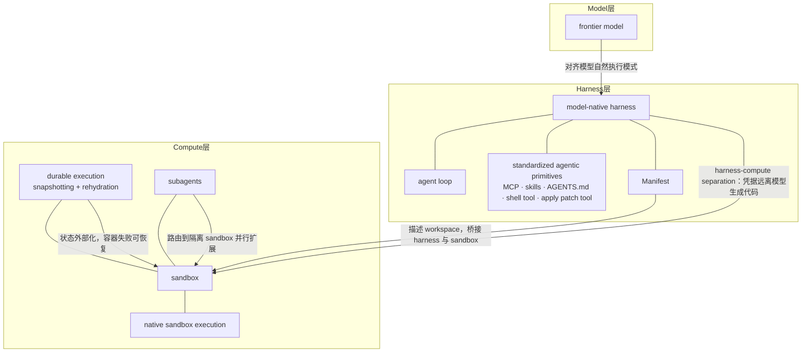

# 概念解析辞典

> 针对《The next evolution of the Agents SDK》（OpenAI）的概念提取

## 一、核心概念

### 1. **Agents SDK**

- **context**：

  > We’re introducing new capabilities to the Agents SDK that give developers standardized infrastructure that is easy to get started with and is built correctly for OpenAI models.

- **费曼一下**：OpenAI 提供给开发者的一套标准基础设施，用来搭建生产级 agent。它不是模型本身，也不是完整产品，而是支撑 agent 跑起来的“脚手架”。本文所有新能力都挂在它下面，是全文的讨论对象。

### 2. **harness（马具／执行架）**

- **context**：

  > A more capable harness for the agent loop… developers need systems that support how agents inspect files, run commands, write code, and keep working across many steps.

- **费曼一下**：包裹在模型外层的运行框架，决定模型如何循环、如何调用工具、如何读写文件、如何管理记忆。模型是“大脑”，harness 是“骸架和四肢”。本文把 harness 当作 agent 工程中独立于模型的一层来对待。

### 3. **model-native harness**

- **context**：

  > a model-native harness that lets agents work across files and tools on a computer… The harness also helps developers unlock more of a frontier model’s capability by aligning execution with the way those models perform best.

- **费曼一下**：专门为 OpenAI 这类前沿模型特性定制的 harness。与 model-agnostic 的通用框架相对，它不是牺牲模型能力换通用性，而是让执行方式与模型擅长的模式对齐，从而释放更多模型能力。这是本次更新的第一个核心创新。

### 4. **agent loop**

- **context**：

  > A more capable harness for the agent loop… developers need systems that support how agents inspect files, run commands, write code, and keep working across many steps.

- **费曼一下**：agent 的核心工作循环：感知现状→思考下一步→调用工具→观察结果→再思考，直到任务完成。harness 的主要职责就是让这个循环在长时间、多文件、多工具的复杂任务中稳定跑下去。理解 harness，必须理解它承载的是这个 loop。

### 5. **standardized agentic primitives（标准化 agentic primitives）**

- **context**：

  > These primitives include tool use via MCP, progressive disclosure via skills, custom instructions via AGENTS.md, code execution using the shell tool, and file edits using the apply patch tool.

- **费曼一下**：harness 内置的一组通用构件：通过 MCP 调工具、通过 skills 渐进式披露能力、通过 AGENTS.md 读取自定义指令、用 shell tool 执行代码、用 apply patch tool 编辑文件。它们正在成为前沿 agent 系统的通用底层，OpenAI 把它们内置，让开发者少花时间在核心基础设施上。

### 6. **native sandbox execution**

- **context**：

  > The updated Agents SDK supports sandbox execution natively, so agents can run in controlled computer environments with the files, tools, and dependencies they need for a task.

- **费曼一下**：SDK 自带沙箱执行能力，开发者不用自己拼执行层。agent 可以直接在受控计算机环境里读写文件、安装依赖、运行命令。这是本次更新的第二个核心创新。

### 7. **sandbox**

- **context**：

  > Many useful agents need a workspace where they can read and write files, install dependencies, run code, and use tools safely.

- **费曼一下**：给 agent 的隔离工作空间，相当于“临时办公室”。agent 在里面跑代码、调工具，不会弄坏宿主机。它是 compute 层的基本单位，也是安全边界所在。

### 8. **Manifest**

- **context**：

  > the SDK also introduces a Manifest abstraction for describing the agent’s workspace. Developers can mount local files, define output directories, and bring in data from storage providers…

- **费曼一下**：一份声明式的 workspace 配置：挂载本地文件、定义输出目录、从云存储拉数据。它给模型一个可预测的工作空间，也让环境能在不同沙箱 provider 之间移植。是 harness 告诉 sandbox“我要在你里面做什么”的契约。

### 9. **harness–compute separation**

- **context**：

  > Separating harness and compute helps keep credentials out of environments where model-generated code executes.

- **费曼一下**：把控制层（harness）与执行层（compute／sandbox）分开。凭据留在 harness 端，模型生成的代码只能在 sandbox 里跑，碰不到凭据。这一分离同时带来安全、持久、可扩展三个好处，是本文最深的架构哲学。

### 10. **prompt-injection & exfiltration**

- **context**：

  > Agent systems should be designed assuming prompt-injection and exfiltration attempts.

- **费曼一下**：两类必须默认存在的攻击。prompt-injection 是把恶意指令藏在 agent 读取的内容里，诱骗它做不该做的事；exfiltration 是把敏感数据悄悄运出去。harness 与 compute 分离，就是为了抬高这两类攻击的成本。

### 11. **durable execution**

- **context**：

  > When the agent’s state is externalized, losing a sandbox container does not mean losing the run. With built-in snapshotting and rehydration, the Agents SDK can restore the agent’s state in a fresh container and continue from the last checkpoint if the original environment fails or expires.

- **费曼一下**：长任务不会因为容器挂了而前功尽弃。agent 状态存在外部，环境失败或过期后，可以开新容器从上一个检查点继续，而不是从头再来。这是持久性目标。

### 12. **snapshotting + rehydration**

- **context**：

  > With built-in snapshotting and rehydration, the Agents SDK can restore the agent’s state in a fresh container and continue from the last checkpoint…

- **费曼一下**：实现 durable execution 的具体机制。snapshotting 把 agent 状态存到外部，rehydration 在新容器里把状态注入回去。类似游戏存档与读档。这个机制让“容器丢失”不再等于“run 丢失”。

### 13. **subagents**

- **context**：

  > route subagents to isolated environments… We’re also working to bring additional agent capabilities, including code mode and subagents…

- **费曼一下**：主 agent 派生的子 agent，可被路由到隔离的沙箱环境。它们让一个 agent run 可以横跨多个容器、并行执行，是 scale-out 的关键。每个 subagent 相当于项目经理分派出去的专家小组。

### 14. **turnkey yet flexible**

- **context**：

  > Developers get a harness that’s turnkey yet flexible—making it easy to adapt it to their own stack

- **费曼一下**：SDK 的设计哲学：即开即用，但每个环节都可以替换适配。默认配置能跑，开发者可以自定义 tool use、memory、sandbox environment。它界定了 SDK 的灵活性边界——不是黑盒产品，也不是纯框架。

## 二、概念架构图

