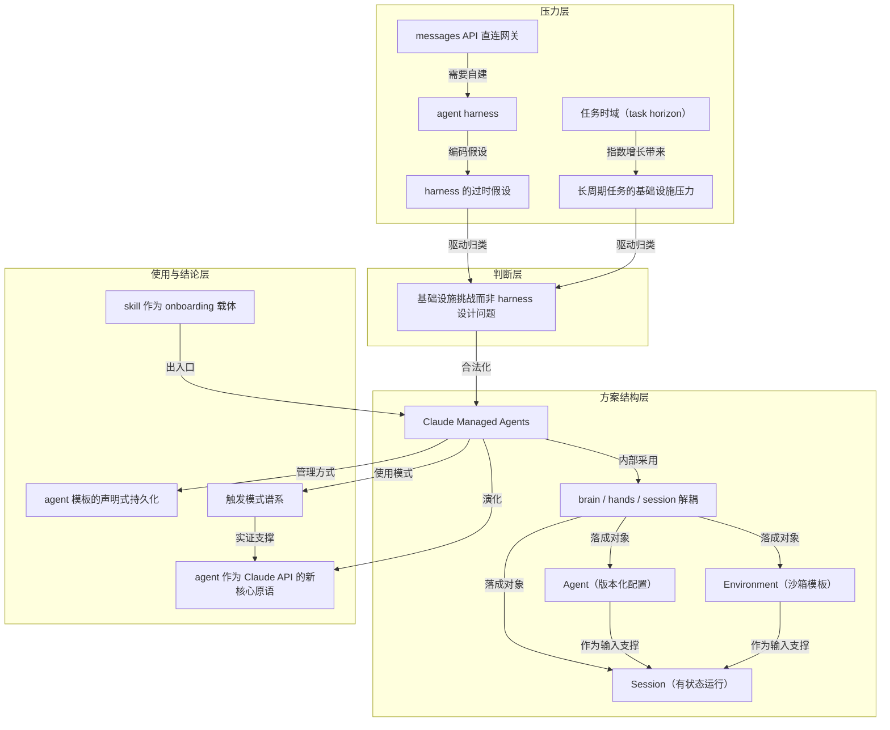

```markdown
# 概念解析辞典

> 针对《Anthropic 干脆把 harness 托管了：Claude Managed Agents 的设计取舍》（来源：martinfowler.com；原推作者 Lance Martin，如材料提供）的概念提取

## 一、核心概念

### 1. **Claude Managed Agents**

- **context**：
  > Claude Managed Agents 是一套预置、可配置的 agent harness，跑在托管的基础设施上：你把 agent 定义成一个模板（模型、system prompt、工具、skills、文件与仓库），harness 和 infra 由 Anthropic 提供。

- **费曼一下**：这是全文的主题对象。它把过去开发者自己搭的“harness 加基础设施”打包成托管服务，用户只负责定义 agent 模板，平台接管运行与维护。它解决的是“harness 跟不上模型”和“长时间任务扛不住”这两个难题；没有它，后文的“新核心原语”就无处落地。

### 2. **agent harness**

- **context**：
  > 基于它构建 agent，就必须自己补上一层 harness——把 Claude 的 tool call 路由到 handler，并管理 context。

- **费曼一下**：harness 是套在模型外面的执行层，决定模型能碰哪些工具、如何路由调用、上下文怎么管理。在本文里，它是问题对象：开发者长期要自己维护这一层，而它又天然会束缚模型。理解 harness 是本篇后续“托管”“解耦”论述的前提。

### 3. **messages API 直连网关**

- **context**：
  > messages API 是通往模型的直连网关（a direct gateway to the model）：接收 messages，返回 content blocks。

- **费曼一下**：这是把模型能力暴露出来的底层接口，只做一问一答。正因为它是“直接网关”，不包含任何 agent 逻辑，所以开发者必须在上面自己垫一层 harness。这个概念解释了“为什么需要 harness”以及压力从何而来。

### 4. **harness 的过时假设**

- **context**：
  > agent harness 编码的是「关于 Claude 做不到什么」的假设。模型变强，这些假设就变陈旧，反过来成为 Claude 表现的瓶颈（bottleneck），于是 harness 必须被持续更新才能跟上模型。

- **费曼一下**：它点出了 harness 的本质：不是稳定工具，而是一份“模型当前短板”的拓印。模型进步后，这些为旧短板写的逻辑会变成新瓶颈。这是第一条压力支流，直接导向“harness 不能再由开发者死扛”的判断。

### 5. **任务时域（task horizon）**

- **context**：
  > 任务时域（task horizon）正在指数级增长，在 METR benchmark 上已经超过 10 个人类小时。
  >
  > 作者预期未来的 Claude 会在人类最重大的挑战上连续运行数天、数周乃至数月。

- **费曼一下**：它衡量一个 agent 能连续自主工作多久而不脱轨。这个概念把讨论从“单次问答能力”拉到“长时间执行能力”，是第二条压力支流的起点：任务时域一变长，问题就不再是模型本身，而是周围设施。

### 6. **长周期任务的基础设施压力**

- **context**：
  > 运行时间一长，压力就从模型转移到 agent 周围的基础设施：要安全、要扛得住长任务期间必然发生的基础设施故障、要能扩展（例如支撑很多个 agent 团队）。

- **费曼一下**：这个概念说明，当任务跑几天甚至几个月时，瓶颈从模型质量转向系统可靠性、安全与扩展性。它解释了为什么“托管基础设施”而不是“更好的 harness”才是关键——长任务条件下，基础设施能力成为决定性约束。

### 7. **Agent（版本化配置）**

- **context**：
  > Agent：一份版本化的配置（a versioned config），承载 agent 的身份——模型、system prompt、工具、skills、MCP servers 等。创建一次，之后按 ID 引用。

- **费曼一下**：在这套产品模型里，Agent 不是一次执行，而是一份可复用、可追踪的配置。它是“身份证明”而非“正在干活的人”。这个区分让 agent 可以被版本化、进 git、按 ID 管理，为声明式持久化打基础。

### 8. **Environment（沙箱模板）**

- **context**：
  > Environment：一份模板，描述如何 provision agent 的工具所运行的沙箱——runtime 类型、网络策略、包配置。

- **费曼一下**：Environment 是“工位标准”，定义运行时、网络和包依赖。每次执行都按这个模板新拉起沙箱，因此执行环境可重复、可替换。它是把“hands”抽象落到产品对象的关键一环。

### 9. **Session（有状态运行）**

- **context**：
  > Session：一次有状态的运行（a stateful run），使用已创建好的 agent 配置与 environment。它从 environment 模板拉起一个全新沙箱，挂载单次运行所需的资源（文件、GitHub 仓库），并把认证信息存进安全 vault（例如 MCP 凭证）。
  >
  > 一个 agent 可以有很多 session。

- **费曼一下**：Session 是“某一次具体执行”。配置和环境模板被前置固化，Session 只管本次运行的状态、资源和凭据。它体现了“可复用部分”与“一次性部分”的分离，也让“一个 agent 可重复运行多次”成为自然结果。

### 10. **brain / hands / session 解耦**

- **context**：
  > 把 brain（Claude 及其 harness）从 hands（执行动作的沙箱与工具）和 session（会话事件的日志）中分离出来。每一部分都成为一个「对其余部分假设极少」的接口，因此可以各自失败、各自被替换。

- **费曼一下**：这是全文最核心的设计取舍。作者没有去设计“某一种正确 harness”，而是把大脑、双手、日志拆成三个几乎互不依赖的部件，让它们能独立失败和替换。可靠性、安全和未来灵活性都来自这个拒绝“押注单一实现”的动作。

### 11. **基础设施挑战而非 harness 设计问题**

- **context**：
  > 让 agent 随 Claude 的智能一起扩展，是一个基础设施挑战（infrastructure challenge），而不严格是 harness 设计问题。
  >
  > building agents to scale with Claude's intelligence is an infrastructure challenge, not strictly a matter of harness design

- **费曼一下**：这是全文的枢纽判断。它把问题从“怎么写好一个程序”重新归为“怎么建好一座工厂”。正是这一步归类，使“托管一整套基础设施”成为合理回应，而不是“再开源一个更好的 harness”。没有它，后面的产品路线就缺少合法性。

### 12. **触发模式谱系**

- **context**：
  > 事件触发（Event-triggered）：由某个服务触发 Managed Agent 干活。例如系统标记出一个 bug，managed agent 写好补丁并开 PR——从「标记」到「动作」之间没有人类在环。
  >
  > 作者认为这是 Managed Agents 特别有用的领域。

- **费曼一下**：四种使用模式——事件触发、定时、触发即走、长周期——按“谁按下开始键、要跑多久”给 agent 分类。这个谱系展示了 agent 已经不是开发者的手工工具，而是可以被外部系统调度的一等公民，支撑“agent 成为新原语”的结论。

### 13. **agent 模板的声明式持久化**

- **context**：
  > agent 模板是持久的，你可以把它存成一份 YAML（模型、system prompt、工具、MCP servers、skills）放进 git，再让 CLI 在部署流水线里 apply。

- **费曼一下**：它把 agent 配置当基础设施代码管理：版本化、进仓库、走部署流水线。这种“声明式持久化”让 agent 不再是散落在本地脚本里的东西，而是可以审计、回滚、协作的工程对象，是“新核心原语”在工程实践上的体现。

### 14. **skill 作为 onboarding 载体**

- **context**：
  > 最省事的入门路径是开源的 claude-api skill，在 Claude Code 里开箱即用：升级到最新版 Claude Code，跑对应子命令就能完成 Managed Agents 的 onboarding。作者特别提到，他很看好把 skill 当作新功能的 onboarding 方式，自己也大量使用。

- **费曼一下**：新功能的“说明书”不再是给人看的文档，而是给 agent 读的技能包。用户只要说想用，agent 自己完成接线。这个概念是进入 Managed Agents 系统的入口，不是产品核心结构，但体现了作者对 skill 这一载体的重视。

### 15. **agent 作为 Claude API 的新核心原语**

- **context**：
  > Claude Managed Agents 把 agent harness 和基础设施一起替你接管，让人可以在「agent 作为 Claude API 的一个新核心原语」之上做探索。
  >
  > agent 成为 Claude API 的新核心原语

- **费曼一下**：以前的 API 最小积木是一次对话；现在最小积木变成一个能自己干活的 agent。这意味着开发者的主战场从“追赶模型能力、维护 harness”上移到“多 agent 编排”和“应该把什么交给 agent 做”。这是全文的结论落点。

## 二、概念架构图


