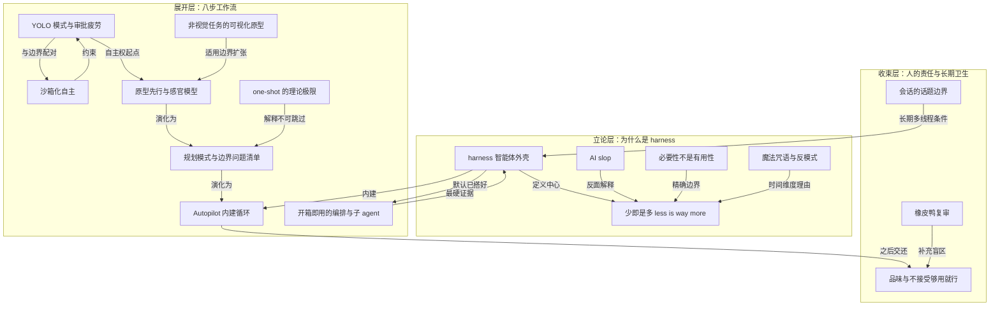

# 概念解析辞典

> 针对《GitHub：决定 AI 编码效果的是 harness，不是你换了哪个工具》（github.blog｜作者：GitHub）的概念提取

## 一、核心概念

### 1. **harness（智能体外壳）**

- **context**：全文的中心词。作者把它与 GitHub Copilot 互换使用，让焦点从附加件回到包裹模型的执行环境本身。

  > “我把 harness 与 GitHub Copilot 互换使用……GitHub Copilot 就是一个 agent harness。”

- **费曼一下**：模型是发动机，harness 是整辆车：模式切换、权限策略、内建循环、编排和子 agent 都住在这里。你换发动机能提速，但决定你能不能顺利到达的，是你会不会开这辆车。

### 2. **少即是多（less is way more）**

- **context**：作者每天与 AI 工作后的判断。安装、配置、诱导 agent 的花活很有意思，但终究像 gimmick；真正的提升来自对 harness 的使用和理解。

  > “less is way more”

  > “很有意思，但归根到底像 gimmick”

  > “how I use the harness and how well I understand it”

- **费曼一下**：工具的新鲜感冒充了进步，所以少而深通常打败多而浅。把基础动作练到位，比不停换器械更能带来真实增益。

### 3. **AI slop**

- **context**：作者用来解释信息噪声来源的概念。生成一个 skill 的成本很低，验证它是否可用的成本却没有同步降低。

  > “让 agent 随便造一个 skill，它会欣然照办”

  > “那个 skill 到底能不能用不重要，照样可以发布到各种 skill / MCP registry”

- **费曼一下**：看起来像成品、其实没人验证过的东西会大量出现。于是判断力比获取力更值钱，信息流里的丰饶不等于价值的丰饶。

### 4. **必要性不是有用性**

- **context**：作者主动划出的边界。不是说永远不需要 skill、MCP、指令、自定义 agent；它们在做复杂工作流和团队自动化时很重要。真正的主张是必要性，不是有用性。

  > “真正的主张是必要性问题，不是有用性问题：要用 AI 取得高效成果，这些都不是必需品。”

- **费曼一下**：有用和必需是两回事。skill 可以是加速器，但不是入场券。这个边界防止把文章误读成反 skill。

### 5. **YOLO 模式与审批疲劳**

- **context**：工作流第二步。YOLO 模式让 agent 无需逐次请求许可即可执行命令；反过来，逐条审批不仅低效，还会训练人不读就批，让审批本身失去意义。

  > “YOLO 模式也叫「Allow All」，让 agent 无需逐次请求许可即可执行任何命令；多数工具里就是在聊天中输入 /allow-all。”

  > “反复点「Approve」会把你训练成不读就批，反而让审批本身失去意义。”

- **费曼一下**：你雇了助理，却要求他每拧一颗螺丝都先举手报告，那你自己拧还快些。自主权是让委托成立的前提；审批疲劳则让安全机制只剩心理安慰。

### 6. **沙箱化自主**

- **context**：与 YOLO 模式成对出现的约束。作者明确说不要在本地机器上跑 YOLO，尤其在公司环境里，数据在组织系统上，出错代价高。

  > “When using YOLO mode, you don't want to run the agent on your local machine”

  > “别在本地机器上跑 YOLO。”

  > “上手最简单的沙箱选项是 GitHub Codespaces 或 development containers。”

- **费曼一下**：给 agent 自由，但把自由圈在一间可以随时推倒重建的房间里。爆炸半径可控，你才敢真正撒手。

### 7. **原型先行与感官模型**

- **context**：工作流第三步。历史上原型是一个完整阶段、常常是奢侈品，现在一个提示词就能做出来。作者从多个日期选择器变体里看见年视图方案，才确定自己真正想要的交互。

  > “AI 最神奇的地方之一，是你可以在前期轻易把任何东西原型化。”

  > “这类东西你不看见就想不到”

  > “As humans, we process sensory-rich models like images, shapes, and tangible layouts much faster than dense text”

- **费曼一下**：你不是在做作品，是在做一堆廉价的问题探测器。人处理图像、形状和可触布局远快于处理密集文本，所以低成本原型能把没意识到的选项和约束提前摊在桌面上。

### 8. **非视觉任务的可视化原型**

- **context**：作者把原型法推广到看似不需要图的场景。要加一个 API 端点，他仍先让 agent 做出五种实现方案并排比较，再进入实现。

  > “Create a visual mockup of the API for this project. Add five options for how we could handle a new API endpoint that allows the user to download their analytics data.”

- **费曼一下**：接口设计、数据流、状态机本质上都是结构，结构就适合被画出来。所谓这事不视觉，往往只是没人试过把它画出来。

### 9. **规划模式与边界问题清单**

- **context**：工作流第四步。不新开会话直接切到 plan 模式，让模型把手工实现时迟早要回答的问题提前问出来。重点不是照单全收 AI 的建议，而是让人的专业判断深度介入。

  > “规划这一步就是为此存在的”

  > “规划让你逼近这个理想”

  > “重点不是照单全收 AI 的建议——那样就抵消了规划的价值——而是让你深度介入问题、引导模型，你的专业判断在这里发挥作用。”

- **费曼一下**：规划不是写文档，是提前触发争吵。起止日期能否相同、部分选择是否有效、能否清空、今天是否常驻、是否允许手输与粘贴，这些问题没提前问完，就会在实现阶段以返工的形式收利息。

### 10. **one-shot 的理论极限**

- **context**：作者对完美提示词的清醒判断。理论上，完美的提示词、完美的上下文、完美的顺序可以让模型一次成型；实践中没人做得到，规划的意义正是逼近这个理想。

  > “理论上你可以用完美的提示词、完美的上下文、完美的顺序让模型一次成型（one-shot）。「理论上。」但没人做得到。”

- **费曼一下**：完美提示词是个存在但够不着的点。承认够不着，就会把力气从找咒语转到搭流程上，后者才是可复制的。

### 11. **Autopilot：内建循环**

- **context**：工作流第五步。计划完成后，Copilot 提示切换到 Autopilot。它强制模型持续工作，确保模型真的完成它声称要做的事。

  > “Autopilot 是一个内建的循环：它强制模型持续工作，确保模型真的做完了它声称要做的事——在这里就是计划中的每一项。”

- **费曼一下**：模型天生倾向于说完就算做完。内建循环相当于在它身上装了一条验收流水线：没做完，就别想下班。

### 12. **开箱即用的编排与子 agent**

- **context**：Autopilot 阶段，GitHub Copilot 自动充当 orchestrator：读代码库文件用小模型的 Explore 子 agent，判断动作复杂时用大模型的 General Purpose 子 agent。虽然自定义 agent 和指令能提供细粒度控制，但什么都不做也能拿到好处。

  > “虽然你可以用自定义 agent 和自定义指令获得对编排的细粒度控制，但你什么都不用做也能拿到子 agent 与多模型工作流的好处——它开箱即用，哪怕你根本不知道这些东西存在。”

- **费曼一下**：这是全文最硬的一块证据。你以为要自己搭的多智能体架构，harness 已经默认替你搭好了；不知道它存在，你照样在享受它。

### 13. **品味与不接受够用就行**

- **context**：人工评审与迭代阶段的纪律。作者拿到的初版有一串问题，他强调这部分仍然是人的责任，分辨优质与平庸正是人带来的价值。

  > “The most important thing is not to settle for AI output that is *good enough*. Insist on quality. Be ruthless about it.”

  > “这部分仍然是你的责任”

- **费曼一下**：AI 把做出来变便宜了，于是值不值得做成这样成了唯一稀缺的判断。你的品味不再是装饰，它成了产品质量的最后一道闸门。

### 14. **橡皮鸭复审**

- **context**：工作流第七步。Copilot 会向另一个 AI 家族的模型请求评审，作者当时用 GPT 5.6 Terra，它就去请了 Sonnet。原理是不同模型训练数据不同，盲区也不同。

  > “GitHub Copilot 会向另一个 AI 家族的模型请求评审。”

  > “不同模型训练数据不同，因而盲区不同；橡皮鸭复审能发现单一模型会漏掉的问题。”

- **费曼一下**：找同一个人复查自己的作业没用，他会犯一样的错。换一个受过不同训练的人来看，才可能照见你看不见的角落。它能用在原型、计划或成品上，也能与 Autopilot 组成循环。

### 15. **会话的话题边界**

- **context**：收工阶段的会话卫生建议。接下来做与本功能无关的事，就开新的聊天会话；会话被看成有话题性的。

  > “把会话看成有话题性的；一旦开始明显偏离主题，就该换新会话了。”

- **费曼一下**：会话像一张桌子，堆得越杂越难找东西。定期收桌子不是洁癖，是让每次协作都从干净的台面开始，也让多线程推理变得可能。

### 16. **今天的魔法咒语，明天的反模式**

- **context**：全文的元判断，落在结语。它给少即是多提供了时间维度的最强理由：在一个所有人都在现学的领域，技巧的半衰期短于理解的半衰期。

  > “nobody really knows what they are doing right now. We're all figuring this out as we go. A lot of what is today's magical incantation for AI will be tomorrow's anti-pattern.”

- **费曼一下**：追逐技巧的半衰期极短，理解底层机制的半衰期才长。这就是为什么押注 harness 比押注咒语划算。

## 二、概念架构图

