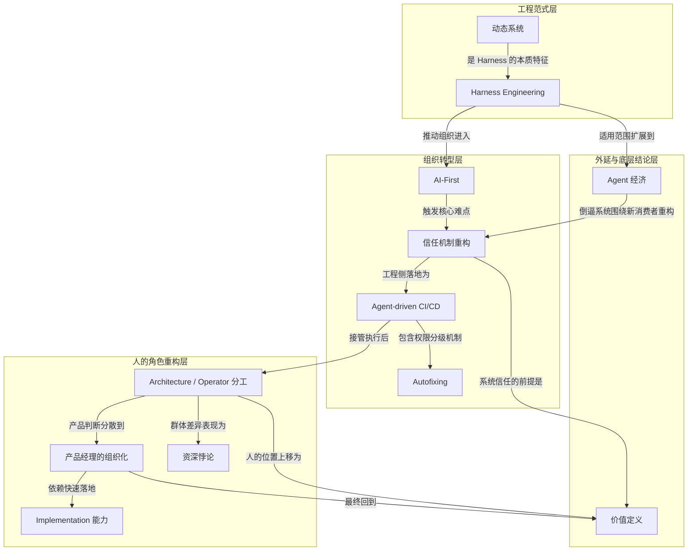

# 概念解析辞典

> 针对《Harness Engineering：AI-First 组织的信任机制重构》（硅谷101播客）的概念提取

## 一、核心概念

### 1. **Harness Engineering（Harness 工程）**

- **context**：

  > 播客把过去几年的大模型工程演进分成三段：2023 年是 Prompt Engineering，重点是怎样写好提示词；2024 年是 Context Engineering，重点是怎样给模型提供更完整的上下文；到 2026 年，硅谷开始讨论 Harness Engineering。

  > Harness 的对象不只是模型本身，而是围绕模型建立一套系统。Peter 强调，它包括基建、tooling、安全保障、sandbox 与 host service 的交互、启动时间、latency，以及系统如何持续 improve。

  > Prompt 和 Context 更像静态优化：把一个任务喂给模型，让它在一次或少数几次交互中表现更好。Harness 则是动态系统：让 Agent 在真实世界里长时间工作、使用工具、吸收信号、发现错误并自我修复。

- **费曼一下**：Harness Engineering 是把大模型从"一次性回答器"升级为"可持续运行的动态系统"的工程范式。它不再优化模型单次表现，而是搭建模型周围的一整套基础设施：工具、安全边界、沙箱、反馈回路、自修复机制。它的失败通常不是"模型不聪明"，而是"系统没有给模型足够的护栏和反馈回路"。理解这个概念，就理解了为什么作者说"不要只把 AI 当成一个智能，要把它当成一个系统"。

### 2. **AI-First（AI 优先）**

- **context**：

  > Creao 对 AI-First 的定义很激进：不是每个工程师用 AI 写代码、每个 PM 用 AI 写 PRD、每个设计师用 AI 做图，而是围绕 AI 的能力重新设计公司的流程和组织形态。

  > 如果人仍是工具使用者，效率提升有上限，因为人的时间和对齐能力有上限。Kai 直接指出，如果想让效率提升 100 倍、1000 倍，AI 就不能只是助手，而要成为生产力的主导。

- **费曼一下**：AI-First 的核心区分是"谁在主导生产力"。如果人仍拿着 AI 当工具，人的时间和对齐能力就是瓶颈；只有当 AI 成为生产力主导、人退到定义需求与审核结果的位置，效率才可能跃迁百倍千倍。这个概念是全文组织转型的靶心——不是"用 AI 提效"，而是"围绕 AI 重构流程与组织"。

### 3. **信任机制重构（Trust Mechanism Restructuring）**

- **context**：

  > 真正的组织难点在"信任"。团队需要从信任人，转向信任一套 AI 驱动的系统；这要求 guardrails、验证机制、反馈链路和共同的工作方式，否则任何成员觉得"不如人做"，转型都会被拖慢。

- **费曼一下**：AI-First 最难的不是技术，而是组织成员愿不愿意把任务交给一套系统。以前信任的是"某个员工能把事情做好"，现在要信任的是"一套由护栏、测试、日志、review 和权限边界组成的系统能把事情做好"。这个概念是组织转型的承重墙：没有它，AI 能力再强也无法在组织内落地。

### 4. **动态系统（Dynamic System）**

- **context**：

  > Prompt 和 Context 更像静态优化：把一个任务喂给模型，让它在一次或少数几次交互中表现更好。Harness 则是动态系统：让 Agent 在真实世界里长时间工作、使用工具、吸收信号、发现错误并自我修复。

  > 动态系统会持续吸收 marketing、product、infrastructure 等信号，并根据反馈快速迭代。

- **费曼一下**：动态系统是 Harness Engineering 的本质特征，用来与 Prompt/Context 的静态优化做区分。静态优化像一份写好的说明书，一次性把任务做完；动态系统像一个持续运转的工厂，吸收外部信号、发现错误、自我修正。这个概念解释了为什么 Harness 不是"更好的提示词"，而是"让 AI 在真实世界中持续工作"。

### 5. **Agent-driven CI/CD（代理驱动的持续集成与部署）**

- **context**：

  > Creao 构建了 Agent-driven CI/CD 和 Agent-driven bug triage。AI-driven integration test、unit test 和 Playwright 这类端到端测试，会在代码进入生产前拦截明显破坏产品的错误。

  > 代码上线后，系统继续读取 log、error、incident 等信号，反馈给 AI 判断代码质量。Bug 出现后，不同 Agent 可以并行识别前端、后端或 Agent 核心系统的问题，并在几分钟内分派任务。

  > Peter 给出的数量级是：发现一个 bug 可能只要 1 到 2 分钟，分配给工程师只要几秒，工程师再用 Agent investigate 并提出方案，整个 cycle 可以从过去的一周缩短到 1 到 2 小时。

- **费曼一下**：这是信任机制在工程侧的具体落地。传统 CI/CD 靠固定规则检查代码，Agent-driven CI/CD 让多个 AI 质检员并行看代码、看日志、看用户反馈，发现问题后在几分钟内分派任务。它支撑了"质量控制并行化"的说法，是理解"为什么开发周期能从六周压缩成一天"的关键工程机制。

### 6. **Autofixing（自动修复）**

- **context**：

  > 更进一步，50% 以上 issue 可以通过 autofixing 处理。如果改动只涉及风险较低目录，AI 自动提交 PR，人只需简单 review 即可上线；涉及安全或 Agent behavior 的敏感文件，才需要更深的人工审核。

- **费曼一下**：Autofixing 展示了系统信任的边界规则。在低风险目录，AI 修完自动提交 PR，人只做简单 review；在涉及安全或 Agent behavior 的敏感区域，必须深审。这个概念定义了"哪些地方 AI 可以自主、哪些地方必须人管"，是理解整套信任机制边界的关键——信任不是无差别的，而是按风险分级。

### 7. **Architecture / Operator 分工（架构者与操作者的分工）**

- **context**：

  > Peter 把团队角色分为 Architecture 和 Operator：前者决定 Agent 系统的结构、sandbox 与 host 的交互、安全性和 latency；后者在系统中运行和处理具体任务。

  > 在传统条件下，搭一个 Agent 系统可能需要 10 到 20 人；在 AI 工作流下，一个 architecture 用一周就能完成框架。但这个效率成立的前提是架构师能识别 AI planning 的缺陷，能 challenge 方案，能让模型参考开源框架并修订计划。

- **费曼一下**：当执行被 AI 接管，人的价值从"写好代码"转向"设计系统与边界"。Architecture 负责决定系统结构、安全边界、sandbox 与 host 交互；Operator 在系统内处理具体运行任务。这个分工概念解释了 AI-First 下人的角色如何被重新定义——不是消失，而是上移到设计系统、识别 AI planning 缺陷、判断约束的位置。

### 8. **产品经理的组织化（Organizationalization of Product Management）**

- **context**：

  > 传统产品经理承担大量对齐成本：连接市场、研发、设计和管理层。Creao 的做法不是否定产品判断，而是把产品经理的职能拆解到工程团队和工程管理者身上。

  > 当开发成本大幅降低，谁能定义需求方向、谁能快速把想法变成产品，谁就承担产品经理的一部分职责。产品角色从一个人变成团队共同具备的能力。

- **费曼一下**：传统 PM 的职能是"传话、排优先级、定义需求"，这个职能的核心是降低对齐成本。当 AI 让开发成本极低，谁能快速落地想法，产品判断就分布到谁身上。因此 PM 不会消失，而是从单一岗位变成一种组织功能——每个人和 AI 流程都要具备产品判断力。

### 9. **Implementation 能力（落地实现能力）**

- **context**：

  > Peter 也补充说，工程师、产品经理、设计师都需要 implementation 能力，因为当交流成本大于落地成本，传统交接流程就显得低效。

- **费曼一下**：在 AI 环境下，想法若不借助 AI 快速做成产品，层层转交的传统流程就会成为瓶颈。Implementation 能力指"把 idea 在一两个小时内带到产品中"的能力，是产品判断可以分散到团队的前提。没有这个能力，产品经理的组织化就无从谈起。

### 10. **Agent 经济（Agent Economy）**

- **context**：

  > Clark 提出一个重要外延：未来很多工作结果的消费者不一定是人，而可能是 Agent。营销素材、网页、任务管理产品甚至 SaaS Dashboard，都可能先被 Agent 阅读、筛选和调用。

  > 这会改变内容与产品的评价标准。一个人类审美上不够好的 go-to-market asset，如果被 Agent 读取后带来更好的数据反馈，可能就是更有效的资产。问题不再是"人觉得好不好"，而是"真正的消费者是谁，它如何判断价值"。

- **费曼一下**：Harness 的范围不只针对工程师。如果内容与产品的第一读者变成 Agent，系统就必须围绕"Agent 如何读取、判断、调用"来设计反馈标准。这个概念把 Harness 从工程概念扩展为一种面向消费者、反馈信号和系统边界的设计方式——它反过来决定了"系统应该优化什么"。

### 11. **价值定义（Value Definition）**

- **context**：

  > Clark 的表达更简洁：人未来的价值是判断任何事情是否还有价值。价值定义延伸出需求定义；当我们知道自己想要什么，才能判断 AI 做出来的东西是否值得。

  > 因此，这期内容的底层结论是：AI-First 并不是把人移出系统，而是把人放到更高层的判断位置。执行权交给 AI，价值判断、系统约束和最终审核仍然属于人。

- **费曼一下**：这是全文的最终落脚点。AI 可以主导执行、迭代、修复，但它不知道"什么值得做"。人的核心价值收敛为：定义需求方向、判断结果是否符合利益与伦理、审核最终产出。这个概念回答了"当 AI 接管执行后，人还剩什么"这一根本问题，是整个概念网络的收束点。

### 12. **资深悖论（Seniority Paradox）**

- **context**：

  > Peter 的一个观察是：初级工程师往往比资深工程师更适应 AI-First 工作环境，因为他们技术债和思想束缚更少，更愿意把 scope 从写代码扩展到产品设计、数据分析和上线后的 impact 判断。

  > 资深工程师的问题不是能力不足，而是过去十年、二十年积累的 specialty 正在被 AI coding 稀释。一个后端、前端或 infra 专家如果仍只关心代码交付前的部分，会很难适应新的工作闭环。

  > 但资深工程师仍然不可替代。Peter 强调，真正稀缺的是能 embrace AI mindset、拥有架构能力、产品 sense 和 marketing knowledge 的资深工程师。

- **费曼一下**：经验在 AI-First 环境下同时是资产和包袱。初级工程师束缚少、更愿扩展 scope，反而适应更快；资深工程师的专业专长被 AI 稀释，若只守代码交付前的环节就难以适应。但真正能拥抱 AI mindset、把技术经验升级为架构判断与商业价值判断的资深工程师，反而更稀缺。这个概念解释了为什么组织转型在不同群体身上产生相反的压力。

## 二、概念架构图

图中关系均来自原文：动态系统是 Harness 区别于 Prompt/Context 的本质特征；Harness 推动组织进入 AI-First；AI-First 触发信任机制重构；Agent-driven CI/CD 与 Autofixing 是信任机制在工程侧的具体实现；执行被 AI 接管后人的角色重构为 Architecture/Operator 分工；产品经理的组织化依赖 Implementation 能力；资深悖论是角色重构在不同群体身上的差异化表现；Agent 经济扩展 Harness 适用范围并倒逼系统围绕新消费者重构；最终所有角色重构与系统信任都回到价值定义——执行权交给 AI，价值判断、系统约束和最终审核仍然属于人。
