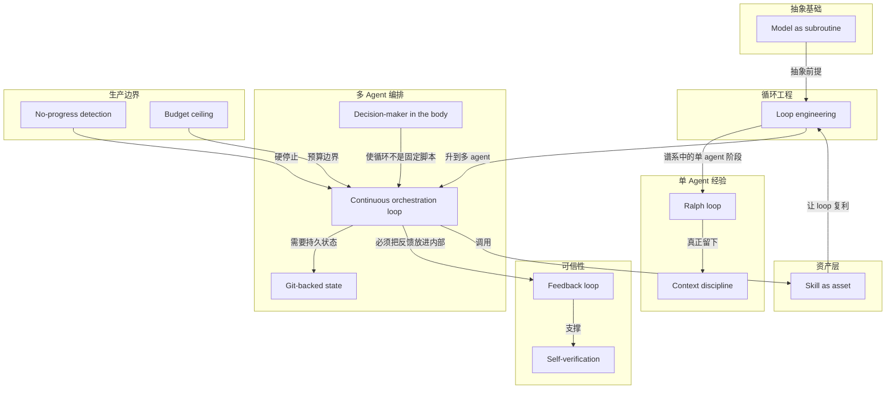

# 概念解析辞典

> 针对《一次关于 Loop 的工程争论》（来源：x.com｜作者：Matt Van Horn）的概念提取

## 一、核心概念

### 1. **Loop engineering**

- **context**：文章围绕 Peter Steinberger 的说法展开。

  > 工程师不应再只是 prompt coding agents，而应设计会 prompt agents 的 loops。
  > Loop engineering 指的不是把 prompt 写得更漂亮，而是写一个能提示、读取、判断、重试、调度和停止的程序结构。

- **费曼一下**：在这篇文章里，loop engineering 不是把 prompt 写得更花哨，而是写一个会自动提示 agent 的程序。这个程序负责读取结果、判断有没有完成、没完成就再来一轮，还要能调度和停止。它是全文的中心转向：工程师从循环里面的操作者，变成循环外面的作者。

### 2. **Model as subroutine**

- **context**：

  > 在这个结构里，人类不再是循环里的操作者，而是循环的作者；模型不再是对话对象，而是系统中的一个 subroutine。

- **费曼一下**：模型不再是你聊天窗口里的对象，而像代码里的一个函数。loop 在需要判断或生成时才调用它，调用完再根据返回结果继续执行。这个变化解释了为什么人类的位置会从“发 prompt 的人”变成“写 loop 的人”。

### 3. **Continuous orchestration loop**

- **context**：

  > 它不是 ralph 或 goal 这种单 agent 循环，而更像一种持续编排 loop，负责监督其他线程或 agents。
  > loop 成为工作单元，而不是单次任务；loop 可以并发监督其他 loops；调度替代人类 kickoff；git-backed state 和 crash recovery 让它能在基础设施时间里持续运行。

- **费曼一下**：这是 Steinberger 和 Boris 所说的新 loop：它不只是一个 agent 反复做同一件事，而是像一个调度室，管理其他 agents 或 loops，能并发、能计划、能长期运行。它是文章里区分“旧 loop”和“新 loop”的关键层级。

### 4. **Ralph loop**

- **context**：

  > 第三阶段是 Geoffrey Huntley 在 2025 年发布的 ralph loop：一个几乎简单到粗暴的 bash 循环，反复把同一个 prompt 文件喂给 agent。

- **费曼一下**：ralph loop 是 loop 谱系里的单 agent 阶段：用最简单的 bash 循环，把同一个 prompt 文件一遍遍喂给 agent。它不是终点，而是证明简单循环也能产生实际产出的中间环节。没有它，读者就看不出新 loop 是从哪里长出来的。

### 5. **Context discipline**

- **context**：

  > ralph 的真正创新不是复杂性，而是上下文纪律：每次迭代都重置到固定 anchor files，而不是让对话上下文无限增长。

- **费曼一下**：ralph 最有价值的不是那个 bash 循环，而是“每轮都回到固定材料”的纪律。它防止 agent 被越来越长的聊天记录带偏。这个纪律解释了为什么重复迭代可以稳定工作，也解释了长上下文为什么会成为问题。

### 6. **Decision-maker in the body**

- **context**：

  > 关键区别在于 decision-maker：不是硬编码分支决定下一步，而是模型在每个 tick 里根据状态做判断。
  > 它是 cron plus a decision-maker in the body，真正的工程难点是包住这个决策者，让它不会冲出边界。

- **费曼一下**：这个说法用来回答“loop 不就是 cron 换皮吗”。cron 到点执行固定脚本；agent loop 到点后，里面有一个模型先看当前状态，再决定下一步做什么。它是 loop 与 cron 的边界概念，也说明为什么 loop 更灵活、更难管。

### 7. **Git-backed state**

- **context**：

  > 第五阶段 loop 的新特征之一是显式 durability，包括 git-backed state 和 crash recovery。Ralph 假设终端一直开着，2026 版本假设系统可能重启。

- **费曼一下**：loop 如果要长时间运行，就不能只靠当前终端或当前对话里的记忆。把状态存在 git 里，等于每一步都有可恢复的存档。没有它，持续编排 loop 一旦崩溃就很难接着跑。

### 8. **Self-verification**

- **context**：

  > Boris 的五条建议里最关键的是让 Claude 有端到端自验证能力。作者认为 loop 的可信度取决于它检查自己工作的能力。

- **费曼一下**：loop 不能只会干活，还必须能检查自己有没有干成。自验证就是让 agent 端到端地验证自己的输出。没有这个能力，loop 越自主，越可能更快地制造未经检查的错误。

### 9. **Feedback loop**

- **context**：

  > 如果 open loop 只会写代码、没有反馈，它会变成制造 confident mistakes 的机器。
  > 可靠的 loop 必须写、运行、读取结果、修正，把反馈放进循环内部。

- **费曼一下**：反馈回路就是让 loop 写完代码后真的去运行、读取结果、发现问题再修正。它把“闭眼往前冲”的 open loop 变成会纠偏的系统。文章反复强调，loop 的工程价值不在循环本身，而在循环里的反馈。

### 10. **No-progress detection**

- **context**：

  > 生产环境最怕的失败模式是不会停止的 loop：无限迭代、无进展但持续消耗 token 或预算。
  > 因此严肃的 loop 设计都会收敛到三种 hard stop：最大迭代次数、no-progress detection、token 或 dollar budget ceiling。

- **费曼一下**：no-progress detection 用来判断 loop 是不是还在烧钱，但任务其实没有往前推进。如果连续几轮都没有进展，就应该停下来。它是生产 loop 的硬停止边界之一，防止无限空转。

### 11. **Budget ceiling**

- **context**：

  > 当模型能低成本写出大量代码时，昂贵的部分变成管理 agent loop。
  > Uber 对 Claude Code 和 Cursor 给工程师设下每人每工具每月 1500 美元上限，是作者用来说明成本现实的案例。

- **费曼一下**：预算上限就是给 loop 设一个 token 或美元额度。它把“一千个 agents 一夜建公司”的浪漫版本拉回生产现实：如果 loop 不会自己停，就必须有外部边界让它停。这个边界既是技术问题，也是成本问题。

### 12. **Skill as asset**

- **context**：

  > 作者最后把自己的结论落在 skill 上：loop 是 plumbing，真正的资产是它调用的 skill。
  > 如果一件事做超过一次，就把它变成自动化 skill；如果一件事很难，做完后也把它变成 skill，让下一次免费。

- **费曼一下**：loop 只是管道，真正能复利的是它调用的可复用技能。一个没有好技能的 loop，只是包着陌生 agent 的 while-true；一个能调用经过测试、命名清楚的 skill 库的 loop，才会越用越强。这是文章对“loop 到底是什么”的最后落点。

## 二、概念架构图

