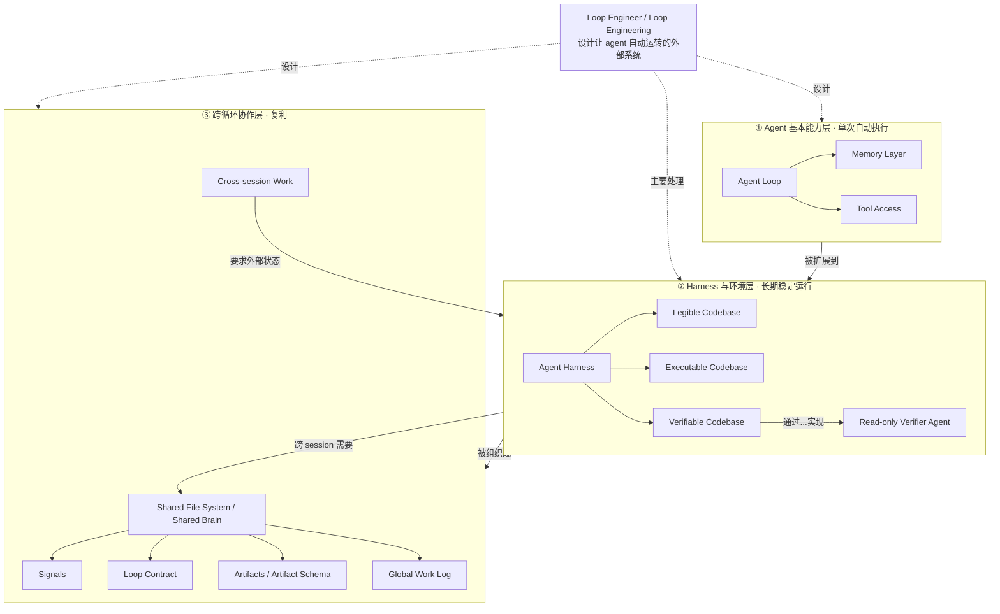

# 概念解析辞典

> 针对《Loop Engineer：把 Agent 工作流变成可复用知识模板》（材料标注来源 martinfowler.com，正文标注作者 AI Jason · YouTube）的概念提取

## 一、核心概念

### 1. **Loop Engineering（Loop Engineer / loop engineering）**

- **context**：作者用它命名从"写提示"到"设计循环"的整体转变。

  > Loop engineer 的工作，就是设计让 agent 自动被唤醒、读取上下文、执行任务、写入状态、积累信号，并在下一轮继续变好的外部系统。

  以及落地姿势：

  > 它不是继续手写 prompt 给 agent，而是搭建环境

- **费曼一下**：loop engineering 是把"一次性提示词"升级成"可复用、可触发、可记账、可复盘的 agent 循环"的做法。它不是教你怎么把某句话说得更漂亮，而是设计一整套外部机制：谁在什么时机唤醒 agent、agent 读哪些上下文、结果写回哪里、下一轮怎么在此基础上继续变好。loop engineer 就是设计这条循环的人——角色从"站在旁边派活的人"变成"设计流水线的人"。全文的其它概念都挂在这个核心上。

### 2. **Agent Loop**

- **context**：作者把 agent 拆成三个底层部件，其中核心是循环。

  > agent 的一句话定义就是：llm runs tools in a loop to achieve a goal。

  到工具调用阶段：

  > 更大的上下文让模型不只是“输出文本”，而是带着 MCP 等工具自己决定下一步，把 tool call 和 tool response 放回对话，循环执行到任务完成。

- **费曼一下**：agent loop 是 agent 最基本的运转形态——模型想一步、调用工具、读回结果、再想下一步，循环到它判断任务完成。它由 programming language agent loop、memory layer、tool access 三块底层部件构成。理解它很重要，因为 loop engineering 不在改这个循环本身，而是让这个循环被系统自动调度，不必每次由人按启动键。

### 3. **Cross-session Work**

- **context**：作者用它描述新的任务形态，也是外部状态系统存在的理由。

  > 新的任务形态不再是一个 agent 完成全部工作，而是多个 agent session 各自处理一部分，在循环中持续推进。它要求外部状态能跨 session 保存和恢复。

- **费曼一下**：cross-session work 指工作被切成多个 agent session 接力完成，而不是一个 agent 一口气干完。它像个上下文锚：因为循环跨越 session、多 agent，所以状态不能只存在某次对话的上下文里，必须外置到文件系统中，后面接力的人（或 agent）才接得上。

### 4. **Agent Harness**

- **context**：作者先给出宽定义，再给一个更有用的二分。

  > 凡是 non-model 的部分，都可以算 harness。

  > 第二层优化 agentic system 的外部环境，让系统知道何时触发、做什么、交给谁、结果如何沉淀。

- **费曼一下**：harness 是"模型之外的一切"——prompt/context 管理、orchestration、hooks、state、logs、运行环境都算。这个定义太宽容易糊涂，所以作者用二分划边界：第一层优化单个 agent loop（让一个 Codex / Claude Code 更好地完成一次任务），第二层优化整个 agentic system 的外部环境。loop engineer 的主战场是第二层。

### 5. **Legible Codebase**

- **context**：codebase harness 的三条边界之一——"知道去哪改"。

  > legible codebase 意味着 agent 能快速判断“该改哪里”。作者提到 OpenAI 的 AGENTS.md 作为索引入口，指向其他文档，让 agent 渐进发现信息。

  附录里还提到 custom lint、programmatic link check 用来防误用：

  > 避免 agent 误用 legacy folders 或错误 repo。

- **费曼一下**：legible 指代码库对 agent 是"路标清楚"的——它一眼能判断该改哪里、信息藏在哪。做法的核心是索引与护栏：AGENTS.md 当入口、由它指向更细的文档，让 agent 逐层发现信息；再把规则注入工具链（custom lint、link check），让 agent 要走错时被拦下。它解决的是"找错入口、改错模块"的边界问题。

### 6. **Executable Codebase**

- **context**：第二条边界——"能不能跑起来"。

  > executable codebase 意味着 agent 可以用低 token、低认知负担启动本地环境。作者团队有 dev.local 脚本，让 agent 一步拉起开发环境；同时要求 worktree friendly，使 5 个 parallel agents 在不同 worktree 中都能启动和测试。

- **费曼一下**：executable 指 agent 能用极低成本把开发环境跑起来、进入目标状态并测试场景，而不是每次开局先花精力摸索环境。它由 dev.local 这类一键脚本加上 worktree friendly 支撑——多个并行 agent 各自在自己的 worktree 里都能启动、测试、互不踩踏。它划的是"环境能不能低成本、并行地跑"的边界。

### 7. **Verifiable Codebase**

- **context**：第三条边界——"怎么证明完成"。

  > verifiable codebase 意味着 agent 有工具证明结果。作者推荐 Playwright CLI，因为它可以操作浏览器、记录视频、附到 PR。关键路径需要端到端测试，例如 upgrade flow、sign up flow、核心创建流程。

  并特别强调不要自证：

  > 作者强调，不要让 agent 只做 self-verification。

- **费曼一下**：verifiable 指 agent 手上有可靠工具来交出结果证据——录像、端到端测试、可附到 PR 的产物，而不是口头说"我觉得好了"。它划的是"完成与否能不能被复核"的边界；只有结果能被独立验证，循环才敢自动化。

### 8. **Read-only Verifier Agent**

- **context**：把"执行"和"验证"拆开的机制。

  > 更好的做法是在 PR skill 里要求执行 agent spawn 一个 read-only verifier agent，并给它详细规格。执行和验证分离，能减少“看起来完成但实际没完成”的情况。

- **费曼一下**：这是"做题的人"和"改卷的人"分开。执行 agent 负责改，另起一个只读的 verifier agent、带着详细规格去检查结果是否达标；验证者不改代码，只核对。之所以承重，是因为它堵住了"执行者自我确认"这个最容易被忽略的漏洞——减少"看着做完了、其实没做完"。

### 9. **Shared File System（Shared Brain）**

- **context**：跨 loop 协作的状态底座。

  > 多 session、多 agent 工作需要一个 shared folder system 来记录状态。support、SEO、ads、growth 等不同 loop 都会读写 signals、artifacts、tasks 和 logs，使各自观察到的信息能被其他 loop 复用。

- **费曼一下**：共享文件系统是多个 loop 共用的"白板"和记忆。每个 agent 把看到的问题、做过的动作、下一步线索写上去，别的 loop 进来不必重新问一遍就能接着干。它承重的原因是：没有它，每个 loop 只是各扫门前雪地重复巡检；有了它，不同 loop 才共享同一套决策背景，作者所说的复利才可能发生。

### 10. **Signals**

- **context**：共享系统里最重要的抽象之一，会累积而非重生成。

  > signals 是其中最重要的抽象之一。它可以记录 product ideas、frictions、opportunities、conversion gaps、keyword opportunities 等跨部门信号。一个 signal 文件会持续追加来源、用户案例和时间线，而不是每轮重新生成一份孤立报告。

- **费曼一下**：signal 是"值得系统长期记住的业务信号"——一张累积证据的线索卡片。每多出现一次相关现象（比如又一位用户问怎么 export files），就往同一条 signal 上加一笔，并记录来源和时间线。它区别于一次性报告的关键在"持续追加"：正是这种累积，让不同 loop 观察到的机会能互相喂给对方。

### 11. **Loop Contract**

- **context**：每个 loop 自己的职责说明书。

  > loop contract 是每个 loop 自己的 README，说明 goal、workflow、boundaries、backlog 和 timeline。agent 每次被触发前先读 contract，理解当前领域的目标、流程、历史和待办，再决定下一步动作。

- **费曼一下**：loop contract 是单个 loop 的"岗位说明书＋交接班记录"：讲清你负责什么、不负责什么、按什么流程走、上次做到哪、还剩哪些待办。agent 每次被唤醒先读它，才不容易越界或重复劳动。它划的是单个 loop 的职责边界。

### 12. **Artifacts（Artifact Schema）**

- **context**：结构化输出层，也是共享知识层。

  > artifacts 是每个 agent 工作或发现的输出，也是 shared knowledge layer。

  > 每种 artifact 应有自己的文件夹和 README，写清楚内容边界、创建流程、schema 和时间线。

  为何要 schema：

  > schema 让不同 loop 产生的文件可读、可合并、可被小应用展示。

- **费曼一下**：artifact 是 agent 每轮工作或发现的产物，按 docs、signals、tasks、tickets、campaigns 等类型归类，是各 loop 共享的知识层。schema 就像"统一表格格式"——大家都按同样的列写，后面的 agent 和人类才能排序、筛选、合并、复用地读懂它。

### 13. **Global Work Log**

- **context**：串起跨领域临时上下文的第三类文件。

  > global work log 用来记录跨领域的 ad hoc 信息和当天整体工作上下文。

  与另两类文件的分工：

  > 三类文件形成分工：artifacts 记录结构化业务对象，contract 管理单个 loop 的职责和状态，global log 串起跨 loop、跨 domain 的临时上下文。

- **费曼一下**：global work log 是全局流水账，专记那些不属于任何单个 loop 的临时信息和当天整体进展。新 session 先读最近几条，就能快速理解"今天整体在干什么"。它补的是 artifacts（结构化的业务对象）和 contract（单 loop 职责）都覆盖不到的跨 loop、跨 domain 的零散上下文。

## 二、概念架构图

图的三层与原文"概念网络"一致：Agent Loop 依赖 memory layer 与 tool access，构成单次执行的能力层；Legible / Executable / Verifiable 三条边界加上 Agent Harness 和 read-only verifier，构成让 loop 能长期稳定运行的环境层；Shared File System 承载 Signals、Loop Contract、Artifacts、Global Work Log，并支撑 Cross-session Work，构成跨循环的协作层。三层递进：没有 Agent Loop 就没有自动执行，没有可验证的 harness 就不敢自动化，没有共享状态与 contract 多个 loop 就无法复利——Loop Engineer 的职责横跨三层，主要落在第二层。
