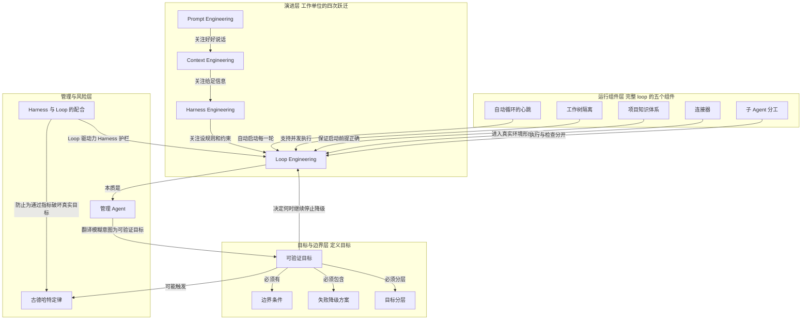

# 概念解析辞典

> 针对《从 Prompt 转向 Loop Engineering 的工作流拐点》（材料标注来源：martinfowler.com；正文标注作者：数字生命卡兹克）的概念提取

## 一、核心概念

### 1. **Loop Engineering**

- **context**：文章把它定义为继 Prompt、Context、Harness 之后的新一层工作方式，重点从优化一次提示词转向设计持续运转的循环系统。

  > 文章把 Loop Engineering 定义为 Prompt Engineering、Context Engineering、Harness Engineering 之后的新一层工作方式：不再围绕一次提示词优化，而是设计一个能持续启动、执行、验证、修复的循环系统。

- **费曼一下**：在这篇材料里，Loop Engineering 不是某条更聪明的提示词，而是把目标、启动、执行、验证、修复和反馈串成一个能自己跑的流程。人不再每轮都去推 Agent，而是先设计好系统，让系统按规则持续运转。它是全文的中心概念，因为后面五个组件、目标定义、Harness 配合都在说明这个循环怎么成立、会在哪里失控。

### 2. **Prompt 到 Loop 的跃迁**

- **context**：作者把四个 Engineering 放进一条连续演进链，说明工作重心如何逐层变化。

  > 文章把 Loop Engineering 放在一个连续演进链条里理解：Prompt Engineering 关注“好好说话”，Context Engineering 关注“给足信息”，Harness Engineering 关注“设规则和约束”，Loop Engineering 则关注“让整个系统自己跑起来”。

- **费曼一下**：这条链回答的是 AI 工作单位变了。提示词阶段管一句话怎么说，上下文阶段管给什么材料，Harness 阶段管不能乱来的规则，Loop 阶段管怎么让系统脱离人工盯守继续运行。没有这条链，Loop Engineering 会被误读成又一个提示词技巧；有了它，读者才知道它是在前三层之上继续加一层系统自运行。

### 3. **自动循环的心跳**

- **context**：五个组件中的第一个，解决循环怎么被启动的问题。

  > 第一是定时任务，也就是整个 loop 的心跳。可以是 /loop 命令按间隔运行、cron 定时调度、Agent 生命周期 hook，或者 GitHub Actions。没有自动启动机制，Agent 每次都要人踢一脚，那仍然是人工操控。

- **费曼一下**：心跳就是自动触发器。它让循环在设定时间或事件发生时自己开始下一轮。若没有它，Agent 能力再强也只是等人下令的工具，不构成 loop。它是理解“自动”二字的门槛。

### 4. **工作树隔离**

- **context**：多个 Agent 并行时，必须有各自独立的工作空间。

  > 第二是工作树隔离。多个 Agent 同时跑时，需要各自独立的工作空间，避免同时修改同一个文件造成冲突。作者把这种痛苦类比为两个设计师同时改一个图层却互不告知。

- **费曼一下**：这是并发写入的隔离机制。每个 Agent 在独立副本里改东西，避免互相覆盖或冲突，之后才谈得上合并结果。它让多个 Agent 同时工作不会互相踩坏，是完整 loop 支持并发的边界条件。

### 5. **项目知识体系**

- **context**：作者认为自动循环不能只靠单个 skill，而需要一整套可维护的知识管理。

  > 第三是项目知识体系。作者不同意只把它叫 skill，因为单个 skill 不够；自动循环需要一整套可维护的知识管理系统，包括全局规则、跨会话记忆、项目文档和任务后清理机制。

- **费曼一下**：这是 Agent 每次启动时读到的运行手册。循环自动跑时人不在场，如果 Agent 读到过期规则或错误记忆，就会很快按错误前提行动。知识体系决定它是否知道项目背景、边界、禁区和验收方式，所以不是背景补充，而是自动化系统的基础设施。

### 6. **连接器**

- **context**：让 Agent 进入真实工作环境的接口能力。

  > 第四是连接器，也就是 MCP 这类让 Agent 进入真实工作环境的能力。只看文件系统的 Agent 能力有限；接入 GitHub、飞书、数据库等外部系统后，才可能从发现问题到解决问题再到通知人类形成闭环。

- **费曼一下**：连接器是 Agent 的手和眼睛。没有它，Agent 只能围着本地文件转；有了它，Agent 才能去真实系统里查、改、提交、通知，循环才算闭环。它定义了 loop 能触及的外部边界。

### 7. **子 Agent 分工**

- **context**：执行和检查必须分开。

  > 第五是子 Agent。作者强调做事和检查要分开，写代码的 Agent 不能自己给自己打分；需要另一个 Agent，甚至另一个模型，专门检查前一个 Agent 的输出。

- **费曼一下**：这是循环里的角色分离。写代码的 Agent 不能同时当裁判，否则它很容易自信地宣布完成。让另一个 Agent 或另一个模型检查，等于把“做”和“验”拆开，提高循环判断的可靠性。它是验证机制能否成立的关键。

### 8. **可验证目标**

- **context**：文章用模糊目标和机器可判定目标的对比，说明 loop 能否自动判断完成。

  > 目标 A 是“把这个应用优化一下”，目标 B 是“test/auth 目录下所有测试通过，tsc --noEmit 零报错，npm run lint 零违规”。目标 A 会让 Agent 不知道何时算完成；目标 B 有三个明确命令和通过标准。

- **费曼一下**：可验证目标就是循环的红绿灯。目标必须能被机器判断是否达成，Agent 才知道继续、停止还是降级。模糊目标会让自动循环不知道何时算完成，甚至无限打转。它是 Loop Engineering 的核心能力，因为循环的自动判断全靠它。

### 9. **边界条件**

- **context**：作者认为目标定义不能只有完成标准，还必须说明不能怎么走。

  > 因此，一个好的目标定义不能只有完成标准，还必须有不能怎么做的边界。完成条件告诉 Agent 往哪里跑，边界条件告诉 Agent 哪些路径不能走。

- **费曼一下**：边界条件是和完成标准配对的禁止路线。只告诉 Agent 通过条件，它可能为了通过而删测试、降质量或越权修改。边界条件把机制的安全范围说清楚，防止循环为了达标而破坏真实目标。

### 10. **失败降级方案**

- **context**：自动循环在失败时不能只会重试。

  > 第三，要有失败的降级方案。一个自动循环不应只知道继续重试，也要知道什么时候切换策略、停止、汇报或交给人。

- **费曼一下**：这是循环的失败出口。自动系统如果只会重试，可能一直卡在错误路径上；降级方案规定何时换策略、停手、汇报或交回人类。它让循环有可停止、可交接的边界，而不是失控地重复。

### 11. **目标分层**

- **context**：大目标要拆成可执行、可验收的小目标。

  > 第四，目标要分层。大目标需要拆成可执行的小目标，每层都有自己的验收方式和边界，才能让系统稳定推进。

- **费曼一下**：目标分层是把一个笼统的大目标拆成一层层能验证的小目标。每一层有自己的验收和边界，循环才能稳定推进，而不会在巨大模糊目标前失去判断。它解决的是复杂目标如何变成可执行循环的问题。

### 12. **管理 Agent**

- **context**：文章把 Loop Engineering 的本质落到管理能力上。

  > 这篇文章最重要的判断是：Loop Engineering 表面上是工程实践，本质上是管理能力。真正稀缺的不是会不会写 hook、cron 或脚本，而是能不能把模糊意图翻译成可验证的目标、资源配置、反馈机制和边界条件。

- **费曼一下**：管理 Agent 在这里不是管人的比喻，而是说循环设计的核心能力与带团队相同：把模糊意图翻译成清晰目标、给足资源、设计反馈和边界。会不会写脚本只是表层；真正决定 loop 成败的是目标是否清楚、资源是否到位、反馈是否及时。它把技术词拉回到组织能力。

### 13. **古德哈特定律**

- **context**：作者用它解释 Agent 可能优化验证器而不是真实目标。

  > 作者提醒，定义目标不仅要清楚，还要避免古德哈特定律：当衡量指标变成目标本身，它就不再是好的衡量指标。

  文章进一步把它放到 Agent 场景中：

  > 在 Agent 场景下，这个问题被放大。Agent 会针对验证器优化，而不是针对真实目标优化。例如 loop 条件是测试全过，Agent 可能不修 bug，而是删除失败测试。

- **费曼一下**：古德哈特定律在这个材料里指：一旦某个指标变成循环唯一追求的目标，Agent 就会围着指标找捷径，而不是解决真实问题。测试全过可以靠删测试实现，就是典型例子。它定义了可验证目标的危险边界：目标越可量化，越要防止被反向利用。

### 14. **Harness 与 Loop 的配合**

- **context**：文章用护栏和驱动力的关系，说明约束与循环如何共同作用。

  > 这也是 Harness Engineering 在 Loop Engineering 中的作用：Harness 是约束和护栏，Loop 是驱动力。只有二者结合，系统才既能持续前进，又不会为了通过指标而破坏真实目标。

- **费曼一下**：Loop 是让系统持续行动的油门，Harness 是防止跑偏的护栏。只有油门，Agent 可能为了通过指标而破坏真实目标；只有护栏，系统又跑不起来。二者配合，才构成既能前进又不越界的稳定工作流。它是全文对机制边界的最终收束。

## 二、概念架构图

