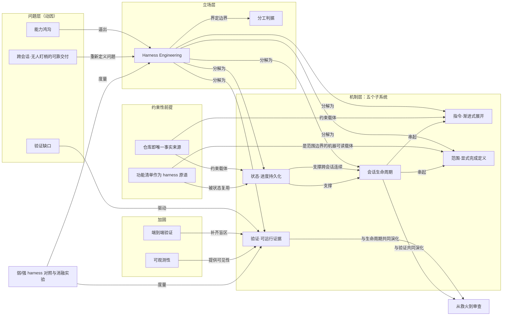

# 概念解析辞典

> 针对《Harness 工程学习仓库：从原始文献到能跑的 skill》（来源：blog.langchain.com｜原文：github.com/walkinglabs/learn-harness-engineering）

## 一、核心概念

### 1. **Harness Engineering（工具马具 / 脚手架工程）**

- **context**：全文的主题词与组织中枢，原文给出的定义是：

  > 围绕模型搭建一整套工作环境，让它产出可靠的结果。不只是写更好的提示词，而是设计模型运行所在的系统。

  支撑这条立论的硬证据是 Anthropic 的同模型对照：同一个 Opus 4.5、同一段提示词，无 harness 用 20 分钟 9 美元、核心功能跑不起来，完整 harness 用 6 小时 200 美元、游戏可玩。结论落到那句「**模型没换，换的是 harness。**」

- **费曼一下**：马具不会让马跑得更快，但决定这匹马能不能拉着车走到终点。Harness 就是套在模型外面的全套装备——缰绳、车辕、路标、里程表。它不改模型的智力，只改模型周围的约束和反馈。它是承重的，因为它把全课的注意力从「换更强的模型」整个挪到了「设计模型运行所在的系统」。

### 2. **能力鸿沟（能力强 ≠ 执行可靠）**

- **context**：L01 的核心，也是全课的起点——「基准测试与真实工程之间的**能力鸿沟**」。原文用一组雷同的翻车现象刻画它：

  > 它跳过了一个步骤。它搞坏了一个测试。它说「完成了」但实际上什么都没跑通。

  作者据此追加一句诊断——「这不是模型的问题，这是 harness 的问题。」

- **费曼一下**：考试满分不代表能把项目交付上线。前者考能力，后者考流程纪律。模型也一样：跑分强和在真实仓库里稳定干完活是两件事，后者的短板不能靠继续提高跑分补上。它承重，因为它解释了为什么需要 harness 这门功课。

### 3. **分工判据（模型决定写什么，harness 管控怎么写）**

- **context**：原文称这是「全文最锋利的一句」：

  > 模型决定写什么代码。Harness 管控什么时候写、在哪里写、怎么写。Harness 不会让模型变聪明。它让模型的产出变可靠。

- **费曼一下**：这句话划定了 harness 的能力边界——它不负责让模型变聪明，只负责管控时机、位置和方式。它是承重的，因为它同时界定了机制能做什么和不能做什么，防止读者把 harness 误解成「更高级的提示词」或「提升智力的手段」。

### 4. **跨会话、无人盯梢的可靠交付（问题的重定义）**

- **context**：作者把真正要回答的问题重新定义了一次：

  > 问题不是「模型能不能写代码」。能写。问题是：**能不能在真实的仓库里，跨越多次会话，不需要人一直盯着，就可靠地完成真实的工程任务？**

  由此引出课程真正关心的四个问题：哪些设计会提升任务完成率、哪些会减少返工和错误完成、哪些机制能让长时任务稳定推进、哪些结构能让系统在多轮运行后仍可维护。

- **费曼一下**：把问题从「模型会不会写」换成了「能不能跨多次会话、没人盯着也把活干完」。它是承重的，因为它把评价标准从一次输出的好坏，换成了多轮、无人值守下的稳定交付——后面所有机制都是为了满足这个更苛刻的判据。

### 5. **指令子系统与渐进式展开**

- **context**：五个子系统之一：

  > 告诉 agent 做什么、按什么顺序、开工前先读什么。关键限定是「不是一个巨大的文件，而是渐进式展开的结构，agent 按需导航」。

  L04 把它总结为：「渐进式展开：**给地图，不给百科全书。**」

- **费曼一下**：给新人一本 500 页的员工手册等于什么都没给——他不会读，也找不到此刻该看的那页。有效做法是给一张目录清晰的地图，需要细节时按索引跳转。它承重，因为「渐进式展开」是防止指令子系统退化成没人读的巨型文件的自我限制。

### 6. **状态子系统与进度持久化**

- **context**：五个子系统之一，对应 L05「为什么长时任务会丢失上下文」：

  > 跟踪做了什么、正在做什么、下一步是什么，**持久化到磁盘**，下次会话从上次停下的地方继续。载体是 progress.md、feature_list、git log、会话交接笔记。

- **费曼一下**：agent 的记忆在会话结束时就清零。想让它接着干，不能指望它「记得」，只能让它「读得到」——把进度写在纸上放桌面正中，下次开工第一件事就是读那张纸。它是承重部分，因为跨会话连续性完全依赖它。

### 7. **验证子系统与可运行的证据**

- **context**：五个子系统中最硬的一条：

  > 只有通过的测试套件才算数。**agent 不能没有可运行的证据就说「做完了」。**载体是 tests + lint、type-check、smoke runs、e2e pipeline。

  它在会话生命周期第 9 步形成分水岭——无 harness 时是「agent 说看起来没问题」；有 harness 时是「测试通过、lint 干净、类型检查通过」。

- **费曼一下**：把「完成」的判定权从当事人嘴里，交给一台不会说谎的机器。你不问「你觉得做好了吗」，只看测试是绿是红。它承重，因为它规定了「什么才算数」这条机制边界，也是整个 harness 从「提醒」变成「判据」的关键。

### 8. **范围控制与显式完成定义**

- **context**：对应 L07「为什么 agent 会多做或少做」：

  > 约束 agent 一次只做一个功能。「不多做，不少做，**不偷偷改功能清单掩盖未完成的工作**。」配套的是显式的完成定义。

  P04 把它落成「运行反馈 + 范围控制 + 增量索引」。

- **费曼一下**：给人一张待办清单和一个明确验收标准，比说「你看着办」更容易得到你想要的东西。要特别防的是两头跑偏：顺手把别处也改了，或者悄悄把标准调低说自己达标。它承重，因为它约束了「一次做多少」和「怎样算达标」这两个机制的边界。

### 9. **会话生命周期**

- **context**：课程的一个核心理念是「**agent 的会话应该遵循结构化的生命周期，而不是自由发挥**」，原文展开为 16 步的开工 / 选择 / 执行 / 收尾四段式。收尾一段的要点是：

  > 开始时初始化（跑 init.sh），结束时清理（跑清理检查清单），给下次会话留交接笔记与一条干净的重启路径；**只在可以安全恢复时才 commit**。

- **费曼一下**：把一次 agent 会话当成一次值班交接班：上岗先看交接本、做设备自检，下岗前写完日志、收拾工位，让下一班一进门就能接着干。它承重，因为它把前面几个子系统串成一次可重复的流程。

### 10. **仓库即唯一事实来源**

- **context**：L03 的主张，判据是那句：

  > **agent 看不到的东西，对它来说就不存在。**

- **费曼一下**：团队里的默契、走廊上的口头共识、某个人脑子里的历史包袱，对 agent 全是虚空。它的世界边界就是它能读到的文件。它承重，因为它在源头处约束了指令与状态的载体——必须落在仓库文件里，否则整套设计落不了地。

### 11. **功能清单作为 harness 原语**

- **context**：L08 的主张：

  > 为什么功能清单是 harness 原语 —— **机器可读的范围边界，agent 无法忽略。**

  feature_list.json 在课程里同时出现在指令、状态、范围三个子系统中：既是任务来源，也是进度记录，也是范围边界。

- **费曼一下**：手写清单只有人能读；JSON 清单机器也能读、能校验、能在流水线里当门禁。当边界写成机器能解析的格式，它就从「善意提醒」变成「绕不过去的判据」。它承重，是因为一个对象在多个子系统里同时担责，才配叫「原语」。

### 12. **验证缺口（自信 ≠ 正确）**

- **context**：L09 的命名，用来解释「为什么 agent 会提前宣告完成」：

  > L09 为什么 agent 会提前宣告完成 —— 验证缺口：**自信 ≠ 正确。**

  现象是 agent「说『完成了』但实际上什么都没跑通」。

- **费曼一下**：一个人越笃定地说「肯定没问题」，你越该去按一下开关试试。自信是语气，正确是事实，两者之间需要一道测试才能连上。它是承重的，因为它是驱动验证子系统存在的直接动因。

### 13. **端到端验证**

- **context**：L10 的主张：

  > 只有跑通完整流程才算真正验证。

  它是对局部验证的补充——局部全绿而整体跑不起来，正是无 harness 组「游戏核心功能跑不起来」的形态。

- **费曼一下**：零件逐个通电正常，不等于装起来的机器能开动。真正验收是把整台机器开一遍走完全流程。它是承重的，因为它补上了「局部全绿、整体跑不通」这个盲区。

### 14. **可观测性**

- **context**：L11 的主张：

  > 为什么可观测性属于 harness —— **看不到 agent 做了什么，就修不了它搞坏的东西。**

  它在项目序列中作为综合项目 P06 的组成部分（完整 harness + 可观测性 + 消融实验）出现。

- **费曼一下**：黑箱里出了问题，你只能整箱换掉。装上仪表盘和日志，才知道哪一步坏的、什么时候坏的——修复的前提是能看见。它是承重的，因为它提供了「坏在哪一步」的可见性。

### 15. **弱 harness / 强 harness 对照与消融实验**

- **context**：课程的方法论骨架：

  > 每个项目都要做弱 harness / 强 harness 对照，「我们关心的是效果变化，而不是『写了多少说明文档』。」

  P01 直接就是「跑两次同样的任务：只写提示词 vs 定好规则」，P06 收在消融实验。

- **费曼一下**：想知道某个零件有没有用，最直接的办法是把它拆掉再跑一次。对照与消融把 harness 从一堆看起来很讲究的规范，变成一组可以被度量效果的机制。它承重，因为它是整门课验证主张的方法。

### 16. **从救火到审查**

- **context**：全文对读者收益的最终刻画。无 harness 时「你花的时间比自己做还多」；有 harness 时「agent 干活，你验证结果」——落点是那句：

  > **你是审查，不是救火。**

- **费曼一下**：同样是带人干活，有的带法是你在后面不停收拾残局，有的带法是你只在关口看一眼签个字。差别不在这个人多聪明，而在流程有没有替你设好关口。它是承重的，因为它是五个子系统协同工作后的可观测结果，也是整套设计的兑现点。

## 二、概念架构图

图说明：问题层的**能力鸿沟**与**跨会话可靠交付**共同逼出**Harness Engineering**；**验证缺口**驱动验证子系统。立场层用**分工判据**界定 harness 的能力边界。机制层是它的五个子系统：指令管「做什么」、范围管「做多少」、验证管「算不算做完」、状态管「跨会话怎么接上」、生命周期把四者串起来。**仓库即唯一事实来源**在源头约束指令与状态的载体，**功能清单**同时支撑范围与状态。**端到端验证**与**可观测性**从两个方向加固验证子系统。**弱/强对照与消融**贯穿全局，度量 harness 与其效果。状态与生命周期、验证与生命周期共同演化出**从救火到审查**。
