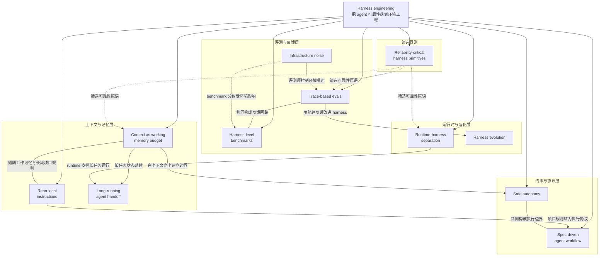

# 概念解析辞典

> 针对《Harness engineering：把 agent 能力落到工具、约束和循环里》（AI 内参主题精选；原文标注 walkinglabs/awesome-harness-engineering）的概念提取

## 一、核心概念

### 1. **Harness engineering**

- **context**：

  > 这份资源清单把 harness engineering 定义为让 AI agent 在真实工作流里可靠运行的环境工程：不是再问“模型会不会更聪明”，而是系统性处理 context、memory、working state、constraints、guardrails、evals、observability、runtime 和 workflow design。

- **费曼一下**：本文不把 agent 可靠性主要归因于“模型更聪明”，而把它归因于模型外部的工作环境。Harness engineering 就是设计这个环境：上下文、记忆、状态、约束、护栏、评测、观测、运行时和工作流。它是全文总框架；拿掉它，后面的资源会变成零散工具链接。

### 2. **Reliability-critical harness primitives**

- **context**：

  > 清单明确排除泛泛的 agent tooling，只有直接覆盖 harness design、context management、evaluation、runtime control 或 reliability-critical primitives 的资源才被纳入。这说明它把“工具很多”与“工具能形成可靠闭环”区分开来。

- **费曼一下**：这是清单的筛选原则。它区分“工具很多”和“工具能形成可靠闭环”。可靠性原语指那些能减少漂移、限制破坏、发现错误、恢复状态和验证结果的基础部件。拿掉它，读者会误以为这只是一份 awesome 工具索引，而不是可靠性工程路线。

### 3. **Context as working memory budget**

- **context**：

  > Context, Memory & Working State 部分把上下文窗口视为 working memory budget，而不是资料倾倒场。Anthropic 的 context engineering、Manus 的 KV-cache locality、filesystem memory 和失败保留策略，都在回答同一个问题：怎样让 agent 在长任务里不漂移。

- **费曼一下**：上下文窗口被当成有限的工作记忆，而不是资料倾倒场。关键问题不是“塞更多信息”，而是怎样让 agent 在长任务里不漂移。它包含放进来，也包含挡出去：低价值日志、噪声输出和无关探索都要被管理。它是长任务 agent 的第一层基础设施。

### 4. **Repo-local instructions**

- **context**：原文把 CLAUDE.md、AGENTS.md 和 repo-local instructions 放在 context、memory、specs 和 workflow 附近，并强调：

  > “记忆”不只是模型上下文，也包括项目内可重复读取的规则、任务约束和本地约定。
  >
  > 这类文件本质上是 harness 的持久化接口。

- **费曼一下**：项目内规则文件是 harness 的持久化接口。它把“记忆”从模型上下文扩展到仓库里可反复读取的命令、测试、目录边界、提交规则、权限约定和项目禁区。它和短期上下文不同：一个管当前工作记忆，一个管长期项目规则。拿掉它，agent 进入一个 repo 后怎么工作就没有协议。

### 5. **Safe autonomy**

- **context**：

  > Constraints, Guardrails & Safe Autonomy 部分围绕一个矛盾展开：agent 要更自主，系统又不能失控。Anthropic 关于 sandboxing、MCP code execution 和 writing tools for agents 的几篇文章，都是在降低 approval friction，同时保持明确边界。
  >
  > Claude Code sandboxing 的重点不是让 agent “随便做”，而是通过安全策略、隔离环境和权限模型，让更多动作可以在可接受风险内自动执行。自主性来自可验证边界，而不是放弃控制。

- **费曼一下**：它解决“agent 要更自主，系统又不能失控”的矛盾。不是把钥匙全给它，而是用 sandbox、权限模型、隔离环境、MCP 协议边界、prompt injection 防护等，让更多动作在可接受风险内自动执行。自主性来自可验证边界。拿掉它，约束和护栏部分就失去核心。

### 6. **Spec-driven agent workflow**

- **context**：原文把 specs、agent files 和 workflow design 放在一起，说明：

  > harness engineering 需要机器可读或至少 agent 可读的工作协议。
  >
  > Spec Kit 和 spec-driven development 解决的是“agent 执行什么”的问题。越复杂的任务越不能只靠一句自然语言目标，必须把产品意图、验收标准、阶段边界和工程约束拆成可以检查的规格。

- **费曼一下**：它把任务意图变成可执行协议。规格告诉 agent 执行什么，验收标准、阶段边界和工程约束让复杂任务可检查。它和 repo-local instructions 的关键区别是：后者回答“进入这个 repo 后怎么工作”，spec 回答“这次要执行什么”。拿掉它，复杂任务只剩一句自然语言目标。

### 7. **Trace-based evals**

- **context**：

  > Evals & Observability 部分把 OpenAI、OpenHands、Anthropic、LangChain 的 eval 资源集中起来，强调 agent 系统必须可测量、可复现、可回放。没有评测和轨迹观测，harness 只能靠感觉迭代。
  >
  > 把 agent traces 转成 JSONL、确定性检查和任务级指标，才能判断某个 skill 或 harness 改动是否真的提升。

- **费曼一下**：评测不只看最后有没有答对，还要回看 agent 怎么走到结果。traces、JSONL、确定性检查、任务级指标、baselines 和轨迹复盘，让“这个 skill 或 harness 改动有没有用”变成可比较实验。它是 harness 改进的反馈回路；拿掉它，只能凭感觉迭代。

### 8. **Infrastructure noise**

- **context**：

  > Anthropic 的 evals for agents 和 infrastructure noise 提醒读者，agent 轨迹可能有很多成功路径，运行时配置也能显著影响 benchmark 分数。harness 评测要关注过程质量、环境噪声和稳定性，而不只是最终答案。

- **费曼一下**：同一个模型在不同工作间里表现会不一样。运行时配置、环境差异和基础设施噪声都可能显著影响 benchmark 分数。它提醒评测必须控制运行环境，否则分数无法可靠归因给 harness 改动。它是评测机制的边界条件。

### 9. **Harness-level benchmarks**

- **context**：

  > Benchmarks 部分很长，覆盖 Agent Arena、AgentBench、AgentBoard、AppWorld、AssistantBench、BrowseComp、BrowserGym、GAIA、OSWorld、SWE-bench Verified、Terminal-Bench、WebArena 等。它的选择标准是测试 context handling、tool calling、environment control、verification logic 和 runtime scaffolding。
  >
  > 这些 benchmark 的共同点是，它们不只考模型知识，还考 agent 在环境中行动的能力。

- **费曼一下**：这些 benchmark 像不同类型的试车场。它们不只考模型知识，还考 agent 在真实工具、浏览器、终端、桌面和 MCP 环境里行动的能力：工具调用、环境控制、状态验证和长任务推进。拿掉它，harness 质量就缺少跨任务环境的压力测试。

### 10. **Runtime-harness separation**

- **context**：

  > LangChain 对 framework、runtime 和 harness 的分解很重要：framework 提供抽象，runtime 负责执行环境，harness 则把模型、工具、状态、评测和任务循环组装成可靠系统。混淆这三者会让团队以为装了框架就拥有了 harness。

- **费曼一下**：framework、runtime 和 harness 不是同一层。framework 提供抽象，runtime 负责“能运行”，harness 负责“能可靠完成任务”，它把模型、工具、状态、评测和任务循环组装起来。拿掉这个区分，团队会以为装了框架就拥有了 harness。机制边界是：有执行器不等于有好的工作流程、状态管理和验证闭环。

### 11. **Long-running agent handoff**

- **context**：

  > Anthropic 的 long-running agents 文章强调 initializer agents、feature lists、init.sh、self-verification 和 handoff artifacts；
  >
  > OpenHands 的 context condensation 则说明，长任务需要能够压缩会话历史，同时保留 goals、progress、critical files 和 failing tests。它把“上下文清理”变成一种有结构的状态转移，而不是简单摘要。

- **费曼一下**：长任务里的 agent 像接力队。跨上下文窗口、跨阶段时，每一棒都要留下清楚的进度、证据、失败和下一步，还要能压缩会话历史但保留目标、进度、关键文件和失败测试。拿掉它，长任务无法延续，下一棒只能重新摸索。

### 12. **Harness evolution**

- **context**：

  > Harbor 和 Harness Evolver 展示了更进一步的方向：harness 本身也可以被评估、改进，甚至由多 agent 系统在隔离 worktree 和 eval 反馈下演化。也就是说，harness engineering 未来可能会变成一套持续优化的工程流程。

- **费曼一下**：不仅 agent 可以做项目，harness 本身也可以被评估、改进，甚至在隔离 worktree 和 eval 反馈下由多 agent 系统演化。它把 harness engineering 从一次性搭建变成持续优化的工程流程。拿掉它，整套体系会停在静态搭建，缺少自我改进方向。

## 二、概念架构图

按原文的概念网络，可以把这些概念重建为五层：总框架／筛选原则、上下文与记忆层、约束与协议层、评测与反馈层、运行时与演化层。

