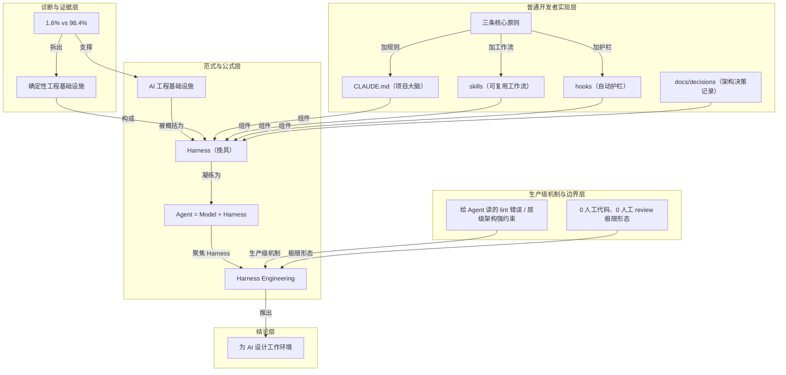

# 概念解析辞典

> 针对《撕开 Claude Code 真相：让它好用的 98.4%，是工程不是 AI》（新智元，材料标注；原文链指向 martinfowler.com）的概念提取

## 一、核心概念

### 1. **AI 工程基础设施（AI engineering infrastructure）**

- **context**：文章用这条推文当作起点，随后用主旨句概括它。

  > 让 AI 编程真正好用的，不是更强的模型或更长的提示词，而是围绕模型搭建的一整套确定性工程基础设施——CLAUDE.md、skills、hooks、docs/decisions 这套“项目大脑+工作 SOP+合规护栏+章程”的组合。

- **费曼一下**：在本文里，它不是模型、算法或提示词技巧，而是围绕模型搭起来的外围工程系统：项目记忆、工作流、护栏、文档、工具。作者用它划出范式转移——从“调 prompt”转到“造基建”。没有它，后面的 98.4%、Harness、CLAUDE.md 等都失去落脚点。

### 2. **1.6% vs 98.4%**

- **context**：这是全文的标题数字，也是论证支点。

  > Claude Code 51.2 万行代码里只有 1.6% 是 AI 决策逻辑，剩下 98.4% 都是权限、上下文、工具路由、错误恢复这类工程基建。

- **费曼一下**：它不是说模型只贡献 1.6% 的能力，而是说 Claude Code 作为产品，复杂度重心在工程侧：真正调模型做决策的代码极少，其余大量代码是确定性的权限、上下文、工具路由和错误恢复。它把“AI 好用”的原因从模型能力挪到工程实现。

### 3. **确定性工程基础设施（deterministic engineering infrastructure）**

- **context**：这是 98.4% 的具体所指。

  > 98.4% 具体由四类组成：权限网关、上下文管理、工具路由、错误恢复。

  > 这组数字不是说模型只贡献 1.6% 的能力，而是说明 Claude Code 作为产品，大量复杂度不在模型本身，而在围绕它的工程基建上。

- **费曼一下**：“确定性”是关键：这些代码不靠 AI 推理，给定输入给相同输出，因此能约束和兜底那个不确定的模型。四类分别是权限网关、上下文管理、工具路由、错误恢复。理解这四类，才能理解为什么工程基建能托住 AI。

### 4. **Harness（挽具）**

- **context**：文章用马术挽具作比，解释模型之外那套东西的角色。

  > 模型再强也不知道在你的代码库里该往哪儿走，Harness 就是你为它造的方向盘+刹车+导航。

- **费曼一下**：本文最核心的隐喻。Harness 来自马术，指马的整套挽具。模型像一匹跑得快但不知道方向的马；Harness 是方向、制动和导航。AI 在你的代码库里能不能跑出价值，不只看模型多强，更看这套挽具怎么造。

### 5. **Agent = Model + Harness**

- **context**：这是把整套思路压成一行公式的表达。

  > Martin Fowler 网站凝练成公式：Agent = Model + Harness。

- **费曼一下**：一个能真正干活的 Agent，不是模型单独运行，而是模型加上整套 Harness。它把“为什么工程占 98.4%”压成一行：换模型只是换马，换 Harness 才决定这匹马在你的项目里可不可控。

### 6. **Harness Engineering（挽具工程）**

- **context**：文章把它作为“为 AI 造挽具”的学科化命名。

  > 2026 年 2 月 11 日 OpenAI 官博文章《Harness engineering: leveraging Codex in an agent-first world》。

- **费曼一下**：把“为 AI 造挽具”当成一门独立工程学科。本文用它解释：模型没换，只调整系统提示、工具、中间件、推理模式等 Harness，Terminal Bench 2.0 分数就能从 52.8 提到 66.5。Harness Engineering 是 98.4% 那套工程实践的学科化名字。

### 7. **CLAUDE.md（项目大脑）**

- **context**：文章把项目根目录这个文件称为 AI 每次启动先读的“大脑”。

  > Anthropic 官方定义：一个 markdown 文件，放在项目根目录，Claude Code 在每次会话开始时自动读取。

- **费曼一下**：项目的“大脑”或“员工手册”。AI 每次启动第一眼读它，里面写架构决策、命名约定、测试要求、反复踩过的坑。它把项目经验沉淀成每次会话都会加载的长期上下文，是整套架构里承载“记忆”的那一层。

### 8. **skills（.claude/skills/，可复用工作流）**

- **context**：文章把 skill 定义为可执行的方法论，而不是每天手敲的提示词。

  > 一个 skill 就是一段可执行的方法论。

- **费曼一下**：可复用的工作流。作者引用 Boris Cherny 的原则：每天做超过一次的事，就变成 skill 或 command。code review、生成 commit message、写发布说明等，封成 skill 后调一下就出结果，不必每天手敲提示词。它对应组织里的 SOP。

### 9. **hooks（.claude/hooks/，自动护栏）**

- **context**：这是全文最强调的机制边界：不靠 AI 自省，靠确定性代码拦截。

  > 不依赖 AI 自己判断，由确定性代码在 AI 犯错之前就挡住它。

  > 这就是为什么敢让 AI“无人监督”地跑——出错的边界由 hooks 卡死了。

- **费曼一下**：自动护栏。它不靠 AI 自我反省，而靠确定性代码强制拦截，所以才能让 AI 在无人监督下运行——因为错误边界由 hooks 封死。它把人类工程师的判断翻译成机器可读的硬约束，是 98.4% 里杠杆最大的一块。

### 10. **docs/decisions/（架构决策记录）**

- **context**：文章说它补的是代码背后的“为什么”。

  > 让 AI 不仅知道代码“是什么”，还知道代码“为什么是这样”。

- **费曼一下**：仓库里记录“为什么这么写”的文档。只有代码，AI 知道现状；有了 decisions，AI 才理解约束的来历，不会无脑改回去。作者说它最容易被忽略，但杠杆最大。它补的是意图和约束边界，而不只是代码事实。

### 11. **三条核心原则（项目大脑的喂养循环）**

- **context**：这是整套架构如何长出来的操作机制。

  > 每次 Claude 犯错 → 你加一条规则
  > 每次你重复自己 → 你加一个工作流
  > 每次出 bug → 你加一道护栏

  > 目的：把项目经验沉淀成 Claude 每次启动都会读取的长期上下文和自动化约束

- **费曼一下**：犯错就加规则，重复就加工作流，出 bug 就加护栏——分别喂养 CLAUDE.md、skills、hooks。它把“项目大脑”从一次性配置变成越用越厚的反馈循环，也是普通开发者可以照着做的操作机制。

### 12. **给 Agent 读的 lint 错误 / 层级架构强约束**

- **context**：OpenAI Frontier 实验里最反直觉的工程细节。

  > 普通项目：“violation detected”——给人看的
  > OpenAI Frontier：“use logger.info({event: 'name', ...data}) instead of console.log”——给 Agent 看的、可以直接读懂并修复的指令

- **费曼一下**：层级依赖从 Types → Config → Repo → Service → Runtime → UI 单向流动，由 CI 的 linter 强制执行；更关键的是，lint 报错本身写成给 Agent 读的修复指令，让 Agent 读了就能改。它把工具链从“给人看的告警”改造成“AI 友好约束”，是 Harness 做到生产级的一个机制边界。

### 13. **0 人工代码、0 人工 review 极限形态**

- **context**：这是 OpenAI Frontier 团队工作流的极限描述，也包含一种反直觉的算账方式。

  > 带队的 Ryan Lopopolo 称这套工作流已接近“0 人工代码、0 人工 review”的极限形态——与其节省 token，不如用模型极高的并发能力和极低的成本，去替代人类有限且昂贵的同步注意力。

- **费曼一下**：OpenAI Frontier 团队 5 个月跑出约 100 万行代码、约 1500 个 PR 的工作模式。它的反直觉之处是算账方式：人类的同步注意力稀缺昂贵，token 便宜且可并发，所以应把工作量倾倒到模型一侧。它定义了这套 Harness 自动化程度的极限边界。

### 14. **为 AI 设计工作环境（工程师能力曲线转移）**

- **context**：这是文章给普通开发者的最终结论。

  > 未来五年，工程师的能力曲线正在从「我能写多少行代码」转向「我能为 AI 设计多严格的工作环境」。

- **费曼一下**：工程师的护城河从“写代码的手速”迁移到“为 AI 写规则、设计约束和环境的判断力”。Karpathy 那句“从 80% 手动写代码变成 80% 交给 Agent 写”是同一件事的另一面。它把前面的 Harness、CLAUDE.md、hooks 等落到人的能力定位上。

## 二、概念架构图

按功能角色分层；只画原文能支持的关系。

