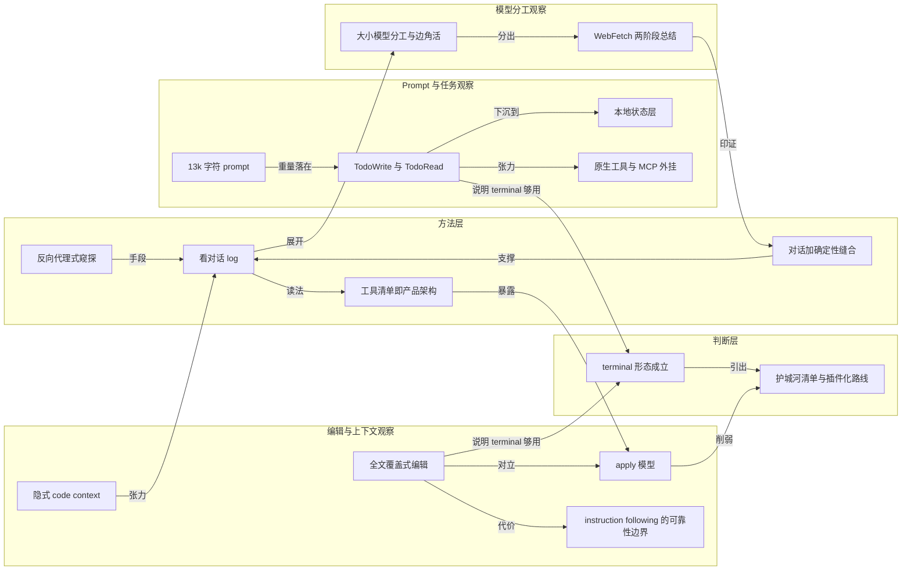

# 概念解析辞典

> 针对《拆开 Claude Code：一个编码 agent 的 harness 内部长什么样》（xxchan，xxchan.me）的概念提取

## 一、核心概念

### 1. **看对话 log**

- **context**：全文的方法起点：作者认为研究 AI app 最可靠的切面不是宣传，而是它和模型之间的请求。

  > 要研究某个 AI app 怎么工作，最好的方式就是看对话 log。

- **费曼一下**：AI 产品对外是一个界面，对内只是一串发给模型的消息。与其猜它有什么黑科技，不如站在它和模型之间，把信件拆开看一眼——产品怎么想、用了哪些工具，都写在请求里。

### 2. **对话加确定性缝合**

- **context**：作者自称「小小升华」的判断，也是看 log 方法能成立的前提。

  > prompt 对话是 LLM 的第一性原理，任何 AI app 归根结底就是和 LLM 对话（例如工具调用也是对话），然后把有用的（结构化的）结果抠出来，再用确定性的其他代码缝合起来。

- **费曼一下**：一个 AI 应用 = 会说话但不可靠的大脑 + 一堆一定能跑对的普通代码。大脑负责出主意，普通代码负责接住、校验、执行。产品差距往往出在后半截，而不是模型本身。

### 3. **反向代理式窥探**

- **context**：三种看 prompt 方法中，Cloudflare AI gateway 与自制 HTTP proxy 共享同一原理。

  > 它本质上是一个反向代理：原封不动地把请求转给模型供应商再转回来，中间截取请求做通用的 log 和 metrics。

- **费曼一下**：在你和模型之间架一个中转站。它不改内容，只是顺手抄一份。抄下来的这份，就是产品说明书里永远不会写的那部分。

### 4. **工具清单即产品架构**

- **context**：log 里不只有对话，还有工具清单；作者认为工具列表本身就在交代产品把哪些能力交给了模型、背后调用什么。

  > tools 是一大关键

  > 工具清单本身就暴露了产品架构

- **费曼一下**：看到 `codebase_search`，就能猜到背后有 codebase 索引和 vector search；看到 `edit_file`，就能猜到背后有专门的 apply change 模型。工具清单不是配置，是产品架构的 X 光片。

### 5. **大小模型分工与边角活**

- **context**：截下请求后的第一条初步观察，以及小模型承担的高频、低价值任务。

  > claude code 会使用一大一小两个模型；每次打字都会发请求给小模型。

  > 小模型被要求生成一个积极、欢快、带点 whimsy 的动名词，用来给状态提示添彩，还被明令禁止使用 Terminating、Killing 这类会让工程师紧张的词。

  > 作者判断「感觉是用来管理 context」。

- **费曼一下**：贵的脑子用在真正的编码推理上，杂活派给便宜的脑子。氛围组请求只为等待时那一点心情，new topic 判定则先问一句“这是不是新话题”，决定要不要另起一段记忆。两者共同说明：低价值、高频次、噪音大的工作被从主推理链上剥离了。

### 6. **13k 字符 prompt**

- **context**：正式请求的第一个体量差。

  > prompt 非常长，有 13k 字符，相比之下 cursor 的 prompt 只有不到 6k

- **费曼一下**：prompt 的长度是可观测的用心程度指标。它相当于给员工写的入职手册——语气、简洁度上限、主动性边界、代码风格、工具使用纪律，都写在里面，而不是留给模型即兴发挥。

### 7. **TodoWrite 与 TodoRead**

- **context**：作者认为 13k prompt 里最大的亮点是任务管理，甚至用 `VERY frequently` 来强调。

  > tools 里内置了 TodoRead/Write（！）和 NotebookRead/Write（jupyter）

  > prompt 里着重强调这两个工具要 VERY frequently 地用

  > If you do not use this tool when planning, you may forget to do important tasks — and that is unacceptable

- **费曼一下**：给 agent 一张写在外面的清单。模型的注意力会漂移，但清单不会；把“记住要做什么”从脑子里搬到纸上，长任务才不会做着做着散架。作者把它看成更进阶版的 `scratchpad.md`，胜在多个子任务的管理。

### 8. **原生工具与 MCP 外挂**

- **context**：作者预测任务管理会成为标配后，立刻自我反问能力应该长在哪里。

  > 是不是直接通过 MCP 插一个 todo manager 就够用了？并不需要 app 原生的任务管理工具。

  > 外置方案已经有 task master（支持命令行或 MCP 调用），不过他直觉上觉得「有点不必要地复杂」

- **费曼一下**：同一个能力，可以长在产品身体里，也可以外接一个插件。前者体验一体、后者生态灵活。判断标准不是哪个更时髦，而是这项能力是否高频到值得被产品自己吃下；作者没有给结论，只留下一个未解的张力。

### 9. **本地状态层**

- **context**：任务管理不只是 prompt 里的一句话，它还落成了本地文件。

  > TODO list 并没有写在项目路径下面，而是藏在 ~/.claude：todo 是一个 json，同目录还有一个 sqlite 数据库 __store.db（表包括 __drizzle_migrations、assistant_messages、base_messages、conversation_summaries、user_messages），以及 statsig 的缓存文件

- **费曼一下**：agent 不只是一次性对话，它需要一层落在磁盘上的记忆——待办、历史消息、摘要、实验开关。看一个 agent 在你机器上留下了什么文件，就知道它把什么当成需要跨会话保留的东西。

### 10. **全文覆盖式编辑**

- **context**：作者发现 Claude Code 的 tool call 基本只用 Write 而不用 Edit，Edit 的 spec 里则明写。

  > For larger edits, use the Write tool to overwrite files

  > 如果直接无脑全文覆盖，不就绕过了 apply edit 的困难吗？只要 instruction following 能力强，效果应该不错，「只是费电 token 罢了」

- **费曼一下**：与其教模型精确地做外科手术，不如让它把整份文件重抄一遍。笨、贵，但可靠得多——很多工程难题的最优解就是用算力换掉一个必须训练的模型。

### 11. **apply 模型（apply edit）**

- **context**：cursor 在编辑上的路线与全文覆盖相反：专门训练一个模型来做 apply edit。

  > cursor 自己训练了一个 LLM 专门做 apply edit

  > 但有点存疑，因为最近一段时间感觉失败率甚至有点高

- **费曼一下**：把“改文件”做成一个专用小模型，是上一代产品的护城河设想。一旦大模型本身足够听话、算力足够便宜，这条护城河就可能被一个更笨的办法抹平；作者对它的失败率也存疑。

### 12. **instruction following 的可靠性边界**

- **context**：全文覆盖式编辑的代价在一次 `(Rest of file unchanged)` 事件中暴露出来。

  > 它是真的把代码删了，把这个注释写进去了

  > 完全依赖 AI 的 instruction following 还是没那么靠谱

- **费曼一下**：模型会把“看起来像正确输出的东西”写出来，而不一定真的做对了事。凡是把正确性完全押在模型听话上的设计，都需要一层确定性的校验兜底。

### 13. **WebFetch 两阶段总结**

- **context**：WebFetch 的 tool 参数除 URL 外还有一个 prompt，形成一次典型的大模型—小模型编排。

  > 这个 tool 的参数在 URL 之外还有一个 prompt。大号模型生成 tool call（包括这个 prompt），系统再把网页与 prompt 组合交给小模型总结，最后只把一小段文字传回给大号模型作为 context。

  > 还是挺细腻的

- **费曼一下**：别把一整个网页倒进主模型的脑子里。先派一个助理带着问题去读，读完只汇报一段话。上下文是稀缺资源，谁先学会压缩谁就跑得远；这个两阶段过程本身也再次印证了“对话 + 确定性缝合”。

### 14. **隐式 code context**

- **context**：作者发出指令后，Claude Code 自动挑了一些文件进入 context，但这一步在 log 里找不到明确机制。

  > 这个步骤并没有 tool use，也没有额外的模型总结，~/.claude 目录下也没发现类似代码索引的东西

  > 感觉有点神秘。感觉 claude code 还是藏了点东西的

- **费曼一下**：能被 log 看见的，是这个产品愿意让你看见的部分。总有一段逻辑发生在请求发出之前——那往往才是竞品最难抄的地方。它和“看 log 就能看懂产品”形成一处张力。

### 15. **terminal 形态成立**

- **context**：作者在总结处对 agent 运行形态的判断，也是护城河讨论的前提。

  > AI coding 好像确实没那么需要一个 IDE，terminal 这个形态感觉很合理。

  > 让 agent 在 terminal 写，人类使用寻常的 IDE（例如原生 VS Code）进行 review、进一步编辑，好像没有任何问题

- **费曼一下**：如果 agent 负责写、人负责 review，那么 IDE 的聊天面板不是必需品。terminal 提供同样的 agent 运行环境，人回到普通编辑器里工作，形态反而更清楚。这个判断一旦成立，cursor 多出来的那些能力就必须重新自证。

### 16. **护城河清单与插件化路线**

- **context**：全文最后的判断：把 cursor 相对于 Claude Code 多出来的东西逐条列出，再逐条问它是否强依赖 IDE。

  > 对于 agent 模式，cursor 相比 claude code 多了什么？作者一下子能想到三样，并逐一祛魅

  > 三样都不构成 IDE 的硬绑定，于是结论指向一个不太乐观的判断：agentic coding tool（startup）的未来越发不明朗，特别是 cursor 这种 fork 的 IDE；或许像 Augment Code 这样的纯插件方案更有前途

- **费曼一下**：判断一个产品的壁垒，方法是逐条列出它“多出来的东西”，再逐条问：这一条离得开它现在的形态吗？如果每一条答案都是“离得开”，那壁垒就只是形态惯性。作者由此认为 fork IDE 的路线越发不明朗，纯插件方案反而可能更有前途。

## 二、概念架构图

