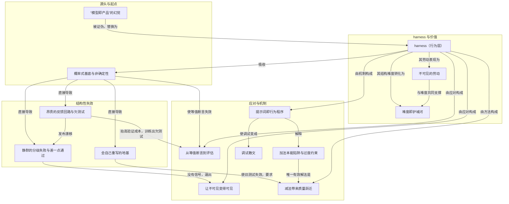

# 概念解析辞典

> 针对《为什么 harness 工程这么难》（Winter／x.com）的概念提取

## 一、核心概念

### 1. **harness（行为层）**

- **context**：作者把介于概率式模型和产品使用者之间的那一层称为 harness，并列出它的组成：prompts、examples、schemas、validators、evals、guardrails。

  > "The model generates the output. The harness is what makes that output usable."

- **费曼一下**：在本文里，harness 不是某个具体工具，而是让模型输出变得可用、可发布、可测试的整层约束设施。它解决的理解难点是：模型本身不等于产品；产品可靠性发生在模型之外的另一层工程里。它是承重概念，因为全文所有痛点最后都被放进这一层来吸收。

### 2. **“模型即产品”的幻觉**

- **context**：开篇指出，几乎每个建在大模型上的项目都会短暂相信模型就是产品：接上 API、写个 prompt、第一次演示惊艳，于是感觉难的部分已经结束。作者的回应是一句独立成段的话。

  > "It is not."

- **费曼一下**：这是全文要拆掉的错误默认设置。它不是说模型不重要，而是说“能演示”和“能依赖”之间隔着 harness 工程。拿掉它，读者就不明白作者为什么把后面所有失败都称为结构性工作，而不是模型能力问题。

### 3. **概率式基底与非确定性**

- **context**：作者把难点归因于系统基底的本性：没有堆栈跟踪、没有确定性、没有稳定契约、也不区分“程序”和“它被训练的数据”。非确定性则表现为同一输入喂两次得到不同输出。

  > “足以让严格的等值断言变成废纸。”
  >
  > “抽掉了整个质量策略的地板。”

- **费曼一下**：在本文里，概率式基底是源头判断：你不是在普通平台上做工程，而是在一个按概率生成、且会随训练和更新改变行为的系统上做工程。非确定性是它最直接的后果——验收语言从“对错”变成“分布上的置信度”。这是承重概念，因为测试、失败、调试、地基漂移都从这里长出来。

### 4. **从等值断言到评估：置信度而非正确性证明**

- **context**：等值断言失效后，作者给出两条更弱的退路：断言结构、断言不变量；并把问题整体改写。

  > “问题于是从「一个输出是否等于一个预期答案」变成「系统在一个输入分布上、在重复运行中，是否满足一份 rubric」。”
  >
  > “得到的是置信度，不是正确性的证明。”

- **费曼一下**：本文中，质量策略不再能靠 `expect(output).toBe(X)`。你只能检查输出能否解析、必填字段在不在、计数对不对，再检查它有没有违反被告知要遵守的规则，然后在一个输入分布上重复运行，拿一个概率性的置信度。它解决的理解难点是：为什么 harness 工程更像 evaluation，而不是传统单元测试；也划出边界——这些断言更弱，会放真正的意外输出过去。

### 5. **静默的分级失败与“差一点就通过”的输出**

- **context**：普通软件失败会自己喊疼：异常、堆栈、非零退出码、红色日志。模型输出不会崩；一个 95% 正确、5% 崩坏的响应看上去完全没问题。作者说最危险的是差一点就通过的输出。

  > “最危险的输出恰恰是那些差一点就通过的。”
  >
  > "None of these crash. All of them ship."

- **费曼一下**：本文中，失败不是二元崩溃，而是分级、静默，并且用同样的散文、格式和自信，把错的部分织进对的部分里。它解决的理解难点是：为什么不能等系统报警，以及为什么质检真正要防的不是离谱，而是“像样”。它划出防御边界：粗暴错误好抓，微妙错误能穿过所有浅层检查抵达用户。

### 6. **调试散文：一个词就是 bug**

- **context**：harness 出故障时，造成失败的“代码”往往是一段英文，唯一的调试器是判断力。作者花了几个小时把一次回归追踪到 prompt 里的一个形容词。

  > “一个词就可能是那个 bug。”
  >
  > “prompt 有确定的顺序，却不像有显式控制流的程序那样执行。”

- **费曼一下**：本文中，调试 prompt 不是查堆栈，而是读一段散文、判断哪个词给了模型许可去做它刚做的事。它解决的理解难点是：为什么 prompt 的 bug 不可见、不可机械定位，只能像作家推敲段落那样推理。它也是承重机制边界：源码 bug 可被找到，散文 bug 只把行为推偏几度，而几度足够悄悄腐蚀输出。

### 7. **加法本能陷阱与过度约束**

- **context**：作者称之为 harness 工程里最可靠的失败模式，也是自己掉进去次数最多的一个：出了问题，本能就是往 prompt 里加一条规则。经典款包括全大写的“MAKE NO MISTAKES!”。

  > “prompt 变长本身是病，不是药。”
  >
  > “你不会收到冲突报错，你只会得到一个被过度约束的模型：它被拉扯到无法同时满足所有方向，于是安静地挑一条来违反。”

- **费曼一下**：本文中，加法本能是用新规则修旧失败，但自然语言规则之间会以无法完全预测的方式互相打架，解空间被压缩到没有合法输出。它解决的理解难点是：为什么“更负责地加规则”反而制造更隐蔽的 bug。它构成 harness 工程的核心张力。

### 8. **减法带来质量跃迁**

- **context**：作者给出的有效解法是删规则、合并重复、删掉暗中互相打架的指令、把约束从散文搬进代码里执行——在代码里它没法被反驳。

  > “质量的跃升来自删除，而不是添加。”

- **费曼一下**：本文中，减法不是少做事，而是唯一能让被过度约束的模型重新获得合法输出空间的工程动作。它解决的理解难点是：为什么工程直觉在这里是反的——删除像在“移除一道保险”，但它实际是在移除冲突源。它和加法陷阱共同定义 harness 调优的方向。

### 9. **提示词即行为程序（示例强于规则）**

- **context**：作者由“示例赢”推出更深的结论：prompt 里的一切都在改变行为，没有中立部分。

  > “prompt 里没有中立的部分，每个 token 都在把模型推向某处。”
  >
  > “prompt 里的一切都是行为程序——指令、示例、章节的顺序、你选的词，（也许）甚至格式。”
  >
  > “示例赢。”

- **费曼一下**：本文中，prompt 不是配置文件，而是一段每行都会执行、输出带范围的程序。它解决的理解难点是：为什么你写了“不要做 X”却附上一个做了 X 的示例，模型就会做 X；为什么排版、顺序和用词也算机制。它是加法陷阱和调试散文的底层解释。

### 10. **会自己重写的地基（测试是绿的，产品却在退化）**

- **context**：模型不是静止地基。厂商会更新它，有时不打招呼；旧模型读作硬约束的句子，新模型读作建议；你的 harness 针对旧模型的失效模式调优，新模型却有不同失效模式。

  > “测试可以是绿的，产品却在退化，因为测试断言的是旧模型的行为，而模型已经动了。”
  >
  > “你写的每一份契约都是与移动靶子签的。”

- **费曼一下**：本文中，harness 建在一个按别人日程重写自己行为的概率系统上，所以没有永久有效的“锁版本”逃生舱。它解决的理解难点是：为什么测试通过不等于产品可靠，为什么 harness 永远不会“做完”。它划出维护边界：要最小化 prompt、建能捕捉漂移的校验、预期下一次更新会弄坏某个还叫不出名字的东西。

### 11. **昂贵的反馈回路与欠测试**

- **context**：正常的 edit-compile-test 循环以秒计，而一次模型调用要花钱，如果流水线里有多次模型调用，一次端到端测试要几分钟到几个小时。你无法用“一分钟试二十种变体”暴力求解，只能试三种、等、认真读输出、形成假设、再试一种。

  > “你在停止编辑之前就停止了观察。”
  >
  > “昂贵的回路训练你欠测试，而对一个概率系统欠测试，就是在发布漂移。”

- **费曼一下**：本文中，反馈回路又慢又贵，不只是拖慢迭代，还会改变工作形状和验证习惯：每次检查都昂贵时，你会开始少检查，说服自己这个改动小到可以跳过完整运行。它解决的理解难点是：为什么成本压力本身会制造回归；它把“没时间测”从项目管理问题变成结构性失败源。

### 12. **让不可见变得可见**

- **context**：面对没有信号的失败，作者把 harness 工程很大一部分定义为加能暴露分级漂移的检查、加能标出“结构合规但语义跑偏”的断言、在置信度低的节点上加人工介入。文末谈社会性痛苦时，他又把同一动作用于劳动本身。

  > “making the invisible visible”

- **费曼一下**：本文中，这是一个双重动作：系统不会自己报警，就亲手造警报器；劳动别人看不见，就刻意记录抓到的失效模式、度量阻止的漂移、写下没有发布出去的回归。它解决的理解难点是：没有信号的失败和没有痕迹的劳动，都只能靠主动显影来管理。

### 13. **不可见的劳动**

- **context**：作者说这是最消耗人的社会性痛点。“Prompt engineering”这个说法让这份工作听起来微不足道，像写封邮件；几个月的收紧、被移除的矛盾、在发布前拦下的静默失败，全都不可见。

  > “看起来你几乎什么都没做。”

- **费曼一下**：本文中，不可见的劳动指 harness 工作的价值天然不上镜：成功表现为事故没有发生。它解决的理解难点是：为什么这份工作容易被内化成“自己没做什么”，以及为什么作者把“让不可见变得可见”同时当作对系统和对自己劳动的策略。它支撑最后的护城河论证。

### 14. **难度即护城河**

- **context**：全文收束：所有痛点都结构性地难，不能被工程掉，只能被一个 harness 吸收；而正因为吸收不了的部分不可复制，它才是护城河。

  > "The pain is the work, and the work is the moat."

- **费曼一下**：本文中，这个判断把前面的痛苦全部反转成价值：如果 harness 工程容易，模型就是产品，任何有 API key 的人都能竞争；真实应用之所以难做，与它之所以难被复制，是同一个原因。它解决的理解难点是：为什么作者不把难点当作待解决的工具问题，而当作产品壁垒本身。

## 二、概念架构图

