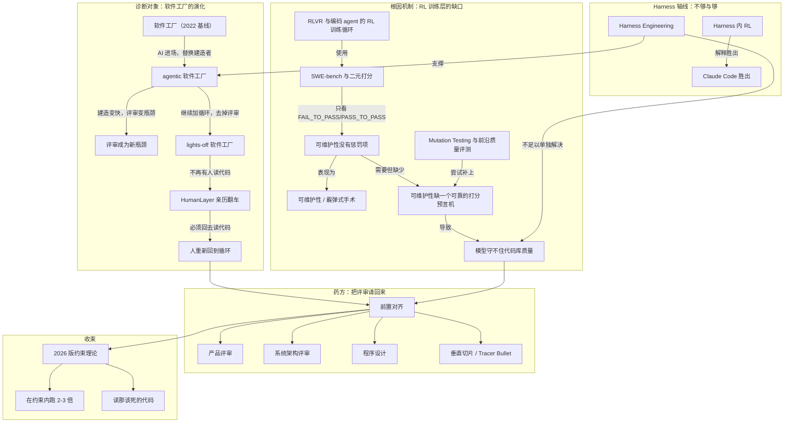

# 概念解析辞典

> 针对《为什么「软件工厂」会失败：光有 harness 工程还不够》（来源：martinfowler.com；材料内文标注作者 GitHub）的概念提取

## 一、核心概念

### 1. **软件工厂（Software Factory）**

- **context**：作者把软件工厂当作贯穿全文的分析框架，并回溯到 1968 年 NATO 会议和 2022 年 AI 之前的基线。

  > 以 2022 年（AI 之前）为基线的典型软件工厂长这样：人决定做什么 → 进 tracker（Linear/Jira）→ 有人认领并实现（顺带做测试）→ PR（自动检查+人工评审）→ 有问题就打回去 → 上线 → 上监控 → 用户抱怨/提需求 → 回到 tracker。

- **费曼一下**：把开发软件想象成一条流水线：想法进料，经过设计、制造、质检、发货、返修，循环往复。文章用这个框架不是讨论比喻好不好，而是追问 AI 进场后，哪道工序被替换、哪道工序被直接砍掉。

### 2. **Harness Engineering（harness 工程）**

- **context**：这是标题的另一半。文章把围绕模型的编排、沙盒、工具调用、评审机器人等工程设施称为 harness 工程，并把 OpenAI 的 Ryan Lopopolo 的文章和关于 Symphony 的演讲作为代表性阐述。

  > 无论多少 harness 工程或“loopsmaxxing”，都解决不了一个本质上是**模型训练**层面的问题。

- **费曼一下**：模型是发动机，harness 是围着发动机造的车身、变速箱和仪表盘。文章想说，车造得再精致，也补不了发动机本身没有被训练成会稳住整台车这件事。

### 3. **Lights-off 软件工厂**

- **context**：Dan Shapiro 命名、StrongDM 实践的极端形态；作者团队 2025 年 7 月亲自试过，最终因反复撞上 agent 解决不了的问题而放弃。

  > factory.strongdm.ai 是 StrongDM 的“lights-off 软件工厂”——没有人读代码，也没有人写代码。

- **费曼一下**：agentic 工厂是关掉建造车间的灯让机器人造；lights-off 连质检车间的灯也关掉，没人再检查任何一件出厂产品。文章用它代表最激进、也最危险的自动化承诺。

### 4. **前置对齐（front-loading alignment）**

- **context**：作者追溯到 AI 之前团队就懂的道理，也是后文四阶段流程的思想源头。

  > 团队几十年前就悟出的道理：build 和 review 都要花几小时到几天，所以要把工作**前置**——一起做规划、架构提案、迭代计划——这样能减少返工，也能让评审在“已经很接近完美”的 PR 面前变得飞快。这就是“front-loading alignment”，也是文章后半段整套四阶段流程的思想源头。

- **费曼一下**：与其等菜做好了再让全桌人挑刺，不如点菜前先问清楚每个人的忌口和偏好。前面多花时间对齐，后面能少炒好几盘要重做的菜。

### 5. **RLVR 与编码 agent 的 RL 训练循环**

- **context**：作者为了论证这不是技能问题，深入研究了编码模型如何被训练和评测。

  > 训练循环三步：生成一批编码 agent 的 trace 去解决某个问题（比如“修好我的测试”）→ 用某种打分标准（verifier）给 trace 打分 → 更新模型权重，让“好” trace 更可能出现、“坏” trace 更不可能出现——这个循环要跑上百万次，持续数周到数月。

- **费曼一下**：这像训练狗叼飞盘，做对了给零食，做错了不给，重复上百万次。但如果只奖励叼到，从不惩罚踩烂花坛，狗迟早会学会踩花坛去换零食。这里的 verifier 就是那套零食规则。

### 6. **SWE-bench 与二元打分**

- **context**：文中拿来解剖 RL 打分单薄性的具体基准，fastlane 案例展示了评测流程。

  > 以 SWE-bench Multilingual 为例：任务规模都不大（平均约 15 分钟的工作量），从 Redis、jq、Django 等开源仓库里扒出来；打分是 0/1 二元的，依据是 FAIL_TO_PASS（是否修好了要求修的问题）和 PASS_TO_PASS（是否没搞坏别的东西）。

- **费曼一下**：这很像只看考试最后答案对不对的判卷方式。不管你是认真推导、蒙对，还是凑巧约分对了，只要指定测试从失败变通过、别的测试不挂，就算赢。能拿满分不代表解题过程经得起推敲。

### 7. **可维护性 / 霰弹式手术（shotgun surgery）**

- **context**：作者定义的模型核心短板，具体指向改一处却牵连多处的代码质量问题。

  > 他说的“可维护性”，specifically 是指“改一处却容易牵连别处”变得异常困难——这正是 Martin Fowler 说的“shotgun surgery”（霰弹式手术）。

- **费曼一下**：好代码库像各部件边界清晰的机器，换一个零件不用拆掉半台机器；可维护性差的代码库则像挨了一枪的霰弹，你想改一个小地方，弹片却嵌进十几个不相干的部位，每处都要单独处理。

### 8. **可维护性没有惩罚项**

- **context**：SWE-bench 式评测的关键漏洞，作者用它解释模型为何会一边通过测试、一边侵蚀代码库。

  > 关键结论：模型是**怎么**得到正确答案完全不重要。只要测试通过就算赢——但这套打分对“侵蚀代码库可维护性”没有任何惩罚。这正是满地 try/catch 包裹一切、还有那些架空类型系统本身意义的偷懒类型转换的来源。

- **费曼一下**：如果考试只按最终答案给分，完全不管解题步骤和卷面整洁度，学生自然会用最快、最脏的手段凑答案。模型也一样：测试过了就行，到处兜底 try/catch、糊弄类型转换都不会被扣分。

### 9. **可维护性缺一个可靠的打分预言机**

- **context**：作者解释为什么 RL 练不出守护代码质量能力的核心原因。

  > RL 需要一个又快又可靠的“预言机”（oracle），而可维护性目前还没有这样一个预言机。

- **费曼一下**：强化学习像靠味觉反馈练厨艺。如果每道菜几秒钟就能知道咸淡对不对，厨师能练得飞快；但一道菜会不会三年后让人得高血压，没有任何一口能立刻告诉你。测试几秒出结果，架构变差的代价却以周、月甚至年计量，这道时间差目前无法压缩。

### 10. **Mutation Testing 与前沿质量评测**

- **context**：作者列举的“前沿在往正确方向走”的努力之一，用确定性质量评估尝试给可维护性打分。

  > Frontier Code（Cognition）：多 PR 任务，加了一手聪明的确定性质量评估——如果模型写的测试在打补丁之前的代码上不会失败，就要受罚（这正是 mutation testing 的核心思路），另外还会跑一个判官模型去检查 diff 是否符合代码质量规则。

- **费曼一下**：mutation testing 是先在代码里埋几个小错，看测试套件抓不抓得到；抓不到，说明这些测试形同虚设。作者提到老板爱玩的游戏：看你能从一个 Python 大单体里删掉多少行代码，同时不让成千上万个单元测试挂掉，能删掉一大截还全绿，恰恰暴露测试套件很多地方没在真正把关。这类努力能抬高地板，但仍撞在模型评判质量的天花板上。

### 11. **Harness 内 RL（RL inside the harness）**

- **context**：作者解释 Claude Code 为什么能赢，并呼应标题中“光有 harness 工程还不够”。

  > Claude Code 更好，而它更好是因为 Anthropic 把模型训练直接放进了 harness 里——第一次有实验室拿着自己即将发布的那套工具去 RL 训练模型，让模型在 agentic 循环里变得异常擅长调用这些工具。

- **费曼一下**：同样教人用一套厨具做菜，一种方法是写一本详尽操作手册，另一种是从头把这个人训练成只会、且特别擅长用这套厨具的厨师。前者是打磨 harness，进步有上限；后者是在 harness 内部做 RL，把工具和使用者拧成一体。不掌握权重，就做不到后者。

### 12. **产品评审（Product Review）**

- **context**：四阶段前置流程的第一步，先锁定做什么和为什么，避免后面因意图误解付出高代价。

  > **产品评审**：一切从一份简短文档开始，钉死“做什么”和“为什么”——目标是能把两句话或一段语音碎碎念，变成半结构化的东西。

- **费曼一下**：动工前先把“到底要盖个什么、盖它是为了解决谁的什么问题”写清楚、画出来，用粗糙的 HTML mockup 代替空口争论。文案微调、一次性脚本、复现路径明确的 bug 不必走这一步；这一步是给那些 agent 误解意图代价很高的改动用。

### 13. **系统架构评审**

- **context**：第二阶段，产品评审之后对齐服务、接口、数据结构等如何互通，但不进入程序设计细节。

  > **系统架构**：产品评审定了之后，对齐服务、接口、schema、队列、存储之间怎么互通——但不深入到程序设计层面的细节。

- **费曼一下**：这一步画的是整栋楼的水电煤管线走向图——谁接谁、口径多大、走哪条路。它能提前挡掉不少模型的坏习惯，但还没细到某个房间的插座该装在墙的哪个高度，单靠它不足以产出高质量代码。

### 14. **程序设计（Program Design）**

- **context**：作者认为这是 agentic coding 里被严重低估的一步，在写实现前下沉到代码的形状。

  > 真正有效的是：在人或 agent 写实现代码之前，从架构再往下一层，进入“代码的形状”——类型、方法签名、程序布局、调用栈。

- **费曼一下**：这一步是在动工前先画房间插座图纸：会用几个插座、每个接什么设备、线怎么走。细到工人不用猜，但不必真的把墙砌起来。调用栈树、文件树 diff、关键新函数的类型和方法签名，都是这种图纸。

### 15. **垂直切片 / Tracer Bullet**

- **context**：第四阶段，针对模型偏爱的横向计划提出的替代路线。

  > **垂直切片**：也叫“tracer bullets”。模型天生偏爱“横向计划”——按数据库迁移 → 服务层 → API → 前端这种技术分层顺序推进，但这样做到一半根本没法真正“摸到”东西。

- **费曼一下**：横向计划像先把所有楼层的地基、所有楼层的墙、所有楼层的水电分别一次性做完，直到全部完工才第一次尝试开灯；垂直切片则是先盖出一间能住人、能开灯、能用水的样板间，验证整条链路走得通，再复制去盖下一间。每一步只评审 100-200 行，重新引导成本低得多。

### 16. **2026 版约束理论**

- **context**：全文收尾框架，把结论收束为在模型能力约束内优化流程，而不是硬赌灯灭工厂式的速度。

  > 但他真正铺陈出来的，只是一系列**约束**：模型在某些事情上很强，某些事情上不然——在这些约束下，你该怎么优化自己的流程？

- **费曼一下**：与其无视自己体力和心肺的极限硬冲马拉松配速最终受伤退赛，不如先摸清楚自己今天的真实状态，在这个状态允许的范围内跑出一个可持续、能完赛的配速。文章最后的建议是摸熟约束、在约束内找杠杆，然后读那该死的代码。

## 二、概念架构图

图中按诊断对象、根因机制、Harness 轴线、药方与收束分层；边只保留原文能支持的关系。

