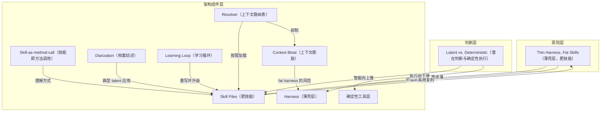

# 概念解析辞典

> 针对《Thin Harness, Fat Skills：harness 才是真正的产品》（Garry Tan，x.com）的概念提取

## 一、核心概念

### 1. **Thin Harness, Fat Skills（薄壳层，肥技能）**

- **context**：这是全文的架构原则，作者用它规定智能与执行的分工方向。

  > "Push intelligence *up* into skills. Push execution *down* into deterministic tooling. Keep the harness *thin*. When you do this, every improvement to the model automatically improves every skill, while the deterministic layer stays perfectly reliable."

- **费曼一下**：本文的核心架构原则：harness 只负责跑模型、读写文件、管上下文、执行安全，保持薄；判断力、流程、领域知识写进可复用的 markdown skill，做厚。方向是智能向上推进 skill，执行向下推进确定性工具。这样模型升级时所有 skill 自动变强，确定性层保持可靠，系统能复利。

### 2. **Harness（薄壳层）**

- **context**：作者定义 harness 时明确限定它只做四件事。

  > "The harness is the program that runs the LLM. It does four things: runs the model in a loop, reads and writes your files, manages context, and enforces safety. That's it. That's the 'thin.'"

- **费曼一下**：Harness 是跑 LLM 的外壳程序，不是模型本身。它只做四件事：循环调用模型、读写文件、管理上下文、执行安全。本文的反模式是 fat harness + thin skills，比如 40+ tool definitions 吃掉一半上下文窗口、God-tools 的 MCP round-trip 需要 2-5 秒、REST API wrapper 把每个 endpoint 变成独立 tool，导致 3 倍 token、延迟、失败率；正确方向是 purpose-built tooling，fast and narrow。

### 3. **Skill Files（技能文件）**

- **context**：作者区分 skill 与用户输入，说明 skill 提供的是过程。

  > "A skill file is a reusable markdown document that teaches the model *how* to do something. Not what to do — the user supplies that. The skill supplies the process."

- **费曼一下**：Skill file 是可复用的 markdown 文档，教模型 how，用户提供 what。它把判断力、流程和领域知识编码成可调用单元，是 fat skills 的载体，作者认为 90% 价值在这里。它像方法调用，可用不同参数复用同一流程，产生不同能力。这不是 prompt engineering，而是用 markdown 作编程语言、人类判断作 runtime 的软件设计。

### 4. **Skill-as-method-call（技能即方法调用）**

- **context**：作者用方法调用解释 skill file 的复用方式。

  > "A skill file works like a method call. It takes parameters. You invoke it with different arguments. The same procedure produces radically different capabilities depending on what you pass in."

- **费曼一下**：这是理解 skill file 的关键比喻：skill 不是固定 prompt，而是一个带参数的方法。同一个流程传入不同 TARGET、QUESTION、DATASET 会产出不同能力。例如 /investigate 指向安全科学家加 210 万封发现邮件是医学研究分析师，指向空壳公司加 FEC 备案文件是法证调查员。它把 skill 从提示词提升为可参数化、可复用的能力单元。

### 5. **Resolver（上下文路由表）**

- **context**：作者把 resolver 定义成上下文路由，并区分它与 skill 的职责。

  > "A resolver is a routing table for context. When task type X appears, load document Y first. Skills tell the model how. Resolvers tell it what to load and when."

- **费曼一下**：Resolver 是上下文路由表，回答“加载什么、何时加载”。Skill 告诉模型 how，resolver 告诉模型 what to load and when。比如开发者改 prompt 时自动先加载 EVALS.md；Claude Code 用每个 skill 的 description 字段把用户意图匹配到 skill。作者自己的 CLAUDE.md 曾膨胀到 20,000 行导致注意力退化，后来砍到 200 行指针文档，让 resolver 按需加载。

### 6. **Latent vs. Deterministic（潜在判断与确定性执行）**

- **context**：作者强调两者不可混淆，并说明它们分别对应智能与信任。

  > "Every step in your system is one or the other, and confusing them is the most common mistake in agent design. Latent space is where intelligence lives. Deterministic is where trust lives."

- **费曼一下**：系统中每一步要么属于 latent，模型阅读、解释、判断，智能所在；要么属于 deterministic，相同输入相同输出，如 SQL、编译、算术，信任所在。混淆两者是 agent 设计最常见错误：8 人晚宴座位可由 LLM 判断，800 人座位是组合优化，塞进 latent space 就会幻觉出看似合理但错误的座位表。架构方向因此是判断向上推进 skill，确定性计算向下推进工具层。

### 7. **Diarization（档案综述）**

- **context**：作者把 diarization 视为知识工作的关键步骤。

  > "Diarization is the step that makes AI useful for real knowledge work. The model reads everything about a subject and writes a structured profile — a single page of judgment distilled from dozens or hundreds of documents."

- **费曼一下**：Diarization 是模型阅读关于某主题的一切，从数十或数百份文档中提炼出一页结构化 profile。它不是 SQL 查询或 RAG 管道能做的，因为模型必须真正阅读、持有矛盾、注意变化、综合出结构化情报。本质是 database lookup 到 analyst's brief 的区别，是 skill 最典型的 latent space 应用。

### 8. **Learning Loop（学习循环）**

- **context**：作者描述规则如何回到 skill file，使 skill 自我重写。

  > "These rules get written back into the skill file. The next run uses them automatically. The skill rewrites itself."

- **费曼一下**：学习循环让 skill 自我进化：/improve skill 读 NPS 调查，diarize 那些“OK”而不是“差”的反馈，提取模式，提出新规则，写回 skill file；下次运行自动使用。通用模式是 retrieve → read → diarize → count → synthesize，然后 survey → investigate → diarize → rewrite the skill。7 月活动 12% “OK” 到下次 4%。Skill 因此是永久升级，模型升级时所有 skill 即刻变强，系统复利。

### 9. **Context Bloat（上下文膨胀）**

- **context**：作者用自己的 CLAUDE.md 教训说明上下文膨胀。

  > "My CLAUDE.md was 20,000 lines. Every quirk, every pattern, every lesson I'd ever encountered. Completely ridiculous. The model's attention degraded."

- **费曼一下**：Context bloat 是把过多信息塞进模型上下文窗口，导致注意力退化。作者的 CLAUDE.md 曾膨胀到 20,000 行，包含每个怪癖、模式、教训，结果模型注意力退化；后来砍到 200 行指针文档，靠 resolver 按需加载。Thin harness 架构的一个核心目标就是最小化 context bloat。

## 二、概念架构图

