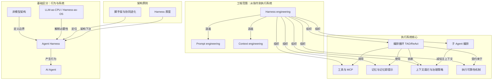

# 概念解析辞典

> 针对《Agent Harness 的本质：把模型放进可控的执行系统》（Akshay，baoyu.io 翻译）的概念提取

## 一、核心概念

### 1. **Agent Harness**

- **context**：作者对 Harness 的完整范围定义。

  > Harness 包裹在大语言模型之外，包含编排循环、工具、记忆、上下文管理、状态持久化、错误处理和护栏。

- **费曼一下**：Agent Harness 是模型外面的完整执行系统。模型负责推理和生成，Harness 负责把推理接进循环、工具、记忆、状态、错误和护栏，让模型从“能生成文本”变成“能执行任务”。本文的核心判断是，生产级 Agent 的差异很大程度来自 Harness 设计。

### 2. **AI Agent**

- **context**：文章把用户看到的行为实体和背后机器分开。

  > AI Agent 是用户感知到的实体：它有目标、调用工具、尝试纠错。
  >
  > Harness 是产生这种实体行为的机器：开发者说“我做了一个 Agent”，实际含义通常是做了一套 Harness 并接入模型。

- **费曼一下**：AI Agent 是用户看到的“会做事的东西”。它看起来有目标、会用工具、会纠错；但这些行为不是裸模型单独产生的，而是模型和 Harness 共同产生的外在表现。区分 AI Agent 和 Harness，是为了不把系统行为误当成模型能力。

### 3. **非模型架构（Non-model Architecture）**

- **context**：文章用排除法给出 Harness 的边界。

  > Vivek Trivedy 的定义公式是：如果某个部分不是模型本身，那它就是 Harness。
  >
  > Anthropic 和 OpenAI 都把 Agent/Harness 用来指代让大语言模型真正发挥作用的非模型架构。

- **费曼一下**：非模型架构指模型本体之外、但让模型真正运行起来的所有部分。文章用它来界定 Harness：凡是负责运行、组织、限制、连接、恢复和验证的，都不是模型本身，而是 Harness。这个边界让讨论 Agent 时不再把所有能力都归给模型。

### 4. **LLM-as-CPU / Harness-as-OS**

- **context**：作者用操作系统类比解释为什么裸模型不够。

  > 原生大语言模型类似没有内存、硬盘和输入输出设备的 CPU。
  >
  > 上下文窗口相当于内存，外部数据库相当于硬盘，工具集成相当于设备驱动。
  >
  > Harness 则是操作系统：它把这些资源和机制组织起来，让模型从“能生成文本”变成“能执行任务”。

- **费曼一下**：裸 LLM 像只有计算能力的 CPU，不能自己管理内存、存储和设备。Harness 像操作系统，把上下文、数据库、工具和权限组织起来，使模型能执行任务。这个类比说明，Agent 能力不是模型单点能力，而是“计算核心 + 执行系统”的结果。

### 5. **提示词工程（Prompt Engineering）**

- **context**：文章把提示词工程放在三层工程化的最内层。

  > 提示词工程关注模型接收到什么指令。
  >
  > 它是最靠近模型输入的一层，但不足以解决完整执行系统的问题。

- **费曼一下**：提示词工程解决“怎么告诉模型”的问题。它影响模型当前收到什么指令，但不能管理长期执行、工具调用、状态恢复和安全边界。因此它是 Harness 工程的一部分，而不是完整 Agent 系统本身。

### 6. **上下文工程（Context Engineering）**

- **context**：上下文工程管理模型视野以及上下文窗口的稀缺性。

  > 上下文工程关注模型在什么时间点能看到什么内容。
  >
  > 它把上下文窗口视为稀缺资源，决定哪些信息进入窗口、哪些信息被压缩、检索或隐藏。

- **费曼一下**：上下文工程是在管理模型每一步能看到什么。它把上下文窗口当作稀缺资源，决定哪些信息进入、哪些被压缩、隐藏或按需加载。它比提示词工程更宽，但仍不处理工具编排、状态持久化和安全执行等完整应用架构问题。

### 7. **Harness 工程（Harness Engineering）**

- **context**：文章把 Harness 工程定义为覆盖提示词和上下文的完整应用架构工程。

  > Harness 工程涵盖提示词和上下文，同时加入应用架构层面的设计。
  >
  > 它处理工具编排、状态持久化、错误恢复、验证循环、安全执行和生命周期管理。
  >
  > 文章强调，Harness 不是提示词外面套一层壳，而是让 Agent 可以自主行动的完整系统。

- **费曼一下**：Harness 工程是本文最大的工程框架。它包含提示词和上下文，但还加入工具、状态、错误、验证、安全和生命周期。它要解决的不是“怎么写更好的提示词”，而是如何让模型在完整执行系统中自主行动。

### 8. **编排循环（TAO / ReAct）**

- **context**：编排循环是 Harness 的心脏，也被 Anthropic 称为“笨循环”。

  > 编排循环实现 Thought-Action-Observation，也就是思考、行动、观察的连续过程。
  >
  > 技术上它可能只是一个 while 循环，但复杂性来自循环内部要维护的状态、工具调用、错误反馈和退出条件。
  >
  > Anthropic 把运行时称为“笨循环”：智慧留给模型，Harness 管理回合切换。

- **费曼一下**：编排循环按“思考、行动、观察”反复推进任务。它表面像一个 while 循环，但真正复杂的是维护状态、处理工具调用、反馈错误和判断何时退出。所谓“笨循环”是让模型负责智慧，Harness 只负责稳定推进回合。

### 9. **工具与 MCP（Tools / MCP）**

- **context**：工具是模型连接外部世界的结构化接口。

  > 工具以结构化模式暴露给模型，包括名称、描述和参数类型。
  >
  > 工具层要完成注册、校验、参数提取、沙箱执行、结果捕获和观察结果格式化。
  >
  > Claude Code、OpenAI Agents SDK 和 MCP 都体现了工具层在生产 Agent 中的中心位置。

- **费曼一下**：工具是模型触达外部世界的双手。Harness 把工具以名称、描述和参数模式暴露给模型，并负责注册、校验、沙箱执行、捕获结果和格式化观察。MCP 在文中代表一种开放的工具接入标准，使工具可以被标准化接入 Harness。没有工具，模型只能生成文本，不能行动。

### 10. **记忆与记忆即提示（Memory / Memory as Prompt）**

- **context**：记忆跨越不同时间尺度，但文章强调它不能当作事实本身。

  > 短期记忆是单次会话里的对话历史。
  >
  > 长期记忆跨越会话存在，可以表现为项目文件、memory.md、命名空间 JSON 存储、SQLite/Redis 会话存储等。
  >
  > 文章强调一个设计原则：Agent 应把记忆看作提示，行动前仍要根据现实状态验证。

- **费曼一下**：记忆分短期会话历史和长期跨会话存储。它让 Agent 能延续当前任务，也能调用过去保存的知识。但记忆不是事实，而是给模型的线索；Agent 行动前要根据现实状态验证，避免把过时或幻觉记忆当成真实情况。

### 11. **上下文腐烂与上下文治理策略（Context Rot / Compaction / Observation Masking / Just-in-time Retrieval）**

- **context**：文章先指出上下文窗口信号变差的问题，再给出生产策略。

  > 许多 Agent 失败来自上下文窗口中的信号变差。
  >
  > 当关键信息处于窗口中间位置时，模型表现会下降；即使窗口达到百万级 token，指令遵循能力也会随上下文增长退化。
  >
  > 生产策略包括压缩、观察掩码、即时检索和子 Agent 委托。
  >
  > 上下文工程的目标是找到最小但信号最强的 token 集合。

- **费曼一下**：上下文腐烂指窗口变大但信号变差，关键信息位置不好也会让模型表现下降。Harness 用压缩、观察掩码、即时检索和子 Agent 委托来治理：压缩浓缩历史，观察掩码隐藏旧工具输出，即时检索按需加载，子 Agent 返回压缩摘要。目标是留下最小但信号最强的 token 集合。

### 12. **执行可靠性机制（State / Error / Guardrails / Verification）**

- **context**：状态、错误处理、护栏和验证共同构成生产级 Agent 的稳定性基础。

  > Checkpointing 让系统中断后可以恢复，也让调试可以回到过去状态。
  >
  > 多步骤流程的整体成功率会随步骤数量下降；10 个 99% 成功率的步骤串联后，全流程成功率只有约 90.4%。
  >
  > Harness 的错误处理不是简单报错，而是决定重试、反馈给模型、暂停等待人类，或上报调试。
  >
  > 一旦触发 tripwire，Agent 会立即停止。
  >
  > Anthropic 的结构把模型推理与权限执行分离：模型决定想做什么，Harness 决定能不能做。
  >
  > 验证循环区分玩具演示和生产级 Agent。

- **费曼一下**：执行可靠性机制让 Agent 可恢复、可约束、可检查。状态和 checkpoint 保证中断后能恢复；错误处理防止小失败滚成大失败；护栏和 tripwire 提供绝对停止与权限边界，模型可以“想”调用什么，但 Harness 决定“允不允许”；验证循环让 Agent 检查工作结果。没有这组机制，Agent 只能做演示，难以进入生产。

### 13. **子 Agent 编排（Subagent Orchestration）**

- **context**：子 Agent 把探索和控制拆开，降低主上下文负担。

  > Claude Code 支持克隆、队友、工作树三种子 Agent 模式。
  >
  > OpenAI 支持把 Agent 作为工具，或把任务移交给另一个专家 Agent。
  >
  > 子 Agent 的价值在于深度探索后返回压缩摘要，降低主上下文负担。

- **费曼一下**：子 Agent 编排是把复杂任务拆给子 Agent 去探索、执行，再让它们返回压缩摘要。主 Agent 不必把所有细节都塞进自己的上下文。这样既支持多 Agent 协作，也减轻主上下文负担。

### 14. **脚手架比喻与协同进化（Scaffolding / Co-evolution）**

- **context**：文章用脚手架说明 Harness 的定位，并预期它会随模型变强而变薄。

  > 脚手架本身不盖房子，但让工人到达原本够不到的位置。
  >
  > Harness 本身不是智能来源，但让模型获得工具、状态、反馈和安全边界。
  >
  > 随着模型能力提升，Harness 的复杂度应该逐渐降低。
  >
  > 文章把这称为协同进化：模型训练已经开始考虑 Harness 的存在。

- **费曼一下**：脚手架比喻说明 Harness 本身不是智能，而是支撑模型行动的外部结构，让模型到达单独够不到的执行高度。协同进化指模型和 Harness 一起演化：模型变强后，Harness 可以变薄，但不会消失；好的 Harness 会在模型升级时自然受益。

### 15. **Harness 厚度（Harness Thickness）**

- **context**：厚度是架构师在系统确定性和模型自由度之间的下注。

  > 架构师要决定多少逻辑写死在系统中，多少逻辑交给模型发挥。
  >
  > Harness 厚度是一种架构下注。

- **费曼一下**：Harness 厚度是系统写死逻辑和模型自由发挥之间的比例。写死更多，系统更可控但可能僵化；交给模型更多，系统更灵活但边界更难保证。它是 Agent 架构必须做的取舍，也呼应“Harness 会变薄但不会消失”的判断。

## 二、概念架构图

