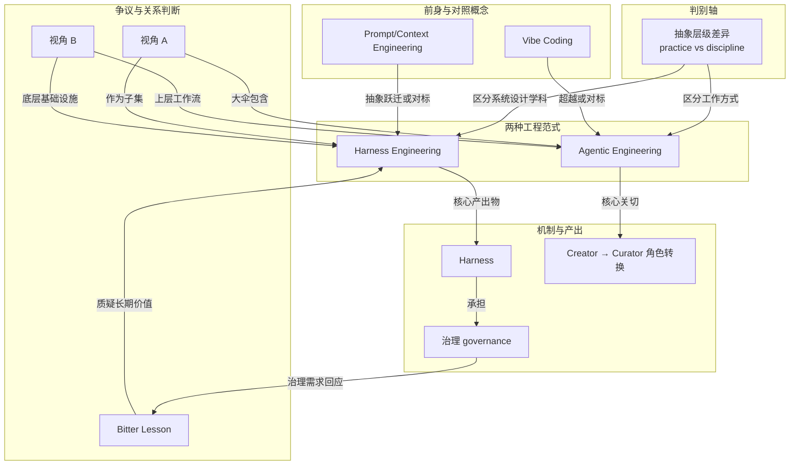

# 概念解析辞典

> 针对《Harness Engineering vs Agentic Engineering：两种工程范式的概念辨析》（martinfowler.com 材料；文中标注作者 howie.serious）的概念提取

## 一、核心概念

### 1. **抽象层级差异（practice vs discipline）**

- **context**：文章开篇把它作为核心命题的判别轴，先防止两个概念被混为一谈。

  > Agentic Engineering 与 Harness Engineering 是 2026 年初几乎同时火起来的两个概念，容易混淆但指向完全不同的抽象层级
  
  > Agentic Engineering（智能体工程）回答的是：「人类如何与 AI Agent 协作来做软件开发？」——描述的是一种工作方式（practice）
  
  > Harness Engineering（驾具工程）回答的是：「如何设计让 Agent 可靠运行的环境和基础设施？」——描述的是一种系统设计学科（discipline）

- **费曼一下**：这是全文的主轴。Agentic Engineering 讲的是人和 Agent 一起干活的方式，Harness Engineering 讲的是让 Agent 可靠跑起来的系统怎么设计。一个偏工作方式，一个偏工程学科；拿掉这个区分，读者会把两者误读成同一层级的同义词。

### 2. **Agentic Engineering（智能体工程）**

- **context**：文章把它定位为工作流层面的问题，而不是系统设计学科。

  > Agentic Engineering 回答的是一个工作流层面的问题：人类如何与 AI Agent 协作来做软件开发？它描述的是一种工作方式（practice），而非一门工程学科。

- **费曼一下**：Agentic Engineering 是 Agent 时代的协作实践。它由 Andrej Karpathy 在 2026 年 1 月命名，对标 Vibe Coding，关注人怎么委派、审查、持有最终责任，核心问题是人类开发者如何编排 Agent、定义目标和护栏、验证输出。它解决的是人和 Agent 之间的工作流问题，而不是 Agent 运行环境本身怎么造。

### 3. **Harness Engineering（驾具工程）**

- **context**：文章明确把它与 Agentic Engineering 的工作流问题切开。

  > Harness Engineering 聚焦的完全是另一个问题。它不关心「人类该怎么跟 Agent 合作」这个工作流问题，它关心的是：如何设计约束、工具链、反馈循环、文档系统和生命周期管理，使得 Agent 在数千次迭代中始终产出正确、可审计、可恢复、可扩展的工作。

- **费曼一下**：Harness Engineering 是给 AI Agent 设计运行环境和约束装置的学科。它由 Mitchell Hashimoto 在 2026 年 2 月命名，对标 Prompt/Context Engineering，但抽象层级更高：从单次调用优化，升级到系统级运行环境设计。它要回答的是，怎样让 Agent 在长期、大量迭代中仍然可靠、可审计、可恢复、可扩展。它的产出是 Linter、AGENTS.md、CI 管道、skill 系统等基础设施，而不是人与人协作的流程本身。

### 4. **Harness（驾具）**

- **context**：文章用 LangChain 的实验说明 Harness 的杠杆作用，并用比喻说明它和模型的关系。

  > LangChain 的编码 Agent 在 Terminal Bench 2.0 上从 Top 30 跃升到 Top 5——没换模型，只改了 Harness。
  
  > 模型是马，Harness 是缰绳

- **费曼一下**：Harness 是 Harness Engineering 的核心产出物，指 Agent 运行环境和约束装置的总称，包括 Linter、AGENTS.md、CI 管道、skill 系统、反馈循环、工具链等。它之所以承重，是因为 LangChain 的例子证明：模型没变，只改 Harness 就能显著改变 Agent 表现。它把抽象的 Harness Engineering 落到了一个具体对象上。

### 5. **Prompt/Context Engineering**

- **context**：文章把它设为 Harness Engineering 的对比对象，用来标出抽象层级的跃迁。

  > 对比对象 Prompt/Context Engineering
  
  > 对标 Prompt/Context Engineering，但抽象层级更高：从「单次调用优化」升级到「系统级运行环境设计」。

- **费曼一下**：Prompt/Context Engineering 在文中不是主角，而是边界概念。它代表更早、更局部的优化层：关心一次调用、一个上下文窗口怎么写得更好。Harness Engineering 则把问题扩大到整个运行环境、约束系统和生命周期。去掉它，读者就不容易看出 Harness Engineering 到底比什么更高一层。

### 6. **Vibe Coding（随性编码）**

- **context**：文章把它作为 Agentic Engineering 的前一个阶段和对标对象。

  > Karpathy 认为行业已超越 vibe coding 阶段，走向更结构化的方向：「Agent 编排写代码，人类开发者监督和验证输出」
  
  > 对比对象 Vibe Coding（随性编码）

- **费曼一下**：Vibe Coding 是跟着感觉走的编程方式：把需求抛给 AI，不强调系统规划、结构化和严格审查。文章用它来定义 Agentic Engineering 的进化方向：行业从随性编码走向更结构化的协作方式。它是一个对照概念，帮读者看出 Agentic Engineering 不是简单的 AI 写代码，而是更结构化的角色分工和验证流程。

### 7. **Creator → Curator 角色转换**

- **context**：文章把角色转换列为 Agentic Engineering 的核心关切，并列出具体变化。

  > 核心关切是角色转换——工程师从创造者（creator）变为策展人（curator）
  
  > 花更少时间写基础代码
  
  > 花更多时间编排 AI Agent 组合、定义目标和护栏、验证输出
  
  > 核心技能从语法变成系统思维

- **费曼一下**：这是 Agentic Engineering 在人这一侧的含义。工程师不再主要是亲手写基础代码的人，而是编排 Agent、定义目标和护栏、验证输出的人。核心技能从语法转向系统思维。拿掉它，Agentic Engineering 就只剩下工具使用，读者看不到人的角色究竟发生了什么变化。

### 8. **Bitter Lesson（苦涩教训）**

- **context**：文章用它引出对 Harness Engineering 长期价值的质疑。

  > 人们在推理模型之上构建脚手架，但这些脚手架最终可能会被更强大的模型取代（经典的苦涩教训论点）
  
  > 长期看，通用的计算力扩展总是胜过人类工程师手工设计的巧妙方案。

- **费曼一下**：Bitter Lesson 是本文的张力来源。它质疑：随着模型变强，今天手工设计的脚手架、Harness 和约束装置，会不会最终被更强的通用模型取代？如果读者不理解这个反论，就看不出作者为什么需要专门反驳，也看不出 Harness Engineering 面临的核心争议是什么。

### 9. **治理（governance）**

- **context**：这是作者回应 Bitter Lesson 的关键概念，划出 Harness 不能只被理解为补模型短板。

  > Harness 不只是弥补模型缺陷，它也在做治理（governance）——权限控制、审计追踪、合规性验证。模型能力越强、自主性越高，这些需求反而更加重要

- **费曼一下**：治理是作者反驳 Bitter Lesson 的支点。Harness 的价值不只是在模型不够强时补漏洞；它还负责权限控制、审计追踪、合规性验证。模型越强、自主性越高，这些需求反而越不能省。拿掉治理，读者可能接受脚手架终将被模型取代的结论，也就看不到作者为什么认为 Harness Engineering 仍然承重。

### 10. **视角 A / 视角 B**

- **context**：文章对两者的层级关系给出两种视角，并明确作者选择。

  > 视角 A：Agentic Engineering 是上层大伞，Harness Engineering 是子集
  
  > 视角 B：Harness Engineering 是底层基础设施，Agentic Engineering 是上层工作流
  
  作者倾向视角 B：
  
  > 你可以在几周内微调出有竞争力的模型，但构建生产级的 Harness 需要几个月甚至几年。Harness 是护城河，Agentic Engineering 是护城河之上的城堡。

- **费曼一下**：这是全文的关系判断框架。视角 A 把 Harness Engineering 看作 Agentic Engineering 实践中的一部分；视角 B 则把 Harness Engineering 看作地基，Agentic Engineering 是建在其上的工作流。作者选择视角 B，并用护城河与城堡的比喻说明：Harness 是更底层的壁垒，Agentic Engineering 的上层实践依赖 Harness 提供的可靠性。没有这个框架，读者只能看到两个概念并列，看不到作者如何给它们排位。

## 二、概念架构图

