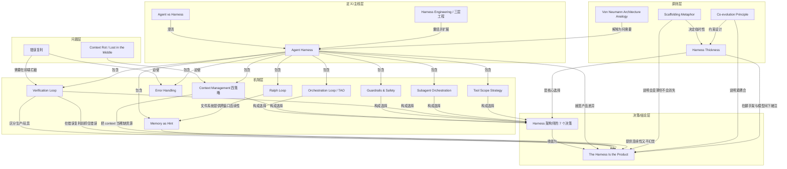

# 概念解析辞典

> 针对《The Anatomy of an Agent Harness》（blog.langchain.com／LangChain；材料内文标注作者 Akshay）的概念提取

## 一、核心概念

### 1. **Agent Harness（代理马具 / 智能体脚手架）**

- **context**：材料先给出定义，再引用 LangChain Vivek Trivedy 的二分公式。

  > 包裹 LLM 的全部软件基础设施——orchestration loop、tools、memory、context management、state persistence、error handling、guardrails。
  >
  > “If you're not the model, you're the harness.”

- **费曼一下**：在本文里，harness 不是某个提示词模板，也不是某个框架名，而是包裹 LLM 的全部软件基础设施。模型只负责生成；harness 负责让生成变成可执行、可恢复、可验证的 agent 行为。它承重，因为全文的因果链都从这里开始：同一个模型换 harness，表现会剧变。

### 2. **Agent vs Harness（agent 与 harness 的区分）**

- **context**：作者用这个区分把用户看到的行为和产生行为的机器分开。

  > **agent** = 涌现行为（用户看到的那个目标导向、会用工具、能自我纠错的实体）
  >
  > **harness** = 产生这个行为的机器
  >
  > “我搭了个 agent” 本质是 “我搭了个 harness，对准一个模型”

- **费曼一下**：用户看到的 agent 是行为结果；harness 是产生行为的机器。这个区分解决了常见的混淆：把产品体验当成模型能力，或把 harness 当成无关外壳。说“我搭了个 agent”，在本文框架里等于说“我搭了个 harness，对准一个模型”。

### 3. **Harness Engineering（三层工程）**

- **context**：作者把 prompt、context、harness 三层工程并列，并强调 harness engineering 是更外层的完整系统。

  > **Prompt engineering**：打磨给模型的指令
  >
  > **Context engineering**：管理模型看到什么、何时看到
  >
  > **Harness engineering**：囊括以上两者，加上整个应用基础设施——tool orchestration、state persistence、error recovery、verification loops、safety enforcement、lifecycle management
  >
  > 一句话：harness 不是 “包在 prompt 外的壳”，而是让自主 agent 行为成为可能的完整系统

- **费曼一下**：三层工程不是三个并列技巧，而是包覆关系。Prompt 管指令，Context 管模型看到什么，Harness 管整个系统能不能在生产里跑。它承重，因为文章要把 harness 从 prompt 工程里拔出来，说明它包含更广的基础设施。

### 4. **Orchestration Loop / TAO / ReAct Loop（编排循环）**

- **context**：这是 harness 的心跳，也是 agent 循环的基本形状。

  > **Orchestration Loop（编排循环）**：心跳，实现 TAO（Thought-Action-Observation）即 ReAct 循环。Anthropic 称自己的 runtime 为 “dumb loop”——智能都在模型里，harness 只管轮次。

- **费曼一下**：这是 agent 的心跳。它反复执行 TAO/ReAct：想、做、看结果，再回到想。关键边界是 Anthropic 说的 dumb loop：循环本身不聪明，智能在模型里，harness 只负责轮次和状态推进。

### 5. **Context Rot / Lost in the Middle（上下文腐烂 / 中间遗失）**

- **context**：作者把 context rot 与位置效应放在一起，作为 context 管理的核心问题。

  > 核心问题 **context rot**：关键内容落在窗口中段时，模型性能下降 30%+（Chroma 研究 + Stanford “Lost in the Middle”）
  >
  > million-token 窗口也会随着 context 变长，指令跟随能力下降
  >
  > 重要 context 放首尾（Lost in the Middle）

- **费曼一下**：上下文不是越大越好。关键内容落在中段，模型性能会下降；即使百万 token 窗口，context 变长也会削弱指令跟随。Lost in the Middle 给出位置边界：重要信息放首尾。这两点解释了为什么 context 必须被当作稀缺资源管理。

### 6. **Context Management 四策略（Compaction / Observation Masking / Just-in-Time Retrieval / Sub-agent Delegation）**

- **context**：作者列出生产 harness 对 context 的四种处理方式，并引用 Anthropic 的目标。

  > 生产策略：compaction、observation masking、just-in-time retrieval、sub-agent delegation
  >
  > Anthropic 的目标：“smallest possible set of high-signal tokens”——最小但高信号的 token 集合

- **费曼一下**：四种生产策略都是对同一稀缺资源的操作：压缩旧历史、遮住旧工具输出、需要时再检索、把探索交给子 agent 并只返回摘要。它们的目标不是塞更多 token，而是只保留高信号 token。边界是：不是简单截断，而是按信号和时机管理。

### 7. **Memory as Hint（记忆作为提示）**

- **context**：作者把记忆分成多时间尺度，并给出一条关键原则。

  > **Memory（记忆）**：多时间尺度
  >
  > - 短期：单会话对话历史
  >
  > - 长期：跨会话持久化（Anthropic 用 CLAUDE.md + MEMORY.md；LangGraph 用 namespace 化 JSON Stores；OpenAI 用 SQLite/Redis Sessions）
  >
  > Claude Code 三层分级：轻量索引（~150 字符/条常驻）→ 按需详细主题文件 → 原始 transcript 仅通过搜索访问
  >
  > **关键原则**：agent 把自己的 memory 当 “hint”，行动前必须对照实际状态验证

- **费曼一下**：Memory 给 agent 跨会话和会话内的连续性，但本文强调它只是 hint，不是事实本身。行动前必须对照实际状态验证。这个边界防止把记忆当 ground truth，导致幻觉或错误复利。

### 8. **Error Handling / 错误复利**

- **context**：作者用乘法说明错误为什么会放大，并列出 LangGraph 的四类错误处理。

  > **Error Handling**：错误会复利式放大——99% 单步成功率 × 10 步 = 90.4% 端到端成功率
  >
  > LangGraph 区分四类错误：transient（退避重试）、LLM-recoverable（把 error 作为 ToolMessage 让模型调整）、user-fixable（中断请求人类输入）、unexpected（上抛调试）
  >
  > Stripe 生产 harness 重试上限 = 2

- **费曼一下**：错误会复利：单步 99% 成功率，十步后只剩 90.4%。所以 harness 必须分类错误并分别处理：暂时性重试、可恢复的交给模型、需要人修的请求人类、意外错误上抛。Stripe 重试上限为 2，说明重试不是无限兜底。

### 9. **Guardrails and Safety（护栏与安全）**

- **context**：作者把安全拆成 OpenAI 的三级护栏和 Anthropic 的架构分离。

  > OpenAI 三级：input guardrails、output guardrails、tool guardrails。tripwire 触发立即停机。
  >
  > Anthropic 把权限执法与模型推理**在架构上分开**——模型决定尝试什么，工具系统决定允许什么。Claude Code 独立管理 ~40 个工具能力：项目加载时建立信任 → 每次工具调用前权限检查 → 高危操作显式用户确认

- **费曼一下**：安全边界不是靠一句提示词。本文的关键是架构分离：模型决定尝试什么，工具系统决定允许什么。权限检查在每次工具调用前发生，高危操作要显式确认，tripwire 触发立即停机。它定义权限边界和绝对禁止规则。

### 10. **Verification Loop（验证循环）**

- **context**：作者称验证循环是生产级与玩具 demo 的分水岭。

  > **Verification Loops**：区分玩具 demo 与生产级 agent 的关键
  >
  > 三种方式：rules-based（测试/lint/类型检查）、visual（Playwright 截图）、LLM-as-judge
  >
  > Boris Cherny（Claude Code 作者）：**给模型一个验证自己工作的方式，质量提升 2-3 倍**

- **费曼一下**：验证循环让 agent 检查自己干得对不对，是玩具 demo 与生产 agent 的分水岭。方式可以是规则、视觉或 LLM 裁判。Boris Cherny 说给模型验证自己工作的方式，质量提升 2-3 倍。它承重，因为它在错误复利前拦截错误。

### 11. **Subagent Orchestration（子 agent 编排）**

- **context**：作者展示多 agent 的执行模型，同时给出何时拆多 agent 的边界。

  > Claude Code 三种执行模型：Fork（父 context 字节级副本）、Teammate（独立终端面板 + 文件邮箱）、Worktree（独立 git worktree，按 agent 隔离分支）
  >
  > OpenAI：agents-as-tools（专家处理有边界的子任务）与 handoffs（专家全权接管）
  >
  > **单 agent vs 多 agent**：Anthropic 和 OpenAI 都说——先把单 agent 用到极致。多 agent 带路由开销、handoff 会丢 context。只有工具过载 ＞ ~10 个重叠工具、或任务域明显分离时才拆。

- **费曼一下**：子 agent 编排回答多 agent 怎么分工、怎么隔离 context。Fork、Teammate、Worktree、agents-as-tools、handoffs、嵌套状态图都是不同执行模型。边界是：多 agent 有路由开销和 handoff 丢 context，所以先把单 agent 用到极致，只有工具过载或任务域明显分离才拆。

### 12. **Tool Scope Strategy（工具范围策略）**

- **context**：作者用 Vercel 和 Claude Code 的例子说明工具不是越多越好。

  > **工具范围策略**：工具越多往往性能越差。Vercel 从 v0 砍掉 **80% 工具**反而更好。Claude Code 靠 lazy loading 做到 **95% context 削减**。原则：只暴露当前步骤最小必要工具集。

- **费曼一下**：工具不是越多越好。工具定义占 context，也扩大选择空间。Vercel 砍 80% 工具反而更好，Claude Code 用 lazy loading 削减 95% context。原则是只暴露当前步骤最小必要工具集。这是工具暴露的边界规则。

### 13. **Ralph Loop（双阶段长任务模式）**

- **context**：作者用 Anthropic 的 Ralph Loop 说明长任务如何跨 context window。

  > **跨 context window 的长任务：Ralph Loop 双阶段模式（Anthropic）**
  >
  > **Initializer Agent**：初始化环境（init 脚本、progress 文件、feature 清单、初始 git commit）
  >
  > **Coding Agent**：后续每个 session 先读 git log 和 progress 文件回忆自己干到哪，选最高优先级未完成 feature，干活 → commit → 写摘要
  >
  > **文件系统提供跨 context window 的连续性**

- **费曼一下**：长任务跨多个 context window 时，Ralph Loop 用两阶段：Initializer Agent 建环境和记录，Coding Agent 每个 session 先读 git log 和 progress 文件回忆进度。文件系统提供跨 context window 的连续性。它解决的是单窗口装不下长任务的问题。

### 14. **Von Neumann Architecture Analogy（冯·诺依曼架构类比）**

- **context**：作者用计算机架构逐项对应 LLM、context window、数据库、工具和 harness。

  > 原始 LLM = 没有 RAM、磁盘、I/O 的 CPU
  >
  > context window = RAM（快但小）
  >
  > 外部数据库 = 磁盘（大但慢）
  >
  > 工具集成 = 设备驱动
  >
  > **harness = 操作系统**
  >
  > “We have reinvented the Von Neumann architecture”——这是任何计算系统的自然抽象

- **费曼一下**：这个类比说明 LLM 本身只是 CPU，没有 RAM、磁盘、I/O。context window 是 RAM，外部数据库是磁盘，工具是设备驱动，harness 是操作系统。它承重，因为解释了 harness 为什么不是可选装饰，而是计算系统的自然抽象。

### 15. **Scaffolding Metaphor（脚手架隐喻）**

- **context**：作者强调脚手架是临时基础设施，并引用 Manus 的删复杂度实践。

  > 建筑脚手架是临时基础设施——它不做建造，但没它工人上不去
  >
  > **关键洞察：建完楼，脚手架就拆掉。** 模型越强，harness 复杂度应越小。Manus 六个月重写五次，每次都在**删**复杂度——复杂工具定义 → 通用 shell 执行；“管理 agent” → 简单结构化 handoff

- **费曼一下**：脚手架是临时支撑，建完就拆。模型越强，harness 复杂度应越小。Manus 五次重写都在删复杂度，不是堆功能。它定义了 harness 的时间边界：会变薄，但不是一开始就可以没有。

### 16. **Co-evolution Principle（协同进化原则）**

- **context**：作者说模型和 harness 是一起 post-train 的，并给出 future-proofing test。

  > **Co-evolution Principle（协同进化原则）**：模型现在是带着特定 harness 一起 post-train 的。Claude Code 的模型就是用它的 harness 训出来的。换工具实现就会掉分——紧耦合。
  >
  > **“Future-proofing test”**：若模型升级后 harness 不需要加复杂度，性能就随之提升——那么设计是好的

- **费曼一下**：模型和 harness 不是先各自独立造好再拼接，而是带着特定 harness 一起 post-train。换工具实现可能掉分，因为紧耦合。Future-proofing test 给出判断：模型升级后 harness 不必加复杂度，性能就提升，才是好设计。

### 17. **Harness Thickness（马具厚度）**

- **context**：作者把厚度问题定义为架构哲学分歧。

  > **Harness 厚度（Harness Thickness）**：多少逻辑放 harness、多少交给模型。Anthropic 押注薄 harness + 模型升级；图式框架押注显式控制。Anthropic 会随新模型版本内化规划能力，**主动从 Claude Code 的 harness 中删除规划步骤**。

- **费曼一下**：厚度问题是把多少逻辑放 harness，多少交给模型。薄 harness 相信模型升级会内化能力，厚 harness 相信显式控制。Anthropic 会主动从 Claude Code 的 harness 中删除规划步骤。它是全文的核心设计分歧，不是代码行数问题。

### 18. **The Harness Is the Product（harness 就是产品）**

- **context**：作者用 TerminalBench 证据收束全文，并说明模型变强后 harness 的命运。

  > 同一个模型，不同 harness 设计，可以产生截然不同的表现。TerminalBench 证据清楚：**仅换 harness，agent 在排行榜上移动 20+ 位**。
  >
  > harness 不是已解决的问题，也不是 commodity 层——硬工程都在这里：把 context 当稀缺资源管理、设计能在错误复利前抓住它们的验证循环、搭既提供连续性又不幻觉的记忆系统、在 “造多少脚手架 vs 留多少给模型” 之间下架构赌注
  >
  > 趋势：随模型变强，harness 在变薄。但不会消失——最强的模型也需要东西去管它的 context、执行它的 tool call、持久化它的状态、验证它的工作

- **费曼一下**：结论是同一个模型配不同 harness，表现能差到排行榜移动 20+ 位。harness 不是已解决或 commodity 层，硬工程在 context 管理、验证循环、记忆系统、脚手架与模型之间的架构赌注。模型变强会让 harness 变薄，但不会消失。

## 二、概念架构图

下图按功能角色分层：问题层解释为什么需要 harness，定义层给出主线，机制层展示生产 harness 的承重部件，原则层给出设计约束，决策/结论层收拢为架构选择与最终论点。

