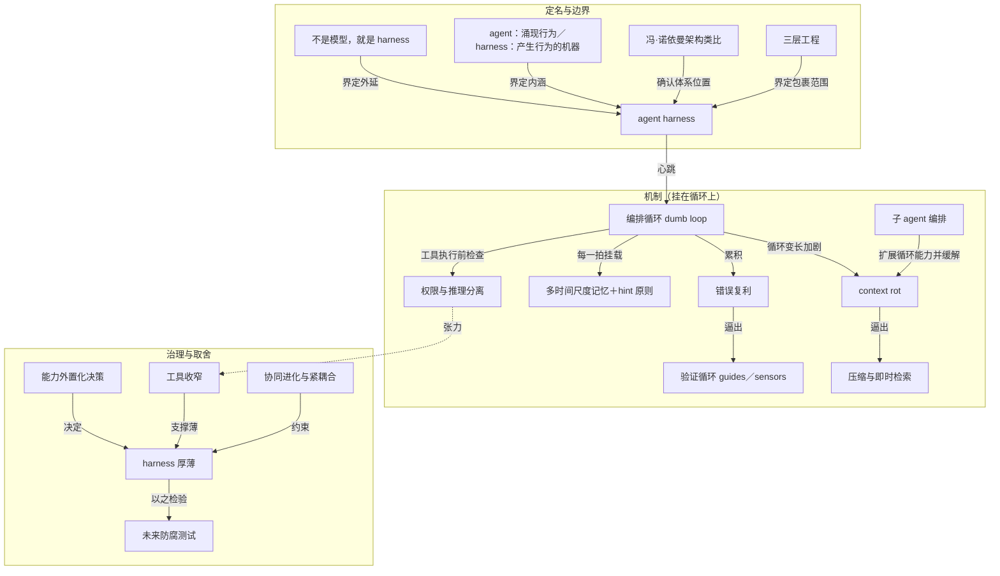

# 概念解析辞典

> 针对《一个被 harness 套住的 LLM agent：这个词到底指什么》（来源标注：openai.github.io／OpenAI；原文：Akshay Pachaar 推文）的概念提取

## 一、核心概念

### 1. **agent harness（智能体套具）**

- **context**：全文的中心概念，术语在 2026 年初被正式定名，所指早已存在。Anthropic 与 OpenAI 的团队用同一套 framing 指认它。

  > 「agent harness」这个词在 2026 年初被正式定名，但东西早就存在。它指的是包裹 LLM 的完整软件基础设施。
  >
  > OpenAI 的 Codex 团队用同一套 framing，明确把「agent」与「harness」等同起来，指的都是让 LLM 变得有用的**非模型基础设施**（non-model infrastructure）。

- **费曼一下**：harness 就是模型之外那一整套让模型能真正干活的软件——编排循环、工具、记忆、上下文管理、状态、错误处理、护栏都在里面。它解决的理解难点是：模型本身不构成产品，产品是模型加上这一整层。它承重，因为全文所有机制和取舍都以它为坐标。

### 2. **「If you're not the model, you're the harness」**

- **context**：LangChain 的 Vivek Trivedy 给出的划界公式，被本文当作整个系统的切分线。

  > LangChain 的 Vivek Trivedy 给了一句划界公式：「If you're not the model, you're the harness.」

- **费曼一下**：这条公式把系统一刀切成两半——模型权重在一侧，其余全部工程在另一侧。它的力量在于取消了中间地带：你写的调度、压缩、权限闸门，全都落在同一侧，没有「这是模型的问题」可以推卸。它承重是因为它划出了 harness 的外延边界。

### 3. **agent 与 harness 的分工（涌现行为 vs 产生行为的机器）**

- **context**：文章反复强调、最容易被混淆的一处区分。

  > agent 是目标导向、会用工具、能自我纠错的**涌现行为**，是用户打交道的那个东西；harness 是产生这种行为的**机器**。说「我造了个 agent」，真实含义是「我造了个 harness，然后把它指向一个模型」。

- **费曼一下**：agent 是机器跑起来之后表现出来的行为，harness 是产生这种行为的装置。一个是效果，一个是机器。抓住这个区分，「我造了个 agent」这句话才重新有信息量——被造出来的是 harness。

### 4. **脚手架化 LLM 与冯·诺依曼架构类比**

- **context**：Beren Millidge 2023 年文章把类比做到逐层对应。

  > 裸 LLM 是一颗没有内存、没有硬盘、没有 I/O 的 CPU。
  >
  > - 上下文窗口 = RAM（快，但小）
  > - 外部数据库 = 磁盘（大，但慢）
  > - 工具集成 = 设备驱动
  > - harness = 操作系统
  >
  > 他的结论是「We have reinvented the Von Neumann architecture」——因为这是任何计算系统的自然抽象，不是巧合。

- **费曼一下**：把 LLM 当 CPU，harness 就是操作系统。它解决的理解难点是让 harness 的定位不再神秘：缺内存、缺硬盘、缺 I/O 的处理器需要一整套系统软件，这是计算机体系结构早已解决过的老问题结构。它承重，因为「模型薄、智能外置」这个核心判断靠它站稳。

### 5. **三层工程（prompt / context / harness engineering）**

- **context**：文章给出的三个同心层级，以及一句关键定性。

  > prompt engineering：打磨模型收到的指令。
  >
  > context engineering：管理模型看到什么、什么时候看到。
  >
  > harness engineering：把前两者都包住，再加上整个应用基础设施——工具编排、状态持久化、错误恢复、验证循环、安全执行、生命周期管理。
  >
  > 一句定性：harness 不是包着 prompt 的一层壳（not a wrapper around a prompt），而是让自主 agent 行为成为可能的完整系统。

- **费曼一下**：这是包含关系，不是三个并列流派。harness engineering 把 prompt 和 context 两层都包在里面，还加上工具、状态、错误、验证、安全、生命周期。它承重是因为它划定了 harness 的范围边界：谈 harness 不能只谈提示词。

### 6. **编排循环与「dumb loop」（笨循环、聪明模型）**

- **context**：harness 的心跳，以及 Anthropic 对自家 runtime 的定性。

  > **编排循环（Orchestration Loop）**：心跳。实现 Thought-Action-Observation（TAO）循环，也叫 ReAct 循环：组装提示、调用 LLM、解析输出、执行工具调用、把结果喂回去、重复直到完成。机制上常常就是一个 while 循环——复杂性住在循环所管理的一切里，而不是循环本身。Anthropic 把自己的 runtime 描述为「dumb loop」，智能全在模型里，harness 只管回合。

- **费曼一下**：循环本身可能就是个 while 循环，笨得像洗衣机的定时器。它解决的理解难点是「智能在哪」——循环不聪明，聪明在模型，循环只负责管理好每一拍的输入输出。它承重，因为其余所有机制都是挂在它每一拍上的处理。

### 7. **context rot（上下文腐烂）与 Lost in the Middle**

- **context**：上下文管理失效的核心机制。

  > 核心问题是 context rot——关键内容落在窗口中部时模型表现下降 30%+（Chroma 研究，与 Stanford 的「Lost in the Middle」互相印证）；即使百万 token 窗口，指令遵循也会随上下文变长而退化。

- **费曼一下**：模型读长上下文像人扫读长会议纪要——开头记得，结尾记得，中段容易漏；关键内容落在中部，性能会掉三成以上。它承重，因为它是上下文管理存在的理由，也解释了提示组装为何要把重要内容放开头和结尾。

### 8. **上下文压缩与即时检索（compaction / observation masking / just-in-time retrieval）**

- **context**：对抗 context rot 的一组生产策略。

  > - compaction：接近上限时对对话历史做摘要（Claude Code 保留架构决策与未解决 bug，丢弃冗余工具输出）
  > - observation masking：JetBrains 的 Junie 隐藏旧工具输出，但保留工具调用可见
  > - just-in-time retrieval：维持轻量标识符、动态加载数据（Claude Code 用 grep、glob、head、tail 而不是整文件加载）
  > - 子 agent 委派：每个子 agent 广泛探索，但只回传 1000 到 2000 token 的浓缩摘要

- **费曼一下**：把上下文当稀缺资源来管：摘要旧历史、遮蔽旧输出、按需取数据、让子 agent 只交浓缩摘要。它承重，因为它是循环变长时 harness 还能保持可用的关键操作。

### 9. **多时间尺度记忆与「记忆只是 hint」**

- **context**：记忆分层，以及一条关键设计原则。

  > 短期记忆是单次会话内的对话历史；长期记忆跨会话持久化——Anthropic 用 CLAUDE.md 项目文件与自动生成的 MEMORY.md，LangGraph 用命名空间组织的 JSON Store，OpenAI 支持 SQLite 或 Redis 支撑的 Sessions。
  >
  > 一条关键设计原则：agent 把自己的记忆当作「hint」，行动前先对真实状态做校验。

- **费曼一下**：记忆有短长期之分，各有生命周期。更重要的是那条原则：记忆只是线索，不是事实，动手前要回真实状态核对。它承重，因为它是防止记忆产生幻觉的防御边界。

### 10. **错误复利（compounding errors）**

- **context**：错误处理为什么重要的硬数字，以及随之而来的错误分诊。

  > 为什么重要有个硬数字——一个 10 步流程，每步 99% 成功率，端到端只剩约 90.4%，错误复利得很快。LangGraph 区分四类错误：瞬时错误（退避重试）、LLM 可恢复错误（作为 ToolMessage 回给模型自行调整）、用户可修错误（中断并请求人工输入）、意外错误（冒泡出来调试）。

- **费曼一下**：单步「几乎不出错」在多步流程里是一句安慰话，可靠性像利息，只是复的是负利。它承重，因为它是错误处理存在的量化理由，也解释了为什么要给错误分诊、把失败变成模型能自我纠正的反馈。

### 11. **权限与推理的架构分离**

- **context**：Anthropic 把权限执行从模型推理里拆出来。

  > Anthropic 在架构上把权限执行与模型推理分开：模型决定尝试什么，工具系统决定允许什么。Claude Code 独立管控约 40 项离散工具能力，分三个阶段：项目加载时建立信任、每次工具调用前做权限检查、高风险操作要用户显式确认。

- **费曼一下**：把「模型想做什么」和「系统允许做什么」拆成两件事。安全不靠模型愿意听话，而靠工具系统这道闸门。它承重，因为它是 harness 的权限边界与防御结构。

### 12. **验证循环：guides 与 sensors**

- **context**：区分玩具 demo 与生产 agent 的关键组件，以及 Fowler 团队的表述。

  > Anthropic 推荐三种做法：规则式反馈（测试、linter、类型检查）、视觉反馈（用 Playwright 截图做 UI 任务）、LLM-as-judge（另一个子 agent 评判输出）。Claude Code 作者 Boris Cherny 的观察是：给模型一条能验证自己工作的通路，质量提升 2 到 3 倍。
  >
  > Martin Fowler 的 Thoughtworks 团队把这组对立表述为 guides（前馈，行动前引导）与 sensors（反馈，行动后观察）。

- **费曼一下**：给模型造一条能验证自己工作的通路。guides 是行动前划好的车道线，sensors 是行动后告诉你压线了。它承重，因为它决定了 harness 能不能在生产里自我纠错。

### 13. **子 agent 编排（Fork / Teammate / Worktree）**

- **context**：子 agent 的几种隔离执行模型，以及各家 SDK 的不同形态。

  > Claude Code 支持三种执行模型——Fork（父上下文的逐字节副本）、Teammate（独立终端窗格，基于文件的信箱通信）、Worktree（自己的 git worktree，一 agent 一分支）。OpenAI SDK 支持 agents-as-tools（专家处理有界子任务）与 handoffs（专家接管全部控制）。LangGraph 把子 agent 实现为嵌套的状态图。

- **费曼一下**：把工作分包给子 agent 的几种隔离方式。它承重，因为它有双身份：既扩展循环能力，又是上下文管理手段——子 agent 广泛探索、只回传浓缩摘要，从而缓解 context rot。

### 14. **能力外置化决策（这项能力该住在哪）**

- **context**：推文原始框架解锁的核心提问。

  > 这套框架解锁的有用问题是：任何一项新能力，它该住在哪里？稳定知识去记忆，学到的打法去 skills，通信契约去 protocols，循环治理交给中介层。harness 设计因此变成「外置什么、如何中介」的问题。

- **费曼一下**：对任何新能力先问它该放在哪——记忆、skills、protocols 还是中介层。它承重，因为它是作者把 harness 设计重新表述成的核心操作问题，也是决定厚薄的具体动作。

### 15. **工具收窄（tool scoping）**

- **context**：一条反直觉的经验规律。

  > 工具越多往往表现越差。Vercel 从 v0 里删掉 80% 的工具，结果反而更好；Claude Code 靠懒加载做到 95% 的上下文缩减。原则是：只暴露当前这一步所需的最小工具集。

- **费曼一下**：给一整面工具墙，使用者会先站着发呆；给一把螺丝刀，他会去拧螺丝。选项本身有成本，所以只暴露当前这一步要用的最小工具集。它承重，因为它是经验规律，也支撑薄 harness。

### 16. **协同进化与紧耦合（co-evolution principle）**

- **context**：模型与 harness 一起被后训练，构成一个约束。

  > 由此引出协同进化原理（co-evolution principle）：模型现在是带着特定 harness 一起做后训练的。Claude Code 的模型学会的是它训练时那一套 harness；换掉工具实现反而可能让性能下降，因为耦合非常紧。

- **费曼一下**：模型不是在中立的 harness 上训练，而是带着特定 harness 一起后训练，所以工具与模型会绑得很紧；像给用惯某套工具的老师傅换一套新工具箱，短期效率可能不升反降。它承重，因为它是个约束：不能想当然地改厚薄或换工具。

### 17. **harness 厚薄（thin vs thick）**

- **context**：七个架构决策中最根本的一个，全篇的架构总账。

  > **harness 厚薄**：多少逻辑住在 harness 里，多少留给模型。Anthropic 押注薄 harness 加模型进步，图式框架押注显式控制。Anthropic 会随着新模型内化规划能力，定期从 Claude Code 的 harness 里删掉规划步骤。

- **费曼一下**：这是一场关于「信任模型到什么程度」的赌注。押模型会变强，就少写代码；押要可控，就把流程钉死在代码里。它承重，因为工具收窄、能力外置化、协同进化最终都要汇到这笔账上。

### 18. **未来防腐测试（future-proofing test）**

- **context**：判断一个 harness 设计是否站得住的操作判据。

  > harness 设计的「未来防腐测试」（future-proofing test）：如果换上更强的模型、不增加任何 harness 复杂度、性能就能跟着涨，这个设计就是稳的。

- **费曼一下**：好的支架不挡长个子——换个更强的模型、不加任何 harness 代码，性能自己就涨，说明设计没有绑死模型进步。它承重，因为它是检验厚薄押注对不对的可操作标准，与脚手架「楼盖完就拆」、模型越强 harness 越薄是同一件事的三种说法。

## 二、概念架构图

分层依据：第一层是定义与边界，第二层是 harness 内部机制（以编排循环为轴），第三层是设计与治理取舍。所有边都能由原文支撑。

读图要点：`agent harness` 处在中心，四条定义线（划界公式、分工、架构类比、三层工程）共同界定它；机制层的每一条都通过 `编排循环` 与中心相连，其中 `context rot` 和 `错误复利` 是两条因果起点，分别逼出压缩与验证循环；`子 agent 编排` 是双身份节点，既扩展循环能力又缓解 context rot；治理层里 `权限与推理分离` 与 `工具收窄` 是一组张力，最终三条线（工具收窄、能力外置化、协同进化）都汇入 `harness 厚薄`，由 `未来防腐测试` 检验。
